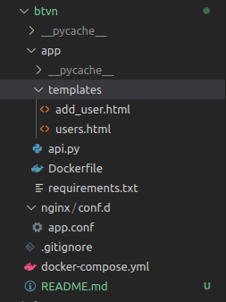
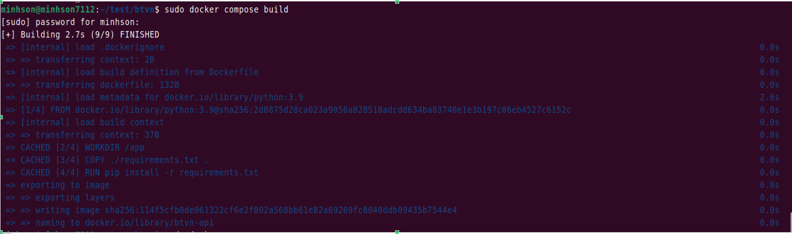
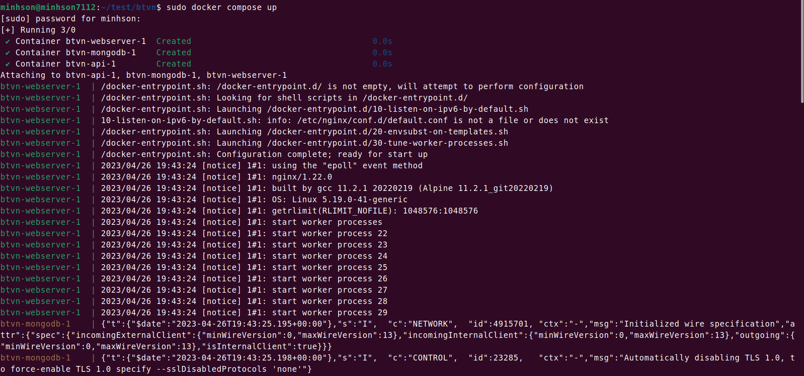
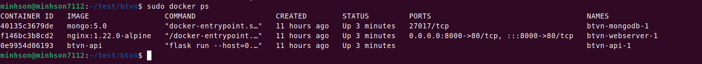
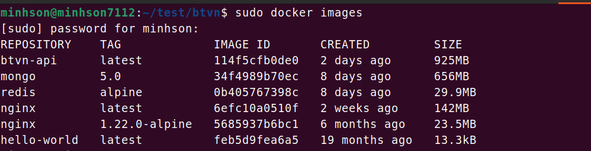
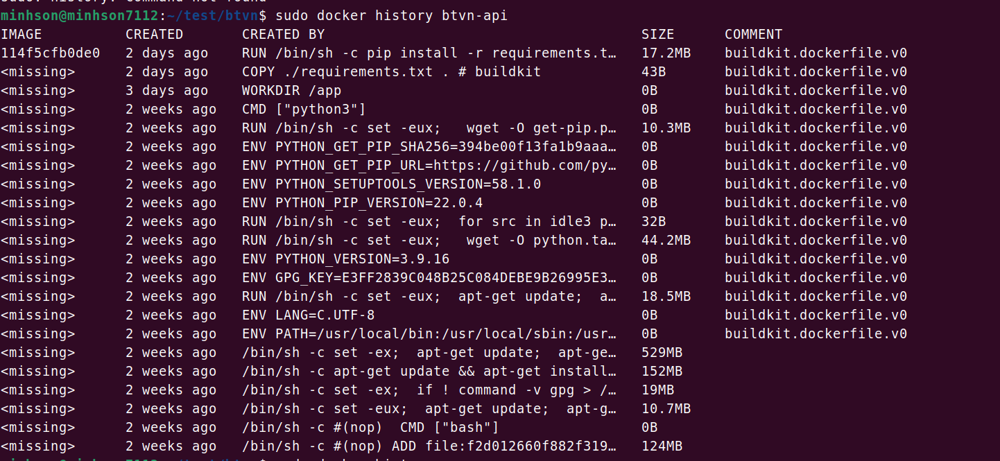
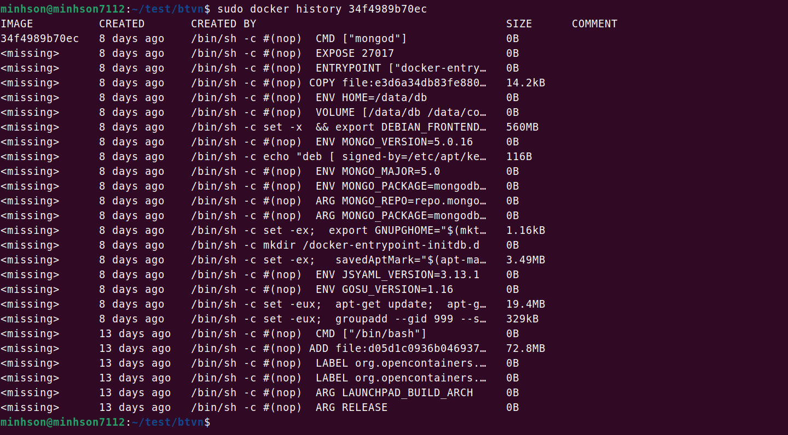
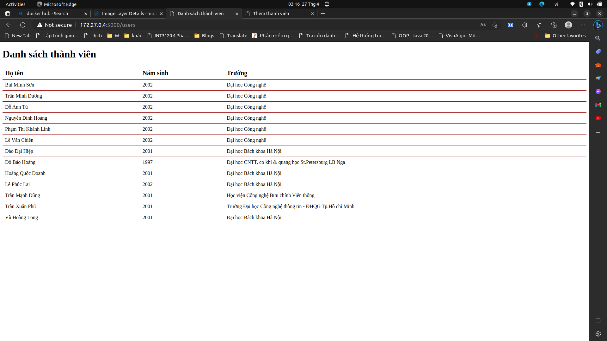

# Containerization

## Phần I: Trả lời câu hỏi lý thuyết

### 1. How many optimization tricks used in this Dockerfile?


```Dockerfile
FROM alpine:3.5

# Install python and pip
RUN apk add --update py2-pip

# upgrade pip
RUN pip install --upgrade pip

# install Python modules needed by the Python app
COPY requirements.txt /usr/src/app/
RUN pip install --no-cache-dir -r /usr/src/app/requirements.txt

# copy files required for the app to run
COPY app.py /usr/src/app/
COPY templates/index.html /usr/src/app/templates/

# tell the port number the container should expose
EXPOSE 5000

# run the application
CMD ["python", "/usr/src/app/app.py"]
```

* Có một số  thủ thuật để tối ưu hóa Dockerfile trên, đó là:
    - Sử dụng base image là Alpine Linux, khá là nhẹ để giảm kích thước của image
    - Copy và cài đặt file requirement.txt để giới hạn và chỉ tải về các package cần thiết của Python
    - Sử dụng `--no-cache-dir` với lệnh `pip install` để giảm kích thước bộ nhớ cache

### 2. What are the differences between these instructions?
>ARG vs ENV
- `ARG` dùng để truyền giá trị vào trong quá trình build của Docker image, và giá trị của biến `ARG` có thể được truyền từ command line khi build image. Ngoài ra, các biến `ARG` chỉ tồn tại trong quá trình build và không được lưu trữ trong container khi chạy
- `ENV` được sử dụng để thiết lập các biến môi trường trong container. Những biến này có thể được sử dụng trong quá trình chạy của container. `ENV` có thể được định nghĩa trong Dockerfile hoặc thông qua lệnh docker run

>COPY vs ADD
- COPY nhận một src và destination. Nó chỉ cho phép ta sao chép một tệp cục bộ hoặc thư mục từ  máy vào Docker image
- ADD cũng cho phép bạn làm điều đó nhưng nó cũng hỗ trợ các chức năng. Đầu tiên, ta có thể sử dụng một URL thay vì một tệp/thư mục cục bộ. Thứ hai, ta cũng có thể trích xuất file tar từ nguồn trực tiếp vào đích. Điều này có nghĩa là nó có thể giải nén nội dung của file tar vào trong hệ thống file của container
- Tuy nhiên, COPY vẫn được ưa chuộng sử dụng hơn nhờ tính minh bạch của mình, sẽ chỉ sử dụng ADD khi thực sự cần tới các tính năng bổ sung của nó

>CMD vs ENTRYPOINT
- CMD và ENTRYPOINT được sử dụng để chỉ định lệnh mà container sẽ chạy khi được bật. Điểm khác biệt chính giữa CMD và ENTRYPOINT là cách chúng xử lý các đối số được truyền vào khi container được khởi động
- CMD được sử dụng để chỉ định một lệnh mặc định cho container. Nếu một lệnh khác được cung cấp khi container chạy, nó sẽ thay thế CMD ban đầu. CMD thường được sử dụng để chỉ định lệnh mặc định cho container và đơn giản hóa việc chạy container.
- ENTRYPOINT được sử dụng để chỉ định một lệnh chính cho container và đối số được cung cấp khi khởi động container sẽ được truyền vào như đối số cho lệnh chính đó. ENTRYPOINT thường được sử dụng để chỉ định một lệnh chính không thể thay đổi và cung cấp các đối số tùy ý khi container được khởi động

## Phần II: Thiết lập ứng dụng web 3 tầng hiển thị thông tin sinh viên

### 1. Yêu cầu:
- Sử dụng các base image :  
     - nginx:1.22.0-alpine
     - python:3.9
     - mongo:5.0
- Kích cỡ của image sau khi build chênh lệch không quá lớn so với base image
### 2. Thực hành

- Dưới đây là cấu trúc thư mục của project

   

- Tạo thư mục app, đây sẽ là thư mục làm việc chính của project, trong này sẽ có file api.py để định nghĩa các API cho phía backend của app( ở đây em sử dụng framework là flask)
    - Dưới đây là nội dung của file `api.py`
        ```python
        from flask import Flask, jsonify, redirect, render_template, request
        from pymongo import MongoClient

        app = Flask(__name__)

        client = MongoClient('mongodb://mongodb:27017/')
        db = client.test_database

        @app.route('/')
        def VDT():
            return "Bui Minh Son - VDT" 

        @app.route('/users')
        def users():
            collection = db.users.find()

            data = []
            for element in collection:
                item = {
                    'id': str(element['_id']),
                    'ho_ten': element['ho_ten'],
                    'nam_sinh': element['nam_sinh'],
                    'truong': element['truong']
                }
                data.append(item)

            return render_template('users.html', data=data)

        @app.route('/user')
        def add_user():
            return render_template('add_user.html')

        @app.route('/user', methods=['POST'])
        def save_user():
            ho_ten = request.form['ho_ten']
            nam_sinh = request.form['nam_sinh']
            truong = request.form['truong']
            user = {
                'ho_ten': ho_ten,
                'nam_sinh': nam_sinh,
                'truong': truong
            }
            db.users.insert_one(user)

            return render_template('add_user.html')
        ```

        - Khi em làm project này vẫn chưa có dữ liệu sinh viên nên em có viết 2 API cho nó ( cài đầu để test không tính ), 1 cái là để in ra danh sách sinh viên, cái tiếp theo là để lấy dữ liệu từ form để tự tạo database cho app
    - Thư mục templates được tạo để lưu các mẫu html in ra màn hình, file `add_user.html` chứa form để thêm thông tin sinh viên, file `users.html` dùng để hiện danh sách các sinh viên 
- Tạo file `requirement.txt`, bên trong chứa các package cần thiết sử dụng trong project
- Tạo Dockerfile có nội dung như sau:
    ```Dockerfile
    FROM python:3.9

    WORKDIR /app

    COPY ./requirements.txt .

    RUN pip install -r requirements.txt
    ```
    - Trong Dockerfile trên, em sử dụng base image là `python:3.9` . `WORKDIR /app` dùng để thiết lập đường dẫn làm việc của container nằm trong thư mục `/app`. `COPY ./requirements.txt` dùng để copy file `requirements.txt` từ thư mục hiện tại của máy tính lên thư mục làm việc `/app `của container. Cuối cùng, `RUN pip install -r requirements.txt `để cài đặt các dependencies cho ứng dụng từ file `requirements.txt`.

- Tiếp theo, tạo file app.conf để cấu hình cho Nginx. Nó cho phép Nginx sử dụng một định tuyến (upstream) để định tuyến các yêu cầu đến ứng dụng Flask của mình và chạy trên cùng Docker network, cụ thể là chuyển tiếp các yêu cầu đến port 5000.
    ```
    upstream api {
    server api:5000;
    }

    server {
        listen 80;
        server_name _;
        error_log /var/log/nginx/project_error.log;
        access_log /var/log/nginx/project_access.log;

        location / {
            proxy_set_header X-Forwarded-For $proxy_add_x_forwarded_for;
            proxy_set_header X-Forwarded-Proto $scheme;
            proxy_set_header Host $http_host;
            proxy_buffering off;
            proxy_redirect off;
            proxy_pass http://api;
        }
    }
    ```
- Cuối cùng, tạo file `docker-compose.yml ` có nội dung như dưới:

    ```
    version: '3.5'

    services:
        api:
            build: ./app
            volumes:
                - ./:/app
            working_dir: /app
            environment:
                - FLASK_APP=./app/api.py
            command: flask run --host=0.0.0.0

        webserver:
            image: nginx:1.22.0-alpine
            ports:
                - 8000:80
            volumes:
                - ./nginx/conf.d/:/etc/nginx/conf.d/

        mongodb:
            image: mongo:5.0 
            volumes:
                - mongodata:/data/db

    volumes:
        mongodata:
    ```

    - File docker-compose trên được tạo để tạo các service phục vụ cho việc chạy app
    - Service **api** được build từ Dockerfile nằm trong thư mục "./app" và được mount vào thư mục "/app" trong container. `environment: - FLASK_APP=./app/api.py`  cấu hình biến môi trường để định nghĩa ứng dụng Flask trong file api.py. `command: flask run --host=0.0.0.0`: đặt lệnh chạy khi khởi động container cho service **api**. Lệnh này sẽ khởi động ứng dụng Flask trên container
    - Service **webserver** sử dụng image của `nginx:1.22.0-alpine` và được mapping port 8000 của máy host với port 80 của container. Nó cũng được mount vào thư mục "/etc/nginx/conf.d/" để sử dụng các cấu hình cụ thể của Nginx.
    - Service "mongodb" sử dụng image của mongo:5.0 và được mount vào thư mục "/data/db" trong container. và  định nghĩa "volumes" ở cuối được dùng  để sử dụng volume "mongodata" cho dịch vụ MongoDB.

- Sau khi hoàn thành các thành phần, dùng lệnh `docker compose build` để build các image như hình dưới đây, 

    

- Ngoài ra, nếu chạy lệnh docker compose up thì các image cũng sẽ tự build và chạy các container

    

-  Để xem danh sách các container, ta dùng lệnh `docker ps`

    


- Để xem danh sách các image, ta dùng lệnh `docker images`

    

- Như hình trên, ta thấy kích cỡ của image python sau khi build là btvn-api đã tăng lên đáng kể, cụ thể là 925MB so với 332MB, tương tự đối với mongo là 656MB so với 242MB. Ta xem log lịch sử của các image bằng lệnh `docker history <tên image>`

    

    

    - Sau khi xem log của 2 image trên thì ta có thể thấy kích thước thực tế ta thay đổi lên chúng rất nhỏ, sự chênh lệch lớn kia là do quá trình tự update repo và setup môi trường khi đang thực hiện quá trình build (nên mong là nó sẽ không vi phạm đến tiêu chí chấm điểm của các anh ạ -.-')

- Đây là giao diện form điền thông tin sinh viên

    

- Cuối cùng là kết quả in ra danh sách sinh viên

    


