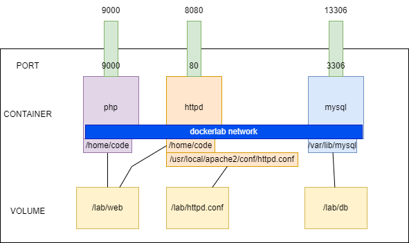

# Docker Lab
## 1. Docker ARG và ENV
Giống nhau:
* Đều được dùng để khai báo các biến môi trường trong quá trình build Docker image, điểm khác nhau:

Khác nhau:
* Các biến được định nghĩa trong ARG có giá trị khi Container được khởi chạy
* Các biến trong ENV chỉ có giá trị trong quá trình build image
## 2. Docker ADD và COPY
Giống nhau:
* Được dùng để sao chép một file hoặc một folder từ máy host vào trong container

Khác nhau:
* ADD hỗ trợ URL, giải nén tập tin tải về từ URL
* COPy đơn thuần là sao chép file, folder có sẵn
## 3. Docker CMD và ENTRYPOING
Giống nhau:
* Hỗ trợ việc thực thi lệnh trong Container khi khởi động

Khác:
* CMD chạy các lệnh không có đối số, tham số và option
* ENTRYPOINT cho phép chạy lệnh có đối số, tham số và option
## 4. Docker Lab
### 4.1. Mô hình

Các thành phần:
* PHP: được build từ image **docker.io/php:7.4-fpm**, được custom để kích hoạt các extension hỗ trợ truy vấn MySQL. Xem [Dockerfile](build/php/Dockerfile)
* httpd: máy chủ web, lấy từ image **docker.io/httpd:latest**, có chỉnh sửa file cấu hình theo file [httpd.conf](httpd.conf), cụ thể:
    * forward yêu cầu thực thi ngôn ngữ PHP sang container php port 9000
    * DocumentRoot là /home/web, file thực thi mặc định là index.php
* mysql: lấy từ image **docker.io/mysql:latest**

Các container được mount volume như hình.

Các Container cùng nằm trong mạng **dockerlab**
### 4.2. Triển khai
1. Build image myphp
```bash
cd build/php
docker build . -t myphp
```
2. Chạy Docker Compose
```bash
cd ../..
docker-compose up
```
### 4.3. Ứng dụng web:
* Mã nguồn: https://github.com/bonavadeur/simplewebapp (tag v1.0)
* Mã nguồn được đặt trong folder `web`
* Chi tiết hướng dẫn đọc [README](web/README.md)
* Cấu hinh thông tin đăng nhập trong file `web/config.php`
* Kết quả khi chưa kết nối được tới Database:

* Kết quả khi kết nối được tới Database thành công:

## 5. Contributor:
Đào Hiệp - @bonavadeur