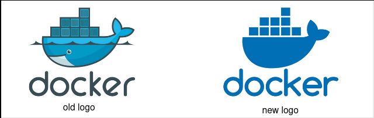
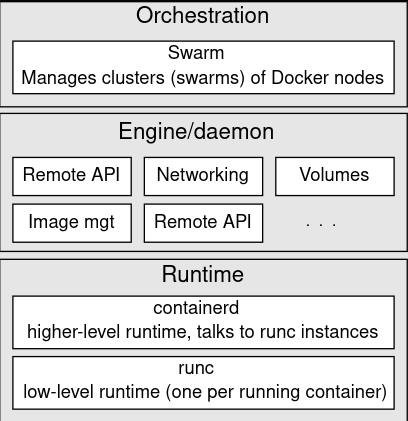
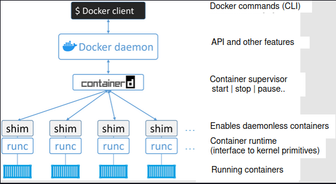
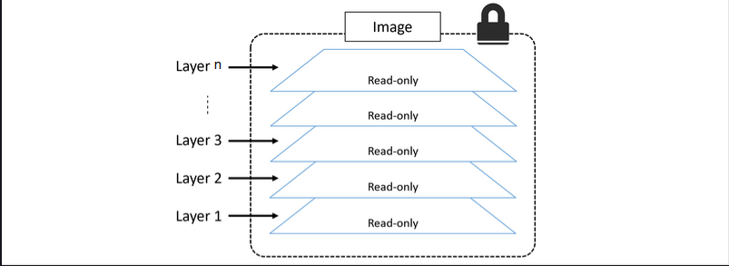
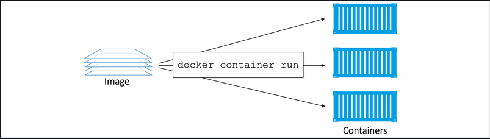
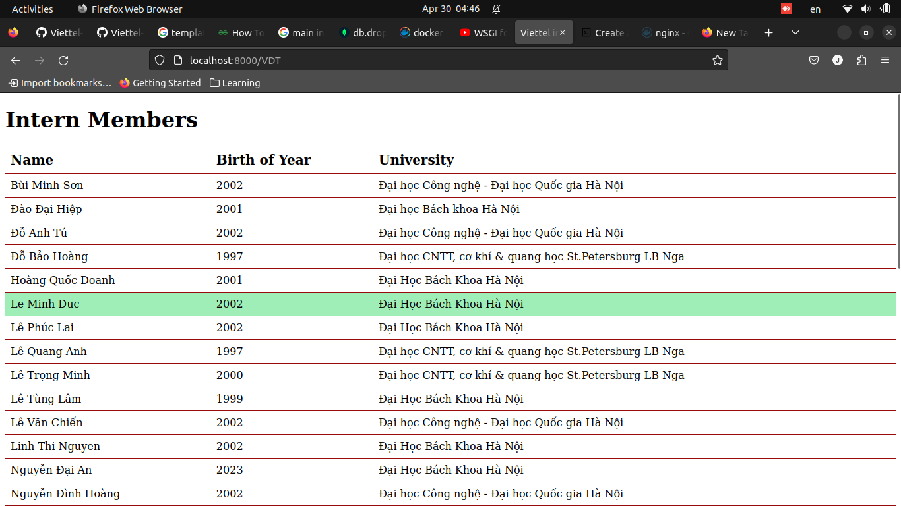
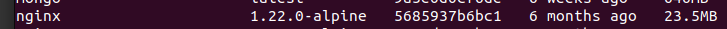
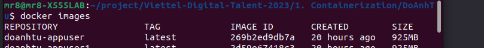
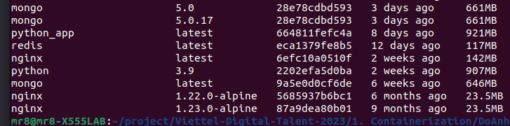

# **Ex1: Build and deploy 3-tier web by Docker**

## Table of content:
- [1. What is a container?](#1-what-is-a-container)
- [2. Why do we need to use containers?](#2-why-do-we-need-to-use-containers)
- [3. Docker introduction](#3-docker-introduction)
- [4. Docker technology?](4-docker-technology)
- [5. Docker engine](#5-docker-engine)
- [6. Docker compose](#6-docker-compose)
- [7. Exercises](#7-exercises)
- [8. Build and deploy 3-tier web application](#8-build-and-deploy-3-tier-web-application)
- [9. Result](#9-result)


## **1. What is a container?**

A container is a **standardized** unit of software that packages up code and all its dependencies so the application runs quickly and reliably from one computing environment to another. A container is an **isolated** environment for your code. This means that a container has no knowledge of your operating system, or your files.
Container has 2 characteristics suitable for building applications which are **standardized** and **isolated**.

## **2. Why do we need to use containers?**

We used to live in a world where every time a business wanted a new application, we had to buy a brand-new server. VMware came along and enabled us to drive more value out of new and existing company IT assets. As good as VMware and the VM model is, it’s not perfect because if we deploy new VMware, it wastes our time to install OS, build libraries for running applications. That is the reason we need to use containers. Another reason my mentor Cong and Tu said “Nowadays, we don't run all in one application on one server. Because it is a single point failure and it’s not making full use of the server's resources”. Following the success of VMware and hypervisors came a newer more efficient and lightweight virtualization technology called “containers.” But containers were initially hard to implement and were only found in the data centers of web giants that had Linux kernel engineers on staff. Then along came Docker, Inc. and suddenly containers were available to the masses.

## **3. Docker introduction**

Docker is a software that runs on Linux and Windows. It **creates**, **manages**, and can even **orchestrate containers**. The software is currently built from various tools from the Moby open-source project. Docker, Inc. is a San Francisco based technology company founded by French-born American developer and entrepreneur, Solomon Hykes. Solomon is no longer at the company. The company started out as a platform as a service (PaaS) provider called dotCloud. Behind the scenes, the dotCloud platform was built on Linux containers. To help create and manage these containers, they built an in-house tool that they eventually nick-named “Docker.” And that’s how Docker technology was born!

<div align="center">
  
</div>

## **4. Docker technology**

Docker technology has three things we need to aware:

1. The runtime
1. The daemon (a.k.a. engine)
1. The orchestrator
<div align="center">
  
</div>

### The runtime

The runtime operates at the lowest level and is responsible for starting and stopping containers (this includes building all of the OS constructs, such as **namespaces** and **cgroups** which are features that have been in Linux for a long time). Docker implements a tiered runtime architecture with high-level and low-level runtimes that work together.

#### runc

The low-level runtime is called (`runc`) and it is the reference implementation of Open Containers Initiative (OCI) runtime-spec. Its job is to interface with the underlying OS and start and stop containers. Every running container on a Docker node has a (`runc`) instance managing it.

#### containerd

The higher-level runtime is called (`containerd`). (`containerd`) does a lot more than (`runc`). It manages the entire lifecycle of a container, including pulling images, creating network interfaces, and managing lower-level runc instances. containerd is pronounced “container-dee” and is a graduated CNCF project used by Docker and Kubernetes as a container runtime.
A typical Docker installation has a single containerd process (`docker-containerd`), controlling the runc (`docker-runc`) instances associated with each running container.

### The docker daemon (docker engine)

The Docker daemon (`dockerd`) performs higher-level tasks, such as exposing the Docker remote API, managing images, managing volumes, managing networks, and more.
A major job of the Docker daemon is to provide an easy-to-use standard interface that abstracts the lower levels.

### The docker swarm

Docker also has native support for managing clusters of nodes running Docker. These clusters are called “swarms” and the native technology is called “Docker Swarm.” Docker Swarm is easy-to-use, and many companies are using it in real-world production. However, most people are choosing to use Kubernetes instead of Docker Swarm.

## **5. Docker engine**

The **Docker engine** is the core software that runs and manages containers. We often refer to it simply as Docker. If you know a thing or two about VMware, it might be useful to think of it as being like ESXi. The Docker engine is modular in design and built from many small specialized tools. Where possible, these are based on open standards such as those maintained by the Open Container Initiative (OCI). The Docker Engine is made from many specialized tools that work together to create and run containers, such as APIs, execution drivers, runtimes, and shims, etc.

<div align="center">
  
</div>
<div align="center">
  High-level view of the current Docker engine architecture
</div>

The major components that make up the Docker engine are: the _Docker daemon_, (`containerd`), (`runc`), and various plugins, such as networking and storage. Together, these create and run containers.

### Docker image

A Docker image is a unit of packaging that contains everything required for an application to run. This includes: application code, application dependencies, and OS constructs. If you have an application’s Docker image, the only other thing you need to run that application is a computer running Docker. For example. Docker image is similar VM template

You get Docker images by pulling them from an image registry. The most common registry is Docker Hub, but others exist. The pull operation downloads the image to your local Docker host where Docker can use it to start one or more containers.

Images are made up of multiple layers that are stacked on top of each other and represented as a single object. Inside of the image is a cut-down operating system (OS) and all of the files and dependencies required to run an application. Because containers are intended to be fast and lightweight, images tend to be small (while Microsoft images tend to be huge). Images in docker are read-only. After building an image in docker, you can’t edit it. If a change is made in Dockerfile, you need to rebuild the image to apply changes in the image. Each instruction in Dockerfile is a layer in image. Docker engine have a comparison of each version image, if a layer is edited, this layer and layer above will be rebuilt, lower layer dont need to rebuild. This is called docker build cache which reduces time to build image and storage save image.

<div align="center">
  
</div>

<div align="center">
  Docker image layer
</div>

### Docker container

A container is the runtime instance of an image. In the same way that you can start a virtual machine (VM) from a virtual machine template, you can start one or more containers from a single image. The big difference between a VM and a container is that containers are faster and more lightweight. Instead of running a full-blown OS like a VM, containers share the OS/kernel with the host they’re running on. It’s also common for containers to be based on minimalist images that only include software and dependencies required by the application.

<div align="center">
  
</div>

<div align="center">
  Docker container
</div>

## **6. Docker compose**

Docker-compose is a tool that combines and runs multiple containers of interrelated services with a single command. It is a tool to define all the application dependencies in one place and let Docker take care of running all of those services in just one simple command (`docker-compose up`).

## **7. Exercises**

### **What are the differences between these instructions?**

#### **ARG vs ENV**

First, both are Dockerfile instructions which help you define variables, and from within the Dockerfile they feel pretty similar. From within Dockerfile, both ARG and ENV seem very similar. Both can be accessed from within your Dockerfile commands in the same manner.

The different between arg and env is:
ENV is for future running containers. ARG for building your Docker image.

- ENV is mainly meant to provide default values for your future environment variables. Running dockerized applications can access environment variables. It’s a great way to pass configuration values to your project.
- ARG values are not available after the image is built. A running container won’t have access to an ARG variable value.
<div align="center">
  
</div>

<div align="center">
  ARG and ENV
</div>

Beacause ENV is used for future environment so ENV can't be changed during build image. Unlike ENV, ARG can be changed during build image by command when run build.
For example

```Dockerfile
ARG VAR_NAME 5
ENV VAR_NAME_2 6
```

We can change `VAR_NAME` in Dockerfile by command (`--build-arg VAR_NAME=6`). We can’t override ENV values `VAR_NAME_2` directly from the commandline when building your image.

However, you can use ARG values to dynamically set default values of ENV variables during the build like this:

```Dockerfile
# You can set VAR_A while building the image
# or leave it at the default
ARG VAR_A 5
# VAR_B gets the (overridden) value of VAR_A
ENV VAR_B $VAR_A
```

#### **COPY vs ADD**

ADD and COPY are both commands used in Dockerfile to copy files from the host machine to the container. COPY only supports the basic copying of local files into the container, while ADD has some features (like local-only tar extraction and remote URL support) that are not immediately obvious. Consequently, the best use for ADD is local tar file auto-extraction into the image, as in ADD jdk-7u79-linux-x64.tar.gz below.

Example:
COPY:

```Dockerfile
COPY resources/jdk-7u79-linux-x64.tar.gz /tmp/
RUN tar -zxvf /tmp/jdk-7u79-linux-x64.tar.gz -C /usr/local
RUN rm /tmp/jdk-7u79-linux-x64.tar.gz
```

ADD:

```Dockerfile
ADD resources/jdk-7u79-linux-x64.tar.gz /usr/local/
```

#### **CMD vs ENTRYPOINT**

CMD and ENTRYPOINT are both instructions in a Dockerfile that define how a container should be started and run.

The main difference between CMD and ENTRYPOINT is:

- CMD: The CMD instruction is used to set the default command that will be executed when a container is started. It specifies the command to run and any arguments that should be passed to it. If the user specifies a command when running the container, it will override the command set in the CMD instruction.

```Dockerfile
CMD ["python", "app.py"]
```

- ENTRYPOINT: The ENTRYPOINT instruction is used to set the main command that should be run when a container is started. It is similar to CMD, but the difference is that the command and any arguments specified in ENTRYPOINT are not overridden by the command passed when starting the container. Instead, the arguments passed when starting the container will be appended to the command specified in ENTRYPOINT.

```Dockerfile
ENTRYPOINT ["python", "app.py"]
```

## **8. Build and deploy 3-tier web application**

**Build 3-tier web app**

- nginx:1.22.0-alpine

- python:3.9

- mongo:5.0

This is my project structure:

```bash
DoAnhTu
  ├── app
  │   ├── Dockerfile
  │   ├── .dockerignore
  │   ├── requirements.txt
  │   ├── VDT
  |       ├── __init__.py
  |       ├── templates
  |           ├── VDT.html
  ├── img
  ├── nginx
  │   ├── conf.d
  |       ├── default.conf
  ├── docker-compose.yaml
  ├── README.md
  ├── .gitignore
```

In my project, i have used Dockerfile for flask-app image, database and nginx image are in docker-compose.yml

### **Flask-Dockerfile**

```Dockerfile
FROM python:3.9

ENV FLASK_APP=VDT/__init__.py
ENV FLASK_ENV=production


WORKDIR /app

COPY requirements.txt requirements.txt

RUN pip install -r requirements.txt


COPY . .

EXPOSE 5000


CMD [ "flask", "run", "--host=0.0.0.0" ]

```

As the require flask app is base on image python:3.9

In flask-Dockerfile, i set FLASK_APP and FLASK_ENV with ENV.

```Dockerfile
ENV FLASK_APP=VDT/__init__.py
ENV FLASK_ENV=production
```

When run CMD

```Dockerfile
CMD [ "flask", "run", "--host=0.0.0.0" ]
```

Flask will run right file is \_\_init\_\_.py with production environment.

### **docker-compose.yml**

```yaml
version: "3"
services:
  appuser:
    build: ./app
    depends_on:
      - dbmongo
    ports:
      - 5000:5000
    networks:
      - db
      - app

  nginx-production:
    image: nginx:1.22.0-alpine
    ports:
      - 8000:80
    volumes:
      - ./nginx/conf.d/:/etc/nginx/conf.d/
    depends_on:
      - appuser
    networks:
      - app

  dbmongo:
    image: mongo:5.0

    ports:
      - 27017:27017
    volumes:
      - db1:/data/db
    networks:
      - db
volumes:
  db1:

networks:
  db:
    driver: bridge
  app:
    driver: bridge
```

#### **flask-app docker-compose.yml**

In this docker-compose.yml, because i write Dockerfile for flask-app so the location of the Dockerfile to build the Docker image for the appuser service is in `./app`

```yaml
appuser:
  build: ./app
  depends_on:
    - dbmongo
  ports:
    - 5000:5000
  networks:
    - db
    - app
```

#### **nginx in docker-compose.yml**

```yaml
nginx-production:
  image: nginx:1.22.0-alpine
  ports:
    - 8000:80
  volumes:
    - ./nginx/conf.d/:/etc/nginx/conf.d/
  depends_on:
    - appuser
  networks:
    - app
```

Nginx image base `nginx:1.22.0-alpine`.
The `conf.d` directory in the nginx folder of the host machine should be mounted to the `/etc/nginx/conf.d/` directory in the container running the nginx-production service, allowing Nginx to read the configuration files located in the `conf.d` director.

**nginx config**

This is a configuration file for the Nginx server, which is used in a reverse proxy setup to route requests to the appuser service.

```.conf
upstream appuser {
    server appuser:5000;
}


server {
    listen 80;
    server_name _;

    location / {
        proxy_pass http://appuser;
        proxy_set_header X-Forwarded-For $proxy_add_x_forwarded_for;
        proxy_set_header X-Forwarded-Proto $scheme;
        proxy_set_header X-Forwarded-Host $host;
        proxy_set_header X-Forwarded-Prefix /;
    }
}
```

`upstream appuser`: upstream server block named appuser, which specifies the backend server that Nginx will proxy requests to.

`server appuser:5000`: the IP address and port of the backend server to be used for the appuser upstream server.

`listen 80`: The Nginx server should listen on port 80.

`proxy_pass http://appuser;`: Requests to this location should be proxied to the appuser upstream server defined earlier.

#### **mongodb in docker-compose.yml**

Image is used for mongodb is mongo:5.0, when run docker compose, it expose to port 27017. The most important in mongodb is set volumes for mongodb. If you forget set, when restart server database will be lost.

```yaml
dbmongo:
  image: mongo:5.0

  ports:
    - 27017:27017
  volumes:
    - db1:/data/db
  networks:
    - db
```

#### **Other thing in docker compose**

**depends_on**

The important in the context of a multi-container Docker application, where there may be dependencies between different services. By using depends_on, we can ensure that services are started in the correct order, which can help prevent errors due to missing dependencies or services that are not yet available.

I set depends_on for appuser and nginx, appuser wait depends on mongodb and nginx depends on appuser. Because nginx need appuser to run and appuser need database-mongodb to run.

**docker network**
There are 2 network brigde in docker-compose. The first is db which connect appuser(flask-app) and database(mongodb), so when i connect DB in flask, i just use name of service mongodb to connect.

```python
    client = MongoClient('mongodb://dbmongo:27017', connectTimeoutMS=3000)
    VDT_DB = client.VDTuser
    db = VDT_DB.user

```

instead of using ip address of database, i use `dbmongo` which is name of database service.

```yaml
dbmongo:
  image: mongo:5.0

  ports:
    - 27017:27017
  volumes:
    - db1:/data/db
  networks:
    - db
```

Other network is app, which connect nginx and appuser(flask-app).

### **Result**

**Deploy successful in nginx**

After run cmd `docker-compose up`, the 3-tier app deploy successful.

<div align="center">
  
</div>

<div align="center">
  Deploy in server nginx with port 8000
</div>

**check docker-compose**

<div align="center">
  
</div>

<div align="center">
  Docker compose ps
</div>

**images size**

Image in mongodb and nginx is build from original image so the size of each are similiar original image

<div align="center">
  
</div>
<div align="center">
  Size of image mongodb
</div>

<div align="center">
  
</div>
<div align="center">
  Size of image nginx
</div>

In image of python, the gap seem to not big. The gap is 925-907 = 18 MB

<div align="center">
  
</div>
<div align="center">
  Size of image python after build project is 925 MB
</div>

<div align="center">
  
</div>
<div align="center">
  Size of image original python:3.9 is 907 MB
</div>

But i think, i can optimal size of image python by using multi-stage (will do in future)

## **9. Include**

In this project, i have built a simple 3-tier web app by using docker-compose. this is the first time i built an complete app in production so i think it has many disadvantage are:

- In flask, i built app in development not production
- Not optimal image in python
- Don't use ENV and ARG to config

All of this i will fix as soon as possible.
