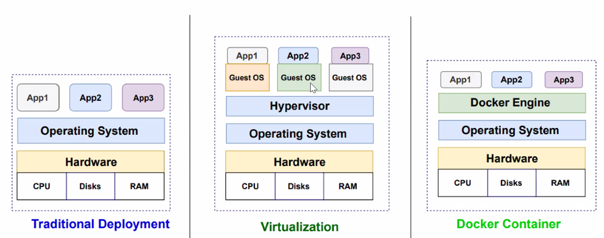
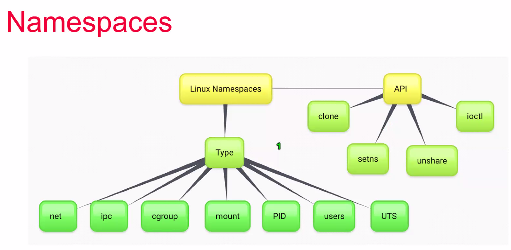
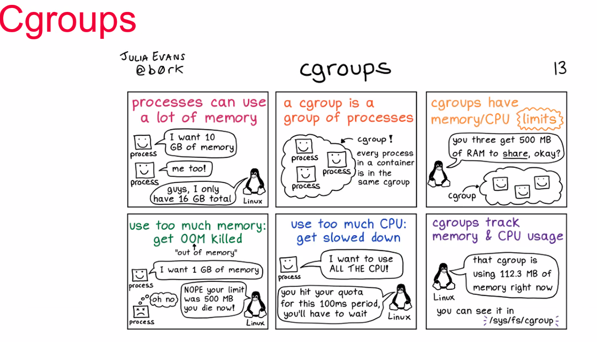
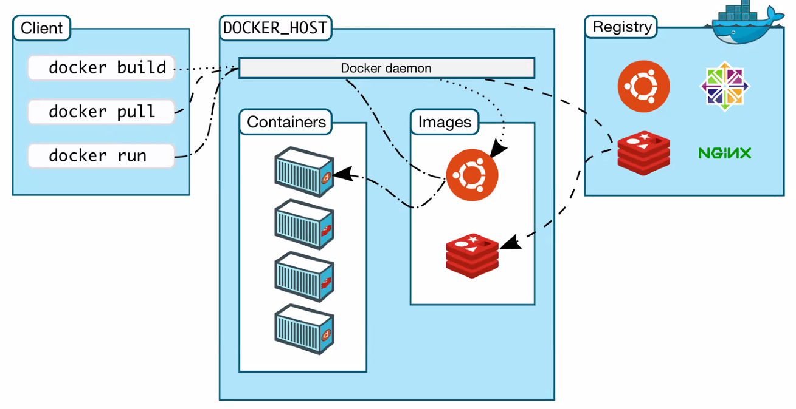
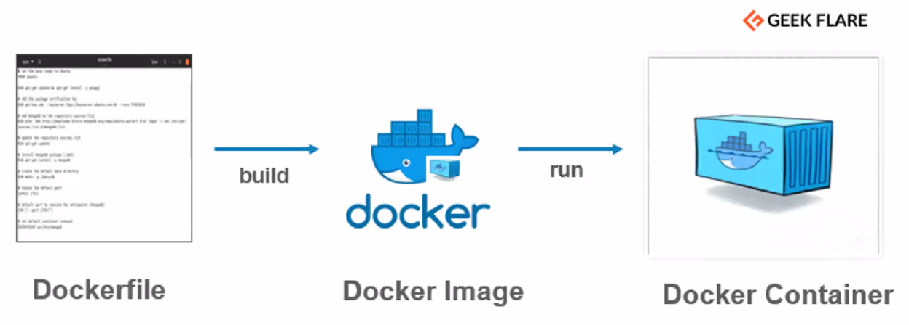
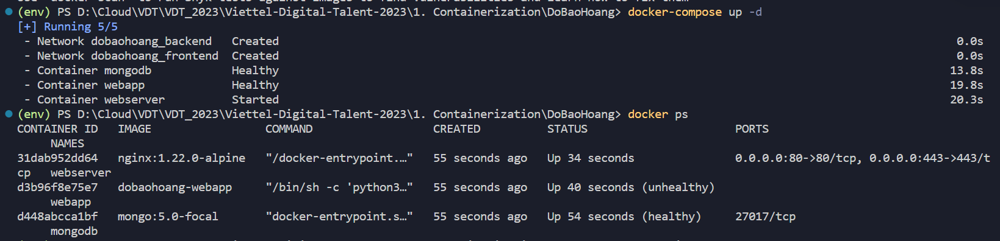
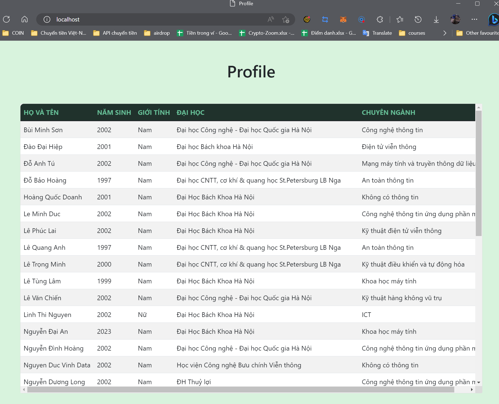
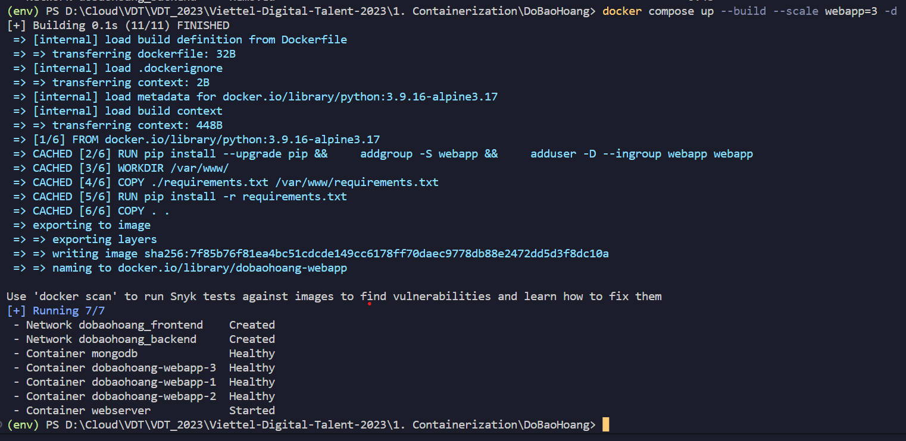
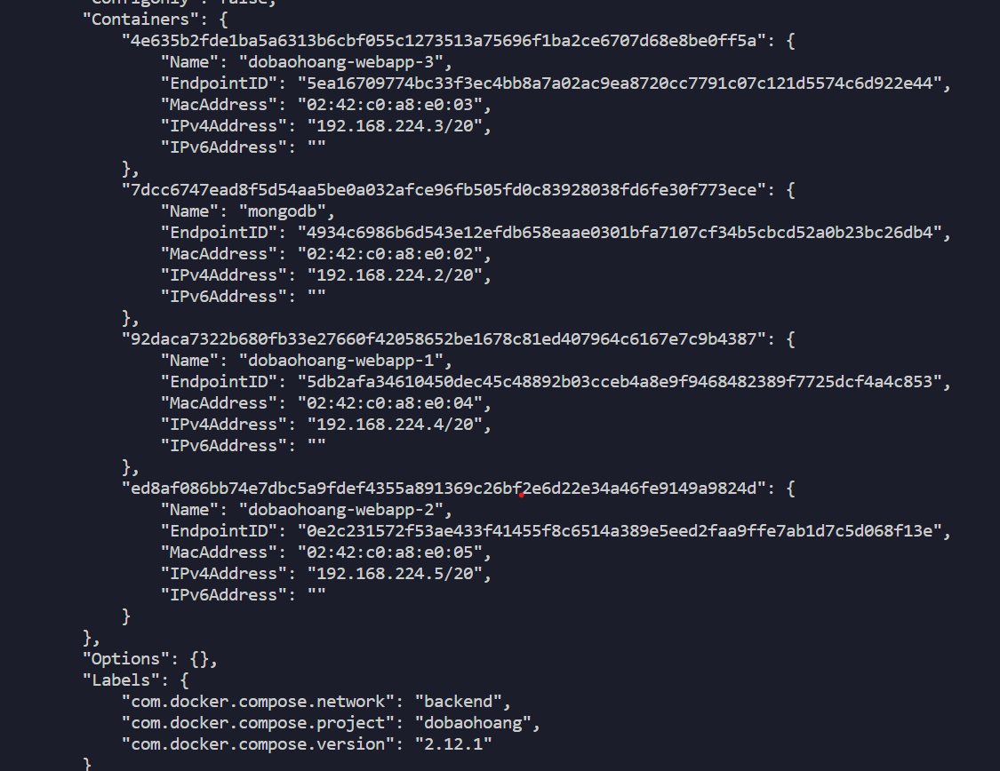
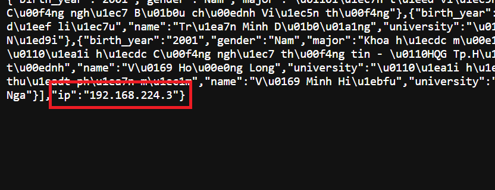

# Lab 1: Containerization

Editor: **Do Bao Hoang**

---
## Mục lục
[I. Kiến thức chung](#intro)
- [1. Containerization](#containerization)
- [2. Docker](#docker)
- [3. Docker-compose](#compose)
- [4. Câu hỏi bài tập](#questions)

[II. Yêu cầu đề bài](#requirements)

[III. Thực hành](#deployment)
- [1. Xây dựng Database](#database)
- [2. Tạo Web application](#webapp)
- [3. Xây dựng Webserver](#webserver)
- [4. Run Result](#result)

[IV. Encountered Errors](#errors)

[V. References](#references)

---
## I. Introduction <a name='intro'></a>

### 1. Containerization <a name='containerization'></a>
`Containerization` là một giải pháp ảo hóa với khả năng đóng gói mã của ứng dụng cùng tất cả các tệp và thư viện cần thiết giúp ứng dụng có thể chạy trên bất kỳ cơ sở hạ tầng nào.

Trước khi công nghệ container xuất hiện, máy ảo (`virtualization`) là công nghệ được dùng để tối ưu hoạt động của máy chủ. Máy ảo mô phỏng các thiết bị vật lý. Các ứng dụng chạy trên 2 máy ảo khác nhau sẽ được cô lập ở lớp vật lý. 

<div align="center">
  
</div>

<div align="center">
  <i>Pic. 1 - Quá trình phát triển của công nghệ</i>
</div>

Tuy máy ảo tối ưu hóa tài nguyên của máy chủ khá hiệu quả nhưng song song với đó cũng còn rất nhiều `nhược điểm` cần khắc phục:

- `Tốn thời gian` cài đặt ứng dụng: mỗi khi tạo máy ảo mới phải cài lại từ đầu, mỗi bước cài đặt khác nhau theo từng phiên bản, update, downgrade khó khăn, ...
- `Dễ xảy ra conflict`: các ứng dụng nằm trên cùng 1 máy ảo vẫn sẽ cạnh tranh nhau về mặt tài nguyên (CPU, RAM, bộ nhớ, ...) và có thể xảy ra xung đột giữa các phiên bản khác nhau. Ngoài ra việc sử dụng nhiều máy ảo cũng không hiệu quả vì phải dành ra dung lượng để cài hệ điều hành trên mỗi máy.

Để khắc phục tình trạng trên, công nghệ `Containerization` với ý tưởng về việc cô lập các tiến trình (ứng dụng) trên hệ điều hành được đề xuất. 

- Không phải tốn dung lượng cho hệ điều hành nên ứng dụng dễ dàng được đóng gói, `tự động hóa việc cài đặt ứng dụng`.
- Vì chung 1 hệ điều hành nên có thể tạo ra nhiều instance mà không sợ tốn bộ nhớ. Mỗi ứng dụng được cô lập trong 1 container nên `không sợ xảy ra conflict` nữa.

`Container` hoạt động dựa trên 2 công cụ của Linux là `Namespace` và `Cgroup`.

<div align="center">
  
</div>

<div align="center">
  <i>Pic. 2 - Namespace in Linux</i>
</div>

`Namespace` xuất hiện lần đầu tiên trong Linux kernel năm 2002. Namespace giới hạn những gì 1 hoặc 1 nhóm tiến trình `có thể nhìn thấy và tương tác`. Cũng giống như trong `ngôn ngữ lập trình C`, 2 biến thuộc cùng 1 namespace nếu đặt tên trùng nhau sẽ bị lỗi nhưng thuộc 2 namespace khác nhau lại hoàn toàn bình thường. 

`Namespace` trong Linux gồm có:

- `users`: user namespace phân tách các user khác nhau sử dụng user IDs và group IDs
- `PID`: process ID gán cho mỗi tiến trình 1 mã PID riêng.
- `net`: mỗi network namespace có 1 network stack riêng (routing table, IP address, socket listing, ...)
- `mount`: mỗi mount namespace có riêng 1 danh sách mount point, có thể mount, unmount mà không ảnh hưởng đến hệ thống bên ngoài.
- `ipc`: interprocess communication namespace - ví dụ điển hình về ipc là POSIX message queues: mỗi ipc có 1 POSIX queue message filesystem riêng. 
- `uts`: UNIX time-sharing namespace cho phép cùng 1 hệ thống có thể có nhiều hosts và domain names khác nhau. 

<div align="center">
  
</div>

<div align="center">
  <i>Pic. 3 - Cgroup in Linux</i>
</div>

`Cgroup` giới hạn tài nguyên (CPU, RAM, bộ nhớ, ...) 1 hoặc 1 nhóm tiến trình có thể sử dụng.

`Cgroup` cung cấp 4 tính năng chính:

- Resource limit: giới hạn tài nguyên sử dụng
- Prioritization: quy định mức ưu tiên sử dụng tài nguyên giữa các group
- Acounting: theo dõi và báo cáo những giới hạn tài nguyên 
- Control: tùy ý thay đổi trạng thái của tiến trình bên trong group (frozen, stopped, restarted)

`Namespace` và `Cgroup` là 2 công cụ dành riêng cho Linux nên các nền tảng khác (windows, apple) không thể chạy trực tiếp dẫn đến hiệu suất không bằng Linux thậm chí có thể gặp lỗi. 


### 2. Docker <a name='docker'></a>

<div align="center">
  
</div>

<div align="center">
  <i>Pic. 4 - Docker</i>
</div>

`Docker` được tạo ra năm `2013` bởi công ty cùng tên viết bằng ngôn ngữ Go. Từ đó đến nay Docker vẫn luôn là công cụ tốt nhất để làm việc với container. 

`Docker` là một `PaaS` (dịch vụ nền tảng) sử dụng ảo hóa ở cấp độ hệ điều hành để đóng gói phần mềm vào các package gọi là `container`. 

Ý tưởng chính của Docker là `Build once, run everywhere` giúp cho quá trình vận hành phần mềm đơn giản hơn trước rất nhiều. 

<div align="center">
  
</div>

<div align="center">
  <i>Pic. 5 - Cấu trúc của Docker </i>
</div>

`Cấu trúc của Docker` gồm có 3 thành phần chính:

- `Docker Daemon` (dockerd) đóng vai trò là server và nhận request từ Docker Client và thực thi chúng. `Dockerd` ngoài nhiệm vụ build, run còn quản lý các `Docker objects` (containers, images, networks, volumes) và các thành phần liên quan khác.
- `Docker Client` là giao diện tương tác giữa người dùng và Docker. Khi chạy những lệnh docker run hay docker build, client sẽ xử lý và gửi request đến dockerd để thực hiện.
- `Docker Registry` là nơi lưu trữ các images. Ví dụ như `Docker hub` là một public docker registry. Ngoài ra ta có thể tự host một private docker registry riêng.

Các `thuật ngữ` liên quan:

- `Docker Image`: 1 image sẽ định nghĩa cho 1 môi trường và những thứ có trong môi trường đó.
- `Docker Container`: Container được tạo ra từ Image, là nơi chứa mọi thứ cần thiết để có thể chạy ứng dụng. Từ 1 image chúng ta có thể tạo ra nhiều containers với môi trường bên trong giống hệt nhau.
- `Docker Network`: Docker Network có nhiệm vụ cung cấp kết nối để các container trên một hoặc nhiều host có thể liên lạc được với nhau.
- `Docker Volume`: Volume là cơ chế tạo và sử dụng dữ liệu của docker, có nhiệm vụ lưu trữ dữ liệu độc lập với vòng đời của container. 
- `Dockerfile`: Dockerfile chứa các đặc tả về một trường thực thi phần mềm, cấu trúc cho Docker image.

**Cách để tạo ra một container**

<div align="center">
  
</div>

<div align="center">
  <i>Pic. 6 - Create a Container </i>
</div>

Nếu coi `Container` là một ngôi nhà thì `Docker image` chính là bản thiết kế chi tiết còn `Dockerfile` là những chỉ dẫn của kỹ sư. 

Từ những chỉ dẫn của kỹ sư (`Dockerfile`), bản thiết kế được vẽ lên (`quá trình build`). Từ bản thiết kế có sẵn (`Docker image`), ta có thể dựng lên bao nhiêu ngôi nhà (`Container`) và ở đâu tùy ý, vẫn đảm bảo các ngôi nhà giống nhau 100% (`quá trình run`). 

### 3. Docker-compose <a name='compose'></a>

`Docker Compose` là một tool dùng để build và run nhiều Container cùng lúc, điều phối các container làm việc cùng nhau.

`Docker Compose` có file config mặc định là `docker-compose.yml`.

### 4. Câu hỏi bài tập <a name='questions'></a>

**Phân biệt ARG và ENV**

`ENV` được tạo ra để khởi tạo container khi run từ image thành container. Các app trong container cũng có thể truy cập.

`ARG` được tạo ra để khởi tạo các giá trị cho quá trình build từ Dockerfile thành image. Sau khi build thì các biến ARG không sử dụng được nữa.

<div align="center">
  
</div>

<div align="center">
  <i>Pic. 7 - Tổng quan về ARG và ENV </i>
</div>

Cả `ENV` và `ARG` đều có thể access trong quá trình build tuy nhiên khác với ARG, `ENV không thể bị ghi đè trong quá trình build`. 

Ví dụ ta khởi tạo ARG `VAR_1` = 5 và ENV `VAR_2` = 15 .
```yaml
ARG VAR_1=5
ENV VAR_2=15
```
Ta có thể ghi đè `VAR_1` trong build-time với câu lệnh
```bash
docker build --build-arg VAR_1=10 .
```
Tuy nhiên `VAR_2` chỉ có thể bị ghi đè trong run-time
```bash
docker run -e "VAR_2=20" .
```
Ngoài ra ta có thể khởi tạo ENV linh động bằng cách gán biến ENV bằng giá trị ARG
```yaml
ARG VAR_1=5
ENV VAR_2=$VAR1
```

**Phân biệt COPY và ADD**

`COPY` và `ADD` có tính năng tương tự nhau đó là copy file từ local vào trong container. Ngoài ra đối ADD còn hỗ trợ thêm 2 tính năng: fetch packages from URLs và tar extraction.

`COPY` thường được sử dụng hơn do tính rõ ràng, dễ hiểu. `ADD` sử dụng trong các trường hợp cần giải nén hoặc tải thêm file.

Tuy nhiên `ADD` có điểm yếu là tạo thêm 1 layer trong docker gây `lãng phí bộ nhớ` nên thay vì dùng ADD để tải file, ta có thể dùng `curl` hoặc `wget` rồi xóa file đã tải sau khi cài đặt. 

Ví dụ thay vì dùng ADD 
```yaml
ADD https://fake.com/file.tar.xz /usr/path/to/somewhere/
RUN tar -xJf /usr/path/to/somewhere/file.tar.xz -C /usr/path/to/somewhere
RUN make -C /usr/path/to/somewhere all
```
Ta có thể dùng wget để tiết kiệm dung lượng cache
```yaml
RUN wget https://fake.com/file.tar.xz && \
    tar -xJf file.tar.xz -C /usr/path/to/somewhere && \
    make -C /usr/path/to/somewhere all
```

**Phân biệt CMD và ENTRYPOINT**

`ENTRYPOINT` dùng để khởi chạy container dưới dạng 1 executable program.

`CMD` mục đích chính dùng để cung cấp giá trị mặc định cho executing container. 

`Nếu không có ENTRYPOINT`, CMD sẽ đóng vai trò khởi chạy executable của container. Nhưng nếu người dùng truyền tham số vào khi docker run, CMD sẽ bị bỏ qua.
```yaml
FROM alpine

CMD ["echo", "cde"]

# Sau khi build container ta được kết quả:
# $ docker run test
# $ cde

# Tuy nhiên nếu thêm tham số CMD sẽ bị bỏ qua:
# $ docker run test abc
# $ exec: "abc": executable file not found in $PATH: unknown.
```

`Nếu có ENTRYPOINT`, CMD sẽ đóng vai trò là tham số mặc định cho executable trong ENTRYPOINT.
```yaml
FROM alpine

CMD ["echo", "cde"]

ENTRYPOINT ["echo", "abc"]

# Sau khi build container ta được kết quả:
# $ docker run test
# $ abc echo cde 

# Run container với tham số:
# $ docker run test abc
# $ abc abc
```

Cần lưu ý nếu viết `ENTRYPOINT dưới dạng Shell form`, cả CMD lẫn tham số truyền vào qua docker run sẽ bị bỏ qua
```yaml
FROM alpine

CMD ["echo", "cde"]

ENTRYPOINT echo abc

# Sau khi build container ta được kết quả:
# $ docker run test
# $ abc

# Run container với tham số:
# $ docker run test abc
# $ abc
```

## II. Yêu cầu đề bài <a name='requirements'></a>

Cài đặt một ứng dụng web 3 lớp để hiển thị thông tin các học viên trên trình duyệt sử dụng docker-compose.

Base images:

- `nginx:1.22.0-alpine`
- `python:3.9`
- `mongo:5.0`


## III. Thực hành <a name='deployment'></a>

<div align="center">
  
</div>

<div align="center">
  <i>Pic. 8 - Cấu trúc ứng dụng web 3 lớp </i>
</div>

Ứng dụng web 3 lớp gồm có:

- Lớp `Presentation`: hiện thị các thành phần giao diện để tương tác với người dùng. Tương ứng với lớp này trong bài tập ta xây dựng 1 `static webserver` trả về html, css, js file bằng `Nginx`
- Lớp `Businesss Logic`: thực hiện các hành động tính toán, đánh giá, xử lý thông tin. Tương ứng với lớp này trong bài tập ta xây dựng 1 `ứng dụng web` chạy bằng `flask` trả về dữ liệu dạng json.
- Lớp `Data`: lưu trữ và trích xuất dữ liệu từ CSDL. Tương ứng với lớp này trong bài tập ta xây dựng 1 `CSDL MongoDB` cho phép truy xuất qua cổng 27017.

### 1. Database <a name='database'></a>

Đối với mongoDB 5.0 trên dockerhub có rất nhiều phiên bản, ta chọn phiên bản có dung lượng nhỏ nhất là 5.0-focal để làm base image.

*Table 1 - MongoDB images*
| Series | Size |
|--------|--------|
| 5.0 | 2.22 GB | 
| 5.0-focal | 242.9 MB | 
| 5.0-nanoserver | 414.7 MB | 
| 5.0-windowsservercore | 2.22 GB | 

Trước hết ta khởi tạo service mongodb trong `docker-compose.yml`. Ta chỉ định thêm tên container để dễ phân biệt khi chạy compose. Reference `restart` dùng đảm bảo service mongodb luôn chạy trừ khi người dùng lệnh cho container dừng.

```yaml
services:
    mongodb:
        image: mongo:5.0-focal
        container_name: mongodb
        restart: unless-stopped
```
Base image này cho phép khởi tạo database thông qua biến môi trường. Ta sẽ khởi tạo 1 database có tên `flaskdb`
```yaml
environment:
    MONGO_INITDB_DATABASE: flaskdb
```
Để dữ liệu không bị mất đi mỗi khi tắt/bật service, toàn bộ database được mount vào local drive.
```yaml
volumes:
    - ./mongodbdata:/data/db
```

### 2. Web application <a name='webapp'></a>

Python Web Application sẽ sử dụng 2 thư viện là Flask (viết API) và pymongo (kết nối với database). App chỉ đơn giản trả ra danh sách các học viên dưới dạng json response qua route `/profiles`

```Python
import os
from flask import Flask
from pymongo import MongoClient
application = Flask(__name__)

MONGODB_DATABASE = os.environ.get("MONGODB_DATABASE")
MONGODB_HOSTNAME = os.environ.get("MONGODB_HOSTNAME")

client = MongoClient(f"{MONGODB_HOSTNAME}:27017")
db = client[MONGODB_DATABASE]
collection = db.attendees

@application.route("/profiles")
def profiles():
    attendees = []
    for attendee in collection.find():
        attendee.pop('_id', None)
        attendees.append(attendee)
    response = {
        "attendees": attendees
    }
    return response
```

Ngoài ra ta cũng khởi tạo database ngay trong service này. Ý tưởng đơn giản là trước khi chạy Flask service ta sẽ chạy script và kiểm tra database.
```Python
import csv

def init_database(path, collection):
    if collection.count_documents({}) == 0:
        with open(path, "r", encoding='utf_8_sig') as file:
            data = csv.DictReader(file, delimiter=",")
            for row in data:
                collection.insert_one(row)

if __name__ == "__main__":
    import os
    from pymongo import MongoClient

    MONGODB_DATABASE = os.environ.get("MONGODB_DATABASE")
    MONGODB_HOSTNAME = os.environ.get("MONGODB_HOSTNAME")

    client = MongoClient(f"{MONGODB_HOSTNAME}:27017")
    db = client[MONGODB_DATABASE]
    collection = db.attendees

    init_database('static/attendees.csv', collection)
```
Giống như service mongoDB, ta cần chọn base image cho webapp. Trong các phiên bản Python 3.9x thì image `3.9.16-alpine3.17` có dung lượng nhỏ và chạy trên phiên bản alpine 3.17 mới nhất. 

Tuy rằng image 3.9.16-alpine và 3.9.16-alpine3.17 là 1 (giống nhau hash). Nhưng nên chọn phiên bản 3.9.16-alpine3.17 để tránh trường hợp sau này alpine update lên phiên bản mới hơn, image bị thay đổi.

*Table 2 - Python images*
| Series | Size |
|--------|--------|
| 3.9.16| 337 MB | 
| 3.9.16-slim | 45.71 MB | 
| 3.9.16-buster | 332.2 MB | 
| 3.9.16-alpine3.17 | 17.88 MB | 

Sau khi chọn được base image, ta tiến hành tạo group và user cho webapp, tránh không dùng user root để tăng tính bảo mật.
```yaml
FROM python:3.9.16-alpine3.17

RUN pip install --upgrade pip && \
    addgroup -S webapp && \
    adduser -D --ingroup webapp webapp 

USER webapp
```
File requirements và các package ít khi thay đổi nên được copy vào và cài đặt riêng. Sau đó mới copy các file code vào.
```yaml
WORKDIR /var/www/
COPY ./requirements.txt /var/www/requirements.txt

RUN pip install -r requirements.txt

COPY . .
```
Khởi chạy gồm 2 phần: khởi tạo database bằng script init.py và khởi chạy WSGI server bằng gunicorn. WSGI server chạy trên 4 workers, public webapp trên cổng 8080.

```yaml
CMD ["/bin/sh", "-c", "python3 init.py;python3 -m gunicorn -w 4 -b 0.0.0.0:8080 app"]
```

Cuối cùng config docker-compose file cho service webapp:
```yaml
webapp:
        build: ./app
        container_name: webapp
        restart: on-failure
        environment:
            MONGODB_DATABASE: flaskdb
            MONGODB_HOSTNAME: mongodb
        depends_on:
            - mongodb
```
Config của service webapp cũng tương tự như service mongodb. Service webapp có thêm referece depends_on thể hiện sự phụ thuộc vào service mongodb. Service webapp sẽ khởi động sau service mongodb. 

### 3. Webserver <a name='webserver'></a>

`Webserver` thực hiện 2 nhiệm vụ: `serving static files` (html, js, css, imges) và `reverse proxy server` forward ngược request về webapp.

`Webserver` chạy trên NGINX được gắn với port 80 và 443 của máy localhost. NGINX sử dụng file `nginx.conf` để cấu hình máy chủ:
```C
events {}
http {
    include mime.types;
    sendfile on;
    server {
        listen 80;
        root /etc/static;
        index index.html;

        location / {
            try_files $uri $uri/ =404;
        }

        location /profiles {
            proxy_pass http://webapp:8080;
        }
    }
}
```

Các file serve bởi NGINX sẽ được kiểm tra và gắn MIME types tương ứng vào response. Nhờ vậy browser có thể hiểu đúng loại file và sử dụng.
```c
include mime.types;
```
Nếu không tìm được file tương ứng trong thư mục root, NGINX sẽ trả về 404
```c
location / {
    try_files $uri $uri/ =404;
}
```
Trong file docker-compose ta mount file config và thư mục static từ localhost vào container  nhưng chỉ cho phép đọc (read only mode)
```yaml
volumes:
    - ./nginx/nginx.conf:/etc/nginx/nginx.conf:ro
    - ./nginx/static:/etc/static:ro
```
Service server cũng phụ thuộc vào service webapp
```yaml
depens_on:
    - webapp 
```

### 4. Run Result <a name='result'></a>


<div align="center">
  
</div>

<div align="center">
  <i>Pic. 9 - Build và chạy docker-compose file </i>
</div>

----

<div align="center">
  
</div>

<div align="center">
  <i>Pic. 10 - Kết quả hiển thị </i>
</div>

----

<div align="center">
  
</div>

<div align="center">
  <i>Pic. 11 - Build và chạy với tính năng scale </i>
</div>

Sau khi scale webapp lên thành 3 containers, docker sẽ đóng vai trò làm load balancer và phân chia đều request đến container tương ứng. Kiểm tra trong network backend có thể thấy ip của các instances:

<div align="center">
  
</div>

<div align="center">
  <i>Pic. 12 - Kiểm tra các ip trong mạng backend </i>
</div>

Mở trình duyệt và vào api của webapp để check ip, ta có thể thấy phần ip trả về (mục khoanh đỏ thay đổi mỗi lần reload lại website)

<div align="center">
  
</div>

<div align="center">
  <i>Pic. 13 - Kiểm tra các ip trong trình duyệt </i>
</div>


## IV. Encountered Errors <a name='errors'></a>

### 1. Container Database đã started nhưng Mongodb chưa khởi động xong

Tuy container mongodb đã started nhưng vẫn cần thêm thời gian để service Mongo bên trong container khởi chạy. 

Để kiểm tra được chính xác trạng thái của container, t chạy 1 command ping vào mongodb mỗi , nếu kết quả trả ra 1, status của container sẽ là healthy, ngược lại sẽ là unhealthy và webapp không khởi động.
```yaml
healthcheck:
    test: echo 'db.runCommand("ping").ok' | mongosh localhost:27017/test --quiet || exit 1
    interval: 5s
    retries: 3
    start_period: 20s
```

Tương tự webserver cũng phụ thuộc vào api của webapp nên ta viết thêm healthcheck cho webapp
```yaml
healthcheck:
    test: wget http://localhost:8080/profiles || exit 1
    interval: 5s
    retries: 3
    start_period: 15s
```

### 2. Khởi tạo dữ liệu cho Database

Lúc đầu khi chưa sử dụng gunicorn để làm WSGI server mình import hàm khởi tạo dữ liệu cho Database trực tiếp vào app.py sau đó khởi chạy ngay trước lệnh application.run()
```Python
from init import init_database

...

init_database('/path', collection)

if __name__ == "__main__":
    application.run()
```

Database vẫn khởi tạo bình thường nhưng khi config cho WSGI với 4 workers chạy song song, dữ liệu đã bị khởi tạo trùng 4 lần.

`Lý do chính` là do WSGI tạo ra 4 instances của file app.py và khởi chạy cùng thời điểm. Tại thời điểm 4 instances đó chạy, database chưa khởi tạo và cả 4 instances cùng ghi thêm dữ liệu vào database. 

`Cách khắc phục`: tách function init_database ra 1 file script riêng và khởi chạy trước gunicorn

### 3. Serve static css file trên NGINX

Khi chưa config mime.types trên NGINX, server vẫn trả ra các file đầy đủ nội dung, html và js vẫn hoạt động bình thường, duy chỉ có css không được áp dụng.

`Lý do chính` là do response header của file css có Content-Type là html/plain chứ không phải text/css nên trình duyệt không hiểu đó là file css.

`Cách khắc phục` config mime.types để NGINX tự động gán header theo loại file

## V. References <a name='references'></a>

https://docs.docker.com/compose/compose-file/compose-file-v3/#depends_on
https://docs.docker.com/engine/reference/builder/#entrypoint
https://hub.docker.com/
http://nginx.org/en/docs/http/ngx_http_core_module.html#types
https://medium.com/@vinodkrane/microservices-scaling-and-load-balancing-using-docker-compose-78bf8dc04da9
