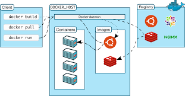
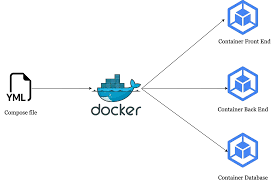
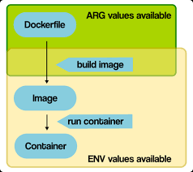
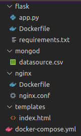

# **Bài tập Containerization**
## **Nội dung**
  - [**Mục Lục**](#mục-lục)
  - [**I. Tổng quan**](#i-tổng-quan)
    - [**1. Containerization**](#1-containerization)
    - [**2. Docker**](#2-docker)
    - [**3. Docker compose**](#3-docker-compose)
  - [**II. Bài tập 1**](#ii-bài-tập-1)
    - [**1. ARG vs ENV**](#1-arg-vs-env)
    - [**2. COPY vs ADD**](#2-copy-vs-add)
    - [**3. CMD vs ENTRYPOINT**](#3-cmd-vs-entrypoint)
  - [**III. Bài tập 2**](#iii-bài-tập-2)
    - [**1. Yêu cầu**](#1-yêu-cầu)
    - [**2. Xây dựng**](#2-xây-dựng)
  - [**IV. Tài liệu tham khảo**](#iv-tài-liệu-tham-khảo)
## **I. Tổng quan**

### **1. Containerization**

- Containerization là giải pháp ảo hoá, tự động hóa thế hệ mới kế tiếp sau Hypervisor Virtualization, được các hãng công nghệ hàng đầu thế giới như Google, Facebook, Amazon áp dụng rộng rãi, đem lại hiệu quả đột phá với các ưu điểm vượt trội về tốc độ triển khai, khả năng mở rộng, tính an toàn và trải nghiệm người dùng.

### **2. Docker**

- Docker là một nền tảng để cung cấp cách để building, deploying và running ứng dụng dễ dàng hơn bằng cách sử dụng các containers (Trên nền tảng ảo hóa). Ban đầu Docker được viết bằng Python nhưng hiện tại đã chuyển sang Golang.

    

- Lợi ích của Docker:

  - Triển khai kiến trúc Microservices.

  - Scale một cách linh hoạt khi xây dựng ứng dụng.

  - Không tốn nhiều thời gian để config máy local và server cùng một môi trường để chạy được ứng dụng. Bạn chỉ cần build 1 lần chạy ở nhiều nơi mà thôi.

  - Thực thi ứng dụng một cách nhanh chóng dễ dàng.

### **3. Docker compose**

- Docker Compose là một công cụ dùng để định nghĩa và chạy các chương trình Docker sử dụng nhiều container (multi-container). Với Docker Compose, chúng ta sử dụng một file YAML (yml) để thiết lập các service cần thiết cho chương trình. Cuối cùng, với một câu lệnh, chúng ta sẽ create và start tất cả service từ các thiết lập đó.

  

- Những lợi ích khi sử dụng Compose:

  - **Tạo ra nhiều môi trường độc lập (isolated environments) trong một host:** Compose cô lập môi trường của các project để đảm bảo chúng không bị xung đột lẫn nhau, cũng như dễ dàng tạo những bản sao của một môi trường nào đó.

  - **Chỉ tạo lại các container đã thay đổi:** Compose sẽ nhận biết được các service chưa thay đổi và sử dụng lại các container tương ứng với service đó.

  - **Điều chỉnh các biến sử dụng cho các môi trường:** Compose sử dụng các biến trong Compose file cho các môi trường. Vì vậy với môi trường hay người dùng khác nhau, có thể điều chỉnh các biến khi sử dụng Compose để thiết lập các service.

## **II. Bài tập 1**

### **1. ARG vs ENV**

- `ARG` hay còn gọi là biến build-time chỉ hoạt động trong quá trình build-image, hoạt động kể từ thời điểm chúng được khai báo trong Dockerfile trong câu lệnh `ARG` cho đến khi image được tạo. Khi chạy container, chúng ta không thể truy cập giá trị của các biến `ARG` và chúng chạy duới giá trị mặc định, nếu thay đổi lệnh build sẽ lỗi.

- `ENV` có sẵn trong quá trình xây dựng, ngay khi bạn khai báo chúng với một command của `ENV`. Tuy nhiên, không giống như `ARG`, khi build xong image, các container chạy image có thể truy cập giá trị `ENV` này.Bên cạnh đó các container chạy từ image có thể ghi đè giá trị của `ENV`.



### **2. COPY vs ADD**
- Nhìn chung `COPY` và `ADD` khá giống nhau về mặt chức năng khi chúng cho phép copy files từ một vị trí được khai báo tới một Docker image.
- `ADD` có thể tìm nạp các URL từ xa, trích xuất các tệp TAR,... tuy nhiên khi copy local files tới Docker image thì nên sử dụng `COPY` bởi vì nó tường minh hơn so với `ADD`

### **3. CMD vs ENTRYPOINT**

Chúng đều được sử dụng để chỉ định và thực thi các lệnh nhưng chúng cũng có những điểm khác nhau.
- `CMD` cho phép ta set default command, có nghĩa là command này sẽ chỉ được chạy khi run container mà không chỉ định một command. `CMD` thì tất cả sẽ bị ignore ngoại trừ lệnh `CMD` cuối cùng.
- `ENTRYPOINT` cho phép ta cấu hình container sẽ chạy dưới dạng thực thi. Nó tương tự như `CMD`, vì nó cũng cho phép ta chỉ định một lệnh với các tham số. Sự khác biệt là lệnh `ENTRYPOINT` và các tham số không bị bỏ qua khi container chạy.
## **III. Bài tập 2**
### **1. Yêu cầu**
Thiết lập ứng dụng web 3 tầng hiển thị thông tin sinh viên trong lớp học trên trình duyệt bằng Docker-compose. Dựa trên các base-image:
- *nginx:1.22.0-alpine*
- *python:3.9*
- *mongo:5.0*
### **2. Xây dựng**
- Mô hình em xây dựng có cấu trúc như ở dưới:

  

- Tạo file `app.py` để thiết lập tầng logic:
```bash
import os
from flask import Flask, jsonify
from flask_pymongo import PyMongo

application = Flask(__name__)

mongo = PyMongo(application)
db = mongo.db


@app.route('/', methods = ['GET'])
def index():
    students = db.students.find()

    item = {}
    data = []
    for student in students:
        item = {
            'id': str(student['_id']),
            'num': str(student['num']),
            'name': str(student['name']),
            'year': str(student['year']),
            'gender': str(student['gender']),
            'university': str(student['university']),
            'major': str(student['major'])
        }
        data.append(item)

    return jsonify(
        status=True,
        data
    )

@app.route('/', methods=('GET', 'POST'))
def all():
    return render_template('index.html')


if __name__ == "__main__":
    app.run(host='0.0.0.0', port=9000, debug=ENVIRONMENT_DEBUG)

```

- Tiếp theo, e, tạo file `requirements.txt` để cài đặt các thư viện cần thiết

- Tạo `Dockerfile` để xây dựng Docker image
```bash
FROM python:3.9

WORKDIR /src
COPY ./requirements.txt /src/requirements.txt
RUN pip install -r requirements.txt --no-cache-dir

EXPOSE 9000
CMD ["python","0.0.0.0:9000","./app.py"]
```

- Tiếp theo, em tạo file cấu hình cho nginx và Dockerfile của nó
  
  - `nginx.conf`

  ```bash
  upstream nginx_sever {
  server flask:9000;
  }
  server {
  listen 800;
  location / {
    proxy_pass http://nginx_server;
  }
  }
  ```
   - `Dockerfile`
   ```bash
   FROM nginx:1.22.0-alpine
   WORKDIR /src
   RUN rm -rf ./*
   EXPOSE 80
   ENTRYPOINT [ "nginx", "-g", "daemon off;" ]
   ```

- Bước tiếp theo, em tạo `file docker-compose.yml`

```bash
version: '3.9'

services:
 web:
   build:
     context: nginx
     dockerfile: Dockerfile
   ports:
     - 800:800
   depends_on:
     - backend
 backend:
   build: 
     context: flask
     dockerfile: Dockerfile
   environment:
     MONGODB_DATABASE: flaskdb
     MONGODB_USERNAME: flaskuser
     MONGODB_PASSWORD: mongodb_password
     MONGODB_HOSTNAME: mongodb
   ports: 
     - 9000:9000
   depends_on:
     -  mongo  
 mongo:
   image: mongo:5.0
   container_name: mongod
   environment:
     MONGO_INITDB_ROOT_USERNAME: mongodbuser
     MONGO_INITDB_ROOT_PASSWORD: mongodb_password
   ports:
     - 27017:27017

```
- Để khởi tạo user cho MongoDB database và import data vào database, em sử dụng lần lượt 2 lệnh

```
docker exec -it mongod bash
```
```
mongoimport --type csv -d students -c students --headerline datasource.csv
```

- Cuối cùng chạy lệnh `docker compose up` để khởi tạo và chạy các container

## **IV. Tài liệu tham khảo**
- [Docker là gì?](https://topdev.vn/blog/docker-la-gi/)
- [Docker-compse là gì](https://viblo.asia/p/docker-compose-la-gi-kien-thuc-co-ban-ve-docker-compose-1VgZv8d75Aw)
- [Dockerfile references](https://viblo.asia)
- [How To Set Up Flask with MongoDB and Docker](https://www.digitalocean.com/community/tutorials/how-to-set-up-flask-with-mongodb-and-docker)
- [Đỗ Triệu Hải VDT2022](https://github.com/vietstacker/Viettel-Digital-Talent-Program-2022/tree/main/Practice-3/do-trieu-hai)