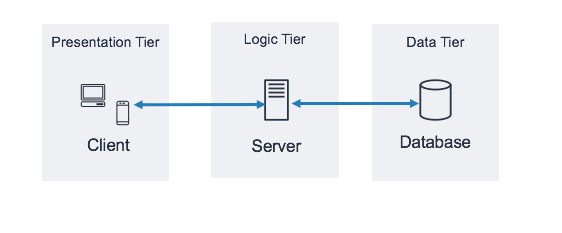
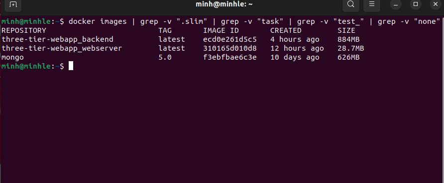
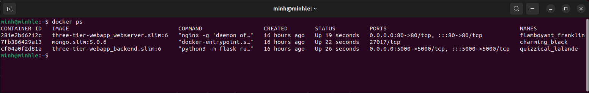

# TABLE OF CONTENT

- [TABLE OF CONTENT](#table-of-content)
- [1. DISTINGUISH INSTRUCTIONS](#1-distinguish-instructions)
  - [1.0. Overview Docker and docker-compose](#10-overview-docker-and-docker-compose)
  - [1.1. ARG and ENV](#11-arg-vs-env)
  - [1.2. COPY and ADD](#12-copy-vs-add)
  - [1.3. CMD and ENTRYPOINT](#13-cmd-vs-entrypoint)
- [2. THREE-TIER WEB APPLICATION WITH DOCKER](#2-three-tier-web-application-with-docker)
  - [2.1. Three-tier architecture overview](#21-three-tier-web-application-overview)
  - [2.2. Configure Dockerfile for backend](#22-configure-dockerfile-for-backend)
  - [2.3. Configure NGINX](#23-configure-nginx)
  - [2.4. Configure Dockerfile for frontend](#24-configure-dockerfile-for-frontend)
  - [2.5. Deploy using Docker-compose](#25-deploy-using-docker-compose)
- [3. OPTIMIZE DOCKER IMAGE SIZE](#3-optimize-image-size)
  - [3.1 Based on Dockerfile instruction](#31-based-on-dockerfile-instruction)
  - [3.2 Extremely optimize Docker image size ](#32-extremely-optimize)
  - [3.3 Conclusions](#33-conclusions-about-optimzation)
- [4. REFERENCES](#4-references)


# 1. DISTINGUISH INSTRUCTIONS

## 1.0. Overview Docker and docker-compose

### **Docker**

1. Docker is an open platform for developing, shipping, and running applications.

Docker enables to separate applications from infrastructure so can deliver software quickly. With Docker, we can manage our infrastructure in the same ways we manage our applications. By taking advantage of Docker’s methodologies for shipping, testing, and deploying code quickly, you can significantly reduce the delay between writing code and running it in production.

2. Docker uses containerization to separate applications from infrastructure and allow for efficient and predictable development.

Docker uses containerization to package applications and their dependencies into portable containers that can run on any system. This allows developers to separate their applications from the underlying infrastructure, which can help to increase efficiency and predictability in the development process. Containers are lightweight, portable, and can be run on any system that supports Docker, making it easy to move applications between different environments.

3. Docker has a client-server architecture, with the Docker client communicating with the Docker daemon via a REST API.

This allows developers to manage their Docker containers from the command line or through a web interface, providing a flexible and powerful way to interact with the Docker platform. The Docker daemon is responsible for building, running, and distributing Docker containers, and can be run on the same system as the Docker client or on a remote system.

4. Docker images are read-only templates for creating containers, and can be customized and built using a simple syntax in a Dockerfile.

Docker image based on a set of instructions, called a Dockerfile, that define the steps needed to create the image and run it. Docker images can be customized and built using a simple syntax in a Dockerfile, and each instruction in the Dockerfile creates a layer in the image. When changes are made to the Dockerfile and the image is rebuilt, only the layers that have changed are rebuilt, making Docker images lightweight, small, and fast compared to other virtualization technologies.

5. Docker containers are runnable instances of images, and can be controlled and configured for isolation and connectivity to other containers and networks.

Docker containers be created, started, stopped, moved, or deleted using the Docker API or CLI. Containers can be connected to one or more networks, attached to storage, and configured for isolation and connectivity to other containers and networks. By default, containers are isolated from other containers and the host machine, but the level of isolation can be controlled by developers to meet their specific needs.


<div align="center">
  
</div>

<div align="center">
  <i><a href=http://xmlandmore.blogspot.com/2015/11/security-and-isolation-implementation.html>
         Virtualization and Isolation and Docker - xmlandmore.blogspot.com
        </a></i>
</div>


### **docker-compose**

Docker Compose is an orchestration tool that helps developers manage complex container-based applications. It allows developers to define and configure multiple services, dependencies, and networking requirements in a single file. By defining the infrastructure as code, Docker Compose ensures that the same environment can be replicated anywhere, which is especially useful when deploying to multiple environments such as development, staging, and production. 
Docker Compose uses YAML syntax to define the components or dependencies of an application. This makes it easy for developers to write and read configuration files, which are human-readable and easy to parse. Docker Compose's rich command line interface (CLI) allows developers to easily manage the various components of an application. By eliminating the need for manual configuration and setup, Docker Compose frees developers to focus on writing and testing code, making the development process faster and more efficient.

<div align="center">
  
</div>

<div align="center">
  <i><a href=https://www.freecodecamp.org/news/a-beginners-guide-to-docker-how-to-create-a-client-server-side-with-docker-compose-12c8cf0ae0aa>
         docker-compose - freeCodeCamp
        </a></i>
</div>

## 1.1. ARG vs ENV

ARG and ENV are instructions used to define variables in Docker, however, the scope of variables declared by these two instructions is different.

- ENV is used to declare the variables `for running the container in the future`.
```shell
        ENV <key>=<value> ...
```
- ENV is used when to define environment variables that applications running the container will access these variables, . These variables will be used to configure applications running in containers. Containers running from the image can override the value of ENV by flag **-env**.

- ARG is used for image building process.

- ARG is used to define variables that after building the image will no longer be able to use these variables. Cannot access the value of ARG variables and they run below default value, if change build command will error. **When building a Docker** image from the commandline, you can set ARG values using **–build-arg**.

```shell
        $ docker build --build-arg some_variable_name=a_value
```

<div align="center">
  
</div>

<div align="center">
  <i><a href=https://vsupalov.com/docker-arg-vs-env>
        ARG vs ENV - vsupalov.com
        </a></i>
</div>
Use a variable ENV or ARG:

```shell
        ${var_name}
```

## 1.2. COPY vs ADD

`COPY` and `ADD` both have the feature of copying files from **src** and adds them to the filesystem of the container at the path **dest**.
```shell
          COPY <src> <dest>
          ADD <src> <dest>
```

`COPY` support to overwrite build context by `--from` argument.

`ADD` supports two more features, local-only tar extraction and fetch packages from remote URLs. `ADD` can be used in cases where we need to extract the tar file in the container.

## 1.3. CMD vs ENTRYPOINT

CMD and ENTRYPOINT are both used to specify the program that we want to execute when we run command `docker run`.
Forms:
```shell
        CMD ["param1","param2"] # preferred form
        CMD command param1 param2 # shell form

        ENTRYPOINT command param1 param2 # shell form
        ENTRYPOINT ["executable", "param1", "param2"] # preferred form
```

ENTRYPOINT will configure when running the container as an command called `executable capability`, in other words all variables defined after the name of the image will be appended to the command in the ENTRYPOINT as a variable. 
For CMD add after the image name of the docker run image command, it will override this CMD command.
A Dockerfile can contain more than one CMD instruction, however `the last CMD instruction will be used` when creating the container.

A CMD's primary function is to offer defaults to an executing container. These defaults may or may not include an executable, in which case you also need to specify an ENTRYPOINT instruction.


## 1.4. What is Multi-stage build:

One of the biggest challenges of reducing the size of a docker image is the hardest. Each instruction in the docker file will create a layer, each layer will increase the size of the image. This will make it difficult to maintain, and create containers that will execute these images.

To keep the size of the image small, we can use the multi-stage technique to build the images.

We have two Dockerfiles:
                
Dockerfile for vuejs, build vuejs by webpack based on node image
```dockerfile
        FROM node:14.0.0-alpine3.10
        COPY webpack /webpack
        WORKDIR /webpack
        RUN npm install
        RUN npm run build
```
Dockerfile for golang, Build app golang based on golang image
```dockerfile         
        FROM golang:1.13
        COPY beego /go/src/goapp
        COPY vuejs/build.js /go/src/backend/static/js/build.js
        WORKDIR /go/src/goapp
        RUN go mod vendor
        RUN go build goapp.go
        CMD ./goapp
```
With the above method, the image built from node will become unnecessary because in the end, we only need to go to the build.js file to bring in the image of the golang app. Besides, it also carries with it a heavy **node_modules** block, so after the build is complete, it is best to delete this image.

**Multi-stage build**
```dockerfile
        #Phase 1: Build vuejs by webpack

        FROM node:14.0.0-alpine3.10 AS webpack-builder
        COPY webpack /webpack
        WORKDIR /webpack
        RUN npm install
        RUN npm run build

        #Phase 2: Build application
        FROM golang:1.13
        RUN apt-get -q update && apt-get -qy install netcat
        COPY beego /go/src/goapp
        COPY --from=webpack-builder /webpack/dist/build.js /go/src/goapp/static/js/build.js
        COPY ops/bin/wait-for.sh /usr/bin/wait-for.sh
        RUN chmod +x /usr/bin/wait-for.sh
        WORKDIR /go/src/goapp
        RUN go mod vendor
        RUN go build main.go
        CMD /usr/bin/wait-for.sh backend-mysql:3306 -- ./goapp
```
On phase 1, the building process will be named **webpack-builder**

On phase 2:
```sh
        COPY --from=webpack-builder /webpack/dist/build.js /go/src/goapp/static/js/build.js
```
This code will help copy file build from **webpack-builder** (named **build.js** in **webpack.config.js**) into folder **/go/src/goapp/static/js**
of app golang.

With multi-stage builds, `we only need a single Dockerfile`. All unnecessary things generated during the webpack build process (like node_modules, package-lock etc.) will be removed, keeping only what is needed for the final image, as in the above example the file **build.js**.

# 2. THREE-TIER WEB APPLICATION WITH DOCKER

## 2.1. THREE-TIER WEB APPLICATION OVERVIEW

## Mandatory: 

Set up a three-tier web application that displays the course attendees' information     on the browser using docker-compose.

Base images:

        nginx:1.22.0-alpine
        python:3.9
        mongo:5.0

<div align="center">
  
</div>

<div align="center">
  <i><a href=https://docs.aws.amazon.com/whitepapers/latest/serverless-multi-tier-architectures-api-gateway-lambda/three-tier-architecture-overview.html>
        Three-tier web application - AWS
        </a></i>
</div>

The three-tier architecture organizes the web app into three logical and physical layers: the presentation tier or user interface; application layer where the data is processed and finally the data tier used to store and manage data, this is a common pattern of client-server application:

- Presentation tier: This is the tier that provides the user interface to communicate with the application. It is run on a web browser. Usually written in HTML, CSS, and JS. NGINX is responsible for serving HTML, CSS, and JS files and will also act as a proxy server to pass requests to the application tier.
- Application tier: in this tier will proceed to get and process information from the data tier. Flask framework is used to develop Resful APIs
- Data tier: The main task is to store and manage data. MongoDB is used.

## 2.2. Configure Dockerfile for backend

I use framework Flask for API and library pymongo to connect with database. 
Designed POST, GET, DELETE APIs to pass data through Postman, get data about students and delete students (also using Postman).

```dockerfile
        # We use image python:3.9
        FROM python:3.9

        # We set working directory to /app
        WORKDIR /app

        # Copy all the source code to the current working directory
        COPY . .

        # Upgrade pip to latest version and also install all requied packages and libs form requirements.txt.
        # --no-cache-dir:m not save any cache files during the installation
        RUN pip install --no-cache-dir --upgrade pip && pip install --no-cache-dir -r requirements.txt

        # The FLASK_APP environment variable is set to api.py. 
        # This environment variable will be used by Flask when running the flask run command to launch the application.
        ENV FLASK_APP=api.py

        # The container will listen for connections from port 5000
        EXPOSE 5000

        # Use CDM to execute application, the flask command or python -m flask is used to run application.
        # --host=0.0.0.0 allows the container to be accessed from outside, by binding to the port configured in the docker-compose.yml file.
        CMD [ "python3", "-m", "flask", "run", "--host=0.0.0.0" ]
```
## 2.3. Configure NGINX

We use NGINX as a web server to host the frontend
NGINX will serve static files such as HTML, CSS, JS to the client and act as a proxy server to forward API requests to the Web Server. Use the nginx.conf file to configure NGINX:
```shell
        # This server will listen on port 80 for incoming HTTP requests
        server { 
        listen 80;

        # sets the domain name for this server block to localhost
        server_name localhost;

        # "root /usr/share/nginx/html;" - sets the root directory for for serving static files. 
        # "try_files $uri /index.html;" - serve the requested file first, and if it's not found, it serves the index.html file instead. 
        location / {
                root /usr/share/nginx/html;
                try_files $uri /index.html;
        }

        # Requests to an API running on localhost:5000
        # "proxy_redirect off;" - disables Nginx from automatically redirecting requests
        # "proxy_set_header" - setting some HTTP headers to be passed along to the backend API server
        # "proxy_pass" - specifies the URL of the backend API server
        # "proxy_cache_bypass $http_upgrade;" - bypass caching for requests that include the "upgrade" header.
        location /api {
                proxy_pass http://localhost:5000/;
                proxy_redirect off;
                proxy_set_header X-Real-IP $remote_addr;
                proxy_set_header X-Forwarded-For $proxy_add_x_forwarded_for;
                proxy_set_header X-NginX-Proxy true;
                proxy_ssl_session_reuse off;
                proxy_set_header Host $http_host;
                proxy_cache_bypass $http_upgrade;
                
                }
        }
```

## 2.4. Configure Dockerfile for frontend

We will use image the base image of `nginx:1.22.0-alpine` and copies the contents of the current directory to the nginx working directory. Then the entrypoint is set to run nginx with the flag `"-g daemon off;`" to prevent nginx from running in the background.

```shell
        FROM nginx:1.22.0-alpine

        WORKDIR /usr/share/nginx/html

        COPY ./* ./

        ENTRYPOINT [ "nginx", "-g", "daemon off;" ]
```

To design the website interface, we leverage the fundamental alignment characteristics of HTML, CSS, and JavaScript. It is quite finished, but using specialized frontend frameworks would make it more attractive. We incorporate a minimalist design that is nonetheless packed with information due to the time constraints.

## 2.5. Deploy using docker-compose

Our project will include service, corresponding to the backend and web_server.

Specifies the version of docker-compose.yml to use, the latest version: `3.9`
The backend service is defined. It is being configured to build from the Dockerfile defined in the `./api` directory.
The server's current directory will be shared with the backend service's `/app` directory by volume moun.

```yaml
        version: '3.9'
        services:
        backend:
            build:
              context: ./api
              dockerfile: Dockerfile
            volumes:
                - ./api/:/app
```

Specify the ports to be visible to the service and redirect traffic from port 5000 on the host to port 5000 on the backend service.


```yaml
        ports:
          - 5000:5000
```

Specify the networks to connect the service to the backend: the frontend-webapp network to connect to the frontend and the backend-webapp to connect to the database

```yml
        networks:
            - frontend-webapp
            - backend-webapp
```
Define a service named "webserver", set the build context to the "client" directory and specify the Dockerfile defined in the directory ./client to use for building the image.
Expose port 80 on the host to port 80 on the `webserver` service.
```yml
        webserver:
            build:
              context: ./client
              dockerfile: Dockerfile
        ports:
          - 80:80
```

Specify the volume to mount for the webserver service. Specifies that the `./client/nginx/conf.d/` and `./client` directories on the host machine will be mounted with the `/etc/nginx/conf.d/` and `/usr/share/nginx/html` respective directories in the `webserver` service.

```yml
        volumes:
            - ./client/nginx/conf.d/:/etc/nginx/conf.d/
            - ./client:/usr/share/nginx/html
```

Specifies that the container should be attached to the `frontend-webapp` network.
```yml
        networks:
            - frontend-webapp
```

Define a service named `mongodb` for a MongoDB database. Specifies the Docker image to use for the container based on `mongo:5.0`. Then mount the `.data/db/` directory on the host machine to the `/data/db` directory in the container.
Specify that the container should be attached to the `backend-webapp` network.

```yml
        mongodb:
            image: mongo:5.0      
            volumes:
                - .data/db:/data/db
            networks:
                - backend-webapp

```
Two networks has been defined that the containers will use:
`frontend-webapp`: A bridge network for communication between the `webserver` and `backend` containers.

`backend-webapp`: A bridge network for communication between the `backend` and `database` containers.

```yml
        networks:
            frontend-webapp:
                driver: bridge
            backend-webapp:
                driver: bridge
```   

So, here we go. This is final docker-compose.yml:

```yml
version: '3.9'

services:
    backend:
        build:
          context: ./api
          dockerfile: Dockerfile
        volumes:
            - ./api/:/app
        ports:
          - 5000:5000
        networks:
            - frontend-webapp
            - backend-webapp

    webserver:
        build:
          context: ./client
          dockerfile: Dockerfile
        ports:
            - 80:80
        volumes:
            - ./client/nginx/conf.d/:/etc/nginx/conf.d/
            - ./client:/usr/share/nginx/html
        # links:
        #     - backend
        # depends_on:
        #     - backend
        networks:
            - frontend-webapp

    mongodb:
        image: mongo:5.0      
        volumes:
            - .data/db:/data/db
        networks:
            - backend-webapp

networks:
    frontend-webapp:
        driver: bridge
    backend-webapp:
        driver: bridge
```

Build images and running container:

```shell
        docker-compose up --build -d
```

After the build process, we have the following <big>results</big>:

<div align="center">ing
  
</div>

<div align="center">
  <i><a>
        Building results
        </a></i>
</div>

<div align="center">
  
</div>

<div align="center">
  <i><a>
        Containers are running
        </a></i>
</div>

Run the containers with docker-compose up, use our browser to access localhost port 80:

Using Postman to post data to POST API endpoint:


<div align="center">
  
</div>

<div align="center">
  <i><a>
        Postman
        </a></i>
</div>

### *Here we go again!!!*

<div align="center">
  
</div>

<div align="center">
  <i><a>
        Result
        </a></i>
</div>


<div align="center">
  
</div>

<div align="center">
  <i><a>
        Students
        </a></i>
</div>


# 3. OPTIMIZE IMAGE SIZE
An equally challenging aspect is keeping the size of Docker images small. The core advantage of small Docker images is cost reduction: **small images consume less disk space, can be downloaded (and extracted) faster, and thus reduce container startup time**.


## 3.1. Based on Dockerfile instruction.

In the process of writing Dockerfiles, I optimized the size of Docker images using the following methods:

### 3.1.1. **Choose a suitable base image**. 
As required by the topic, the base images are not arbitrarily selected, so I have used the base images as required.

```dockerfile
        nginx:1.22.0-alpine
```

```alpine``` is a `**lightweight**` Linux distribution that is known for its small and scurity-focuesed design.

### 3.1.2. **Aggregate multiple RUN commands**: 
Whenever you only need certain files temporarily (i.e. you download/install them, use them and then delete them again), you should build a single RUN command that does it all all these steps, instead of having multiple RUN commands. Since each RUN command adds a new layer to the image, this layer contains the changed files and directories. These classes are "additional", using an overlay-style file system. However, deleting files only marks these files as deleted – no disk space is reclaimed! When using only a single RUN command with tasks that do not change much, the downloaded and installed files are deleted before the RUN command completes.

```shell
        RUN pip install --no-cache-dir --upgrade pip && pip install --no-cache-dir -r requirements.txt
```

### 3.1.3. **Use .dockerignore files**
The .dockerignore file lets us `specify files & folders that the Docker build process should not copy from the host into the build context`. This not only speeds up Docker image building (because the build context is populated faster), but this can also make your image smaller: it avoids that you accidentally copy large files or folders into the image, which you don’t need to run your application. 

### 3.1.4 **Avoid superfluous chowns**
In addition, I followed some security guidelines to building Docker images. It is not to grant redundant permissions to execute commands during the build process. Whenever some statement in the Dockerfile modifies a file in the build container in any way (including changing the metadata), a brand new copy of that file is stored in the new layer. . The same is true for changes in file ownership or permissions. Therefore, recursive chowns can lead to very large images, as Docker copies every affected file.

## 3.2. **Extremely optimize**

### 3.2.1. **Use the docker-slim tool**

**docker-slim** is a tool that reduces image size, by starting a temporary container of image, and figuring out (via static + dynamic analyses) which files are really used by application in that container. **docker-slim** then builds a new single-layer image that contains only those files and folders that were actually used. This makes **docker-slim** the most effective approach of all those listed here, but it does not come without caveats!

After building image, we can use this **docker-slim build** to build a new single-layer image:
```shell
        docker-slim build --http-probe=false <image>
```
where:
``` shell 
        --http-probe=false # do not use http probe to detect the port used.
```

For optimizing Docker images, execute the following commands for each Docker image:

I have tried many times, and as you can see in the tag, this is my 6th time.

```shell
        // mongo
        docker-slim build --http-probe=false --target mongo:5.0 --tag mongo.slim:5.0.6

        // backend
        docker-slim build --http-probe=false --target three-tier-webapp_backend:latest --tag three-tier-webapp_backend:6
        
        // web server
        docker-slim build --http-probe=false --target three-tier-webapp_webserver:latest --tag three-tier-webapp_webserver:6
```

After optimization with Docker-slim, the docker images are significantly smaller than before:

<div align="center">
  
</div>

<div align="center">
  <i><a>
        Result after optimizing with docker-slim
        </a></i>
</div>

<big> **Oh, wizardry!!!** </big> The size of backend image has been reduced from `nearly 900 MB` (three-tier-webapp_backend) to `less than 50 MB` (three-tier-webapp_backend.slim) - `almost 40 times reduction`.


Let's run containers:

<div align="center">
  
</div>

<div align="center">
  <i><a>
        Slim containers are runing
        </a></i>
</div>

## **Deep into this magic**

`docker-slim` is a tool that reduces your image size, by starting a temporary container of your image, and figuring out (via static + dynamic analyses) which files are really used by your application in that container. docker-slim then builds a new single-layer image that contains only those files and folders that were actually used. This makes docker-slim the most effective approach of all those listed here, but it does not come without caveats!

### Advantages:
- Results in very small images – they are often smaller than alpine-based images!
- High image security (distroless-like), because all other tools (e.g. the shell, curl, package manager, etc.) are removed, unless your application needs them.
- Carefree Dockerfiles: you can ignore most other tricks of this article, e.g. use large base images and have many (unoptimized) RUN statements. docker-slim will figure out the rest!

### Disadvantage:
- docker-slim may throw away too many files, because your application uses lazy loading/calling. This `can make the resulting Docker image unusable in production`. Even worse, these errors might only show up after the slimmed-down image has been in use for a while, because the missing files are only needed in certain (sometimes hard-to-replicate) edge cases. 

To handle this disadvantage, you need to tweak docker-slim via two mechanisms:

- Explicit “preserve path”-lists, that contain paths to files and folders that docker-slim should definitely keep (even though they were not used during the tests in the temporary container)
- Dynamic probes, which are HTTP requests or shell command calls that docker-slim makes to your application, to force it to (lazy-) load dependencies, e.g. native libraries

[The official manual provides further details about how to install and use docker-slim.](https://github.com/docker-slim/docker-slim/)

## 3.3. Conclusions about optimzation

To get small Docker images, we can don't use docker-slim to catch-all, but then you need to spend time implementing the other techniques. Or we do use docker-slim, but then we need to invest time to write automated system-level tests which identify problems in the slimmed-down container.

`With this simple web application we can use docker-slim but for more complex applications a lot more care is needed
`
# 4. REFERENCES

- https://docs.docker.com/
- https://shantanoo-desai.github.io/posts/technology/seeding-mongodb-docker-compose/
- https://www.mongodb.com/docs/
- https://slimtoolkit.org/
- http://nginx.org/en/docs/
- https://vsupalov.com/docker-arg-vs-env/
- https://www.augmentedmind.de/2022/02/06/optimize-docker-image-size/
- https://www.google.com/search?channel=fs&client=ubuntu-sn&q=optimization+docker+image+size
- https://blog.knoldus.com/how-to-run-multi-container-applications-with-docker-compose/


## [Back to the top](#table-of-content)
