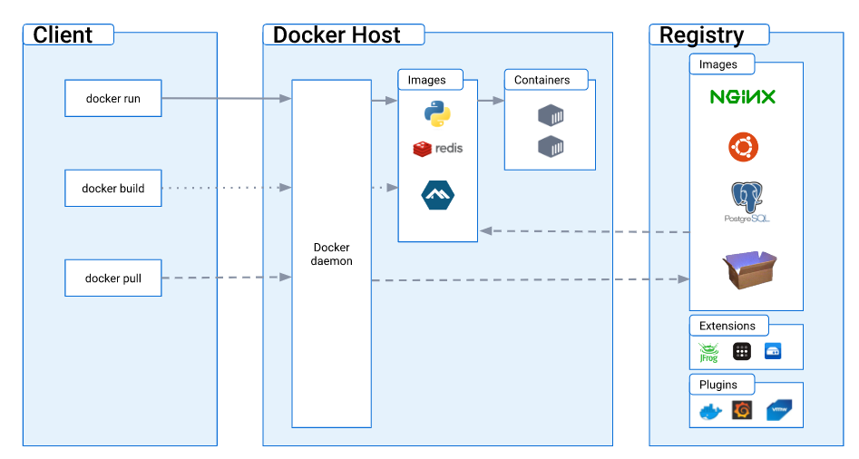
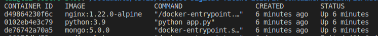
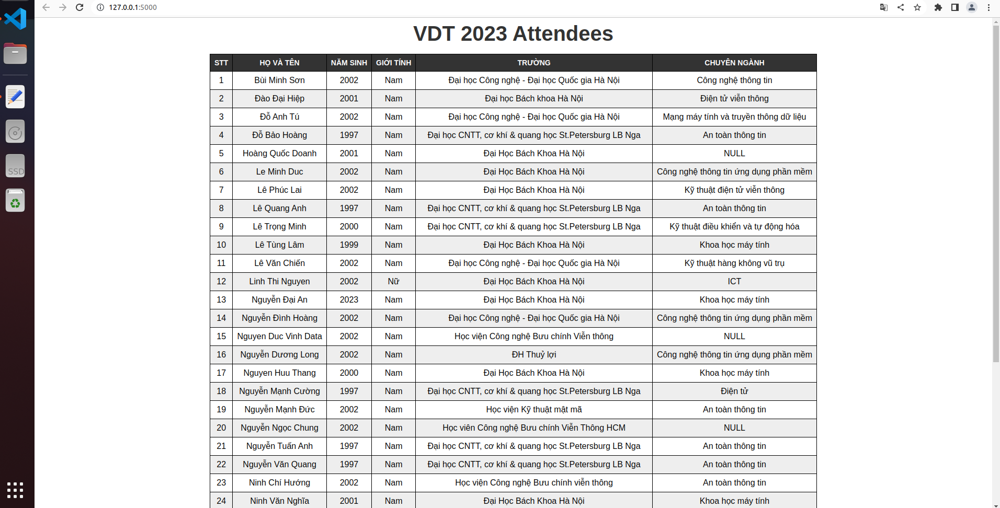

# 1. DOCKER OVERVIEW


* Docker is a platform for developing, shipping and running applications. Docker gives you an ability to seperate your applications from yoir infrastructure so that you can deliver your software quickly, reduce the delay between writing code and running it in production. 

## 1.1 The Docker platform
* Docker enables you to package and run application in a isolated environment. That environment is called a container. You can run many containers at the same time on a given host thanks to its isolation and security, therefore reduce conflict between your applications.
* You can easily share containers while you work, or deploy it into your production environment.

## 1.2 Docker's advantages:
* Fast, consistent delivery of your applications
* Responsive deployment and scaling
* Running more workloads on the same hardware

## 1.3 Docker architecture:
* Docker uses a client-server architecture. The Docker client talks to the Docker daemon, which does the heavy lifting of building, running, and distributing your Docker containers.


## 1.4 Docker objects:
* Images: a read-only template with instructions for creating a Docker container
* Container: a runnable instance of an image. You can create, start, stop, move, or delete a container using the Docker API or CLI. You can connect a container to one or more networks, attach storage to it, or even create a new image based on its current state

# 2. DIFFERENTS BETWEEN DOCKERFILE INSTRUCTIONS:
## ARG and ENV:
* ARG: 
    * ```ARG <name>[=<default value>]```
    * The ARG instruction defines a variable that users can pass at build-time to the builder with the docker buildcommand using the --build-arg <varname>=<value> flag. A Dockerfile may include one or more ARG instructions. For example, the following is a valid Dockerfile:

* ENV:
    * ```ENV <key> <value>```
    ```ENV <key>=<value> ...```
    * The ENV instruction sets the environment variable <key> to the value <value>. This value will be in the environment for all subsequent instructions in the build stage and can be replaced inline in many as well.
    * The ENV instruction has two forms. The first form, ENV <key> <value>, will set a single variable to a value. The entire string after the first space will be treated as the <value> – including whitespace characters. The value will be interpreted for other environment variables, so quote characters will be removed if they are not escaped.
    * The second form, ENV <key>=<value> ..., allows for multiple variables to be set at one time. Notice that the second form uses the equals sign (=) in the syntax, while the first form does not. Like command line parsing, quotes and backslashes can be used to include spaces within values.

* ENV is for future running containers. ARG for building your Docker image.


## COPY and ADD:
* COPY:
    * ```COPY <src> <dest>```
    * Copies new files or directories from <src> and adds them to the filesystem of the container at the path <dest>.

* ADD:
    * ```ADD <src> <dest>```
    * Copies new files, directories or remote file URLs from <src> and adds them to the filesystem of the image at the path <dest>.

*COPY only lets you copy in a local or directory from your host. ADD lets you copy from remote

## CMD and ENTRYPOINT:
* CMD:
    * ```CMD ["", ""]```
    * Specifies the command to run when a container is launched (different from RUN instruction running the command when the container is being built)

* ENTRYPOINT
    * ```ENTRYPOINT ["executable", "param1", "param2"] (exec form, preferred)``
    ```ENTRYPOINT command param1 param2 (shell form)```
    * Allows you to configure a container that will run as an executable.

* ENTRYPOINT command and parameters are not overridden when Docker container runs with command line parameters 

# 3. THREE TIER WEB APPLICATION USING DOCKER COMPOSE
## 3.1 Requirements
* Set up a three-tier web application that displays the course attendees’ information on the browser using docker-compose.
* Base image:
    * nginx:1.22.0-alpine
    * python:3.9
    * mongo:5.0

## 3.2 Writting the application code
* For the web app using in this practice, i will use Flask, a web application framework using Python
```
from flask import Flask, render_template
from flask_pymongo import PyMongo

application = Flask(__name__, template_folder='template')

application.config["MONGO_URI"] = "mongodb://host_mongodb:27017/attendees"
mongo = PyMongo(application)


@application.route('/', methods=['GET'])
def index():
    cur = mongo.db.attendees.find({}, {'STT': 1, 'Name': 1, 'DOB': 1, 'Gender': 1, 'Univerity': 1, 'Major': 1, '_id': 0})
    return render_template('index.html', cur=list(cur))

if __name__ == "__main__":
    application.run(host='0.0.0.0', port=5000, debug=True)
```

## 3.3 Configuring Nginx
* In this step, i will configure Nginx to forward requests to Flask on port ':5000'
'''
upstream app_server {
    server flask:5000;
}

server {
    listen 8000;
    server_name _;
    error_log  /var/log/nginx/error.log;
    access_log /var/log/nginx/access.log;
    client_max_body_size 64M;

    location / {
        try_files $uri @proxy_to_app;
    }

    location @proxy_to_app {
        gzip_static on;

        proxy_set_header X-Forwarded-For $proxy_add_x_forwarded_for;
        proxy_set_header X-Forwarded-Proto $scheme;
        proxy_set_header Host $http_host;
        proxy_buffering off;
        proxy_redirect off;
        proxy_pass http://app_server;
    }
}
'''
* 

## 3.4 Writting the Docker Compose file
```
version: '2.17.3'
services:
  flask:
    build:
      context: app
      dockerfile: Dockerfile
    container_name: flask
    image: python:3.9
    restart: unless-stopped
    ports:
      - 5000:5000
    volumes:
      - appdata:/var/www
    depends_on:
      - mongodb
    networks:
      - frontend
      - backend

  mongodb:
    image: mongo:5.0.0
    container_name: mongodb
    hostname: host_mongodb
    restart: unless-stopped
    environment:
      MONGODB_DATA_DIR: /data/db
      MONDODB_LOG_DIR: /dev/null
    volumes:
      - mongodbdata:/data/db
    ports:
      - 27017:27017
    networks:
      - backend

  webserver:
    build:
      context: nginx
      dockerfile: Dockerfile
    image: nginx:1.22.0-alpine
    container_name: webserver
    restart: unless-stopped
    environment:
      APP_NAME: "webserver"
      SERVICE_NAME: "webserver"
    ports:
      - "8000:8000"
      - "443:443"
    volumes:
      - nginxdata:/var/log/nginx
    depends_on:
      - flask
    networks:
      - frontend

networks:
  frontend:
    driver: bridge
  backend:
    driver: bridge

volumes:
  mongodbdata:
    driver: local
  appdata:
    driver: local
  nginxdata:
    driver: local
```

## 3.5 Writting the Flask and Nginx Dockerfile
* The dockerfile for the flask application will be put inside the `app` directory
```
FROM python:3.9

WORKDIR /var/www/

ADD . /var/www/

RUN pip install --no-cache-dir -r requirements.txt

EXPOSE 5000

CMD [ "python", "app.py"]
```

* ANd for the dockerfile of Nginx, it will be put inside `nginx` directory
```
FROM nginx:1.22.0-alpine

COPY conf.d/app.conf /etc/nginx/conf.d/app.conf

EXPOSE 8000 433

CMD ["nginx", "-g", "daemon off;"]
```

## 3.6 Building and running the containers
* After all the dockerfiles and docker-compose.yml file is written, we can start building and running the containers using the commands below:
```
docker compose build
docker compose up
``` 
* To check whether the containers is running properly, we can use 
```docker ps -a```
* The results is given below:


## 3.7 Import attenddees' information to MongoDB
* Firstly, I will convert the given .xslx file to .json format. The result is given below:
```
{
  "STT": 1,
  "Name": "Bùi Minh Sơn",
  "DOB": 2002,
  "Gender": "Nam",
  "Univerity": "Đại học Công nghệ - Đại học Quốc gia Hà Nội",
  "Major": "Công nghệ thông tin"
 }
 {
  "STT": 2,
  "Name": "Đào Đại Hiệp",
  "DOB": 2001,
  "Gender": "Nam",
  "Univerity": "Đại học Bách khoa Hà Nội",
  "Major": "Điện tử viễn thông"
 }
```


* Then, I copy it to the mongodb container using this command:
'docker cp attendees.json <container id>:/tmp' 

* After that, i will go into the container and import the .json file to a MongoDB database using these commands:
```
docker exec -it mongodb bash
cd tmp
mongoimport --db attendees --collection attendees --file attendees.json
```
* the -it flag allows me to use the keyboard whem i'm inside the container

## 3.8 Results
* Open the browser and go to http://127.0.0.1:5000/, we can see the results below:


# Refferences:
* [Docker Overview](https://docs.docker.com/get-started/overview/)
* [Dockerfile Instructions](https://www.australtech.net/dockerfile-instructions/)
* [Set Up Flask with MongoDB and Docker](https://www.digitalocean.com/community/tutorials/how-to-set-up-flask-with-mongodb-and-docker#step-2-writing-the-flask-and-web-server-dockerfiles)