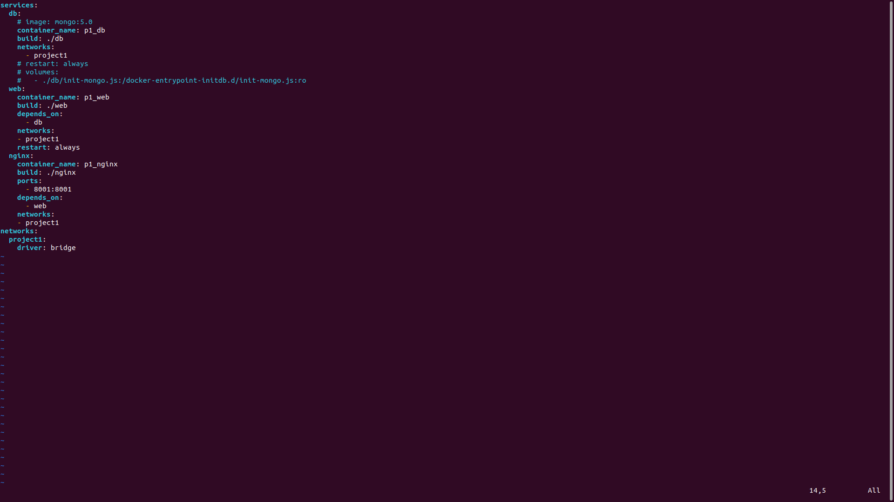
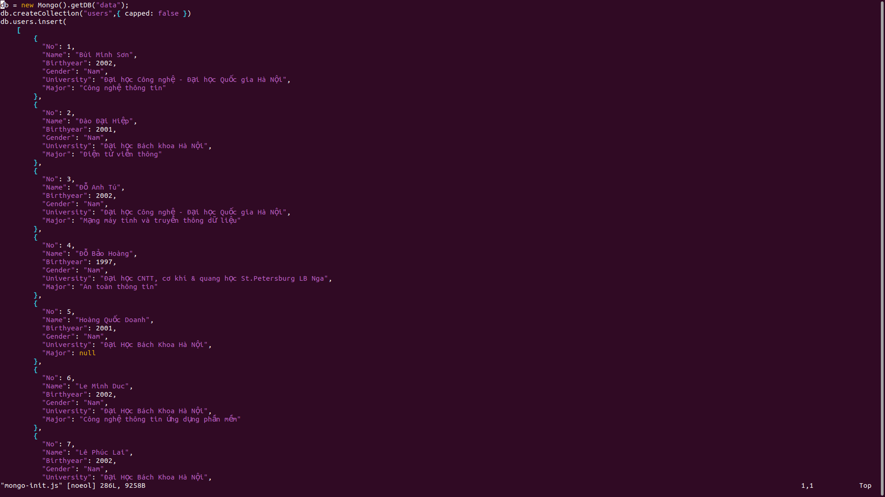

# Containerization

## Quetions

### 1. How many optimization tricks used in this Dockerfile?


```Dockerfile
FROM alpine:3.5

# Install python and pip
RUN apk add --update py2-pip

# upgrade pip
RUN pip install --upgrade pip

# install Python modules needed by the Python app
COPY requirements.txt /usr/src/app/
RUN pip install --no-cache-dir -r /usr/src/app/requirements.txt

# copy files required for the app to run
COPY app.py /usr/src/app/
COPY templates/index.html /usr/src/app/templates/

# tell the port number the container should expose
EXPOSE 5000

# run the application
CMD ["python", "/usr/src/app/app.py"]
```
Optimization methods used:

- Using small image (alpine).
- Specify packages for installation using requirements.txt.
- Using --no-cache-dir to reduce build's size.

### 2. What are the differences between these instructions?
>ARG vs ENV
- ARG is only available at build time can be override using `--build-arg`. Meanwhile, ENV is meant to set default value for the environment.

>COPY vs ADD
- COPY is used to move local files from and to container. It is more documented and has better behaviour consistency.
- ADD has uncompression feature, though currently not recommend for actual usage due to lack of documentation and behaviour inconsistency. ADD also supports fetching from URL instead of local directories.

>CMD vs ENTRYPOINT
- CMD can be easily overriden during run. It can specify `["executable","param1","param2"]` or (if ENTRYPOINT is used) `["param1","param2"]`. 
- The main difference between the two is that all the params in CMD will be appended after ENTRYPOINT's when both is specified.

## Project: Three-tier web

### Requirements
- Base images:
     - nginx:1.22.0-alpine
     - python:3.9
     - mongo:5.0
- Optimize build's size.
### Result

**The project codes are added to the project1 directory of this homework submission.**

1. Website:

    The final website: 

   

    Storage size:

   

    The added storage can further be optimized by using the lighter alpine version of python and mongo images.
   
2. Docker compose setup:

   
3. MongoDB setup:
   
   MongoDB Dockerfile:

   

    Setup Database and fill it with provived student datas:

   


3. Django+UWSGI setup:

    Django+UWSGI Dockerfile:

   

    Django project's directory tree:

   

   The user app that shows student data in a table and has a form to insert new student:

   

   User app's front-end:

   
    

4. Nginx setup:

    Nginx Dockerfile: 

   

    Nginx config:

   

