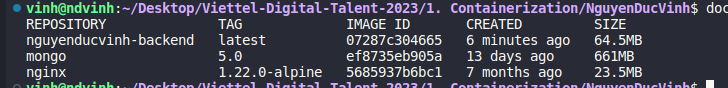

## Table of contents
[I. Doker instructions](#instruction)

[II. Practice docker compose](#practice)

# I. Docker instructions
<a name='instruction'></a>

## ARG vs ENV
### Cả hai instruction ARG và ENV đều được sử dụng để định nghĩa các biến trong quá trình xây dựng Docker image, tuy nhiên chúng có sự khác nhau như sau:
- ARG: Được sử dụng để định nghĩa các biến môi trường trong quá trình xây dựng Docker image và chúng được đặt giá trị trong quá trình build. Điều này có nghĩa là giá trị của ARG chỉ có hiệu lực trong quá trình build và không có giá trị trong quá trình runtime của container.
- ENV: Được sử dụng để định nghĩa các biến môi trường trong quá trình runtime của container. Chúng được đặt giá trị trong quá trình build và được sử dụng trong quá trình runtime của container. Điều này có nghĩa là giá trị của ENV có thể được truyền vào container và sử dụng trong quá trình chạy của nó.

## sử dụng ARG trong Dockerfile
ARG APP_PORT = 5000

ENV APP_PORT= $APP_PORT

EXPOSE $APP_PORT

## sử dụng ENV trong Dockerfile
 *ENV APP_PORT=5000*
 
 *EXPOSE $APP_PORT*

### Ở ví dụ trên, cả hai instruction đều định nghĩa biến môi trường APP_PORT và sử dụng nó trong lệnh EXPOSE. Tuy nhiên, với ARG, giá trị của nó chỉ có hiệu lực trong quá trình build và được truyền vào ENV để sử dụng trong quá trình runtime của container. Trong khi đó, với ENV, giá trị của nó được sử dụng trực tiếp trong quá trình runtime của container.

## COPY vs ADD
### Giống nhau:
- Cả hai đều hỗ trợ sao chép một tập tin hoặc một thư mục từ host vào trong container Docker.
- Cả hai đều hỗ trợ sử dụng đường dẫn tương đối và đường dẫn tuyệt đối để chỉ định nguồn và đích.

### Khác biệt:
- ADD có thể xử lý các URL ngoài cùng host, tải về và giải nén chúng tự động trong quá trình sao chép, trong khi đó COPY chỉ hỗ trợ sao chép các file và thư mục từ host tới container.
- ADD còn hỗ trợ các tính năng bổ sung như giải nén tập tin tar hoặc tải xuống từ URL SSL. Trong khi đó, COPY chỉ có thể sao chép file và thư mục.
- COPY được coi là an toàn hơn vì nó rõ ràng và đơn giản hơn ADD, trong khi ADD có thể làm cho quá trình build của Dockerfile phức tạp hơn.
- Do đó, COPY là một instruction phổ biến được sử dụng trong hầu hết các trường hợp, trong khi ADD thường được sử dụng khi cần giải nén hoặc tải xuống tập tin trong quá trình sao chép.
## CMD vs ENTRYPOING

### Cả hai lệnh CMD và ENTRYPOINT đều được sử dụng để chỉ định một lệnh mà container sẽ chạy khi được khởi động. Tuy nhiên, chúng có những sự khác biệt sau:
- CMD: chỉ định một lệnh mặc định mà container sẽ chạy khi không có lệnh được chỉ định trong lệnh khởi chạy. Nếu có nhiều lệnh được chỉ định, chỉ có lệnh cuối cùng được thực thi. CMD có thể được ghi đè khi khởi động container bằng cách sử dụng tham số docker run hoặc bằng cách sử dụng một Docker Compose file.
- ENTRYPOINT: chỉ định lệnh cố định sẽ được thực thi khi container được khởi động. Nếu có các tham số được truyền vào khi khởi động container, chúng sẽ được thêm vào cuối của lệnh được chỉ định trong ENTRYPOINT. ENTRYPOINT được sử dụng để chỉ định một chương trình hoặc một script như một entrypoint cho container và không bị ghi đè bởi các tham số khác.

- Ví dụ, nếu trong Dockerfile có lệnh CMD ["python3", "server.py"], khi container được khởi động, nếu không có lệnh được truyền vào, container sẽ thực thi lệnh python3 server.py. Nếu chạy container với lệnh docker run myapp python3 test.py, lệnh python3 test.py sẽ được thực thi thay vì lệnh CMD.Trong khi đó, nếu sử dụng ENTRYPOINT ["python3"], container sẽ luôn chạy lệnh python3, và nếu chạy container với lệnh docker run myapp test.py, lệnh được thực thi sẽ là python3 test.py.

# II.  Practice : Set up a three-tier web application using docker-compose.
<a name='practice'></a>


## Table of contents
[I. Requirement](#)
Set up a **three-tier** web application that displays the course attendees’ information on the 
browser using `docker-compose`.

Base images:

- For Nginx web server: `nginx:1.22.0-alpine`

- For Python: `python:3.9`

- For MongoDB database: `mongo:5.0`

[II. Homework](#)
- [1. Build image by `Dockerfile`](#image)
- [2. Config nginx](#nginx)
- [3.  Create `docker-compose.yml` file](#docker)
- [4.  Deployment](#deploy)

---
## 1. Build Docker file
<a name='image'></a>

```text
FROM python:3.9-alpine AS builder

WORKDIR /src
COPY requirements.txt /src
RUN --mount=type=cache,target=/root/.cache/pip \
    pip3 install -r requirements.txt

COPY . .

CMD ["python3", "server.py"]

```
First, we will use image `python:3.9-alpine` as a base image
```text
FROM python:3.9-alpine AS builder
```
set our **working directory** at `/src`
```text
WORKDIR /src
```

Use instruction `COPY` to copy requirements.txt of our source code to the current directory (`/src`).
```text
COPY requirements.txt /src
```


The `RUN` instruction installs the Python dependencies specified in requirements.txt using `pip3 install -r requirements.txt`. The `--mount=type=cache,target=/root/.cache/pip` flag enables caching of the pip package manager's cache directory for improved build performance.

```text
RUN --mount=type=cache,target=/root/.cache/pip \
    pip3 install -r requirements.txt
```

The second `COPY` instruction copies all the files and directories from the host to the current working directory `(/src)` inside the container. This includes the application code.
```text
COPY . .
```
Finally, the CMD instruction specifies the default command to run when the container is started. It sets the command to execute the server.py file using the python3 interpreter.

```text
CMD ["python3", "server.py"]
```

## 2. Config nginx
<a name='nginx'></a>

Here is the configuration file `nginx.conf`. It listens on port 80 and defines a location block for the root URL path ("/").
Within the location block, the proxy_pass directive is used to forward incoming requests to a backend server running on http://backend:5000
```text
server {
  listen 80;
  location / {
    proxy_pass http://backend:5000;
  }
}
```

## 3. Create `docker-compose.yml` file
<a name='docker'></a>

```yml
services:
  web:
    image: nginx:1.22.0-alpine
    volumes:
      - ./nginx/nginx.conf:/etc/nginx/conf.d/default.conf
    ports:
      - 80:80
    depends_on:
      - backend

  backend:
    build:
      context: flask
      target: builder
    stop_signal: SIGINT
    environment:
      - FLASK_SERVER_PORT=5000
    volumes:
      - ./flask:/src
    depends_on:
      -  mongo  

  mongo:
    image: mongo:5.0
``` 
It defines three services: `web`, `backend`, and `mongo`.
1. WEB
- The `web` service is based on the `nginx:1.22.0-alpine image`. 

```text
    image: nginx:1.22.0-alpine
```

- It binds the local `./nginx/nginx.conf` file to the container's `/etc/nginx/conf.d/default.conf` file, allowing custom Nginx configuration. 
```text
    volumes:
      - ./nginx/nginx.conf:/etc/nginx/conf.d/default.conf
```

- It maps port 80 on the host to port 80 in the container
```text
    ports:
      - 80:80
```

- It depends on the backend service.
```text
    depends_on:
      - backend
```
2. BACKEND
- The `backend` service is built using a `Dockerfile` located in the flask directory. It specifies the target builder in the `Dockerfile` during the build process. 

```text
    build:
      context: flask
      target: builder
```


- The `stop_signal` is set to `SIGINT`, indicating the preferred signal to stop the container. 

```text
    stop_signal: SIGINT
```

- It sets the `FLASK_SERVER_PORT`   environment variable to `5000` within the container.
```text
environment:
      - FLASK_SERVER_PORT=5000
```

-  It binds the local `./flask` directory to the `/src` directory in the container, allowing the container to access the Flask application code. 
 ``` text
    volumes:
    - ./flask:/src
 ```

-  It depends on the mongo service.
```text
    depends_on:
      -  mongo  
```
3. Mongo
- The mongo service uses the mongo:5.0 image, which provides a MongoDB database server.
``` text
  mongo:
    image: mongo:5.0
```

## 4. Deployment
<a name='deploy'></a>

- Use command line to run `docker-compose.yaml` file
``` text
    docker compose up 
```
- Docker images
  
- And our deployed project will run at localhost:80.
    


### Thanks for reading


