**Table of Contents**
- [1 Containerization](#1-containerization)
  - [1.1 Overview](#11-overview)
  - [1.2 Containerization vs Virtualization](#12-containerization-vs-virtualization)
  - [1.3 Benefits of Containerization](#13-benefits-of-containerization)
  - [1.4 Linux Technologies Fundamental to Containers](#14-linux-technologies-fundamental-to-containers)
- [2 Docker](#2-docker)
  - [2.1 Docker Architecture](#21-docker-architecture)
  - [2.2 Docker Objects](#22-docker-objects)
  - [2.3 Dockerfile](#23-dockerfile)
  - [2.4 Docker Compose](#24-docker-compose)
  - [2.5 Docker Image Optimization](#25-docker-image-optimization)
- [3 Homework](#3-homework)
  - [3.1 Requirements](#31-requirements)
  - [3.2 Explaination](#32-explaination)
  - [3.3 Result](#33-result)
- [References](#references)

## 1 Containerization

### 1.1 Overview

<p align = "justify"><strong>Containerization</strong> is achieved by <em>packing</em> together of software code with all its necessary components like libraries, frameworks, and other dependencies in an isolated user space called a container.</p>
<p align = "justify">Traditionally, to run any application on your computer, you had to install the version that matched your machine’s operating system. For example, you needed to install the Windows version of a software package on a Windows machine. However, with containerization, you can create a single software package, or container, that runs on all types of devices and operating systems.</p>

### 1.2 Containerization vs Virtualization

<p align = "justify">Virtualization and containerization are the two most frequently used mechanisms to host applications in a computer system.</p>

<p align = "center">
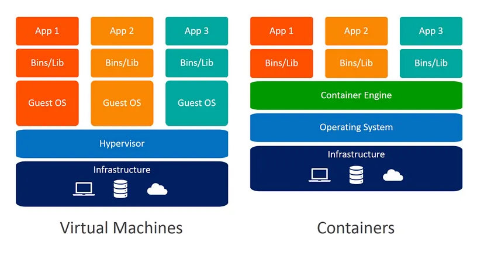 
<br>Picture 1. Virtualization vs Containerization
</p>

<p align = "justify"><strong>Virtualization</strong> is the technology that can simulate your physical hardware (such as CPU cores, memory, disk) and represent it as a separate machine. It has its own Guest OS, Kernel, process, drivers, etc. Therefore, it is <em>hardware-level virtualization</em>. Virtualization wouldn’t be possible without a <em>hypervisor</em> (also known as a virtual machine monitor) – a software layer enabling multiple operating systems to co-exist while sharing the resources of a single hardware host. Most common technology is "VMware" and "Virtual Box".</p>

<p align = "justify"><strong>Containerization</strong> is <strong>"OS-level virtualization"</strong>. It doesn't simulate the entire physical machine. It just simulates the OS of your machine. Therefore, multiple applications can share the same OS kernel. Containers play similar roles as virtual machine but without hardware virtualization. Most common container technology is <strong>"Docker"</strong>.</p>

### 1.3 Benefits of Containerization

- <p style="text-align: justify"><strong>Portability</strong>: By abstracting applications away from the host OS, a container enviroment makes applications run smoothly on any platform or cloud.</p>

- <p style="text-align: justify"><strong>Scalability</strong>: With a service-oriented appllication design, a container application holds ability to handle increasing workloads, thus ensuring application scalability.</p>

- <p style="text-align: justify"><strong>Faster Deployment</strong>: A Docker container can create a master version of an image (main application) that can be deployed quickly on demand.</p>

- <p style="text-align: justify"><strong>High Productivity</strong>: Containers allow developers to change and track the changes in the platform's source code, thus ensuring high app productivity.</p>

- <p style="text-align: justify"><strong>Enhanced Security</strong>: App isolation method of containers ensures every application running independently in separate containers have their level of security.</p>

- <p style="text-align: justify"><strong>Continuity</strong>: Since different containers run independently, failure of one will not have an impact on the continuity of others, thus allowing business continuity.</p>

- <p style="text-align: justify"><strong>Easy Management</strong>: Container orchestration tools perform application management, automating installation and management of workloads.</p>

### 1.4 Linux Technologies Fundamental to Containers

<p style="text-align: justify"> Linux technologies make up the foundations of building and running a container process on system. </p>
<p align = "center">
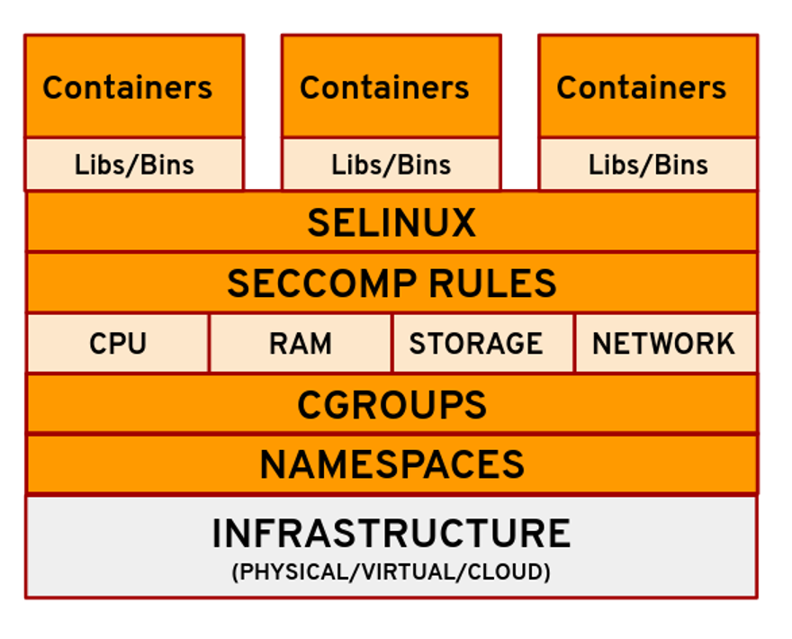 
<br>Picture 2. Linux technologies that contribute to containers
</p>

<strong>Namespaces</strong>
<p align = "justify"><strong>Namespaces</strong> provide containers with their own view of the underlying Linux system, limiting what the container can see and access. There are several namespaces in the Linux kernel: </p>

- <p align = "justify"><strong>NET</strong>: Provides a container with its own view of the network stack of the system (e.g. its own network devices, IP addresses, IP routing tables, /proc/net directory, port numbers, etc.).</p>
- <p align = "justify"><strong>IPC</strong> (InterProcess Communication): IPC namespace is responsible for isolating IPC resources between processes running inside each container.</p>
- <p align = "justify"><strong>MNT</strong>: Allows the containers to have their own view of the system's file system hierarchy.</p>
- <p align = "justify"><strong>PID</strong> (Process ID): Ensures that the processes running inside a container are isolated from the external world.</p>
- <p align = "justify"><strong>USER</strong>: Isolates users and groups within a container. It functions by allowing containers to have a different view of the uid (user ID) and gid (group ID) ranges, as compared with the host system.</p>
- <p align = "justify"><strong>UTS</strong> (UNIX Timesharing System): Allows containers to have a unique hostname and domain name.</p>
<p align = "justify"> Docker uses these namespaces together in order to isolate and begin the creation of a container.</p>

<strong>Control groups (cgroups)</strong>
<p align = "justify"><strong>Cgroups</strong> is a Linux kernel feature that isolates, prioritizes, and accounts for the resource usage (CPU, memory, disk I/O, network, etc.) of a set of processes. In this sense, a cgroup ensures that Docker containers only use the resources they need - and, if needed, set up limits to what resources a container can use. Cgroups also ensure that a single container doesn’t exhaust one of those resources and bring the entire system down.</p>

<strong>SECCOMP (secure computing)</strong>
<p align = "justify"><strong>Seccomp</strong> provides containers access to only those resources which the container might need. For example, if you don't need the container to change the clock time on your host machine, you probably have no use for the clock_adjtime and clock_settime syscalls, and it makes sense to block them out. The default <code>seccomp</code> profile provides a sane default for running containers with seccomp and disables around 44 system calls out of 300+</p>
<p align = "justify"> If you are running a Red Hat distribution on your hosts, then <strong>SELinux</strong> is enabled by default. SELinux lets you limit an application to have access only to its own files and prevent any other processes from accessing them.</p>

## 2 Docker

<p align = "justify"> <strong>Docker</strong> is the containerization platform for developing, shipping, and running applications. Docker enables you to separate your applications from your infrastructure so you can deliver software quickly.</p>

<p align = "center">
 
<br>Picture 3. Docker Logo
</p>

### 2.1 Docker Architecture
<a name='architecture'></a>

<p align = "center">
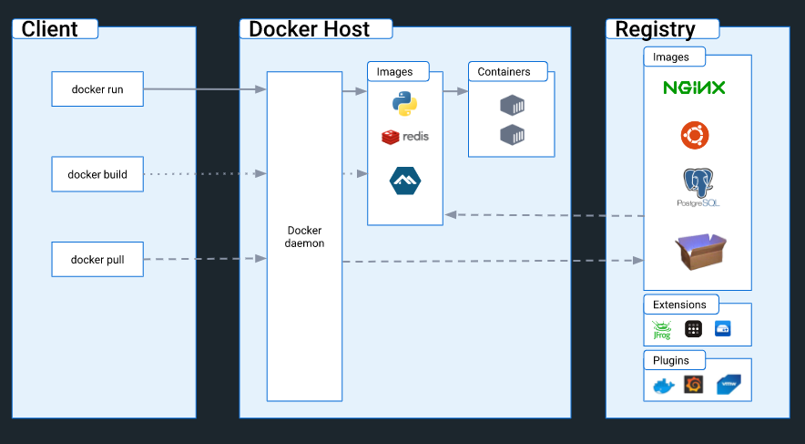 
<br>Picture 4. Docker Architecture
</p>

<p align = "justify">Docker architecture consists of <strong>Docker client</strong>, <strong>Docker Daemon</strong> running on <strong>Docker Host</strong>, and <strong>Docker Hub</strong> repository (<em>Registry</em>).</p>

<p align = "justify"><strong>Docker Daemon</strong> (<code>dockerd</code>) listens for Docker API requests and manages Docker objects such as images, containers, networks, and volumes. A daemon can also communicate with other daemons to manage Docker services. Docker has <em><strong>client-server architecture</strong></em> in which the client communicates with the Docker Daemon using a combination of REST APIs, Socket IO, and TCP.</p>

<p align = "justify"><strong>Docker Client</strong> (<code>docker</code>) is the primary way that many Docker users interact with Docker. When you use commands such as <code>docker run</code>, the client sends these commands to <code>dockerd</code>, which carries them out. The docker command uses the Docker API. The Docker client can communicate with more than one daemon.</p>

<p align = "justify"><strong>A Docker Registry</strong>  stores <strong>Docker Images</strong>. <strong>Docker Hub</strong> is a public registry that anyone can use, and Docker is configured to look for images on Docker Hub by default. You can even run your own private registry. When you use the <code>docker pull</code> or <code>docker run</code> commands, the required images are pulled from your configured registry. When you use the <code>docker push</code> command, your image is pushed to your configured registry.</p>

<p align = "justify"><strong>Docker Desktop</strong>  is an easy-to-install application for your Mac, Windows or Linux environment that enables you to build and share containerized applications and microservices. Docker Desktop includes the Docker daemon, the Docker client, Docker Compose, Docker Content Trust, Kubernetes, and Credential Helper.</p>

### 2.2 Docker Objects

**Images**

<p align = "justify"><strong>Docker images</strong> are used to build a <strong>Docker container</strong> by using a <em>read-only template</em>. Often, an image is based on another image, with some additional customization. You might create your own images or you might only use those created by others and published in a registry. To build your own image, you create a <code>Dockerfile</code> with a simple syntax for defining the steps needed to create the image and run it.</p>

**Containers**

<p align = "justify"><strong>Docker Containers</strong> are runtime instances of <strong>Docker images</strong>. Containers contain the whole kit required for an application, so the application can be run in an isolated way. You can create, start, stop, move, or delete a container using the Docker API or CLI.</p>

**Volumes**

<p align = "justify">The persisting data generated by docker and used by Docker containers are stored in <strong>Volumes</strong>. They are completely managed by docker through docker CLI or Docker API. Rather than persisting data in a container’s writable layer, it is always a good option to use volumes for it. Volume’s content exists outside the lifecycle of a container, so using volume <em>does not increase the size of a container</em>.</p>

**Network**

<p align = "justify">Docker networking is a passage through which all the isolated container communicate. There are mainly five network drivers in docker: <strong>Bridge, Host, Overlay, None, macvlan</strong>.</p>

### 2.3 Dockerfile

<p align = "justify"><code>Dockerfile</code> is a text file that contains a series of instructions on how to build your Docker image. This image contains all the project code and its dependencies.</p>
<p align = "center">
 
<br>Picture 5. Building Docker Image from Dockerfile
</p>

**Dockerfile Instructions**

- <p align = "justify"><code>FROM</code>: represents the base image (OS), which is the command that is executed first before any other commands. <em>A valid Dockerfile</em> must start with a FROM instruction.</p>

    ```dockerfile
    FROM [--platform=<platform>] <image> [AS <name>]
    ```
    or
    ```dockerfile
    FROM [--platform=<platform>] <image>[:<tag>] [AS <name>]
    ```
    or
    ```dockerfile
    FROM [--platform=<platform>] <image>[@<digest>] [AS <name>]
    ```
    The ```--platform```, ```AS name```, ```tag``` or ```digest``` values are optinal.

    *Example*: ```FROM python:3.9-alpine3.17 AS db_initializer```
- <p align = "justify"><code>ARG</code>: defines a variable that users can pass at <strong>build-time</strong> to the builder with the <code>docker build</code> command using the <code>--build-arg &lt;varname&gt;=&lt;value&gt;</code> flag. If a user specifies a build argument that was not defined in the <code>Dockerfile</code>, the build outputs a warning.</p>
    
    ```ARG``` is the **only** instruction that may **precede** ```FROM``` in the ```Dockerfile```

    ```dockerfile
    ARG <name>[=<default value>]
    ```
    *Example*: ```ARG  VERSION=latest```

- <p align = "justify"><code>ENV</code>: sets the environment variable <code>&lt;key&gt;</code> to the value <code>&lt;value&gt;</code>. This value will be in the environment for all subsequent instructions in the build stage and can be replaced inline in many as well.</p>

    ```dockerfile
    ENV <key>=<value> ...
    ```
    or
    ```dockerfile
    ENV <key> <value>
    ```
    *Example*: ```ENV MONGODB_DATABASE=VDT2023```
- <p align = "justify"><code>WORKDIR</code>: sets the working directory for any <code>RUN</code>, <code>CMD</code>, <code>ENTRYPOINT</code>, <code>COPY</code> and <code>ADD</code> instructions that follow it in the <code>Dockerfile</code>. The <code>WORKDIR</code> instruction can be used multiple times in a <code>Dockerfile</code>. If a relative path is provided, it will be relative to the path of the previous <code>WORKDIR</code> instruction.</p>
    
    ```dockerfile
    WORKDIR /path/to/workdir
    ```
    *Example*: ```WORKDIR /web```
- <p align = "justify"><code>USER</code>: sets the user name (or UID) and   optionally the user group (or GID) to use when running the image and for any <code>RUN</code>, <code>CMD</code>, <code>ENTRYPOINT</code> instructions that follow it in the Dockerfile.</p>

    ```dockerfile
    USER <user>[:<group>]
    ```
    or
    ```dockerfile
    USER <UID>[:<GID>]
    ```
    *Example*: ```USER vanson:dev```
- <p align = "justify"><code>RUN</code>: executes any commands in a new layer on top of the current image and commit the results. The resulting committed image will be used for the next step in the Dockerfile. <code>RUN</code> has 2 forms: <em>shell</em> form and <em>exec</em> form.</p>

    - The `exec` form:

    ```dockerfile
    RUN ["executable", "param1", "param2"]
    ```
    - The `shell` form:  the command is run in a shell, which by default is /bin/sh -c on Linux or cmd /S /C on Windows
    ```dockerfile
    RUN <command>
    ```
    *Example*: ```RUN ["/bin/bash", "-c", "echo hello"]```
- <p align = "justify"><code>ENTRYPOINT</code>: allows you to configure a container that will run as an executable.</p>
    
    - The `exec` form (preferred):
    ```dockerfile
    ENTRYPOINT ["executable", "param1", "param2"]
    ```
    - The `shell` form:
    ```dockerfile
    ENTRYPOINT command param1 param2
    ```
    *Example*: ```ENTRYPOINT ["ping", "google.com"]```

- <p align = "justify"><code>CMD</code>: provides defaults for an executing container. These defaults can include an executable, or they can omit the executable, in which case you must specify an <code>ENTRYPOINT</code> instruction as well. There can only be <em><strong>one CMD instruction</strong></em> in a Dockerfile. If you list more than one <code>CMD</code> then only the last <code>CMD</code> will take effect. If <code>CMD</code> is used to provide default arguments for the <code>ENTRYPOINT</code> instruction, both the CMD and <code>ENTRYPOINT</code> instructions should be specified with the JSON array format.</p>
    
    - The `exec` form (preferred):
    ```dockerfile
    CMD ["executable","param1","param2"]
    ```
    - The `shell` form:
    ```dockerfile
    CMD command param1 param2
    ```
    - As default parameters to ENTRYPOINT:
     ```dockerfile
    CMD ["param1","param2"]
    ```
    *Example*: ```CMD echo "This is a test." | wc -```
   
**The differences between dockerfile instructions:**

- `ARG` vs `ENV`:

    - <p align = "justify"><code>ARG</code> parameters are only available during Docker image building and cannot be accessed after the image has been built.</p>
    - <p align = "justify">Default values for <code>ARG</code> parameters can be set in a <code>Dockerfile</code> and modified during the build process.</p>
    - <p align = "justify">Some examples <code>ARG</code> arguments include a version of your Ubuntu or a version of a library.</p>
    - <p align = "justify"><code>ENV</code> variables can be passed both during image <em>building</em> and while the containers are <em>running</em> at runtime.</p>
    - <p align = "justify">Similar to <code>ARG</code> variables, <code>ENV</code> variables can have a default value in the Dockerfile. They can be updated by providing new values through the </code>Docker CLI</code> or a <code>docker-compose.yml</code> file, overriding the values set in the <code>Dockerfile</code>.</p>
    - <p align = "justify"><code>ENV</code> variables are usually your <code>API keys</code>, <code>database URLs</code>, <code>secret keys</code>, etc.</p>
    *Example:* The same variable VERSION is defined by both ARG and ENV. ARG VERSION=1.0 is only available during build-time, and not during run-time. The value ```VERSION=3.0``` from ENV takes **precedence** over ARG in run-time. Also, building the image with the flag ```--build-arg VERSION=2.0``` will have no effect as well in run-time.
    ```Dockerfile
    FROM ubuntu
    ENV VERSION=3.0
    ARG VERSION=1.0
    RUN echo "Build-time: VERSION is set to ${VERSION:-}"
    CMD ["bash", "-c", "echo Run-time: VERSION is set to ${VERSION:-}"]
    ```
    <p align = "center">
    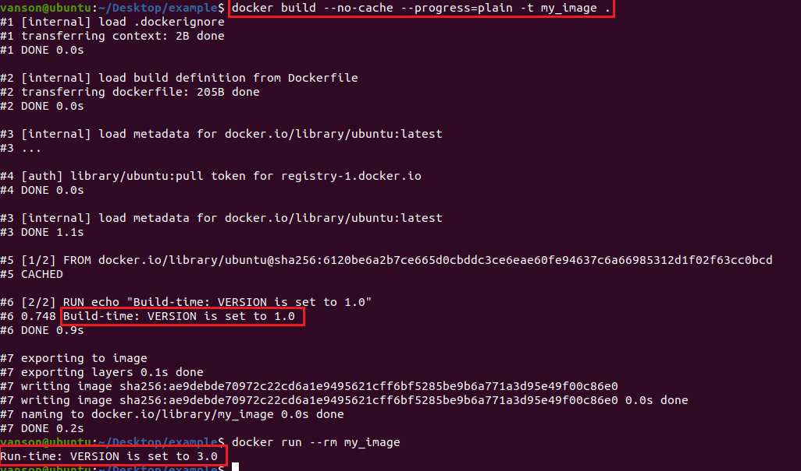 
    <br>Picture 6. Example of using ARG and ENV
    </p>
    <p align = "center">
    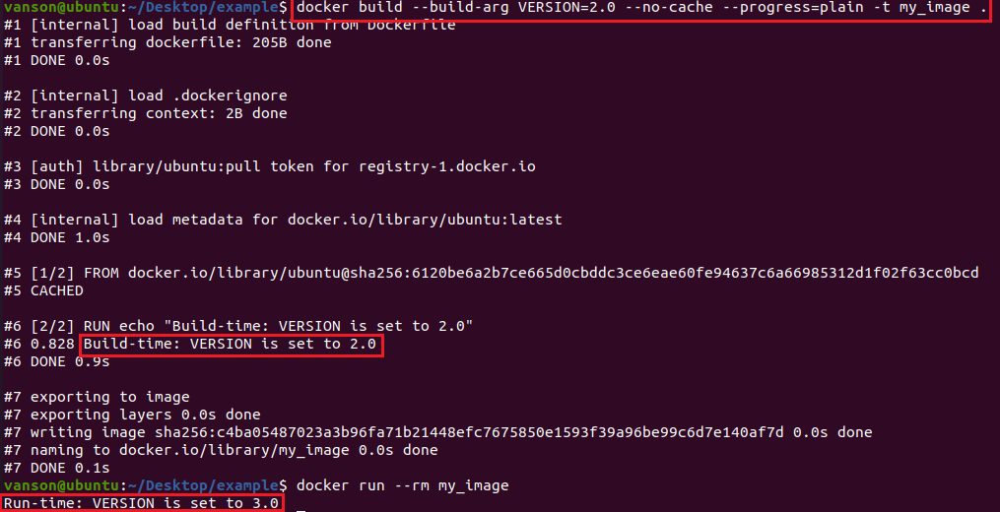 
    <br>Picture 7. Example of using ARG and ENV
    </p>

- `COPY` vs `ADD`:

    - <p align = "justify"><code>COPY</code> and <code>ADD</code> are both <code>Dockerfile</code> instructions that let you copy files from a specific location into a Docker image.</p>
    - <p align = "justify"><code>COPY</code> command only copies the file <em>locally</em> to the destination path container. However, the <code>ADD</code> command can add files from <em>local</em> and <em>remote</em> sources through URLs.
    - <p align = "justify"> Moreover, <code>ADD</code> command can copy and automatically decompress a compressed file from the local source to the destination.</p>
    - <p align = "justify"><strong>For safety reasons</strong>, Docker <em>discourages</em> the use of the <code>ADD</code> command and recommends using the <code>COPY</code> command to copy local files instead. If you need to download and copy files from the internet, Docker suggests using the <code>curl</code> command with a <code>RUN</code> command. The only recommended use case for <code>ADD</code> is to extract a local <code>tar</code> file into the image.</p>
    
    *Example:*
    ```Dockerfile
    FROM ubuntu
    COPY normal.txt /tmp/
    RUN cat /tmp/normal.txt

    ADD compressed.zip /tmp/
    RUN cat /tmp/compressed.txt
    ```
    <p align = "center">
    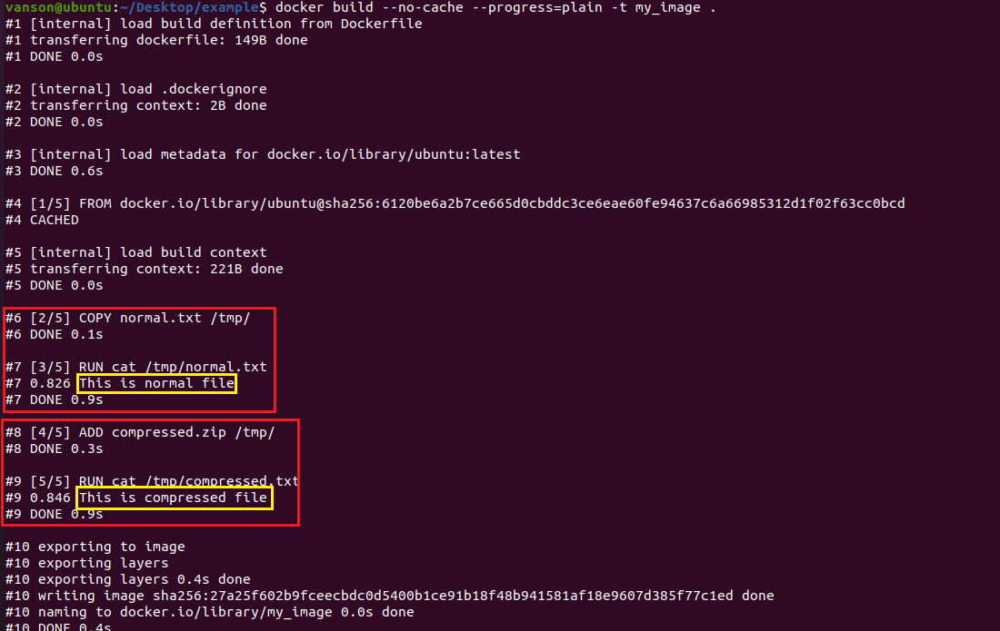 
    <br>Picture 8. Example of using COPY and ADD
    </p>
- `CMD` vs `ENTRYPOINT`:

    - <p align = "justify">Both <code>CMD</code> and <code>ENTRYPOINT</code> instructions define the commands that will be executed during <code>docker run</code>.
    - <p align = "justify"><code>CMD</code> defines default commands and/or parameters for a container that can be overridden when the container is run, while <code>ENTRYPOINT</code> specifies the primary command and arguments that cannot be overridden unless the <code>--entrypoint</code> option is used.</p> 
    - <p align = "justify">Use <code>ENTRYPOINT</code> instructions when creating an executable Docker image with commands that must always be executed.
    - <p align = "justify">Use <code>CMD</code> instructions for an additional set of arguments that will serve as default instructions in case there is an explicit command line argument provided when the container runs.
    - <p align = "justify">If <code>ENTRYPOINT</code> and <code>CMD</code> are both used in a Dockerfile, everything specified in the <code>CMD</code> will be appended to the <code>ENTRYPOINT</code> as an argument.</p>
    *Example*: Using CMD
    ```Dockerfile
    FROM ubuntu
    ENTRYPOINT ["echo", "Hello world"]
    ```
    <p align = "center">
    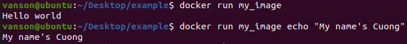 
    <br>Picture 9. Example of using CMD
    </p>

    *Example*: Using ENTRYPOINT
    ```Dockerfile
    FROM ubuntu
    ENTRYPOINT ["echo", "Hello world"]
    ```
    <p align = "center">
    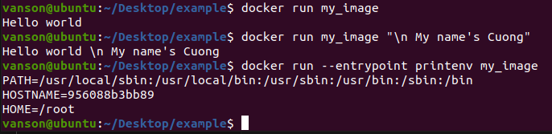 
    <br>Picture 10. Example of using CMD
    </p>

    *Example*: Using ENTRYPOINT and CMD
    ```Dockerfile
    FROM ubuntu
    ENTRYPOINT ["echo", "Hello"]
    CMD ["world"]
    ```
    <p align = "center">
    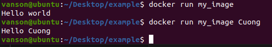 
    <br>Picture 11. Example of using ENTRYPOINT and CMD together
    </p>
- `RUN` vs `CMD` vs `ENTRYPOINT`:

    - <p align = "justify"><code>RUN</code> is used to execute commands during the build process of a Docker image. These commands are run in a new layer on top of the current image and their result is saved in the new image layer. It is often used for installing software packages.</p>
    - <p align = "justify"><code>CMD</code> specifies parameters with which container is to be used.</p> 
    - <p align = "justify"><code>ENTRYPOINT</code> is being used when you want to run your container as an application.</p>


### 2.4 Docker Compose

<p align = "justify"><strong>Docker Compose</strong> is a tool for defining and running <em>multi-container</em> Docker applications. By using Compose, we can define the services in a <code>YAML</code> file. Then, with a single command, we create and start all the services from our configuration.</p>

<p align = "center">
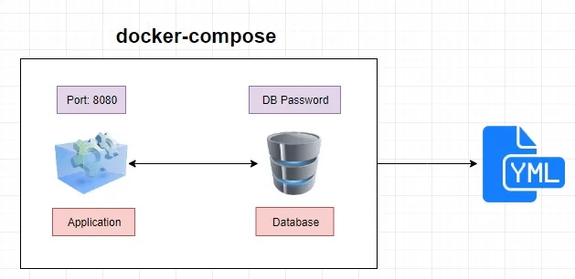 
<br>Picture 12. A graphical illustration that shows how Docker compose works.
</p>

<strong>Docker Compose</strong> is basically a three-step process:
- <p align = "justify">Define application environment with a <strong>Dockerfile</strong> so it can be reuse again.</p>
- <p align = "justify">Define the services that make up the app in <code>docker-compose.yml</code> so they can be run together in an isolated environment.
- <p align = "justify">Run <code>docker-compose up</code> command and <strong>Compose</strong> will start and run entire application.</p>
  
### 2.5 Docker Image Optimization

<p align = "justify">Large Docker images can make it difficult to share and slow down execution. So, optimizing the images can help with the overall development and production process. There are several techniques for optimizing the building of images in Docker:</p>

- <p align = "justify"> <strong>Use a smaller base image</strong>: In Docker Hub there are several images available for download, each with different characteristics and sizes. Normally, images based on <em>Alpine</em> or <em>BusyBox</em> are extremely small in size compared to those based on other Linux distributions, such as Ubuntu.</p>

- <p align = "justify"><strong>Use multi-stage builds</strong>: You can build an application and then transfer it to a new clean environment to deploy. It will ensure that only the necessary runtime libraries and dependencies are part of the final image.</p>

- <p align = "justify"><strong>Minimize the number of layers</strong>: Each instruction in a Dockerfile creates a new layer, which can increase the size of the final image. To minimize the number of layers, you can chain commands together with <code>&&</code> and use the <code>COPY</code> instruction to copy files in a single step.</p>

- <p align = "justify"><strong>Use caching</strong>: Docker caches the results of each build step, so if a step has not changed, Docker will reuse the cached result. To take advantage of caching, order your Dockerfile so that the most frequently changing steps are at the end.</p>

- <p align = "justify"><strong>Remove unnecessary files</strong>: When building an image, be sure to remove any temporary files or build artifacts that are no longer needed.</p>

    <p align = "justify">Use <code>.dockerignore</code> to optimize Images. If you have a complicated build that goes through multiple directories recursively, all the files and directories are sent to the Docker daemon. It can result in larger images and slower build times. You can use the .dockerignore to exclude unnecessary files and folders that complicate the build process.</p>
  
- <p align = "justify"><strong>Install Required Packages Only</strong>:

    - <p align = "justify">Instruct the package manager to install as few additional dependencies as possible. </p>
    - <p align = "justify">Disable (or clean) the cache of the package manager.</p>

      - For Debian/Ubuntu: <p align = "justify"><code>apt-get install -y --no-install-recommends &lt;list of package names to install&gt; && &lt;optional: do something with packages&gt; && apt-get clean && rm -rf /var/lib/apt/lists/* </code></p> This ensures that no recommended packages are installed, and that the cache is cleared at the end.
  
      - For Python: <p align = "justify"><code>pip install --no-cache-dir &lt;list of package names to install&gt;</code>. The <code>-no-cache-dir</code> argument ensures that no cache is created to begin with.</p>
- <p align = "justify"><strong>Using DockerSlim</strong>: Docker Slim is a tool for optimizing Dockerfiles and Docker images. It makes your containers betters, smaller and more secure. It can reduce image size up to <em>thirty times</em> without any manual optimization


## 3 Homework

### 3.1 Requirements

<p align = "justify">Set up a three-tier web application that displays the course attendees' information on the browser using <strong>docker-compose</strong>.</p>

Base images:
- `nginx:1.22.0-alpine`
- `python:3.9`
- `mongo:5.0`
  
<p align = "center">
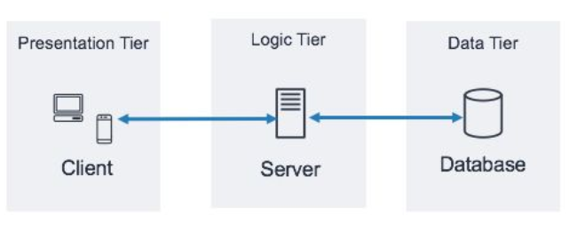 
<br>Picture 13. Three-tier web architecture.
</p>

### 3.2 Explaination

**Dockerfile configuration**

```dockerfile
# stage 1
FROM python:3.9-alpine3.17
WORKDIR /database
COPY requirement-init.txt requirement.txt
RUN pip install --no-cache-dir -r requirement.txt && \
    rm requirement.txt
COPY init.py init.py
CMD ["python3", "init.py"]

# stage 2
FROM python:3.9-alpine3.17
WORKDIR /web
COPY requirement.txt requirement.txt
RUN pip install --no-cache-dir -r requirement.txt && \
    rm requirement.txt
COPY . .
CMD ["python3", "app.py"]

```
**The Dockerfile provided includes a few optimization techniques:**

- <p align = "justify">This Dockerfile sets up a <strong>multi-stage</strong> build process. The first stage sets up the database tier, while the second stage sets up the web application tier. Using multi-stage builds like this can help keep the resulting Docker image small and efficient. The first stage is only used to <em>initialize</em> the database and is not included in the final image, so the final image only includes the necessary components to run the web application. (<em>However, it should be noted that this is a demonstration of how to employ a multi-stage build process. My database initialization and web application can be built and run using the same dependencies and environment, so it may not need to use multi-stage builds. can use a single Dockerfile without separate stages)</em>.</p>
- <p align = "justify"><strong>Lightweight base image</strong>: The Dockerfile uses the <code>python:3.9-alpine3.17</code> base image, which is a lightweight version of the Python 3.9 image. This helps reduce the size of the resulting Docker image. In Docker Hub images <strong>python:3.9-alpine</strong> and <strong>python:3.9-alpine3.17</strong> have the same size, but the latter specifies the exact version of Alpine Linux used (version 3.17). This helps ensure stability and compatibility, reducing the risk of unexpected behavior. Using a specific version also aids reproducibility by ensuring consistent behavior across different environments.</p>
- <p align = "justify"><strong>Use caching</strong>: Firsly copy the <code>requirement.txt</code> file into the container, This is because this file is unlikely to change frequently, so Docker can use the cached version from a previous build if it hasn't changed. The <code>COPY init.py init.py</code> and <code>COPY . .</code> commands will copy neccessary and frequently changed code into the container. It can save time and improve build times.</p>
- <p align = "justify"><strong>Use the local cache when installing the specified packages</strong>: When installing dependencies using pip, the <code>--no-cache-dir</code> flag is used. This flag tells pip not to use the local cache when installing packages, which can help reduce the size of the Docker image.</p>
- <p align = "justify"><strong>Remove unnecessary files</strong>: After installing dependencies using <code>pip</code>, the <code>rm</code> command is used to remove the <code>requirement.txt</code> file. This helps reduce the size of the Docker image by removing unnecessary files.
- <p align = "justify"><strong>Minimize the number of layers</strong>: Chain commands <code> pip install --no-cache-dir -r requirement.txt</code> and <code>rm requirement.txt</code> together with <code>&&</code>.

**Nginx configuration**

```conf
    upstream load_balancer {
        server web_1:5000 weight=3;
        server web_2:5000 weight=2;
        server web_3:5000 weight=1;
    }

    server {
        listen 80;
        server_name localhost;

        location / {
            proxy_pass http://load_balancer;
        }

        location /server1 {
            proxy_pass http://web_1:5000/;
        }

        location /server2 {
            proxy_pass http://web_2:5000/;
        }

        location /server3 {
            proxy_pass http://web_3:5000/;
        }
    }
```
- <p align = "justify">The <code>upstream</code> block defines the group of web servers that Nginx will load balance requests across. Each server is identified by its hostname and port number. In this case, the load balancer is set up to distribute the load across three servers (<code>web_1</code>, <code>web_2</code>, and <code>web_3</code>) using a weighted distribution, where <code>web_1</code> is given <strong>three times</strong> the weight of <code>web_3</code>.</p>
- <p align = "justify">The <code>server</code> block defines the virtual host that Nginx is serving. The listen directive specifies the port number that Nginx will listen on for incoming requests. The server_name directive specifies the IP address that Nginx will respond to.</p>
- <p align = "justify">The <code>location</code> blocks specify the mappings between the URLs requested by the client and the backend servers that will handle the requests. In this example, requests to the root <code>URL (/)</code> are passed to the <strong>load_balancer</strong> group defined in the <strong>upstream block</strong>, which will distribute them across the <strong>three servers</strong>.</p>
- <p align = "justify">Requests to the <code>/server1</code>, <code>/server2</code>, and <code>/server3</code> URLs are passed directly to the corresponding backend servers (<code>web_1</code>, <code>web_2</code>, and <code>web_3</code>) without load balancing. This can be useful if you want to send certain types of requests directly to specific servers, or if you want to bypass the load balancer for certain requests.</p>

    <p align = "justify">This configuration allows Nginx to efficiently distribute incoming requests across multiple backend servers, improving the <strong>performance</strong>, <strong>scalability</strong>, and <strong>reliability</strong> of the web application.</p>

<p align = "center">
 
<br>Picture 14. Reverse proxy using Nginx.
</p>

<p align = "center">
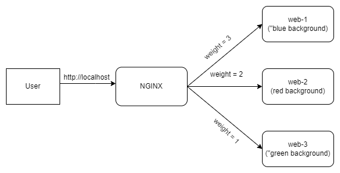 
<br>Picture 15. Load-balancer using Nginx.
</p>

**Docker-compose configuration**

- **`db` service (database)**:
  
    ```yaml
        db:
            image: mongo:5.0.17
            container_name: mongodb
            restart: unless-stopped
            environment:
                MONGO_DATABASE: flask
            ports:
                - "27017:27017"
            volumes:
                - ./database:/data/db
            networks:
                - backend
    ```

    - <p align = "justify"><code>image: mongo:5.0.17</code>:  The <strong>smallest</strong> official image for <strong>MongoDB version 5.0</strong> is <code>mongo:5.0.17</code>, which can be found on Docker Hub.</p>
    - <p align = "justify"><code>restart</code>: Specifies the restart policy for the container. In this case, the container will be restarted unless explicitly stopped.</p>
    - <p align = "justify"><code>environment</code>: Defines environment variables that will be passed to the container at runtime. In this case, we are setting the <code>MONGO_DATABASE</code> variable to <code>flask</code>, which will be used to create a new database with the given name.</p>
    - <p align = "justify"><code>volumes</code>: Allows us to mount a host directory or a named volume as a data volume inside the container. In this case, we are mounting the local directory <code>./database</code> to <code>/data/db</code> inside the container, which will persist the database data even if the container is removed.</p>
    - <p align = "justify"><code>networks</code>: Specifies the network mode for the container. In this case, the container will be attached to the <code>backend</code> network, which we define later in the configuration.</p>

- **`web` service**:
  
    ```yaml
        web_1:
            build: ./web
            container_name: flask_1
            restart: unless-stopped
            environment:
                MONGODB_DATABASE: flask
                MONGODB_HOSTNAME: db
                COLOR: "#003366"
            ports:
                - "5000:5000"
            networks:
                - frontend
                - backend
            depends_on:
                - db

        web_2:
            build: ./web
            container_name: flask_2
            restart: unless-stopped
            environment:
                MONGODB_DATABASE: flask
                MONGODB_HOSTNAME: db
                COLOR: "#ff0033"
            ports:
                - "5001:5000"
            networks:
                - frontend
                - backend
            depends_on:
                - db

        web_3:
            build: ./web
            container_name: flask_3
            restart: unless-stopped
            environment:
                MONGODB_DATABASE: flask
                MONGODB_HOSTNAME: db
                COLOR: "#00ff00"
            ports:
                - "5002:5000"
            networks:
                - frontend
                - backend
            depends_on:
                - db
    ```

    - <p align = "justify">These are the definitions of three services, <code>web_1</code>, <code>web_2</code>, and <code>web_3</code>, which are built from a Dockerfile located in the <code>./web</code> directory and expose their application on ports <code>5000</code>, <code>5001</code>, and <code>5002</code>, respectively. Each of these services is dependent on a database service named <code>db</code> and is connected to two networks, <code>frontend</code> and <code>backend</code>.</p>
    - <p align = "justify">Each of these services defines three environment variables: <code>MONGODB_DATABASE</code>, which specifies the name of the database that the Flask application will connect to; <code>MONGODB_HOSTNAME</code>, which specifies the hostname of the MongoDB instance that the Flask application will connect to (in this case, <code>db</code>); and <code>COLOR</code>, which specifies the color of the Flask application's background.</p>
    - <p align = "justify">The <code>depends_on</code> field specifies that the db service must be started before the <code>web_1</code>, <code>web_2</code>, and <code>web_3</code> services can be started.</p>

- **`nginx` service (server)**:
  
    ```yaml
        nginx:
            image: nginx:1.22.0-alpine
            container_name: nginx
            ports:
                - "80:80"
            volumes:
                - ./nginx/nginx.conf:/etc/nginx/conf.d/default.conf
            networks:
                - frontend
            depends_on:
                - web_1
                - web_2
                - web_3
    ```

    - <p align = "justify"><code>image: nginx:1.22.0-alpine</code>: Uses the <code>nginx:1.22.0-alpine</code> Docker image, which is the most lightweight version of the popular Nginx web server.</p>
    - <p align = "justify"><code>volumes</code>: This mounts the <code>./nginx/nginx.conf</code> file on the host to the container's <code>/etc/nginx/conf.d/default.conf</code> file, which is the Nginx configuration file.</p>
    - <p align = "justify"><code>networks</code>: Sets the networks for the container will connect to. In this case, it is only connected to the frontend network.</p>
    - <p align = "justify"><code>depends_on</code>: This specifies the container dependencies for the Nginx service. In this case, it depends on the three Flask services (<code>web_1</code>, <code>web_2</code>, and <code>web_3</code>) to be started before it can start.</p>

- **`networks` section**:

    ```yaml
    networks:
    frontend:
        driver: bridge
    backend:
        driver: bridge
    ```

    <p align = "justify">The networks section defines two networks: <strong>frontend</strong> and <strong>backend</strong>. The frontend network is used by the Nginx container and the Flask containers to communicate with each other. The backend network is used by the Flask containers to communicate with the MongoDB container. Both networks use the <em>bridge</em> driver, which is the default driver for Docker networks.</p>

    <p align = "justify">By using custom networks, you can isolate the communication between containers, control the traffic flow, and provide a secure environment for your application. Using custom networks in Docker can provide an additional layer of security to your application stack by limiting access to sensitive resources and controlling how containers communicate with each other.</p>

### 3.3 Result

<p align = "center">
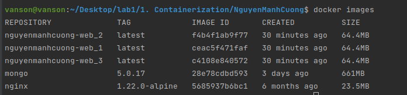 
<br>Picture 16. Built images.
</p>

<p align = "center">
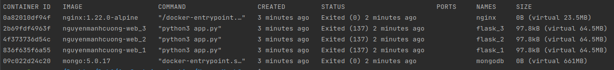 
<br>Picture 17. Running containers.
</p>

<p align = "center">
 
<br>Picture 18. Demo web
</p>

## References

[1] [What Is Containerization?](https://aws.amazon.com/what-is/containerization/)

[2] [What are the differences between Virtualization (VMware) and Containerization (Docker)?](https://blog.bytebytego.com/p/what-are-the-differences-between)

[3] [7 Key Containerization Benefits for Your IT Business](https://www.veritis.com/blog/7-key-containerization-benefits-for-your-it-business/)

[4] [4 Linux technologies fundamental to containers](https://opensource.com/article/21/8/container-linux-technology)

[5] [Docker overview](https://docs.docker.com/get-started/overview/)

[6] [Docker Architecture and its Components for Beginners](https://geekflare.com/docker-architecture/)

[7] [Dockerfile reference](https://docs.docker.com/engine/reference/builder/#env)

[8] [Docker ARG vs ENV Command Differences Explained in Detail](https://docs.docker.com/engine/reference/builder/#env)

[9] [Difference Between the "COPY" and "ADD" Commands in a Dockerfile](https://linuxhint.com/difference-between-copy-and-add-command-dockerfile/)

[10] [How are CMD and ENTRYPOINT different in a Dockerfile?](https://www.educative.io/answers/how-are-cmd-and-entrypoint-different-in-a-dockerfile)

[11] [Docker Compose overview](https://docs.docker.com/compose/)

[12] [Docker Slim](https://earthly.dev/blog/docker-slim/)


