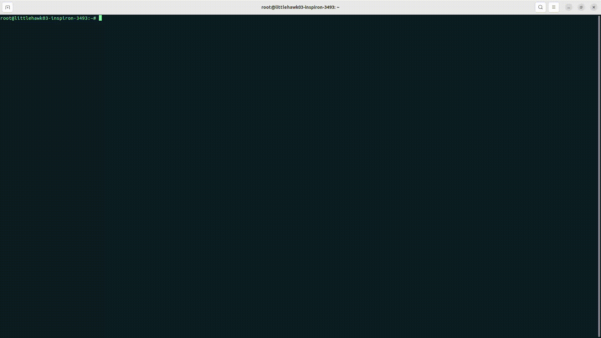

# HOME WORK FROM VIETTEL DIGITAL TALENT

### _LittleHawk03-Nguyễn Mạnh Đức_


####Table of contents
[I. Practice 1. What are the differences between these instructions?](#practice-1--what-are-the-differences-between-these-instructions)

  - [ARG vs ENV](#arg-vs-env)
  - [COPY vs ADD](#copy-vs-add)
  - [CMD vs ENTRYPOINT](#cmd-vs-entrypoint)
  

[II. Practice 2. How many optimization tricks used in this Dockerfile?](#practice-2--how-many-optimization-tricks-used-in-this-dockerfile)

  - [method 1 : Using Minimal Base Images](#method-1--using-minimal-base-images)
  - [method 2 : Minimize the number of layers](#practice-2--how-many-optimization-tricks-used-in-this-dockerfile)
  - [method 3 : Use multi-stage builds](#practice-3--set-up-a-three-tier-web-application-that-displays-the-course-attendees-information-on-the-browser-using-docker-compose)
  - [method 4 : Remove or don't use unnecessary packages or files.](#method-4--remove-or-dont-use-unnecessary-packages-or-files)
  - [method 5 : Keep Application Data Elsewhere](#method-5--keep-application-data-elsewhere)
  - [method 6 : Using docker-slimToolKit  to optimize images](#method-6--using-docker-slimtoolkit-to-optimize-images)

[III. Practice 3  Set up a three-tier web application that displays the course attendees’ information on the browser using docker-compose](#practice-3--set-up-a-three-tier-web-application-that-displays-the-course-attendees-information-on-the-browser-using-docker-compose)

  - [3.1 technology requirement](#31-technology-requirement)
  - [3.2 Analysis docker image](#32-analysis-docker-image)
  - [3.3 BACK END WITH FLASK](#33-back-end-with-flask)
  - [3.4 MONGODB DOCKER IMAGE](#34-mongodb-docker-image)
  - [3.5 BUILD PYTHON IMAGE](#35-build-python-image)
  - [3.6 BUILD NGIX IMAGE FOR WEB SERVER](#36-build-ngix-image-for-web-server)
  - [3.7 BUILD A DOCKER-COMPOSE FILE](#37-build-a-docker-compose-file)
  - [3.8 Dockerignore](#38-dockerignore---dockerignore)
  - [3.9 Run the web app](#39-run-the-web-app)

# Practice 1 : What are the differences between these instructions?

#### ARG vs ENV

- ```ARG``` và ```ENV``` đều được sử dụng để định nghĩa các biến môi trường được sử dụng bởi các ứng dụng container

- so sánh sự khác nhau của ```ARG``` và ```ENV```

|```ARG```|```ENV```|
|----|-----|
|- ```ARG``` được sử để định nghĩa các biến môi trường trong quá trình build images|- ```ENV``` được định nghĩa là các biến mỗi trường trong quá trình chạy container|
|- Các biến môi trường được định nghĩa bằng ```ARG``` sẽ không thể truy cập từ bên trong container|- các biến được định nghĩa bởi ```ENV``` thì có thể truy cập và sử dụng bên trong container|
|- ```ARG``` để định nghĩa các giá trị, chúng chỉ có thể được sử dụng trong một lệnh duy nhất trong quá trình build image| - ```ENV``` có thể được sử dụng trong nhiều lệnh khác nhau trong quá trình chạy container.|

- example

```docker
  # You can set VAR_A while building the image
  # or leave it at the default
  ARG VAR_A 5
  # VAR_B gets the (overridden) value of VAR_A
  ENV VAR_B $VAR_A
```


#### COPY vs ADD

- ```COPY``` and ```ADD``` cả hai đều được tạo ta với chức năng tổng  thể giống nhau là để sao chép file từ một vị trí được khai báo đến một docker images.

- so sánh sự khác nhau của ```COPY``` và ```ADD```

|```COPY```|```ADD```|
|-----|----|
|-  ```COPY``` có tính năng sao chép tệp tin hoặc thư mục đến đường dẫn cụ thể trong container| - ```ADD``` có thể sao chép tệp tin hoặc thư mục đến đường dẫn được chỉ định hoặc có thể tự động đặt tại vị trí hiện tại trong container.|
|- không hộ trợ giải nén tệp tin tar | - hỗ trợ giải nén file tar|
|- không thể tải tài nguyên xuống từ URL| - hỗ trợ có thể tải xuống các tài nguyên từ một URL trực tiếp|
|-  ```COPY``` được xem là an toàn hơn trong một số trường hợp, bởi vì nó không thực thi bất kỳ lệnh nào và chỉ đơn giản là sao chép tệp tin hoặc thư mục|- có thể thực thi lệnh giải nén hoặc các lệnh khác và có thể gây ra các vấn đề bảo mật|

- **Node :** hightly recommend sử dụng ```COPY``` thay vì ```ADD``` vì lý do an toàn và nếu bạn dùng để tải tài nguyên có thể dùng lệnh RUN  ```curl``` thay thế cho ```ADD``` và dùng ```COPY``` sẽ tường minh hơn


#### CMD vs ENTRYPOINT

- Cả ```CMD``` và ```ENTRYPOINT``` đều được sử dụng để chỉ định lệnh và tham số cho việc chạy container.
- Cả hai từ khóa đều có thể được sử dụng trong Dockerfile và có thể được chỉ định một lần duy nhất.
- Cả ```CMD``` và ```ENTRYPOINT``` đều có thể được sử dụng để thực thi các tệp script hoặc các lệnh Linux thông thường.


- điểm khác nhau

|CMD|ENTRYPOINT|
|----|----|
|- ```ENTRYPOINT``` chỉ định lệnh cố định mà container sẽ chạy| ```CMD``` chỉ định các tham số được đưa vào lệnh đó|
|- ```ENTRYPOINT``` là không thể ghi đè bởi các tham số được đưa vào dòng lệnh khi container được chạy|- ```CMD``` có thể bị ghi đè bởi các tham số được đưa vào dòng lệnh khi container được chạy|
|- ```ENTRYPOINT``` thường được sử dụng cho container có một lệnh cố định, chẳng hạn như một lệnh để khởi động một ứng dụng hoặc một script shell|- ```CMD``` được sử dụng để chỉ định các tham số được đưa vào lệnh để điều chỉnh hành vi của container|

- example ```CMD```:

```docker
  FROM alpine
  CMD ["echo","Hello VDT"]
```


như ta thấy sau khi chuyền một lệnh mới với lệnh ```docker run``` thì lênh ``CMD`` mặc định là ``echo Hello VDT`` sẽ được thay bằng lệnh ```echo HELLO VDT AND MENTOR```

- **Node :** nếu như nhiều lệnh được truyền vòa dockerfile, thì tất cả các lệnh trừ lệnh cuối cùng sẽ bị bỏ qua.

- example ```ENTRYPOINT```:


```docker
  FROM ubuntu
  ENTRYPOINT ["echo", "Hello VDT"] 
```


như ta thấy thì lệnh ```echo HELLO VDT AND MENTOR``` không được ghi đè vào như lệnh CMD mà nó trở thành một tham số cho lệnh ```echo Hello VDT```

- **Node :** các lệnh ```ENTRYPOINT``` vẫn có thể ghi đè được bằng cách thêm cờ ```--entrypoint```


# Practice 2 : How many optimization tricks used in this Dockerfile?

#### method 1 : Using Minimal Base Images

- Việc lựa chọn image phù hợp là bước đầu và cũng như là bước quan trọng trong quá trình build image docker. docker đã  cung cấp hơn 170 [offical images](https://hub.docker.com/search?q=&image_filter=official) cho công việc build image. Trong một số project ví dụ như là các dự án về python thay vì lựa chọn một base images là ubuntu sau đó mới cài các composer lên đó thì ta có thể lựa chọn các base image là composer có sẵn của docker.
- Highly recommned sử dụng các image được dựng trên ```alpine``` . ```Alpine linux``` là một distro linux được dựng dựa trên musl và busybox, và chú trọng vào tính đơn giản và bảo mật và hiệu quả tài nguyên. Do là một disto linux siêu nhỏ gọn (base image < 7.05 MB) nên gần như ta phải tự cài thêm các công cụ hay thư viện cần thiết


như ta có thể thấy trong hình thì việc sử dụng một images được dựng trên distro linux alpine đã giúp giảm được size image từ 900 MB --> 50MB


#### method 2 : Minimize the number of layers

- Các docker images được xây dựng từ nhiều layer. Trong Dockerfile thì mỗi dòng lệnh đều tạo ra một read-only layout và mỗi layer này được thêm vào và trồng lên layer của câu lệnh phía trước và nó không phải những layer free nó cũng yêu cầu chiếm dụng khoảng tài nguyên nhất định, cho nên việc xếp chồng các lên nhau ngày càng nhiều thì kích thước images càng tăng. Do vậy **giảm số lượng layer** là điều đầu tiên cần nghĩ khi muốn giảm kích thước images. Dưới đây là một số  cách để giảm số  lượng layer : 

- **Combine commands together wherever possible**: đây là một cách dễ nhất để có thể giảm đi số lượng layer bằng cách gộp các lệnh lại với nhau khi có thể . 

- **example 1** : ta có  Dockerfile chưa được combine như sau

```docker
    FROM ubuntu:latest

    RUN apt-get update -y
    RUN apt-get upgrade -y
    RUN apt-get install vim -y
    RUN apt-get install net-tools -y
    RUN apt-get install dnsutils -y
```

sau khi build *image size : 243*


```docker
  REPOSITORY   TAG       IMAGE ID       CREATED          SIZE
  testimage    v1        ad8d288d8704   22 seconds ago   243MB
```

- example 2 : ta có Dockefiler được combine như sau:

```docker
  FROM ubuntu:latest
  RUN apt-get update -y \
      && apt-get upgrade -y \
      && apt-get install --no-install-recommends vim net-tools dnsutils -y
```

sau khi build *image size : 240*


- như ta thấy việc gộp các câu lênh ```RUN``` thì images trên chỉ bao gồm 2 layer và dung lượng đã giảm từ 243 --> 240

#### method 3 : Use multi-stage builds

- Việc viết một Dockerfile hiệu quả là một kỹ thuật khó, vậy nên ta cần áp dụng các kỹ thuật shell và những logic hiểu quả để giữ cho image nhỏ nhất có thể .

- Multi-stage build là một tính năng mới được giới thiệu từ Docker v17.05. Multi-stage build rất hữu ích khi bạn muốn tối ưu hóa Dockerfile của mình mà vẫn giữ cho nó vừa dễ đọc, vừa dễ mantain.

- Mỗi ```FROM``` thì có thể kế thừa từ một base image khác nhau, và mỗi lệnh bắt đầu một giai đoạn mới của quá trình build. Khi sử dụng multi-stage chúng ta có thể copy có chọn lọc nhưng đồ tạo tác từ một stage này qua một stage khác, bỏ lại những thứ không cần thiết. Việc này sẽ giảm bớt image size sau khi build

- example with python: 

```docker 
  #stage 1
    # syntax=docker/dockerfile:1
    FROM golang:1.16
    WORKDIR /go/src/github.com/alexellis/href-counter/
    RUN go get -d -v golang.org/x/net/html  
    COPY app.go ./
    RUN CGO_ENABLED=0 GOOS=linux go build -a -installsuffix cgo -o app .

    FROM alpine:latest  
    RUN apk --no-cache add ca-certificates
    WORKDIR /root/
    COPY --from=0 /go/src/github.com/alexellis/href-counter/app ./
    CMD ["./app"]  
```

trong ví dụ dưới đây Khi chạy lệnh docker build với Dockerfile này, Docker sẽ tạo ra ảnh Docker cuối cùng dựa trên stage "production". Stage "build" chỉ được sử dụng để tạo các tệp trung gian và sẽ không được đóng góp vào ảnh Docker cuối cùng. Do đó, kích thước của ảnh Docker cuối cùng sẽ được giảm xuống đáng kể so với việc chỉ sử dụng một stage duy nhất.

#### method 4 : Remove or don't use unnecessary packages or files.

**1. use ```.dockerignore``` files**

- thư mục trên host chưa Dockerfile được gọi là build context. toàn bộ sữ liệu trong build context khi được build sẽ được gửi đến docker deamon, và việc này cũng sẽ gửi tất cả những file/thư mục không dùng đến đến docker sever điều này làm cho kích thước của image tăng lên một cách đáng kể và tăng thời gian build images một cách đáng kể . 
- do vậy muốn bỏ đi một số file không cần thiết ta sử dụng file ```.dockerignore``` chức năng và cách viết sẽ giống với file ```.gitignore```

```.gitignore
    # Git
    */**/.git
    */**/.gitignore
    */**/.gitattributes

    # Docker
    .dockerignore

    # Env files
    .env*

    # node_modules
    node_modules

    # Logs
    */**/*.log

    # Tests
    tests
    jest.config.js

    # Linters
    .eslintrc
    .eslintignore

    # Readme
    README.md
```
**2. Use ```--no-install-recommends``` với các lệnh ``apt-get install``**

- việc này sẽ làm giảm đáng kể kích thước của image bằng cách tránh cài đặt các gói mà ứng dụng của bạn không hề cần nhưng lại được khuyến khích cài đặt cùng các gói 

- ngoài ra đối cới các lệnh apk add thì nên sử dụng --no-cache để cho phép không lưu trữ các index locally.


***3. Add ```rm -rf /var/lib/apt/lists/*``` with apt-get installs***

- Thêm ``rm -rf /var/lib/apt/lists/*`` vào cuối sau khi cài đặt với ``apt-get -y install`` để dọn dẹp. Tương tự đối với ``yum install``, bạn hãy thêm ``yum clean all`` vào nhé

#### method 5 : Keep Application Data Elsewhere

- Việc lưu dữ liệu trên image là một điều gì đó không phù hợp nó sẽ làm tăng kích thước cuẩ image 
- Vậy nên việc sử dụng docker voulume để mount ổ đĩa là cần thiết

#### method 6 : Using docker-slimToolKit  to optimize images

- **docker slim** : slimToolKit is a tool for developers with a number of different commands (build, xray, lint, debug and others) to simplify and optimize your developer experience with containers. It makes your containers better, smaller and more secure while providing advanced visibility and improved usability working with the original and minified containers.

- **install :**

```sh

  sudo -i

  curl -sL https://raw.githubusercontent.com/slimtoolkit/slim/master/scripts/install-slim.sh | sudo -E bash -
```

- **how to use :** 

```sh
  slim
```

- build a optimize images from a available image.

- for example ,sử dụng slim để tối ưu hóa dụng lượng của image ```mongo:5.0```

```docker

    build --target mongo:5.0 --http-probe=true --tag mongo:5.0
```



- kết quả của quá trình slim (optimize) là ta có một image mới có dung lượng được giảm xuống từ **661 MB còn lại là 304 MB**


- Làm tương tự với image ```nginx:1.22.0-alpine``` ta có kết quả sau


ta thấy được sau khi sử dung slimToolKit image có kích thước từ **23.5 MB giảm xuống còn 7.5MB**


# Practice 3 : Set up a three-tier web application that displays the course attendees’ information on the browser using docker-compose


#### 3.1 technology requirement


  - nginx:1.22.0-alpine
  - python:3.9
  - mongo:5.0


#### 3.2 Analysis docker image

  - __nginx:1.22.0-alpinie__ (23.5 MB): được sử dụng để tạo web server và sử dụng slimToolKit để optimize về còn 7.39 MB (đã được em push lên dockerhub vơi tên là littlehawk03/nginx-slim:slim)

  


  - __mongo:5.0__ (661MB): sử dụng để build database cho website sử dụng, image này được sử dụng slimToolkit để tối ưu hóa lại image còn lại là 304MB

  

  - __python:3.9-alpine3.15__ (47.5MB): sử dụng flask để viết backend

  


#### 3.3 BACK END WITH FLASK
  
**some requirement libary for python code [requirement.txt](requirements.txt) (using pip)**
      
  - flask==2.1.3
  - pymongo==4.2.0

**connect to mongodb [app.py](app.py) :**

  

**list all candicate from colllection**

  


#### 3.4 MONGODB DOCKER IMAGE

**pull mongo image from registry**


  ```docker
    docker pull mongo:5.0
  ```

**run the mongodb image with port 27017 (port này dùng để kết nối với python code)**

  ```docker
    docker run -p 27017:27017 --name database mongo:5.0
  ``` 

**bash or ssh to docker container**

  ```docker
    docker exec -it database bash
    docker exec -it database sh
  ```

  


#### 3.5 BUILD PYTHON IMAGE

**- Docker file content : nội dung cần có trong file Dockerfile**
  - **base image** : python3.9-alpine (sử  dụng image dựa trên distro linux alpine sẽ giúp cho image được tạo có size tối ưu hơn)

  - **work directory** : /code

  - **install libary** : run pip install --no-cacche-dir -r requirement.txt (--no-cacche-dir : nhằm làm tối ưu hóa quá trình cài thư viện tránh để lại dữ liệu ko cần thiết)

  - **copy project to working directory**
    
  - **run command to run the website**: python app.py

**- build a docker file [Dockerfile](Dockerfile)**

  ```docker
      FROM python:3.9-alpine3.15
      WORKDIR /code
      # EXPOSE 9091 việc để port ở dockerfile chỉ nhằm mục đích
      # định hình ko có chức năng gì đặc biệt nên nên loại bỏ để  giảm số lượng layou 
      COPY requirements.txt /code
      # --no-cachr-dir 
      RUN pip install --no-cache-dir -r requirements.txt

      COPY . /code

      CMD [ "python","app.py" ]
  ```


#### 3.6 BUILD NGIX IMAGE FOR WEB SERVER

**nginx. what is it?** : Nginx is a high-performance, open-source web server software that can also be used as a reverse proxy, load balancer, and HTTP cache.

the `default.conf` default configuration file in `/etc/nginx/conf.d` .

**Node:** to config the own webserver we need to revision that file (bad english)

```nginx
server {
    listen 80;
    server_name localhost;

    location / {
        proxy_set_header Host $host;
        proxy_set_header X-Real-IP $remote_addr;
        proxy_set_header X-Forwarded-For $proxy_add_x_forwarded_for;
        proxy_set_header X-Forwarded-Proto $scheme;
        # web_app is service in docker-compose
        proxy_pass http://web_app:5000;
    }
}
```

**Docker file content** : 

- **base image** : nginx:1.22.0-alpine 

- **remove the old file config _default.conf_** : `rm /etc/nginx/conf.d/default.conf`

- **copy file** _nginx.conf_  **to** _/etc/nginx/conf.d/_ 

**build a dockerfile : [Dockerfile](nginx/Dockerfile)**

```docker
    FROM littlehawk03/nginx-slim:latest

    RUN rm /etc/nginx/conf.d/default.conf

    COPY nginx.conf /etc/nginx/conf.d/
```


#### 3.7 BUILD A DOCKER-COMPOSE FILE

**the docker-compose file have 3 component (service):**

  1. **web_app** : 
    
      - build from : Dockerfile - python
      - port mapping : 5000:5000
      - eviroment: MONGO_HOST,MONGO_PORT
      - depends_on : mongodb
      - network : web_network

  2. **mongodb** :

      - base image : mongo:5.0
      - port : 27017:27017
      - networks : web_network
  
  3. **web server** :
      
      - build : Dockerfile - nginx
      - port mapping : 80:80
      - depends_on : web_app
      - network : web_network
  

file [docker-compose.yml](docker-compose.yml)

```yaml
    version: "3"

    # Three-tier web architecture :))

    services:
      # web app using python flask and html
      web_app:
        build: .
        ports:
          - 5000:5000
        environment:
          - FLASK_ENV=development
          - MONGO_HOST=mongodb
          - MONGO_PORT=27017
        depends_on:
          - mongodb
        networks:
          - web_network
        
      # image mongdb port mapping 27017
      mongodb:
        image: littlehawk03/mongo-slim:latest
        container_name: database
        volumes:
          - ./data:/data/db
        ports:
          - 27017:27017
        networks:
          - web_network
      
      # build docker images for web server using nginx
      web_server:
        
        build: 
          context: ./nginx
        hostname: nginx
        ports:
          - 80:80
        depends_on:
          - web_app
        networks:
          - web_network
        
        
    networks:
      web_network:
        driver: bridge
```

    
#### 3.8 Dockerignore - [.dockerignore](.dockerignore)

Docker sẽ tìm file .dockerignore ở build context hiện tại và nếu tìm thấy Docker sẽ bỏ qua tất cả những thứ ta định nghĩa ở trong đó, cú pháp của .dockerignore thì tương tự như .gitignore. Dùng .dockerignore, ta có thể bỏ qua copy các thành phàn không cần thiết vào image, chỉ giữ lại các thành phần thiết yếu, từ đó giảm được size.

#### 3.9 Run the web app

- to build application using docker-compose :

```yaml
  docker-compose up --build
```


- after running, access the address ```localhost``` to see the web interface


- using ```docker ps``` to see what container is running


- using ```docker images``` to see what image is built


the image after building :
  
```
  web_app_web_server - 7.39MB
  web_app_web_app    - 62MB
  mongodb - 304MB
```  


