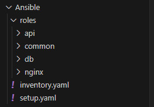
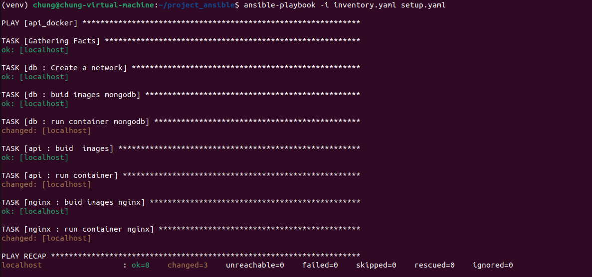
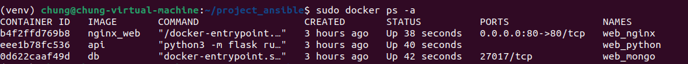
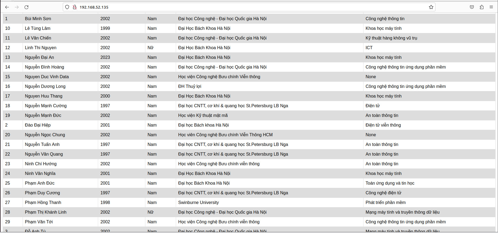

# **Viettel-Digital-Talent-2023**

## **Mục Lục**

  - [**Mục Lục**](#mục-lục)
  - [**I. Practicing**](#i-practicing)
    - [**1. Tổng quan**](#1-tổng-quan)
    - [**2. Cài đặt**](#2-cài-đặt)
      - [**a. Cấu hình cài đặt docker trong roles common**](#a-Cấu-hình-cài-đặt-docker-trong-roles-common)
      - [**b. Cấu hình 3 roles api, db, nginx**](#b-Cấu-hình-3-roles-api,-db,-nginx)
      - [**c. Cấu hình file setup.yaml**](#c-Cấu-hình-file-setup.yaml)
  - [**II. Kết quả**](#ii-kết-quả)


## **I. Practicing**

- *Deploy your application in the docker-compose homework using ansible:*

  - *Setup docker for your target environments in role “common”*
  
  - *Split your application into 3 roles: “web”, “api” and “db”*
  

### **1. Tổng quan**

- **Mô hình**

  

 Hệ thống được triển khai sử dụng Ansible để cài đặt docker và thiết lập 3 container web, api và db trên local host.


### **2. Cài đặt**

#### **a. Cấu hình cài đặt docker trong roles common**

- Thực hiện xóa docker phiên bản cũ trong máy đi và cài đặt docker theo các bước . 

`common/tasks/main.yaml`:

```
# remove docker old
- name: Remove docker
  shell: 
    cmd: snap remove docker

- name: Install dependencies
  apt:
    name:
      - apt-transport-https
      - ca-certificates
      - curl
      - gnupg
      - lsb-release
    state: present
    update_cache: true

- name: Add Docker GPG key
  apt_key:
    url: https://download.docker.com/linux/{{ ansible_distribution | lower }}/gpg
    state: present

- name: Add Docker repository
  apt_repository:
    repo: deb [arch=amd64] https://download.docker.com/linux/{{ ansible_distribution | lower }} {{ ansible_distribution_release }} stable
    state: present

- name: Install Docker
  apt:
    name: docker-ce
    state: present
    update_cache: false

- name: Start Docker service
  service:
    name: docker
    state: started

```

#### **b. Cấu hình 3 roles api, db, nginx**
- Do source code được lưu trong máy  nên cấu hình 3 roles này chỉ cần tạo docker images và chạy  run container trong từng thư mục của source code. 
- Lưu ý: Để 3 container có thể giao tiếp với nhau ta tạo một netwwork chung cho 3 container.
`db/tasks/main.yaml`:
```yaml
---
- name: Create a network
  community.docker.docker_network:
    name: my-network
    state: present

- name: buid images mongodb
  docker_image:
    name: db
    build: 
      path: /home/chung/web_ansible/mongo
    source: build

- name: run container mongodb
  docker_container:
    name: "{{container_name}}"
    image: "{{ docker_images }}"
    networks:
      - name: my-network

```

- `db/vars/main.yaml`

```yaml
container_name: web_mongo
docker_images: db
```
Tương tự 2 roles còn lại cũng cấu hình như trên.

#### **c. Cấu hình file setup.yaml**
Thực hiện tuần tự gọi các roles
`setup.yaml`:
```yaml
---
- name: deploy_web
  hosts: all
  become: true
  gather_facts: true
  roles:
    - common
    - db
    - api
    - nginx
```

## **II. Kết quả**
 Sử dụng câu lệnh:
 ```
 ansible-playbook -i inventory.yaml setup.yaml 

```

- Ansible thực hiện các play:

  

- 3 container đang chạy: 

  

- Web được chạy trên localhost:
  


