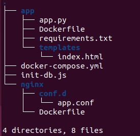
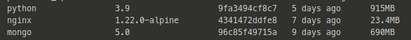
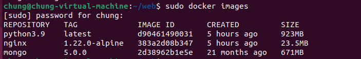
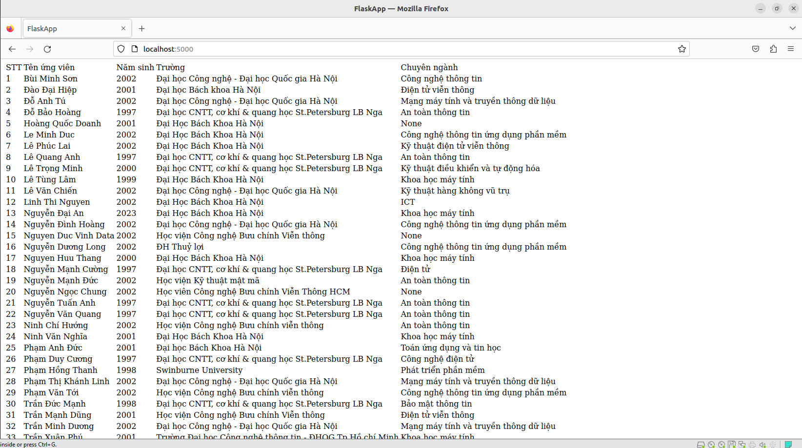

# **Viettel-Digital-Talent-2023**

## **Task: docker, docker-compose**

## **Mục Lục**

- [**Viettel-Digital-Talent-2023](#viettel-digital-talent-2023)
  - [**Task: docker, docker-compose**](#task-docker-docker-compose)
  - [**Mục Lục**](#mục-lục)
  - [**I. Practicing 1**](#i-practicing-1)
    - [**1. ARG vs ENV**](#1-arg-vs-env)
    - [**2. COPY vs ADD**](#2-copy-vs-add)
    - [**3. CMD vs ENTRYPOINT**](#3-cmd-vs-entrypoint)
  - [**II. Practicing 2**](#ii-practicing-2)
    - [**1. Tổng quan**](#1-tổng-quan)
    - [**2. Cài đặt**](#2-cài-đặt)
      - [**a. Cấu hình Nginx**](#a-cấu-hình-Nginx)
      - [**b. Tạo trang web**](#b-tạo-trang-web)
      - [**c. Tạo Database**](#c-tạo-database)
      - [**d. docker-compose**](#d-docker-compose)
  - [**III. Kết quả**](#iii-kết-quả)
  - [**IV. Reference**](#iv-reference)


## **I. Practicing 1**

- *What are the differences between these instruction?*

  - ARG vs ENV

  - COPY vs ADD

  - CMD vs ENTRYPOINT

### **1. ARG vs ENV**

- `ARG`: Chỉ khả dụng trong quá trình build image (Như trong câu lệnh RUN), không khả dụng sau khi image đã được tạo ra và các container được khởi động từ nó.

- `ENV`: Là các giá trị ENV có sẵn trong container, nhưng cũng có các lệnh RUN được chạy trong quá trình Docker build, bắt đầu xuất hiện và khả năng dùng từ dòng lệnh mà chúng được khai báo. Nếu đặt biến môi trường trong các container trung gian bằng cách sử dụng bash (`RUN export VARI = 5 &&`), thì nó sẽ không tồn tại trong các command tiếp theo.

  

### **2. COPY vs ADD**

- `COPY` và `ADD` cả hai đều là chỉ dẫn lệnh trong Dockerfile và có mục đích tương tự nhau. Chúng cho phép copy files từ một vị trí được khai báo tới một Docker image.

  - `COPY` lấy giá trị là src và destination. Nó chỉ cho phép bạn copy một local file hoặc trực tiếp từ local host (máy thực hiện building Docker image) tới chính bản thân của Docker image.

  - `ADD` cũng cho phép bạn thực hiện giống như COPY nhưng còn hỗ trợ cả 2 loại source khác. Thứ nhất, bạn có thể sử dụng URL thay thế cho một local file/ đường dẫn. Thứ hai, bạn có thể thục hiện giải nén một file tar từ source một cách trực tiếp đến destination.

- Trong hầu hết các trường hợp, nếu bạn sử dụng một URL, bạn sẽ download một file zip và thực hiện sử dụng chỉ dẫn lệnh RUN để xử lý nó. Tuy nhiên, bạn cũng có thể sử dụng chỉ dẫn RUN với curl để thay thế cho chỉ dẫn ADD. Tuy nhiên, nên gộp các chỉ dẫn lệnh RUN xử lý một mục đích lại để giảm kích thước của Docker Image.

- Trường hợp sử dụng hợp lệ của ADD là khi bạn muốn thực hiện giải nén một local tar file tới một đường dẫn khai báo trong Docker Image. Điều này là chính xác với những gì Alpine Image thực hiện với ADD rootfs.tar.gz /.

- Nếu bạn thực hiện copy local files tới Docker image thì hãy thường xuyên sử dụng COPY bởi vì nó tường minh hơn so với ADD.

### **3. CMD vs ENTRYPOINT**

- Về cơ bản:
  
  - `CMD` thực hiện lệnh mặc định khi chúng ta khởi tạo container từ image, lệnh mặc định này có thể được ghi đè từ dòng lệnh khi khởi tại container.
  
  - `ENTRYPOINT` khá giống CMD đều dùng để chạy khi khởi tạo container, nhưng `ENTRYPOINT` không thể ghi đè từ dòng lệnh khi khi khởi tại container.

## **II. Practicing 2**

- *Set up a three-tier web application that displays the course attendees' information on the browser using docker-compose.*

- *Base images*
  
  - *nginx:1.22.0-alpine*
  
  - *python:3.9*
  
  - *mongo:5.0*

### **1. Tổng quan**

- **Mô hình**

  

- Hệ thống được triển khai sử dụng docker, docker-compose.

- Cấu trúc practice sau khi hoàn thành:

  

### **2. Cài đặt**

#### **a. Cấu hình Nginx**

- Frontend sử dụng `Nginx` làm *Statics Web Server*, với image base: `nginx:1.22.0-alpine`. 

`nginx/conf.d/app.conf`:

```
upstream app_server {
    server flask:5000;
}
server {
    listen 80;
    server_name _;
    location / {
        try_files $uri @proxy_to_app;
    }
    location @proxy_to_app {
        proxy_pass http://app_server;
    }
}
```

- `Dockerfile`

  ```yaml
  FROM python:3.9

  WORKDIR /app

  COPY ./requirements.txt .

  RUN pip install -r requirements.txt

  EXPOSE 5000
  ```

#### **b. Tạo trang web**
- Sử dụng flask làm API.
`app/app.py`:
```python
from flask import Flask, render_template
from pymongo import MongoClient
application = Flask(__name__)


def get_db():
    client = MongoClient(host='test_mongodb',
                         port=27017, 
                         username='root', 
                         password='pass',
                        authSource="admin")
    db = client.flaskdb
    return db

@application.route('/')
def get_stored_student():
    db=""
    try:
        db = get_db()
        _student = db.student.find()
        return render_template('index.html', todos= _student)
    except:
        pass
    finally:
        if type(db)==MongoClient:
            db.close()


if __name__ == "__main__":
    application.run(host='0.0.0.0', port=5000,debug=true)
  ```
Xây dựng file `index.html` để hiển thị danh sách:
```html
<!DOCTYPE html>
<html lang="en">
<head>
    <meta charset="UTF-8">
    <style>
        .todo {
            padding: 20px;
            margin: 10px;
            background-color: #eee;
        }
    </style>
</head>
<body>
    <h1>Danh sách lớp</h1>
    <table>
        <tr>
        <th>STT</th>
        <th>Tên ứng viên</th>
        <th>Năm sinh</th>
        <th>Giới tính</th>
        <th>Trường</th>
        <th>Chuyên ngành</th>
        </tr>
        
        <tr>
        <td> {{ todo['STT'] }} </td>
        <td> {{ todo['Tên ứng viên']}} </td>
        <td> {{ todo['Năm sinh']}} </td>
        <td> {{ todo['Giới tính']}} </td>
        <td> {{ todo['Trường']}} </td>
        <td> {{ todo['Chuyên ngành']}} </td>
        </tr>
        
    </table>
    </div>
</body>
```
- `Dockerfile`

```yaml
FROM python:3.9

WORKDIR /var/www

COPY . /var/www

RUN pip install --no-cache-dir -r requirements.txt

EXPOSE 5000
```
#### **c. Tạo Database**

- Do việc sử dụng `mongodb` khá đơn giản và không cần phải cấu hình nên ta sẽ trực tiếp sử dụng image base `mongodb:5.0` vào docker-compose và lấy dữ liệu từ file `init-db.js`

`teamplates/init-db.js`:
```
db = db.getSiblingDB("flaskdb");
db.student.drop();

db.student.insertMany([
{'STT': '1', 'Tên ứng viên': 'Bùi Minh Sơn', 'Năm sinh': '2002', 'Giới tính': 'Nam', 'Trường': 'Đại học Công nghệ - Đại học Quốc gia Hà Nội', 'Chuyên ngành': 'Công nghệ thông tin'},
{'STT': '2', 'Tên ứng viên': 'Đào Đại Hiệp', 'Năm sinh': '2001', 'Giới tính': 'Nam', 'Trường': 'Đại học Bách khoa Hà Nội', 'Chuyên ngành': 'Điện tử viễn thông'},
{'STT': '3', 'Tên ứng viên': 'Đỗ Anh Tú', 'Năm sinh': '2002', 'Giới tính': 'Nam', 'Trường': 'Đại học Công nghệ - Đại học Quốc gia Hà Nội', 'Chuyên ngành': 'Mạng máy tính và truyền thông dữ liệu'},
{'STT': '4', 'Tên ứng viên': 'Đỗ Bảo Hoàng', 'Năm sinh': '1997', 'Giới tính': 'Nam', 'Trường': 'Đại học CNTT, cơ khí & quang học St.Petersburg LB Nga', 'Chuyên ngành': 'An toàn thông tin'},
...
]);
```
#### **d. docker-compose**

- `docker-compose.yml`

```yaml
version: '3'
services:

  flask:
    build:
      context: app
      dockerfile: Dockerfile
    container_name: flask
    restart: unless-stopped
    image: python3.9
    environment:
      APP_ENV: "prod"
      APP_DEBUG: "False"
      APP_PORT: 5000
    volumes:
      - appdata:/var/www
    command: python -u app.py
    depends_on:
      - mongodb
    ports:
      - 5000:5000
    networks:
      - frontend
      - backend

  mongodb:
    image: mongo:5.0.0
    container_name: mongodb
    restart: unless-stopped
    hostname: test_mongodb
    environment:
      - MONGO_INITDB_DATABASE=flaskdb
      - MONGO_INITDB_ROOT_USERNAME=root
      - MONGO_INITDB_ROOT_PASSWORD=pass
    volumes:
      - ./init-db.js:/docker-entrypoint-initdb.d/init-db.js:ro
    ports:
      - 27017:27017
    networks:
      - backend

  webserver:
    build:
      context: nginx
      dockerfile: Dockerfile
    image: nginx:1.22.0-alpine
    container_name: webserver
    restart: unless-stopped
    environment:
      APP_ENV: "prod"
      APP_NAME: "webserver"
      APP_DEBUG: "true"
      SERVICE_NAME: "webserver"
    ports:
      - 80:80
    depends_on:
      - flask
    networks:
      - frontend

networks:
  frontend:
    driver: bridge
  backend:
    driver: bridge

volumes:
  appdata:
    driver: local
  nginxdata:
    driver: local
  ```

## **III. Kết quả**

- Thông số các image base:

  

- Trong practice này, ta sử dụng trực tiếp image base `mongo:5.0` nên sẽ chỉ xem xét 2 base còn lại của python:3.9 và nginx:

  

- Ta thấy dung lượng của 2 images tăng lên không đáng kể.

- Kết quả:

  

## **IV. Reference**

- [1] <https://www.digitalocean.com/community/tutorials/how-to-set-up-flask-with-mongodb-and-docker>

- [2] <https://github.com/PauGa9/flask-mongodb-nginx-docker>

- [3] <https://morioh.com/p/ff5cf8a37f67>

- [4] <https://ishmeet1995.medium.com/how-to-create-restful-crud-api-with-python-flask-mongodb-and-docker-8f6ccb73c5bc>

- [5] <https://www.youtube.com/watch?v=oYHxA8HY59M&ab_channel=ElClouddePau-Programaci%C3%B3nWeb>

- [6] <https://viblo.asia/p/dockerfile-references-3P0lPkmpZox>
