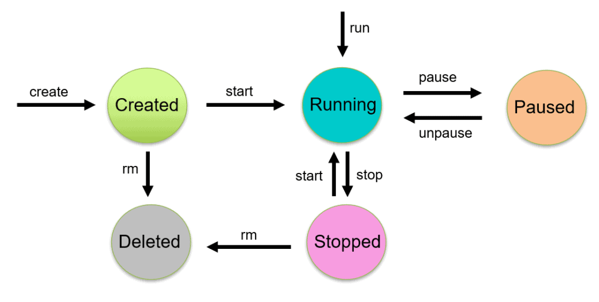
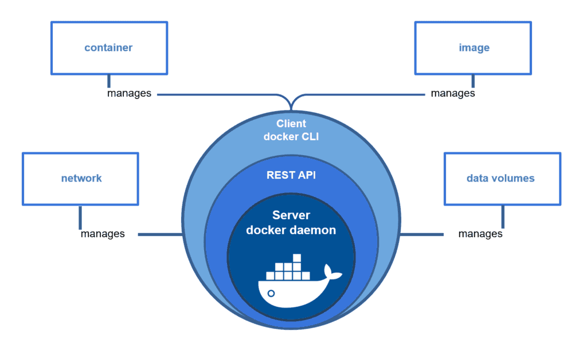
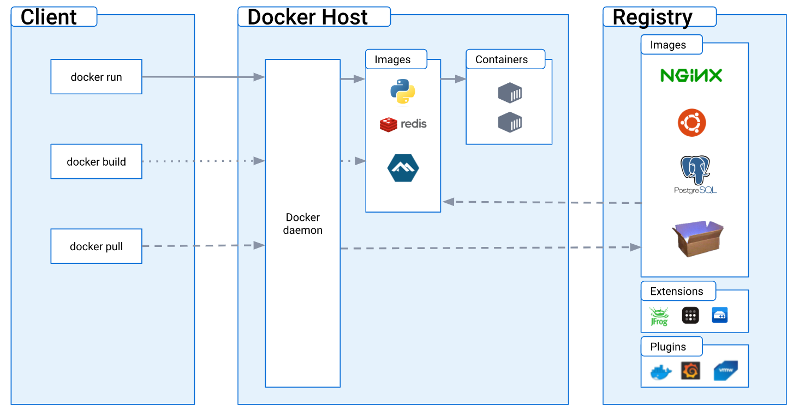
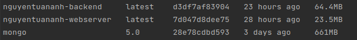
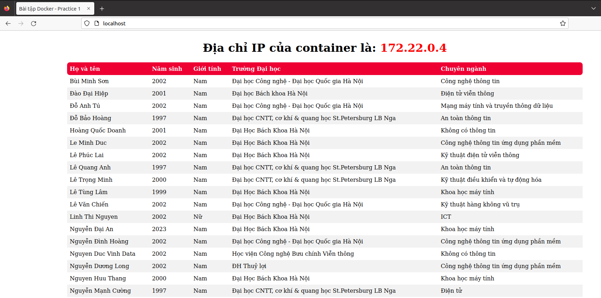

# Viettel-Digital-Talent-2023: Pratice 1

# Task: Docker, Docker-compose

# Mục lục

- [I. Overview](#i-overview)
  - [1. Containerization](#1-containerization)
    - [1.1. Containerization](#11-containerization)
    - [1.2. Containerization vs. Virtualization](#12-containerization-vs-virtualization)
  - [2. Docker](#2-docker)
    - [2.1. Tổng quan](#21-tổng-quan)
    - [2.2. Một số thuật ngữ](#22-một-số-thuật-ngữ)
      - [Docker Image](#docker-image)
      - [Docker Container](#docker-container)
      - [Dockerfile](#dockerfile)
      - [Docker Network](#docker-network)
      - [Docker Volume](#docker-volume)
      - [Docker Compose](#docker-compose)
    - [2.3. Docker Engine](#23-docker-engine)
      - [Docker Engine](#docker-engine)
      - [Server](#server)
      - [REST API](#rest-api)
      - [Client](#client)
    - [2.4. Docker Architecture](#24-docker-architecture)
      - [Docker Daemon](#docker-daemon)
      - [Docker Client](#docker-client)
      - [Docker Registry](#docker-registry)
  - [3. Dockerfile](#3-dockerfile)
    - [3.1. Dockerfile instructions](#31-dockerfile-instructions)
    - [3.2. Cách viết Dockerfile tối ưu](#32-cách-viết-dockerfile-tối-ưu)
    - [3.3. Homework](#33-homework)
      - [Phân biệt ARG và ENV:](#phân-biệt-arg-và-env)
      - [Phân biệt COPY và ADD:](#phân-biệt-copy-và-add)
      - [Phân biệt CMD và ENTRYPOINT:](#phân-biệt-cmd-và-entrypoint)
      - [Phân biệt CMD và RUN:](#phân-biệt-cmd-và-run)
- [II. Web Application](#ii-web-application)
  - [1. Frontend](#1-frontend)
  - [2. Backend](#2-backend)
  - [3. Deployment](#3-deployment)
- [III. Tài liệu tham khảo](#iii-tài-liệu-tham-khảo)

# I. Overview
## 1. Containerization
### 1.1. Containerization
- **Containerization** là giải pháp ảo hóa, tự động hóa thế hệ mới kế tiếp sau Hypervisor Virtualization và được các hãng công nghệ nổi tiếng hàng đầu thế giới như **Google, Facebook, Amazon** áp dụng rộng rãi, đem lại hiệu quả đột phá với các ưu điểm vượt trội về tốc độ triển khai, khả năng mở rộng, tính an toàn và trải nghiệm người dùng. 
- **Containerization** là một **quy trình triển khai phần mềm** với khả năng đóng gói mã ứng dụng cùng với các thư viện, tệp cấu hình và các phụ thuộc cần thiết để ứng dụng chạy đa nền tảng. Với cách tiếp cận đóng gói mã ứng dụng, mã được viết một lần và có khả năng thực thi ở bất cứ đâu, làm cho ứng dụng có tính di động cao. **Docker** là ví dụ về một nền tảng **Containerization**.
### 1.2. Containerization vs. Virtualization
**Sự khác nhau giữa Containerization và Virtualization**

|      Property       | Virtualization |          Containerization          |
|:-------------------:|:--------------:|:----------------------------------:|
|        Size         |  Heavyweight   |            Lightweight             |
|     Performance     |    Limited performance            |         Native performance         |
|  Operating System   |      Each VM runs in its own OS          |   All containers share the host OS                                 |
| Guest Compatibility |           Hardware-level virtualization                               |           OS virtualization                                                         |
|    Startup time     |         Startup time in minutes                                 |                             Startup time in milliseconds                                       |
|    Memory space     |                                 Allocates required memory                                |                             Requires less memory space                                                                   |
|      Isolation      |         Fully isolated and hence more secure                                                                                 |               Process-level isolation, possibly less secure                                                                                                           |


<div align="center">
       
       <br/>
       <i>Sự khác nhau giữa Containerization và Virtualization.</i>
</div>

## 2. Docker

### 2.1. Tổng quan

- **Docker** là một nền tảng mã nguồn mở cung cấp cho người sử dụng những công cụ để có thể đóng gói, vận chuyển và chạy container một cách đơn giản và dễ dàng trên các nền tảng khác nhau với tiêu chí “Build once, run anywhere”.
- **Docker** thực hiện ảo hóa ở mức hệ điều hành. Mỗi container là cô lập với nhau nhưng đều dùng chung một số bin/lib và kernel của Host OS.

### 2.2. Một số thuật ngữ

#### Docker Image
**Image** là một trong những đơn vị cơ bản nhất trong Docker. 1 image sẽ định nghĩa cho 1 môi trường và những thứ có trong môi trường đó. Ứng dụng muốn chạy được thì cần phải có **Image**.

#### Docker Container
**Container** được tạo ra từ **Image**, là nơi chứa mọi thứ cần thiết để có thể chạy ứng dụng. Từ 1 image chúng ta có thể tạo ra nhiều containers với môi trường bên trong giống hệt nhau.
<div align="center">
       
       <br/>
       <i>Docker Container Lifecycle Management.</i>
</div>

#### Dockerfile
**Dockerfile** là một file dạng text không có phần đuôi mở rộng, chứa các đặc tả về một trường thực thi phần mềm, cấu trúc cho **Docker image**. Từ những câu lệnh đó, Docker sẽ build ra Docker image (thường có dung lượng nhỏ từ vài MB đến lớn vài GB).

#### Docker Network

**Docker Network** có nhiệm vụ cung cấp kết nối để các container trên một hoặc nhiều host có thể liên lạc được với nhau.
Với container và service của Docker, chúng ta có thể kết nối chúng lại với nhau hoặc kết nối chúng với các mạng khác nằm ngoài Docker.

#### Docker Volume

**Volume** là cơ chế tạo và sử dụng dữ liệu của docker, có nhiệm vụ lưu trữ dữ liệu độc lập với vòng đời của container.
Chúng ta dùng **Volume** để giữ lại giữ liệu khi một container bị xóa; chia sẻ dữ liệu giữa máy chủ vật lý và docker container hoặc chia sẻ dữ liệu giữa các container.

#### Docker Compose

**Docker Compose** là công cụ dùng để định nghĩa và run multi-container cho Docker application. Với Docker compose chúng ta sử dụng file YAML để config các services cho application. Sau đó dùng command để create và run từ những config đó.

### 2.3. Docker Engine

#### Docker Engine

**Docker Engine** là thành phần cực kỳ quan trọng và không thể thiếu của Docker có nhiệm vụ như một công cụ có khả năng đóng gói các ứng dụng. Công dụng chính của Docker Engine là chạy container, quản lý việc tạo image, kết nối vào container, tải image về hoặc sử dụng những image có sẵn,…
<div align="center">
       
       <br/>
       <i>Các thành phần chính của Docker Engine.</i>
</div>

#### Server
**Server** hay còn được gọi là docker daemon (dockerd): chịu trách nhiệm tạo, quản lý các Docker objects như images, containers, networks, volume.
#### REST API
Docker daemon cung cấp các API cho Client sử dụng để thao tác với Docker.
#### Client
**Client** là thành phần đầu cuối và cung cấp một tập hợp các câu lệnh sử dụng api để người dùng thao tác với Docker. Ví dụ: docker images, docker ps, ...
### 2.4. Docker Architecture
**Docker** sử dụng kiến trúc **client-server**.

<div align="center">
       
       <br/>
       <i>Kiến trúc của Docker.</i>
</div>

#### Docker Daemon
**Docker daemon** chạy trên host, đóng vai trò là **server**, nhận các RESTful request từ Docker Client và thực thi nó. Là một lightweight runtime giúp build, run và quản lý các containers và các thành phần liên quan khác. Docker Daemon quản lý các **Docker objects** (images, containers, network và volume).
#### Docker Client
**Docker client** là phương thức chính để người dùng thao tác với Docker. Docker client có thể giao tiếp và gửi request đến nhiều Docker daemon.
#### Docker Registry
**Docker Registry** là nơi lưu trữ riêng của Docker Images. Images được push vào Registry và client sẽ pull images từ Registry. Nổi tiếng nhất chính là **Docker Hub**, ngoài ra người dùng có thể tự xây dựng một Docker registry cho riêng mình.
## 3. Dockerfile
**Dockerfile** là một file dạng text không có phần đuôi mở rộng, chứa các đặc tả về một trường thực thi phần mềm, cấu trúc cho Docker Image. Từ những câu lệnh đó, Docker sẽ build ra Docker image (thường có dung lượng nhỏ từ vài MB đến lớn vài GB).

Cú pháp chung của một Dockerfile có dạng:
`INSTRUCTION arguments
`
- INSTRUCTION là tên các chỉ thị có trong Dockerfile, mỗi chỉ thị thực hiện một nhiệm vụ nhất định, được Docker quy định. Khi khai báo các chỉ thị này phải được viết bằng chữ IN HOA.
- aguments là phần nội dung của các chỉ thị, quyết định chỉ thị sẽ làm gì.
### 3.1. Dockerfile instructions
- **FROM**: Một Dockerfile bắt buộc phải bắt đầu bằng chỉ thị `FROM`. Chỉ thị `FROM` là base image để chúng ta tiến hành build một image mới. Các image base này sẽ được tải về từ Public Repository hoặc Private Repository riêng của mỗi người tùy theo setup.
- **ARG**: Dùng để định nghĩa các giá trị của biến được dùng trong quá trình **build image**. Biến `ARG` sẽ không bền vững như khi sử dụng `ENV`.
- **ENV**: Chỉ thị `ENV` dùng để khai báo các biến môi trường. Các biến này được khai báo dưới dạng key - value bằng các chuỗi. Khi run container từ image, các biến môi trường này vẫn có hiệu lực.
- **WORKDIR**: Dùng để đặt thư mục đang làm việc cho các chỉ thị khác như: RUN, CMD, ENTRYPOINT, COPY, ADD,...
- **USER**: Có tác dụng set `username` hoặc `UID` để sử dụng khi chạy image và khi chạy các lệnh có trong `RUN`, `CMD`, `ENTRYPOINT` sau nó.
- **EXPOSE**: Chỉ thị `EXPOSE` thông báo cho Docker rằng image sẽ lắng nghe trên các cổng được chỉ định khi chạy. Lưu ý là cái này chỉ để khai báo, chứ ko có chức năng *nat port* từ máy host vào container. 
- **RUN**: Chỉ thị `RUN` dùng để chạy một lệnh nào đó trong quá trình build image và thường là các câu lệnh Linux. Tùy vào image gốc được khai báo trong phần `FROM` thì sẽ có các câu lệnh tương ứng. 
- **ENTRYPOINT**: Chỉ thị `ENTRYPOINT` cho phép cấu hình một container mà chạy như một lệnh thực thi.
- **VOLUME**: Dùng để mount file/directories giữa host và container. Mục đích của `VOLUME` là: giữ được dữ liệu khi container bị remove, chia sẻ dữ liệu giữa host và container, chia sẻ dữ liệu giữa các container với nhau.
- **CMD**: Dùng để truyền một lệnh của Linux mỗi khi thực hiện khởi tạo một container từ image (image này được build từ *Dockerfile*).
- **ADD**: Chỉ thị `ADD` thực hiện sao chép các tập, thư mục từ máy đang build hoặc remote file URLs từ `<src>` và thêm chúng vào filesystem của image `<dest>`. Trong đó `src` có thể khai báo nhiều file, thư mục, ... còn `dest` phải là đường dẫn tuyệt đối hoặc có quan hệ chỉ thị đối với `WORKDIR`.
- **COPY**: Chỉ thị `COPY` cũng giống với `ADD` là copy file, thư mục từ `<src>` và thêm chúng vào `<dest>` của container. Khác với ADD, nó không hỗ trợ thêm các file remote file URLs từ các nguồn trên mạng.

Xem thêm chi tiết [tại đây](https://tuananhnjr.notion.site/Docker-Note-a5b1c099ef054a449f1fa999d8c74b0f).
### 3.2. Cách viết Dockerfile tối ưu
Việc viết Dockerfile tối ưu là rất quan trọng để giảm thiểu thời gian build image và tăng hiệu suất khi chạy container. Dưới đây là một số cách để viết Dockerfile tối ưu:

- Sử dụng `COPY` thay vì `ADD`: `COPY` nhanh hơn `ADD` và không hỗ trợ tính năng tự động giải nén tập tin.

- Sử dụng **multi-stage builds**: Multi-stage builds cho phép xây dựng hình ảnh bằng nhiều stage khác nhau, giúp giảm kích thước image và tăng tốc độ build.

- Sử dụng `.dockerignore` file: Tạo file `.dockerignore` để loại bỏ các tệp không cần thiết khỏi quá trình **build image**. Điều này cũng giúp tăng tốc độ build image.

- Thêm các chỉ mục cụ thể vào chỉ thị `EXPOSE`: Thêm các chỉ mục cụ thể vào `EXPOSE` sẽ giúp tăng hiệu suất mạng và giảm thời gian khởi động.
- Hiểu về Docker layer caching: Nếu chúng ta biết cách tổ chức `Dockerfile`, sắp xếp cách thành phần ít khi thay đổi lên trên và thành phần thường xuyên thay đổi xuống dưới, thì quá trình build image sẽ giảm đi đáng kể.
- Xóa các tệp tạm sau khi cài đặt: Sau khi cài đặt các gói, tệp tạm thời không còn cần thiết và có thể được xóa để giảm kích thước của image.
- Sử dụng cùng một chỉ thị `RUN` để cài đặt nhiều gói cùng một lúc: Việc sử dụng cùng một lệnh `RUN` để cài đặt nhiều gói cùng một lúc sẽ giúp giảm số lượng lớn các lớp trong lịch sử xây dựng và giảm kích thước của image.

### 3.3. Homework
#### Phân biệt ARG và ENV
- `ARG` còn được gọi là biến build-time (chỉ hoạt động trong quá trình build images). Biến `ARG` sẽ không bền vững như khi sử dụng `ENV`, chúng chỉ khả dụng cho đến khi image được tạo. Khi chạy container, chúng ta không thể truy cập giá trị của các biến `ARG`. Các giá trị `ARG` có thể được kiểm tra dễ dàng bằng cách chạy `docker history` của image sau khi được tạo ra. Vì vậy, `ARG` không được lựa chọn sử dụng cho các dữ liệu nhạy cảm, mang tính bảo mật cao.
- Các biến `ENV` cũng có sẵn trong quá trình build, ngay khi khai báo chúng với một command của `ENV`. Tuy nhiên, không giống như `ARG`, khi build xong image, các container chạy image có thể truy cập giá trị `ENV` này. Các container chạy từ image có thể ghi đè giá trị của `ENV`.

<div align="center">
       
       <br/>
       <i>So sánh <strong> ARG </strong> và <strong> ENV</strong>.</i>
</div>

#### Phân biệt COPY và ADD
- `COPY` và `ADD` trong Docker phục vụ chung một mục đích đó là copy file từ một nơi nào đó vào trong Image.
- `COPY` nhận vào đối tượng cần copy và đích cần copy tới trong image. Và `COPY` **chỉ cho phép** copy file từ local, từ máy gốc của chúng ta vào trong Image.
- `ADD` cũng làm được điều tương tự nhưng `ADD` có thêm 2 chức năng đó là:
   - có thể copy từ một địa chỉ URL vào trong Image;
   - có thể giải nén một file và copy vào trong Image.
- **Khi nào nên dùng `COPY` hoặc `ADD`:**
  - Trường hợp sử dụng hợp lệ của `ADD` là khi thực hiện giải nén một local tar file tới một đường dẫn khai báo trong Docker Image. Nhưng trong hầu hết trường hợp khi dùng đến URL để download file thì sẽ dùng câu lệnh **`RUN curl/wget`** hoặc muốn giải nén file thì cũng sẽ dùng **`RUN tar -xvzf`**.
  - Nếu thực hiện copy local files tới Docker image thì hãy sử dụng `COPY` bởi vì nó tường minh hơn so với `ADD` (làm rõ việc chúng ta đang muốn thực hiện hành động nào).
#### Phân biệt CMD và ENTRYPOINT
- Hiện tại Docker chỉ cho phép chạy một `CMD` khi khởi động container, nhưng nếu `CMD` của các chúng ta phức tạp thì có thể dùng tới `ENTRYPOINT`.
- `CMD` và `ENTRYPOINT` có tác dụng tương tự nhau. Nếu một Dockerfile có cả `CMD` và `ENTRYPOINT` thì `ENTRYPOINT` dùng để cấu hình cho `CMD` trước khi chạy `CMD`. 
- Lý do dùng `ENTRYPOINT` là để chuẩn bị các điều kiện setup như tạo user, mkdir, change owner... cần thiết để chạy service trong container.
>Trong Dockerfile có thể vừa có ENTRYPOINT vừa có CMD.
#### Phân biệt CMD và RUN
- `RUN` được thực thi trong quá trình build. Khi chúng ta build một Docker image, Docker sẽ đọc các câu lệnh trong chỉ dẫn `RUN` và build tới một layer mới trong image sử dụng.
- `CMD` được thực thi trong quá trình run. Điều này cho phép gọi tới một vài quá trình như bash, nginx hay bất cứ quá trình nào mà Docker image runs. Việc thực thi chỉ thị nằm ngay trong layer hiện tại của images.
- Trong Dockerfile có thể có nhiều chỉ thị `RUN` được thực thi nhưng chỉ có duy nhất một chỉ thị `CMD` được thi.
# II. Web Application
## 1. Frontend
Để **Build Docker Image** cho Frontend chúng ta cần tạo file cấu hình `Dockerfile` và định nghĩa môi trường chúng ta mong muốn. `Dockerfile` có nội dung như sau:
Chúng ta sẽ sử dụng image này để xây dựng `Nginx` server và triển khai ứng dụng trên server đó.
```Dockerfile
  FROM nginx:1.22.0-alpine
  COPY ./nginx.conf /etc/nginx/conf.d/default.conf
  EXPOSE 80
  CMD ["/bin/sh", "-c", "nginx -g 'daemon off;'"]
```
- Ở đầu mỗi file `Dockerfile` ta luôn phải có `FROM`. `FROM` ý chỉ ta bắt đầu từ môi trường nào, môi trường này phải đã được build thành Image. 
- `nginx:1.22.0-alpine`: Đây là image gốc mà `Dockerfile` này sẽ dựa trên để xây dựng image mới, `nginx:1.22.0-alpine` là một phiên bản nhỏ gọn của `Nginx` chạy trên `Alpine Linux`.
Alpine Linux là một distro linux dựa trên musl và BusyBox, được phát triển chú trọng về đơn giản, bảo mật và hiệu quả tài nguyên và đặc biệt các image dựng trên `alpine` có dung lượng rất **gọn nhẹ**.
- ```Dockerfile
  COPY ./nginx.conf /etc/nginx/conf.d/default.conf
  ```
  Dòng lệnh này sao chép file `nginx.conf` vào thư mục `/etc/nginx/conf.d/` của container, đồng thời đổi tên file thành `default.conf`. Điều này sẽ đảm bảo rằng `Nginx` sẽ sử dụng file cấu hình này khi khởi động.
- `EXPOSE 80`: Chỉ định rằng container sẽ lắng nghe trên cổng 80. Điều này cho phép các yêu cầu từ giao thức HTTP được gửi đến container.
- ```Dockerfile
  CMD ["/bin/sh", "-c", "nginx -g 'daemon off;'"]
  ```
  `CMD` để chỉ câu lệnh **mặc định** khi mà 1 container được khởi tạo từ Image này. `CMD` nhận vào 1 mảng bên trong là các câu lệnh chúng ta muốn chạy. Lệnh này sử dụng shell `/bin/sh` để thực thi lệnh `nginx -g 'daemon off;'`, nghĩa là khởi động `Nginx` và giữ container chạy liên tục.

Tiếp theo chúng ta sẽ tạo 1 file `nginx.conf ` cho **Nginx** web server. File có nội dung như sau:
```
server {
  listen 80;
  server_name localhost;
  location / {
    proxy_pass http://backend:5000;
  }
}
```
- File `nginx.conf` được sử dụng để cấu hình `Nginx` như một **reverse proxy**, để chuyển tiếp các yêu cầu đến một ứng dụng web khác chạy trên một server khác.
- Chúng ta khai báo một `server block` trong cấu hình `Nginx`, chỉ định cho `Nginx` lắng nghe trên cổng 80, tên của server là `localhost`.
- `location /` dùng để khai báo cho Nginx, để xử lý các yêu cầu được gửi đến đường dẫn root của server. Trong trường hợp này, đường dẫn root là "/".
- `proxy_pass http://backend:5000:` `Nginx` sẽ chuyển tiếp các yêu cầu được gửi đến "/ " đến địa chỉ "http://backend:5000". Ứng dụng Web này sẽ được chạy trên server khác và lắng nghe trên `port 5000`.
## 2. Backend
Chúng ta đang set up một ứng dụng Python dùng Flask framework, sử dụng image base `python:3.9-alpine3.17` rất gọn nhẹ. 
Đầu tiên cần tạo 1 `Dockerfile` có nội dung như sau:
```Dockerfile
FROM python:3.9-alpine3.17

WORKDIR /usr/src/app

COPY requirements.txt requirements.txt
RUN pip3 install -r requirements.txt --no-cache-dir && \
    rm -f flask_requirements.txt

COPY . .
EXPOSE 5000

CMD [ "python3" ,"app.py" ]
```
- ```Dockerfile
  WORKDIR /usr/src/app
  ```
  Đây là chỉ định cho Docker container sẽ làm việc trong thư mục `/usr/src/app`. Sau đó chúng ta sao chép tệp `requirements.txt` vào thư mục đó.
- ```Dockerfile
  RUN pip3 install -r requirements.txt --no-cache-dir && \
  rm -f flask_requirements.txt
  ```
  Tiếp theo là chúng ta cài đặt dependencies cần thiết, cần cài những thứ gì thì đã được chỉ định sẵn ở file `requirements.txt`. 
File `requirements.txt` được dùng để cài đặt những module cần thiết để triển khai ứng dụng. File đó có nội dung như sau:
  ```
  Flask~=2.3.1
  pymongo~=4.3.3
  ```
- ```Dockerfile 
  COPY . .
  ``` 
  Lệnh này dùng để sao chép tất cả các tệp trong thư mục hiện tại và đưa vào trong đường dẫn `/usr/src/app` của container.
- ```Dockerfile 
  EXPOSE 5000
  ``` 
  Chỉ định cho Docker container để lắng nghe các kết nối đến cổng 5000.
- ```Dockerfile 
  CMD ["python3", "app.py"]
  ``` 
  Cuối cùng chúng ta dùng `CMD` để chỉ command mặc định khi một container được khởi tạo từ Image. Ở đây, container sẽ chạy lệnh `python3 app.py` để bắt đầu ứng dụng.
## 3. `Docker-compose.yml` file
Để triển khai ứng dụng Web với `docker-compose`, chúng ta cần tạo một file với tên là `docker-compose.yml`, với nội dung như sau:
```
version: '3.9'

services:
  webserver:
    container_name: nginx
    build:
      context: nginx
      dockerfile: Dockerfile
    ports:
      - "80:80"
    depends_on: 
      - backend
             
  backend:
    build:
      context: flask
      dockerfile: Dockerfile
    restart: unless-stopped
    ports:
      - "5000"
    depends_on:
      - database

  database:
    image: mongo:5.0
    restart: unless-stopped
    container_name: mongodb
    environment:
      - MONGO_INITDB_DATABASE=vdt2023
    volumes:
      - database:/data/db
    healthcheck:
      test: echo 'db.runCommand("ping").ok' | data_tier data_tier:27017/test --quiet
      interval: 10s
      timeout: 10s
      retries: 5
      start_period: 40s

volumes:
  database:
```
  - Đầu tiên chúng ta định nghĩa `version` của file cấu hình `docker-compose`, là phiên bản mới nhất.
  - Tiếp theo là các `services`, bên trong `services` chúng ta sẽ định nghĩa tất cả các thành phần cần thiết cho việc triển khai ứng dụng Web bao gồm 3 `services` là `webserver`, `backend`, và `database`.
  - Ở service `webserver` chúng ta thực hiện build image từ `Dockerfile` ở thư mục `nginx`, **map port** từ port 80 trên máy host để kết nối tới port 80 trên container của `service` này. `depends_on:` được dùng để chờ đợi service `backend` khởi chạy xong mới khởi động service này.
  - Ở service `backend` chúng ta thực hiện build image từ `Dockerfile` ở thư mục `flask`, trường `restart` ở đây được để là `unless-stopped`, mục đích là để tự động chạy `service` này trong mọi trường hợp (như lúc khởi động lại máy chẳng hạn), nhưng nếu `service` này bị dừng bằng tay (dừng có chủ đích), hoặc đang chạy mà gặp lỗi bị dừng thì không restart nó. Tiếp theo sẽ **map post** 5000 trên máy host để kết nối tới port 5000 trong container của `service` này. Chúng ta chờ đợi service `database` khởi chạy xong mới khởi động service này.
  - Ở service `database` chúng ta sử dụng image của MongoDB `version 5.0`, thiết lập biến môi trường cho container, trong đó cụ thể là tạo một database có tên là `vdt2023`. `healthcheck` là một tính năng của Docker, cho phép chúng ta kiểm tra trạng thái của một container, đảm bảo rằng container đã được khởi động thành công và đang hoạt động như mong đợi.

Kích thước các `image` như sau:
<div align="center">
       
</div>

## 3. Deployment

Chúng ta sẽ triển khai một Web application có sử dụng **Load balancer**.

Load balancer là một khái niệm về cân bằng tải, được sử dụng để giúp ứng dụng có thể handle một số lượng lớn các request từ người dùng. Chúng ta có thể deploy ứng dụng của mình lên nhiều máy khác nhau, các request từ người dùng sẽ gọi tới load balancer và sẽ được load balancer forward tới một trong các máy này. Ngoài ra, chúng ta có thể sử dụng `weight` để điều chỉnh trọng số ưu tiên giữa các container, container nào có trọng số cao hơn sẽ có ưu tiên hơn khi phân phối tài nguyên trên host. 

Chạy ứng dụng trong trình duyệt theo đường dẫn `localhost:5000` sẽ trả về 2 địa chỉ IP khác nhau của Container và chúng hiển thị xen kẽ sau mỗi lần chạy.

Dòng lệnh `docker-compose up --build -d --scale backend=2` sẽ thực hiện khởi động các `service` đã được định nghĩa trong file `docker-compose.yml`, chạy 2 container của service `backend` (có thể đổi số lượng container cần chạy tại đây). Đây là một ví dụ về việc sử dụng Load Balancer. `Nginx` có thể được sử dụng như một trình cân bằng tải tốt để phân phối lưu lượng truy cập đến các `servers` và trả lại các phản hồi từ các `servers` được chọn đến `client`. 

Kết quả trả về:
<div align="center">
       
</div>
<div align="center">
       
</div>

# III. Tài liệu tham khảo

[1] [What’s the Diff: VMs vs. Containers](https://www.backblaze.com/blog/vm-vs-containers/).

[2] [Docker overview](https://docs.docker.com/get-started/overview/).

[3] [Lí do tôi yêu Docker](https://viblo.asia/p/li-do-toi-yeu-docker-ORNZqxRMK0n).

[4] [Tìm hiểu về Dockerfile và tạo Docker Image](https://viblo.asia/p/tim-hieu-ve-dockerfile-va-tao-docker-image-V3m5WWag5O7).

[5] [Difference between the COPY and ADD commands in a Dockerfile](https://www.geeksforgeeks.org/difference-between-the-copy-and-add-commands-in-a-dockerfile/).

[6] [How To Set Up Flask with MongoDB and Docker](https://www.digitalocean.com/community/tutorials/how-to-set-up-flask-with-mongodb-and-docker).

[7] [Docker tips&tricks: Làm thế nào để tối ưu hóa kích thước của một Docker Image?](https://viblo.asia/p/docker-tipstricks-lam-the-nao-de-toi-uu-hoa-kich-thuoc-cua-mot-docker-image-bWrZnm0pKxw).

[8] [Dockerize ứng dụng Python, Flask](https://viblo.asia/p/dockerize-ung-dung-python-flask-bWrZnxbY5xw).


    