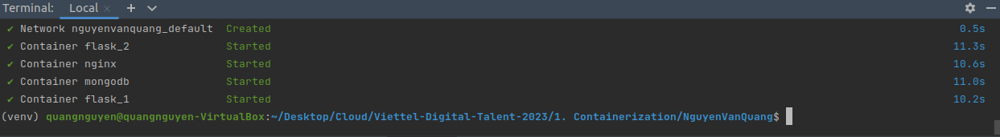

[I. Requirement](#equirements)

[II. Kiến thức lý thuyết](#intro)
- [1. Containerization](#containerization)
- [2. Docker](#docker)
- [3. Dockerfile](#dockerfile)
- [4. Docker-compose](#compose)
- [5. Nginx](#nginx)

[III. Thực hành](#practice)
[IV. References](#references)

# Lab 1: Containerization
## I. Requirements <a name='requirements'></a>
Cài đặt một ứng dụng web 3-tier để hiển thị thông tin các học viên trên trình duyệt sử dụng docker-compose.

Base images:
- nginx:1.22.0-alpine
- python: 3.9
- mongo: 4.4.18 (Do Mông 5.0 trở lên yêu cầu CPU phải hỗ trợ AVX, với cấu hình máy thực hành phải dùng phiên bản khác)

## II. Kiến thức lý thuyết <a name='intro'></a>
### 1. Containerization <a name='containerization'></a>
`Containerization` là một giải pháp ảo hóa với khả năng đóng gói mã của ứng dụng cùng tất cả các tệp và thư viện cần thiết giúp ứng dụng có thể chạy trên bất kỳ cơ sở hạ tầng nào.

Trước khi công nghệ container xuất hiện, máy ảo (`virtualization`) là công nghệ được dùng để tối ưu hoạt động của máy chủ. Máy ảo mô phỏng các thiết bị vật lý. Các ứng dụng chạy trên 2 máy ảo khác nhau sẽ được cô lập ở lớp vật lý. 

Tuy máy ảo tối ưu hóa tài nguyên của máy chủ khá hiệu quả nhưng song song với đó cũng còn rất nhiều `nhược điểm` cần khắc phục:
- `Tốn thời gian` cài đặt ứng dụng: mỗi khi tạo máy ảo mới phải cài lại từ đầu, mỗi bước cài đặt khác nhau theo từng phiên bản, update, downgrade khó khăn, ...
- `Dễ xảy ra conflict`: các ứng dụng nằm trên cùng 1 máy ảo vẫn sẽ cạnh tranh nhau về mặt tài nguyên (CPU, RAM, bộ nhớ, ...) và có thể xảy ra xung đột giữa các phiên bản khác nhau. Ngoài ra việc sử dụng nhiều máy ảo cũng không hiệu quả vì phải dành ra dung lượng để cài hệ điều hành trên mỗi máy.

Để khắc phục tình trạng trên, công nghệ `Containerization` với ý tưởng về việc cô lập các tiến trình (ứng dụng) trên hệ điều hành được đề xuất. 
- Không phải tốn dung lượng cho hệ điều hành nên ứng dụng dễ dàng được đóng gói, `tự động hóa việc cài đặt ứng dụng`.
- Vì chung 1 hệ điều hành nên có thể tạo ra nhiều instance mà không sợ tốn bộ nhớ. Mỗi ứng dụng được cô lập trong 1 container nên `không sợ xảy ra conflict` nữa.

**Linux Container**

Container nó được xây dựng từ hai tính năng chính là `namespaces` and `cgroups`.

<div align="center">
  
</div>

<div align="center">
  <i>Pic. 1 -Linux - Container</i>
</div>

- `Namespaces` phép ta tạo ra một virtualize system, khá giống với chức năng của các công cụ virtual machine. Đây là tính năng chính giúp process của ta tách biệt hoàn toàn với các process còn lại. Linux namespaces sẽ bao gồm các thành phần nhỏ hơn như: 
    
    - `PID namespace` cho phép ta tạo các process tách biệt.
    - `Networking namespace` cho phép ta chạy chương trình trên bất kì port nào mà không bị xung độ với các process khác chạy trên server. 
    - `Mount namespace` cho phép ta mount và unmount filesystem mà không ảnh hưởng gì tới host filesystem.
<div align="center">
  
</div>

<div align="center">
  <i>Pic. 2 - Namespace in Linux</i>
</div>

- `Cgroups` để giới hạn resource của một process. `Cgroups` sẽ định ra giới hạn của CPU và Memory mà một process có thể dùng.

<div align="center">
  
</div>

<div align="center">
  <i>Pic. 3 - Cgroup in Linux</i>
</div>

Ngoài ra ta có thể sử dụng `cgroups` kết hợp với `namespace` để tạo một `process` độc lập và có giới hạn resource nó có thể sử dụng.

```commandline
vanquang@server:~$ sudo cgexec -g cpu,memory:my-process unshare -uinpUrf --mount-proc sh -c "/bin/hostname my-process && chroot mktemp -d /bin/sh"
```

### 2. Docker <a name='docker'></a>

**Docker** là nền tảng phần mềm cho phép bạn dựng, kiểm thử và triển khai ứng dụng một cách nhanh chóng. Docker đóng gói phần mềm vào các đơn vị tiêu chuẩn hóa được gọi là container có mọi thứ mà phần mềm cần để chạy, trong đó có thư viện, công cụ hệ thống, mã và thời gian chạy. Bằng cách sử dụng Docker, bạn có thể nhanh chóng triển khai và thay đổi quy mô ứng dụng vào bất kỳ môi trường nào và biết chắc rằng mã của bạn sẽ chạy được.

<div align="center">
  
</div>

<div align="center">
  <i>Pic. 4 - Docker</i>
</div>

**Lợi ích của Docker:**
- Không như máy ảo Docker start và stop chỉ trong vài giây.
- Bạn có thể khởi chạy container trên mỗi hệ thống mà bạn muốn.
- Container có thể build và loại bỏ nhanh hơn máy ảo.
- Dễ dàng thiết lập môi trường làm việc. Chỉ cần config 1 lần duy nhất và không bao giờ phải cài đặt lại các dependencies. Nếu bạn thay đổi máy hoặc có người mới tham gia vào project thì bạn chỉ cần lấy config đó và đưa cho họ.
- Nó giữ cho word-space của bạn sạch sẽ hơn khi bạn xóa môi trường mà ảnh hưởng đến các phần khác.

**Docker Architecture:**

<div align="center">
  
</div>

<div align="center">
  <i>Pic. 5 - Docker Architecture</i>
</div>

- **Docker Client:** là cách mà bạn tương tác với docker thông qua command trong terminal. Docker Client sẽ sử dụng API gửi lệnh tới Docker Daemon.
- **Docker Daemon:** là server Docker cho yêu cầu từ Docker API. Nó quản lý images, containers, networks và volume.
- **Docker Volumes:** là cách tốt nhất để lưu trữ dữ liệu liên tục cho việc sử dụng và tạo apps.
- **Docker Registry:** là nơi lưu trữ riêng của Docker Images. `Images được push vào registry và client sẽ pull images từ registry`. Có thể sử dụng registry của riêng bạn hoặc registry của nhà cung cấp như : AWS, Google Cloud, Microsoft Azure.
- **Docker Hub:** là Registry lớn nhất của Docker Images ( mặc định). Có thể tìm thấy images và lưu trữ images của riêng bạn trên Docker Hub ( miễn phí).
- **Docker Repository:** là tập hợp các Docker Images cùng tên nhưng khác tags. VD: golang:1.11-alpine.
- **Docker Networking:** cho phép kết nối các container lại với nhau. Kết nối này có thể trên 1 host hoặc nhiều host.
- **Docker Compose:** là công cụ cho phép run app với nhiều Docker containers 1 cách dễ dàng hơn. Docker Compose cho phép bạn config các command trong file `docker-compose.yml` để sử dụng lại. Có sẵn khi cài Docker.
- **Docker Swarm:** để phối hợp triển khai container.
- **Docker Services:** là các containers trong production. 1 service chỉ run 1 image nhưng nó mã hoá cách thức để run image — sử dụng port nào, bao nhiêu bản sao container run để service có hiệu năng cần thiết và ngay lập tức.

### 3. Dockerfile <a name='dockerfile'></a>

Nếu coi `Container` là một ngôi nhà thì `Docker image` chính là bản thiết kế chi tiết còn `Dockerfile` là những chỉ dẫn của kỹ sư.

`Dockerfile` là một tệp tin gồm tập hợp các chỉ thị, mà khi docker gọi tệp tin đó, nó có thể tự động tạo thành các image.

<div align="center">
  
</div>

<div align="center">
  <i>Pic. 6 - Dockerfile</i>
</div>

**Một số lệnh dùng trong Dockerfile:**

### ```FROM``` 
Là base image để chúng ta tiến hành `build một image mới`. Chỉ thị này phải được đặt trên cùng của Dockerfile.

```commandline
FROM <image> [AS <name>]
FROM <image>[:<tag>] [AS <name>]
FROM <image>[@<digest>] [AS <name>]
MAINTAINER Chứa thông tin của tác giả tiến hành build image.
```

### ```WORKDIR```
Là chỉ thị dùng để thiết lập thư mục làm việc. Nó giống home directory, trong trường hợp này là home directory của container. 

Khi gọi ```WORKDIR``` nó sẽ tạo ra thư mục ngay lần gọi đầu và truy cập đến nó như home directory. Nó có thể được dùng nhiều lần trong một Dockerfile.

```commandline
WORKDIR /path/to/workdir
```

### ```USER```
Được sử dụng để thiết lập user để sử dụng khi chạy image and cho một số chỉ thị: ```RUN```, ```CMD``` & ```ENTRYPOINT``` trong `Dockerfile`.


```commandline
USER <user>[:<group>]
```

### ```RUN``` 
Có thể tạo một lệnh khi build image. Được sử dụng để cài đặt các package vào container.

```commandline
RUN ["executable", "param1", "param2"]
RUN /bin/bash -c 'source $HOME/.bashrc; echo $HOME'
```

### ```COPY``` & ```ADD```

- ```COPY``` sao chép các tệp tin hoặc thư mục từ `<src>` và thêm chúng vào hệ thống tệp tin của container ở đường dẫn `<dest>`.
    ```
    COPY <src>... <dest>
    ```
- ```ADD``` sẽ sao chép các files, thư mục hoặc `remote của file từ URLs` từ `<src>` và thêm vào hệ thống tệp của hình ảnh ở đường dẫn `<dest>`
    ```
    ADD <src>... <dest>
    ```
Tuy nhiên ```ADD``` có điểm yếu là tạo thêm 1 layer trong docker gây lãng phí bộ nhớ nên thay vì dùng ```ADD``` để tải file, ta có thể dùng `curl` hoặc `wget` rồi xóa file đã tải sau khi cài đặt.

### ```ARG``` & ```ENV```

<div align="center">
  
</div>

<div align="center">
  <i>Pic. 7 - ENV and ARG</i>
</div>

- ```ARG``` Dùng để ịnh nghĩa giá trị biến được dùng trong lúc build image, chỉ khả dụng trong quá trình `build docker image` (như trong câu lệnh ```RUN```), không khả dụng sau khi image được tạo ra và các container được khởi động từ nó (```ENTRYPOINT```, ```CMD```). Bạn cũng có thể sử dụng giá trị ```ARG``` để set giá trị ```ENV``` để làm việc trong đó.
    ```
    ARG some_variable_name
    or with a hard-coded default:
    #ARG some_variable_name=default_value
    ```
- ```ENV``` Dùng để thiết lập một biến môi trường.
    ```
    ENV an_env_var=$A_VARIABLE
    ```

Cả ```ENV``` và ```ARG``` đều có thể access trong quá trình `build` tuy nhiên khác với ```ARG```, ```ENV``` không thể bị ghi đè trong quá trình build.

### ```CMD``` & ```ENTRYPOINT```

- `CMD` cung cấp lệnh chạy mặc định cho 1 container. Trong mỗi `Dockerfile` chỉ được có duy nhất một câu lệnh `CMD`. Nếu bạn sử dụng nhiều hơn 1 câu lệnh `CMD` thì chỉ có câu lệnh `CMD` cuối cùng được chạy
    ```
    CMD ["executable","param1","param2"]
    ```
- `ENTRYPOINT` cho phép cấu hình `container` sẽ chạy như một tệp tin thi hành.
    ```
    FROM ubuntu:latest
    ENV name Nguyễn Văn A
    ENTRYPOINT ["/bin/echo", "
    
    => Xin chào ${name}
    ```
`ENTRYPOINT` khá giống `CMD` đều dùng để chạy khi khởi tạo container, nhưng `ENTRYPOINT` không thể ghi đè từ dòng lệnh khi khởi tại `container`.

### 4. Docker-compose <a name='compose'></a>

`Docker compose` là công cụ dùng để định nghĩa và run multi-container cho Docker application. Với `compose` bạn sử dụng file `YAML` để config các services cho application của bạn. Sau đó dùng command để create và run từ những config đó. Sử dụng cũng khá đơn giản chỉ với ba bước:

- Khai báo `app’s environment` trong `Dockerfile`.
- Khai báo các services cần thiết để chạy application trong file `docker-compose.yml`.
- Run `docker-compose up` để start và run app.

Không giống như `Dockerfile` (`build` các image). `Docker compose` dùng để `build` và `run` các container.

### 5. Nginx <a name='nginx'></a>

`Nginx` là open source để phục vụ web, `reverse proxying`, caching, `load blancing`, media streaming... Nó bắt đầu như một máy chủ web được thiết kế để có `hiệu suất` và `sự ổn định` tối đa.

<div align="center">
  
</div>

<div align="center">
  <i>Pic. 8 - Nginx</i>
</div>

## III. Thực Hành <a name='practice'></a>

<div align="center">
  
</div>

<div align="center">
  <i>Pic. 9 - Web 3-tier</i>
</div>

Đây là kiến trúc triển khai ứng dụng ở mức vật lý. Kiến trúc gồm 3 module chính và riêng biệt:

- Tầng Presentation: hiển thị các thành phần giao diện để tương tác với người dùng như tiếp nhận thông tin, thông báo lỗi, …
- Tầng Business Logic: thực hiện các hành động nghiệp vụ của phần mềm như tính toán, đánh giá tính hợp lệ của thông tin, … Tầng này còn di chuyển, xử lí thông tin giữa 2 tầng trên dưới.
- Tầng Data: nơi lưu trữ và trích xuất dữ liệu từ các hệ quản trị CSDL hay các file trong hệ thống. Cho phép tầng Business logic thực hiện các truy vấn dữ liệu .

### 1. Database

Trong bài thực hành sử dụng `mongoDB 4.4.18` do phiên bản `mongoDB 5.0` yêu cầu `CPU` phải hỗ trợ `AVX`, với cấu hình máy thực hành phải dùng phiên bản khác để chạy bài thực hành.

Khởi tạo service data-tier trong docker-compose.yml với tên container là `mongodb` để phân biệt khi chạy compose và biến môi trường `vdt2023`. `restart: unless-stopped` để đảm bảo `data-tier` luôn chạy trừ khi buộc container dừng.

```commandline
  data_tier:
    image: mongo:4.4.18
    container_name: mongodb
    restart: unless-stopped
    environment:
      - MONGO_INITDB_DATABASE=vdt2023
    ports:
      - "27017:27017"
```
### 2. Web application - `app.py`

Trong `app.py` ta sẽ sử dụng thư viện `Flask` để viết API cho ứng dụng và `pymongo` để kết nối với database của nó.

```commandline
from flask import Flask, render_template
from pymongo import MongoClient
from init import init_database
```

App sẽ trả ra danh sách các attendees thông qua `@app.router('/)`.

```commandline
pp = Flask(__name__)

MONGO_INITDB_DATABASE = os.environ.get("MONGO_INITDB_DATABASE")
SERVICE_NAME = os.environ.get("SERVICE_NAME")

client = MongoClient(f'mongodb://{SERVICE_NAME}:27017')
db = client[f'{MONGO_INITDB_DATABASE}']


@app.route('/')
def mentee_list():
    mentees = list(db.attendees.find({}))
    return render_template('index.html', data=mentees, server_name=os.environ.get("SERVER_NAME"), ip=socket.gethostbyname(socket.gethostname()))
```

Để tối ưu image thì chúng ta sử dụng phiên bản `python:3.9-alpine3.17` để tối ưu dung lượng và chạy trên phiên bản alpine mới nhất, giúp ổn định và tránh trường hợp xung đột các phiên bản giữa các máy với nhau.

Vì file `requirements.txt` ít khi bị thay đổi nên sẽ được copy và cài đặt trước, sau đó mới copy và file code, để tối ưu thì ta sử dụng cache cho pip để giảm các buớc chạy sau này.

```commandline
FROM python:3.9-alpine3.17

WORKDIR /src

COPY requirement.txt .
RUN --mount=type=cache,target=/root/.cache/pip \
    pip3 install -r requirement.txt

COPY . .
ENTRYPOINT ["python3", "app.py"]
```

### 3. Webserver

Sử dụng biến môi trường `SERVER_NAME` cho 2 server `logic_tier_1` và `logic_tier_2`

```commandline
  logic_tier_1:
    build: flask
    container_name: flask_1
    restart: unless-stopped
    environment:
      SERVER_NAME: Server 1
      MONGO_INITDB_DATABASE: vdt2023
      SERVICE_NAME: data_tier
    ports:
      - "5000:5000"

  logic_tier_2:
    build: flask
    container_name: flask_2
    restart: unless-stopped
    environment:
      SERVER_NAME: Server 2
      MONGO_INITDB_DATABASE: vdt2023
      SERVICE_NAME: data_tier
    ports:
      - "5001:5000"
```

Chia `weight` cho 2 server khi chạy loadbalancing Nginx được gắn với port `80` của máy chủ localhost, cấu hình máy chủ sẽ sử dungj file `nginx.conf`

```commandline
upstream logic_tier {
    server logic_tier_1:5000 weight=7;
    server logic_tier_2:5000 weight=3;
}
server {
    listen 80;
    server_name localhost;

    location / {
        proxy_pass http://logic_tier/;
    }
    location /v1 {
        proxy_pass http://logic_tier_1:5000/;
    }
    location /v2 {
        proxy_pass http://logic_tier_2:5000/;
    }
}
```

### 4. Run App

<div align="center">
  
</div>

<div align="center">
  <i>Pic. 10 - Build và run docker-compose</i>
</div>

<div align="center">
  
</div>

<div align="center">
  <i>Pic. 11 - Kết quả hiện thị Server 1</i>
</div>

<div align="center">
  
</div>

<div align="center">
  <i>Pic. 12 - Kết quả hiện thị Server 2</i>
</div>

## IV. References <a name='reference'></a>

https://viblo.asia/p/docker-la-gi-kien-thuc-co-ban-ve-docker-maGK7qeelj2
https://topdev.vn/blog/mo-hinh-3-lop-la-gi/
http://nginx.org/en/docs/configure.html