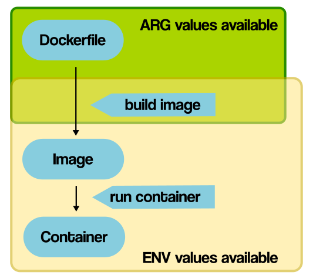

# 1. So sánh một số command trong Dockerfile

## ARG vs ENV

- **ARG** command khai báo một biến để sử dụng trong quá trình build docker image (build-time). Ví dụ: Có thể sử dụng ARG để chọn base image.
- **ENV** command khai báo biến môi trường để sử dụng trong lúc chạy của 1 container (runtime). Nếu 2 biến khai báo bằng ENV và ARG trùng tên thì Docker ưu tiên sử dụng ENV.

## COPY vs ADD
- **COPY**: Sử dụng để copy files hoặc directories từ `src` vào `dest` trong filesystem của image. Copy chỉ hỗ trợ thao tác copy cơ bản từ local files vào container.
- **ADD**: Copy files, directories hoặc các remote file (nếu có url) từ `src` và thêm vào filesystem của image ở `dest`
- [Dockerfile best practice](https://docs.docker.com/develop/develop-images/dockerfile_best-practices/#add-or-copy) khuyến nghị nên sử dụng **COPY** ở hầu hết các trường hợp. Use case tốt nhất của **ADD** là để sử dụng tính năng tự giải nén file để add vào image.
- Họ cũng khuyến nghị không nên sử dụng **ADD** để fetch packages từ remote url, thay vào đó, nên sử dụng `curl` hoặc `wget` để có thể xóa file sau khi cài đặt xong. 

## CMD vs ENTRYPOINT
- **ENTRYPOINT**: Xác định một command để luôn chạy khi container start.
- **CMD**: Có thể được sử dụng để cung cấp default flag cho main command tạo bởi **ENTRYPOINT**. Ngoài ra, **CMD** có thể được sử dụng để chạy software trong container. `CMD ["executable", "param1", "param2"…]`.
# 2. How many optimization tricks used in this Dockerfile?
```Dockerfile
# our base image
FROM alpine:3.5

# Install python and pip
RUN apk add --update py2-pip

# upgrade pip
RUN pip install --upgrade pip

# install Python modules needed by the Python app
COPY requirements.txt /usr/src/app/
RUN pip install --no-cache-dir -r /usr/src/app/requirements.txt

# copy files required for the app to run
COPY app.py /usr/src/app/
COPY templates/index.html /usr/src/app/templates/

# tell the port number the container should expose
EXPOSE 5000

# run the application
CMD ["python", "/usr/src/app/app.py"]
```

- Sử dụng Alpine base image để giảm kích thước image size.
- Ưu tiên cài đặt requirements ở những layer đầu để caching (do các dependency ít thay đổi hơn code)
- Sử dụng flag `--no-cache-dir` để không lưu cache trong sau khi cài đặt các dependencies.
# 3. Bài tập
**Đề bài: Xây dựng three-tier web app để hiển thị người tham gia khóa học trên trình duyệt sử dụng docker-compose.** 
**Base images**:
- nginx:1.22.0-alpine
- python:3.9
- mongo:5.0
## Mô hình 

### Presentation Tier
- Sử dụng nginx là một web server để serve trang giao diện.
- Xây dựng trang giao diện sử dụng html, css và javascript.
- Trang giao diện sẽ call API từ Logic Tier để hiển thị.
### Logic Tier
- Framework: Flask
- Database: Mongodb
- Sử dụng nginx làm reverse proxy cho server này.
### Data Tier
- Sử dụng mongodb là cơ sở dữ liệu cho ứng dụng.

## Xây dựng và triển khai

### Nginx
Nginx web server chạy trên port 8080
1. Viết nginx configuration file. 
```nginx
# nginx.conf

# https://docs.nginx.com/nginx/admin-guide/basic-functionality/managing-configuration-files/

user nobody; # a directive in the 'main' context

events{

}

http {
    # Configuration specific to HTTP and affecting all virtual servers  

    server {
        server_name _;
        listen 8080;
        listen [::]:8080;
        root /app;
        index index.html;
        # configuration of HTTP virtual server 1  
        location / {
            try_files $uri /index.html =404;
        }

        location /api/ {
            proxy_set_header Host $host;
            proxy_set_header X-Real-IP $remote_addr;
            proxy_pass http://python:5000/;
        }
    }
}
```
2. Viết Dockerfile cho Nginx
```Dockerfile
FROM nginx:1.22.0-alpine

WORKDIR /app

COPY index.html .

COPY nginx.conf /etc/nginx/nginx.conf
```
3. Build docker
```
docker build -t ducpa01/nginx-buddy
```

4. Push len Docker Hub

```
docker push ducpa01/nginx-buddy
```
### Flask App
1. Viết server code
```python
# app.py

from flask import Flask, jsonify
from flask_cors import CORS, cross_origin
import pymongo
import csv
import os

app = Flask(__name__)

# Enable CORS
## (some code here)

# Create connection
## (some code here)

# Seed data
## (some code here)

@app.route('/buddies')
@cross_origin()
def get_buddies():
    return list(buddies_collection.find({}, {'_id': 0}))


if __name__ == "__main__":
    app.run(host="0.0.0.0")

```
2. Viết dockerfile

```Dockerfile
FROM python:3.9-slim-buster

WORKDIR /app

COPY ./requirement_version.txt .

RUN pip install --no-cache-dir -r requirement_version.txt

COPY . .

EXPOSE 5000

CMD ["python", "/app/app.py"]
```
3. Build docker
```
docker build -t ducpa01/python-buddy
```

4. Push len Docker Hub

```
docker push ducpa01/python-buddy
```

### Docker-compose

```yml
version: "3.9"
services:

  python:
    container_name: python_buddy
    image: ducpa01/python-buddy
    ports:
      - 5000:5000
    environment:
      - DB_URI=mongodb://mongo:27017/
    depends_on:
      - mongo
  mongo:
    container_name: mongodb_buddy
    image: mongo:5.0
    restart: always
    ports:
      - 27017:27017
    volumes:
      - mongodb:/data/db
      - mongoconfig:/data/configdb
  nginx:
    container_name: nginx_buddy
    image: ducpa01/nginx-buddy
    ports:
      - 8080:8080

volumes:
  mongodb:
  mongoconfig:
```

### Giao dien web


# Tài liệu tham khảo
1. [Dockerfile Reference](https://docs.docker.com/engine/reference/builder)
2. [Ảnh so sánh ENV vs ARG](https://vsupalov.com/docker-arg-vs-env/)
3. [Best practices ADD or COPY](https://docs.docker.com/develop/develop-images/dockerfile_best-practices/#add-or-copy)
4. [CMD vs ENTRYPOINT](https://stackoverflow.com/questions/21553353/what-is-the-difference-between-cmd-and-entrypoint-in-a-dockerfile)
5. [Three-tier architecture from Amazon](https://docs.aws.amazon.com/whitepapers/latest/serverless-multi-tier-architectures-api-gateway-lambda/three-tier-architecture-overview.html)