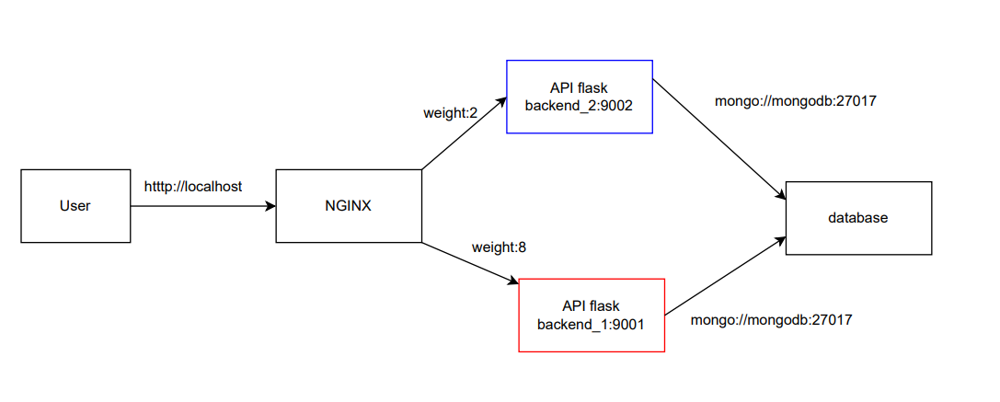
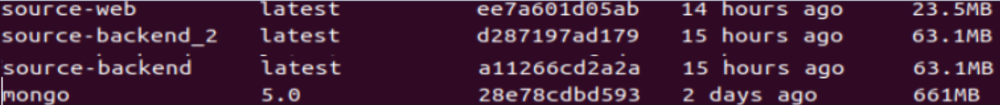
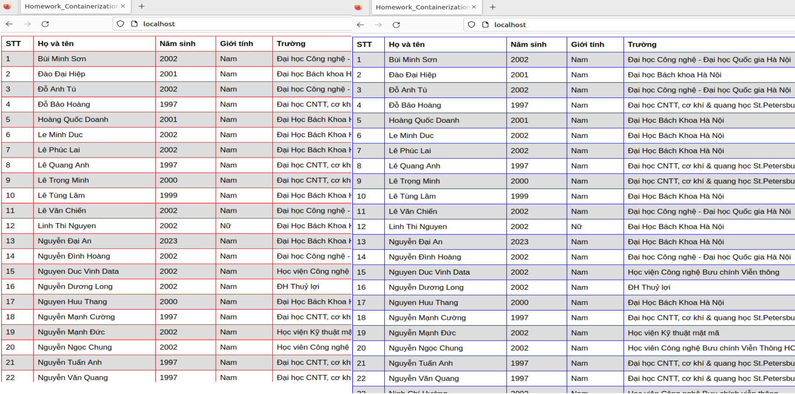

# **Viettel Digital Talent 2023 - Containerization**

## **Mục lục**


- ## [I. Overview](#Overview)
  - ### [1. Containerization](#containerization)
  - ### [2. Docker](#docker)
  - ### [3. Docker-compose](#compose)

- ## [II. Bài tập 1](#baitap1)
- ## [III. Bài tập 2](#baitap2)

- ## [Đánh giá kết quả](#danhgia)
- ## [Reference](#references)
---
## **I. Overview**
<a name='Overview'></a>

### **1.Containerization**
<a name='containerization'></a>

#### **Containerization là gì?**
- Containerization (hay Container hóa) là một quy trình **đóng gói** mã của ứng dụng cùng tất cả các tệp và thư viện cần thiết. Các gói phần mềm được gọi là `container`.
- Containerization là giải pháp ảo hoá, tự động hóa thế hệ mới kế tiếp sau Hypervisor Virtualization.
<div align="center">
  
</div>


#### **Lợi ích của Containerization:**
 Khác với cách truyền thống, để chạy các ứng dụng, bạn cần cài đặt phiên bản **phù hợp** với hệ điều hành trên máy tính của bạn. Còn với Containerization, bạn cần tạo  `container`, chạy trên tất cả các loại thiết bị và hệ điều hành. [1] 

Các những ưu điểm chính của containerization:
- Tính di dộng (Portability)
- Khả năng thay đổi quy mô (Scalability)
- Khả năng chịu lỗi cao (Fault tolerance)
- Linh hoạt (Agility)
- Bảo mật (Security)

#### **Containerization hoạt động như thế nào?**
 Containerization hoạt động bằng cách sử dụng một nền tảng containerization như Docker, Kubernetes hoặc rkt để tạo ra các container dựa trên hai công nghệ chính là `namespaces` và `cgroup`:
 - Namespaces là một cơ chế cho phép cô lập các tài nguyên hệ thống trong một container. Cụ thể, nó giúp container có thể có các tài nguyên hệ thống (`net`, `PID`, `users`) riêng biệt so với host và các container khác. Điều này đảm bảo rằng các container không tác động lẫn nhau và không tác động đến host.
- Cgroups (control groups) là một công nghệ cho phép giới hạn và quản lý tài nguyên hệ thống như (CPU, bộ nhớ, I/O) mà mỗi container sử dụng. Điều này đảm bảo rằng các container không sử dụng quá nhiều tài nguyên và gây ra tình trạng cạnh tranh tài nguyên trên host.

### **2. Docker**

<a name='docker'></a>

Docker là một nền tảng containerization phổ biến được sử dụng để đóng gói, triển khai và quản lý (package, deploy, manage) các ứng dụng trong các container.
 Docker là một bộ **platform as a service** (PAAS) sử dụng ảo hóa cấp độ OS để cung cấp phần mềm trong các container.
- **Note:**
Docker có thể chạy trên nhiều hệ điều hành: Linux, MacOS, Windows,.. . Tuy nhiên, có sự khác biệt trong việc sử dụng Docker trên các hệ điều hành này. Ví dụ, trên Linux, Docker sử dụng kernel Linux để quản lý các container, trong khi đó trên Windows và MacOS, Docker sử dụng một máy ảo `Hyper-V` để chạy các container. Do đó, một số tính năng của Docker có thể không hoạt động.
#### 2.1. Sơ lược về cấu trúc Docker 

<div align="center">
  
</div>

Kiến trúc cơ bản Docker bao gồm 3 phần chính:
- **Docker Host**: Docker host cung cấp một môi trường hoàn chỉnh và sẻ dụng **Docker daemon** để thực thi và chạy các ứng dụng. Nó quản lí các **Docker object**: **Images**, **Containers**, **Networks**, và **Storage**.
- **Docker Client**: Docker Client được sử dụng để kích hoạt các lệnh docker. Client gửi các lệnh( docker build, docker run, ..) đến **Dockerd daemon** để thực hiện các lệnh đó. 

  **Note**: Một docker clinet có thể giao tiếp với nhiều Deamon
- **Registry** : là kho lưu trữ và phân bổ các Docker images. Nơi bạn có thể tải xuống hợc lưu trũ các images của riêng mình.Theo mặc định, Docker sẽ tìm kiếm các images trên **DockerHub**.

**Một số khái niệm cơ bản khác**:
- **Docker Engine:** là thành phần chính của Docker, như một công cụ để đóng gói ứng dụng.

- **Images:** là một khuôn mẫu để tạo một container. Thường thì image sẽ dựa trên 1 image có sẵn với những tùy chỉnh thêm. Bạn có thể tự build một image riêng cho mình hoặc sử dụng những image được chia sẽ từ cộng đồng Docker Hub. Một image sẽ được build dựa trên những chỉ dẫn của Dockerfile.

- **Container:** là một instance của một image. Bạn có thể create, start, stop, move or delete container dựa trên Docker API hoặc Docker CLI.

- **Docker volumes** là một tính năng của Docker cho phép lưu trữ và quản lý dữ liệu trong các container của Docker. Các `volume` được lưu trữ ở nơi khác nhau so với các container, giúp giải quyết vấn đề về tính bất biến và đảm bảo rằng dữ liệu được lưu trữ vẫn tồn tại ngay cả khi container bị xóa hoặc khởi động lại.
- **Docker Networks:** là cơ chế mà thông qua đó các container thiết lập các kết nối `network`  với nhau và với các mạng bên ngoài.

- **Dockerfile:** là một tệp tin chứa các chỉ dẫn để build lên một image.

.

#### **2.2. Dockerfile và các instruciton**

<div align="center">
  
</div>

`Dockerfile` là file dạng text chứa tất cả các lệnh chỉ dẫn để tạo ra một `image`. Docker tạo ra các `image` bằng cách thưc hiện tuần tự các dòng lệnh trong `Dockerfile. 

**Các chỉ dẫn(instructions) trong Dockerfile:**
- `FROM`:
  ```Dockerfile
  FROM [--platform=<platform>] <image>[:<tag>] [AS <name>]
  ```
Chỉ thị `FROM` khai báo image cơ sở, gồm 2 phần tên và tag của image trên docker hub. Khi build image docker sẽ pull image cơ sở trên docker hub nếu máy tính chưa có image trên để khởi tạo image mới của bạn.

- `LABEL`: Dùng để khai báo thông tin metadata cho image theo dạng key-value.
  ```Dockerfile
  LABEL <key>=<value> <key>=<value> <key>=<value> ...
  ```
- `ARG` : Khai báo biến trong Dockerfile. Có thế dùng trong build-time để truyền vào flag `--build-arg <varname>=<value>` trong docker-build.
  ```Dockerfile
  ARG <name>[=<default value>]
  ```
- `ENV` : Thiết lập biến môi trường mà người dùng có thế dùng trong cả build-time và run-time.
  ```Dockerfile
  ENV <key>=<value> ...
  ```
- `WORKDIR` : Thiết lập đường dẫn đến tập làm việc cho `RUN, ENTRYPOINT, COPY, ADD, CMD` trong Dockerfile. `WORKDIIR` có thể dùng nhiều lần trong một Dockerfile, và các đường dẫn tương dối tiếp theo sẽ gắn vào sau đường dẫn trước.

  ```Dockerfile
  WORKDIR /path/to/workdir
  ```
- `USER` :  đặt tên user(hoặc UID) và tùy chọn group users (hoặc GID) sử dụng làm mặc định. User được chỉ định sẽ sử dụng cho các chỉ thị `RUN, ENTRYPOINT, CMD`.

  **Note** : Khi chỉ định user mà  không có group user thì image  sẽ được chạy với **group**  `root`.
  ```Dockerfile
  USER <user>[:<group>]
  ```
- `RUN`: Thực hiện bất kì lệnh nào trong layer mới phía trên top của `imeges`.
Có 2 dạng khai báo lệnh `RUN`:

  Shell form:
  ```Dockerfile
  RUN <command>
  ```
  Exec form:
  ```Dockerfile
  RUN ["executable", "param1", "param2"]
  ```
  - **Note** : Với exec form thì câu lệnh `RUN` viết như một JSON aray nên phải dùng dấu `"` không phải `'` . 

- `ENTRYPOINT` và `CMD`: Đều dùng để chỉ  định các lệnh sẽ chạy khi container bắt đầu chạy.
 Shell form:
  ```Dockerfile
  # Có 2 cách khai báo ENTRYPOINT
  #exec form
  ENTRYPOINT ["executable","param1","param2"]
  #shell form
  ENTRYPOINT command param1 param2

  # Có 3 cách khai báo CMD
  CMD ["executable","param1","param2"] (exec form, preferred form)
  CMD ["param1","param2"] (as default parameters to ENTRYPOINT)
  CMD command param1 param2 (shell form)
  ```
**Một số cách tối ưu và lưu ý khi viết Dockerfile**
- Sắp xếp layers để tận dụng cache: Đặt các layer **nặng** và **ít thay đổi** lên gần phái đầu; các layers hay thay đổi đặt phía cuối tránh **rebuilds** các layers không thay đổi.
- Xây dựng các layers nhỏ:
   - Tránh truyền các file không cần thiết: sử dụng file .dockerignore
   - Sử dụng các package manager một cách thông minh: chỉ install các gói mà container cần.
- Giảm số lượng layer: 
  - Sử dụng các images tích hợp: có thể sử dụng các imaeges từ bên thứ ba mà có đủ chức năng bạn cần.
  - Sử dụng multi-stage builds.
  - Kết hợp các commands nếu có thể: viết nhiều lệnh vào trong một chỉ thị `RUN`; nếu có thể hãy viết 2 lệnh `CMD` vào `ENTRYPOINT` vào một lệnh `ENTRYPOINT` duy nhất.

Ngoài ra nên sử dụng các tag phiên bản cho image, điều này khiến các image cụ thể hơn và dễ quản lí hơn. Tránh khi các images từ registry được update  thì xảy ra lỗi.

### **3. Docker-compose**
<a name='compose'></a>

Docker compose là công cụ dùng để định nghĩa và run multi-container cho Docker application. Với compose bạn sử dụng file YAML để config các services cho application của bạn. Sau đó dùng command để create và run từ những config đó. Cuối cùng, với một câu lệnh, chúng ta sẽ create và start tất cả service từ các thiết lập đó.

<div align="center">
  
</div>

**Những ưu điểm của Docker-compose:**

- **Tạo ra nhiều môi trường độc lập (isolated environments) trong một host:** Compose cô lập môi trường của các container để đảm bảo chúng không bị xung đột lẫn nhau, cũng như dễ dàng tạo những bản sao của một môi trường nào đó.

- **Chỉ tạo lại các container đã thay đổi:** Compose sẽ nhận biết được các service chưa thay đổi và sử dụng lại các container tương ứng với service đó.

- **Điều chỉnh các biến sử dụng cho các môi trường:** Compose sử dụng các biến trong Compose file cho các môi trường. Vì vậy với môi trường hay người dùng khác nhau, có thể điều chỉnh các biến khi sử dụng Compose để thiết lập các service.
- **Quản lí tất cả các container sử dụng một file `docker-compose.yml` duy nhất**
- **Quản lí các volumes và networks một cách tự động**


## **II. Bài tập 1**
<a name='baitap1'></a>

*What are the differences between these instruction?*

  - ARG vs ENV

  - COPY vs ADD

  - CMD vs ENTRYPOINT

### **1. ARG vs ENV**

- `ARG`: Chỉ khả dụng trong **build-time**, không thể sử dụng trong **run-time** khi image đã được tạo ra. **Có thể** ghi đè trong build-time với flag `--build-arg`.

- `ENV`: Là các giá trị ENV có sẵn trong container, nhưng cũng có thể các lệnh RUN được chạy trong quá trình Docker build. Và giá trị của các biến `ENV` **không thể** ghi đè **trực tiếp** trong build-time.

<div align="center">
  
</div>

### **2. COPY vs ADD**

`COPY`giống như `ADD` cho phép bạn copy một local file hoặc trực tiếp từ local host tới Docker Images. Nhưng : 

  - `COPY`: Hỗ trọ sao chép file từ  một stage hoặc remote image sang stage khác trong multi-stage builds  với flag --from.  ví dụ:
    ```Dockerfile
    FROM … AS build1
    COPY –from=build1 . /bin/
    ```

  - `ADD`: 
    - Có thể tải xuống file sử dụng URL.
    - Cho phép giải nén một file tar từ source(từ localfile hoặc URL) một cách trực tiếp đến destination.


**Note:** Nếu thực hiện copy local files tới Docker image thì nên sử dụng COPY bởi vì nó tường minh hơn so với ADD.

### **3. CMD vs ENTRYPOINT**

 Về cơ bản: Cả hai lệnh xác định command nào sẽ được thực thi khi khởi chạy container. Dockerfile có thể khởi tạo thì cần ít nhất một trong hai chỉ dẫn `CMD` hoặc `ENTRYPOINT`. Và nếu chỉ có một trong chỉ dẫn này thì kết  của chúng như nhau.
  
  - `CMD`: đặt các tham số mặc định có thể được ghi đè từ Docker CLI khi container chạy. Các tham số này sẽ bị ghi đè bới `arg` nếu chạy `docker run arg` với tham số tùy chọn. 

  - `ENTRYPOINT` : 
    - Nếu khai báo `ENTRYPOINT` ở **exec** form, thì các tham số của `CMD`  sẽ **chèn** vào sau tham số của `ENTRYPOINT`.

       Note: Ta có thể sử dùng cách khai báo này, khi đó `ENTRYPOINT` dùng để định nghĩa lệnh thực hiện,còn `CMD` định nghĩa tham số.
    - Nếu khai báo `ENTRYPOINT` ở **shell** form, thì các tham số của `CMD`  sẽ **không** được chèn vào.
    - `ENTRYPOINT` khi cần ghi đè từ dòng lệnh khi chạy `docker run` cần sử dụng flag `--entrypoint`:
    ```Dockerfile
      docker run --entrypoint ...
    ```
    - Nếu khai báo nhiều lần trong Dockerfile thì chỉ `ENTRYPOINT`  cuối được thực hiện.
    
Bảng bên dưới hiển thị lệnh nào được thực thi cho các tổ hợp `ENTRYPOINT` và `CMD`:
<div align="center">
  
</div>

## **III. Bài tập 2**
<a name='baitap2'></a>

Set up a three-tier web application that displays the course attendees' information on the browser using docker-compose.

- **Base images**
  
  - *nginx:1.22.0-alpine*
  
  - *python:3.9*
  
  - *mongo:5.0*

### 1.Tổng quan
- Mô hình trực quan
  <div align="center">
    
  </div>
- Hệ thống được triển khai sử dụng docker, docker-compose.
- Cấu trúc practice sau khi hoàn thành:
<div align="center">
  
</div>

### 2. Cài đặt
#### 2.1. Cấu hình flask API
- API framework `Flask` của Python, sử dụng image python:3.9-alpine3.17 nhằm tối ưu dung lượng image
- Thư viện đính kèm `requirements.txt`. Tận dụng các thư mục build-in trong python nhằm giải quyết bài toán nhưng vẫn đảm bảo không install thêm quá nhiều thư viện bên ngoài và tăng dung lượng image. 

  **Note:** nên ghi các version cụ thể cho các thư viện tránh khi có update thì máy sẽ install phiên bản mới nhất và có thể xảy ra lỗi.
```
flask==2.3.1
pymongo==4.3.3
```

- `server.py`

```python
import os

from flask import Flask, render_template
from pymongo import MongoClient
from init_db import insert_db

app = Flask(__name__)

DATABASE_NAME  = 'VDT23'
DATABASE_HOST  = 'data_tier'
client = MongoClient(DATABASE_HOST)
db = client[DATABASE_NAME]

@app.route('/')
def todo():
    try:
        client.admin.command('ismaster')
        students = list(db.attendees.find({}))
        return render_template('index.html', data= students, border_color=os.environ.get("BORDER_COLOR"))
    except:
        return "Server not available"

if __name__ == "__main__":
    insert_db('static/attendees.csv', db.attendees)
    app.run(host='0.0.0.0', port=os.environ.get("FLASK_SERVER_PORT"), debug=True)
```

- `Dockerfile`. Dùng image python:3.9-alpine3.17 sẽ nhỏ hơn python3.9 mặc định.
Sử dụng 2 lệnh `COPY` lần lượt nhằm tận dụng cache khi install `requirements.txt` vì bước install nặng và ít thay đổi nên cần được đưa lên trên. Còn các file source thường được thay đổi nên được `COPY` một lần nữa và đưa xuống dưới.
  ```Dockerfile
  FROM python:3.9-alpine3.17

  WORKDIR /src

  COPY requirements.txt .
  RUN --mount=type=cache,target=/root/.cache/pip \
      pip3 install -r requirements.txt

  COPY . .
  ENTRYPOINT ["python3", "server.py"]

  ```

#### **2.1. Cấu hình cho Nginx**
- Frontend sử dụng Nginx với image base: nginx:1.22.0-alpine làm **hai** nhiệm vụ:
  - Proxy server: chuyển tiếp các yêu cầu nội dung từ nhiều máy khách đến các máy chủ
  - Load balancing: Phân phối các yêu cầu tới các máy chủ khác nhau nhắm ngăn  việc một số máy chủ có thể bị quá tải. Trong trường hợp một máy chủ bị lỗi hoàn toàn thì các máy chủ khác cũng có thể xử lý lưu lượng.

- `Dockerfile`
  ```Dockerfile
  FROM nginx:1.22.0-alpine

  ENV FLASK_SERVER_ADDR_1=backend_1:9001
  ENV FLASK_SERVER_ADDR_2=backend_2:9002

  COPY ./nginx.conf /tmp/nginx.conf

  CMD ["/bin/sh", "-c", "envsubst < /tmp/nginx.conf > /etc/nginx/conf.d/default.conf && nginx -g 'daemon off;'"]
  ```

- `nginx.conf`
  ```
  upstream loadbalancer {
    server $FLASK_SERVER_ADDR_1 weight=8;
    server $FLASK_SERVER_ADDR_2 weight=2;
  }
  server {
    listen 80;
    location / {
      proxy_pass http://loadbalancer;
    }
  }
  ```
  Ở đây ta thấy, `nginx` trỏ đến 2 backend khác nhau với weight lần lượt là 8 và 2. Các biến mỗi trường `FLASK_SERVER_ADDR` được truyền vào nginx.conf nhằm khai báo địa chỉ và port của backend thông qua  dòng lệnh : 
  ```Dockefile 
  CMD "/bin/sh", "-c", "envsubst < /tmp/nginx.conf > /etc/nginx/conf.d/default.conf
  ```
  Vì trong alpine không có **bash** nên cần dùng lệnh `/bin/sh`.

  Như vậy nginx đã đảm bảo phân phối request đến 2 backend.


#### **2.3. Database**
- Do việc sử dụng mongodb không quá phức tạp nên nên ta sử dụng trực tiếp image base mongodb:5.0 và ghi vào docker-compose.

#### **2.4. docker-compose**
  - `docker-compose.yml`
    ```yml
    version: '3.9'

    services:
      web:
        container_name: presentation_tier
        build:
          context: nginx
        ports:
          - 80:80
        depends_on:
          - backend_1
          - backend_2

      backend_1:
        container_name: logic_tier_1
        build:
          context: flask
        environment:
          - FLASK_SERVER_PORT=9001
          - BORDER_COLOR=red
        volumes:
          - /var/run/docker.sock:/var/run/docker.sock
        depends_on:
          - mongo

      backend_2:
        container_name: logic_tier_2
        build:
          context: flask
        environment:
          - FLASK_SERVER_PORT=9002
          - BORDER_COLOR=blue
        volumes:
          - /var/run/docker.sock:/var/run/docker.sock
        depends_on:
          - mongo

      mongo:
        image: mongo:5.0
        container_name: data_tier
        volumes:
          - .docker/data/db:/data/db

      ```

## Đánh giá kết quả
- Thông số các image base:
    <div align="center">
      
    </div>
- Dung lượng của image python sau khi build đã tăng lên khoảng 10Mb. Do đối với API, ta cần cài thêm các packet từ python flask và pymongo để có thể sử dụng. Dung lượng của `nginx` hầu như không đổi.

- Kểt quả: Nginx trỏ tới backend_1 và backend_2 tướng ứng với màu đỏ và xanh với tỉ lệ 8/2 (khai báo bắng weight trong `ngin.conf`)
    <div align="center">
      
    </div>


## References
<a name='references'></a>
 - [1] <https://github.com/PauGa9/flask-mongodb-nginx-docker>
 - [2] <https://viblo.asia/p/dockerfile-references-3P0lPkmpZox>
 - [3] <http://nginx.org/en/docs/http/load_balancing.html>
 - [4] <https://docs.docker.com/engine/reference/builder/>