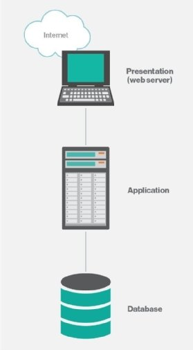
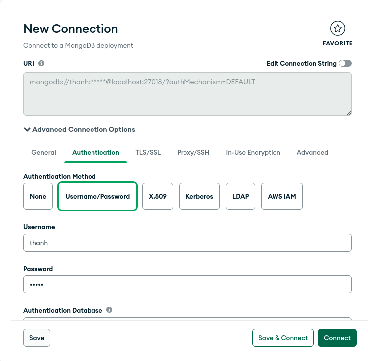
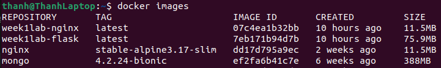
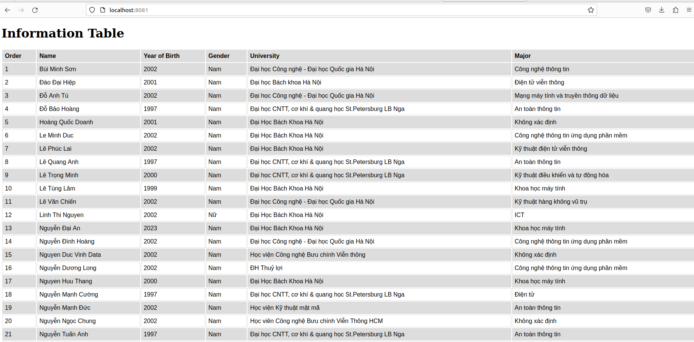
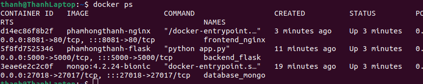

# TABLE OF CONTENT

- [TABLE OF CONTENT](#table-of-content)
- [1. PHÂN BIỆT CÁC INSTRUCTION](#1-phân-biệt-các-instruction)
  - [1.1. ARG vs ENV](#11-arg-vs-env)
  - [1.2. COPY vs ADD](#12-copy-vs-add)
  - [1.3. CMD vs ENTRYPOINT](#13-cmd-vs-entrypoint)
- [2. Áp dụng docker vào kiến trúc 3 lớp cho web](#2-áp-dụng-docker-vào-kiến-trúc-3-lớp-cho-web)
  - [2.1. Tổng quan kiến thức](#21-tổng-quan-kiến-thức)
    - [Three-tier architecture (Kiến trúc ba lớp)](#three-tier-architecture-kiến-trúc-ba-lớp)
    - [Docker](#docker)
  - [2.2. Luồng phát triển](#22-luồng-phát-triển)
    - [Công nghệ dùng để phát triển](#công-nghệ-dùng-để-phát-triển)
  - [2.3. Xử lí Database](#23-xử-lí-database)
  - [2.4. Xử lí Backend](#24-xử-lí-backend)
    - [**Tạo Web bằng Flask**](#tạo-web-bằng-flask)
    - [**Tạo Dockerfile chuẩn bị cho deploy**](#tạo-dockerfile-chuẩn-bị-cho-deploy)
  - [2.5. Xử lí Frontend](#25-xử-lí-frontend)
    - [**Xử lí frontend**](#xử-lí-frontend)
    - [**Tạo Dockerfile chuẩn bị cho deploy**](#tạo-dockerfile-chuẩn-bị-cho-deploy-1)
  - [2.6. Deploy 3 services](#26-deploy-3-services)
- [TÀI LIỆU THAM KHẢO](#tài-liệu-tham-khảo)

# 1. PHÂN BIỆT CÁC INSTRUCTION

## 1.1. ARG vs ENV  
**Arg** và **Env** đều được sử dụng để define các biến trong Docker. Tuy nhiên **Arg** được dùng để define các biến sử dụng khi build image từ Dockerfile và sau đó sẽ không dùng nữa. Chúng ta cũng có thể thay đổi giá trị các biến **Arg** từ tag --build-arg. **Env** được sử dụng khi chạy container và chúng ta không thể thay đổi giá trị các biến này sau khi đã khai báo trong Dockerfile.

## 1.2. COPY vs ADD
Cả hai câu lệnh này đều giúp chúng ta copy file từ host sang container. **Add** gần như là một bản extension của **Copy** khi hỗ trợ cả extract file tar và fetch data từ url. Do đó **Add** cũng có độ phức tạp và tốn nhiều tài nguyên hơn **Copy**. Chính vì thế nếu ta chỉ cần copy những file đơn giản thì hãy dùng **Copy** để tối ưu hóa tài nguyên. 

## 1.3. CMD vs ENTRYPOINT
Cả hai câu lệnh đều dùng để xác định chương trình mà ta muốn execute khi sử dụng docker run. Tuy vậy khi khái báo biến trong **Cmd**, biến đó sẽ là biến default và có thể bị override khi ta chạy docker run ở terminal. Còn khi chạy docker run và khai báo thêm biến, **Entrypoint** sẽ không override biến được khai báo ở Dockerfile mà sẽ append biến ở docker run vào biến trong Dockerfile

# 2. Áp dụng docker vào kiến trúc 3 lớp cho web

## 2.1. Tổng quan kiến thức

### Three-tier architecture (Kiến trúc ba lớp)
Kiến trúc 3-tier gồm có 3 tier chính: Presentation, Application, Data.

- **Presentation tier**: trong phát triển web, tier tương ứng với frontend. Đây là nơi giao tiếp trực tiếp với người dùng, xử lí một vài logic business nhỏ và chuyển tiếp những request khác xuống tier dưới. Trong bài này, ta sẽ dùng HTML, CSS và JS để phát triển và deploy trên một NGINX server. Ngoài việc serve các content file cho client, NGINX server cũng sẽ truyền request từ client xuống backend để xử lí tiếp.
- **Application tier**: tier này tương ứng với backend. Nó nhận request từ tier trên và lấy thông tin từ data tier để xử lí phần lớn business login. Ta sẽ dùng Flask (framework của Python) để phát triển tier này.
- **Data tier**: tier này tương ứng với database. Đây là nơi lưu trữ và xử lí dữ liệu. Ta sẽ dùng Mongodb.  
  
### Docker
Docker là một công nghệ giúp chúng ta đóng gói phần mềm vào những **container**. Những container này chỉ chứa đúng lượng resource vừa đủ để chạy phần mềm. Như vậy, chúng ta có thể build, test và deploy ứng dụng một cách dễ dàng hơn.


## 2.2. Luồng phát triển
### Công nghệ dùng để phát triển
* Ubuntu version 22.04 LTS
* Docker version 23.0.5
* Python 3
* Mongo Compass 1.35.0
* VSCode IDE  
  
Structure:

```bash
├── flask
│   ├── app.py
│   │   ├── **/*.css
│   ├── Dockerfile
│   ├── requirements.txt
├── images
│   ├── ...      
├── nginx
│   ├── index.html
│   ├── nginx.conf
│   ├── Dockerfile
│   ├── js
│   │   ├── script.js
├── attendees.json
├── docker-compose.yml
├── README.md
```
## 2.3. Xử lí Database

Ta sử dụng MongoDB để xử lí database tier. Vì database cần xử lí đơn giản nên ta sẽ không viết Dockerfile cho database mà viết thẳng vào trong docker-compose.yml

Để tối ưu hóa resource, ta sử dụng image mongo:4.2.24-bionic.
```
        image: mongo:4.2.24-bionic
```
Ta đặt các biến để khởi tạo database và credentials:
```
        environment:
                        - MONGO_INITDB_DATABASE=vdt23
                        - MONGO_INITDB_ROOT_USERNAME=thanh
                        - MONGO_INITDB_ROOT_PASSWORD=thanh
```
Config lại port cho mongodb server khi trong container khi expose vì mongodb trong máy chủ đã sử dụng default port rồi. Code sẽ giống thế này:
```Docker 
        mongodb:
                image: mongo:4.2.24-bionic
                container_name: database_mongo
                environment:
                        - MONGO_INITDB_DATABASE=vdt23
                        - MONGO_INITDB_ROOT_USERNAME=thanh
                        - MONGO_INITDB_ROOT_PASSWORD=thanh
                ports:
                        - "27018:27017"
```

Với dữ liệu có sẵn, ta convert từ dạng xlsx sang json rồi import vào database bằng MongoDB Compass  

Tuy nhiên, đây là cách làm rất thủ công, chúng ta có thể import một cách tự động bằng những ý tưởng khác. Một ý tưởng em nghĩ đến là sử dụng Entrypoint để import vào ngay khi khởi tạo nhưng em chưa tìm ra cách làm đúng.
## 2.4. Xử lí Backend

### **Tạo Web bằng Flask**
Ta sử dụng Python framework có tên là Flask để phát triển phần backend. Vì phần backend cũng rất đơn giản (chỉ cần lấy dữ liệu để frontend hiển thị) nên ta chỉ cần viết một api duy nhất. Có một lưu ý nhỏ là tuy chúng ta sẽ expose database ở port 27018 trên máy chủ, ta vẫn sẽ connect tới port 27017 của database container vì 2 service đều nằm trên cùng network riêng của Docker.

``` Python
from flask import Flask
import pymongo
from bson.json_util import dumps

client = pymongo.MongoClient('mongodb://mongodb:27017/', username='thanh', password='thanh')
db = client["vdt23"]
collection = db['attendee']

app = Flask(__name__)

@app.route('/attendees', methods = ['GET'])
def get_attendee():
    att_list = []
    for att in collection.find():
        att_list.append(att)
    return dumps(att_list)

if __name__ == '__main__':
    app.run(host='0.0.0.0', port=5000)

```

### **Tạo Dockerfile chuẩn bị cho deploy**

Ta sử dụng base image là python:3.10.6-alpine để tối ưu hóa resource. Đồng thời, ta tạo directory app để chứa các file cần thiết.
```
        FROM python:3.10.6-alpine
        WORKDIR /app
```
       
Ta update pip trước khi copy và install các thư viện cần thiết vào image. **--no-cache-dir** tag được dùng để  giữ image nhỏ nhất có thể.
```
        
        RUN pip install --upgrade pip
        COPY ./requirements.txt .
        RUN pip install --no-cache-dir -r requirements.txt
        
```
Cuối cùng là copy source code và chạy flask web
```
       COPY ./app.py .
        CMD ["python", "app.py"]
```

## 2.5. Xử lí Frontend  
### **Xử lí frontend**  
Sử dụng lệnh Fetch đơn giản để xử lí dữ liệu từ backend:
```js
fetch("/attendees")
.then(res => {
    return res.json();
})
.then(attendees => {
    let placeholder = document.querySelector("#attData");
    let out = "";
    attendees.forEach(attendee => {
        if(attendee["Chuyên ngành"] == "NULL") attendee["Chuyên ngành"] = 'Không xác định';
        out += `
            <tr>
                <td> ${attendee.STT}</td>
                <td> ${attendee["Họ và tên"]}</td>
                <td> ${attendee["Năm sinh"]}</td>
                <td> ${attendee["Giới tính"]}</td>
                <td> ${attendee["Trường"]}</td>
                <td> ${attendee["Chuyên ngành"]}</td>
            </tr>
        `
    })
    placeholder.innerHTML = out;
})
.catch(error => console.log(error));
```
NGINX được dùng để serve static content lên web browser của client. Đồng thời cũng hoạt động như một proxy server để truyền request xuống backend web. 

```nginx
        server {
                listen 80;
        
                location / {
                        root /usr/share/nginx/html;
                        proxy_pass http://flask-app:5000/;
                }

                location /js/ {
                        root /usr/share/nginx/html/;
                }
        }
```

Domain của backend được sử dụng trong proxy pas là tên của service đó trong network của 3 service. Được hiện thị ở attribute aliases.  
### **Tạo Dockerfile chuẩn bị cho deploy**  
Ta sử dụng base image nhỏ của nginx để image có size không quá lớn. Sau đó copy file cần thiết vào như default setting của NGINX
```dọcker

        FROM nginx:stable-alpine3.17-slim

        COPY ./nginx.conf /etc/nginx/conf.d/default.conf
        COPY ./index.html /usr/share/nginx/html/index.html
        RUN mkdir /usr/share/nginx/html/js/
        COPY ./js/script.js /usr/share/nginx/html/js/script.js
```
## 2.6. Deploy 3 services  
Ta sẽ deploy 3 service trên bằng một file docker-compose.yml duy nhất. Để build image của frontend và backend, ta chỉ cần gán attribute sau:

Đối với service mongdb, ta chỉ cần sử dụng Dockerfile để build:
```docker
        flask:
                build: ./flask
```
Ta có thể thêm trường depends_on vào những service phụ thuộc: frontend cần khởi tạo sau khi backend đẫ khởi tạo thành công. Backend cần khởi tạo sau database.
```
        depends_on:
                - mongodb
Ta có thể cấu hình expose port trên máy chủ bằng trường ports. Đồng thời cấu hình network riêng cho 3 service. Khi đó, docker sẽ tạo ra một network riêng biệt cho 3 service thay vì để chúng vào network default.
File docker-compose.yml đầy đủ:
```docker
version: '3.8'
services:
  mongodb:
    image: mongo:4.2.24-bionic
    container_name: database_mongo
    environment:
      - MONGO_INITDB_DATABASE=vdt23
      - MONGO_INITDB_ROOT_USERNAME=thanh
      - MONGO_INITDB_ROOT_PASSWORD=thanh
    ports:
      - "27018:27017"
    networks:
      my_network:
        aliases:
          - mongodb
  flask:
    build: ./flask
    container_name: backend_flask
    depends_on:
      - mongodb
    ports:
      - 5000:5000
    networks:
      my_network:
        aliases:
          - flask-app
  nginx:
    build: ./nginx
    container_name: frontend_nginx
    depends_on:
      - flask
    ports:
      - 8081:80
    networks:
      - my_network
networks:
  my_network:
```
3 Docker Image với size khá hợp lí:



Chạy các container bằng docker-compose up --build và truy cập




Như vậy, ta đã deploy thành công project.

# TÀI LIỆU THAM KHẢO

- https://docs.docker.com/
- https://www.mongodb.com/docs/
- http://nginx.org/en/docs/
- https://dev.to/ishankhare07/nginx-as-reverse-proxy-for-a-flask-app-using-docker-3ajg