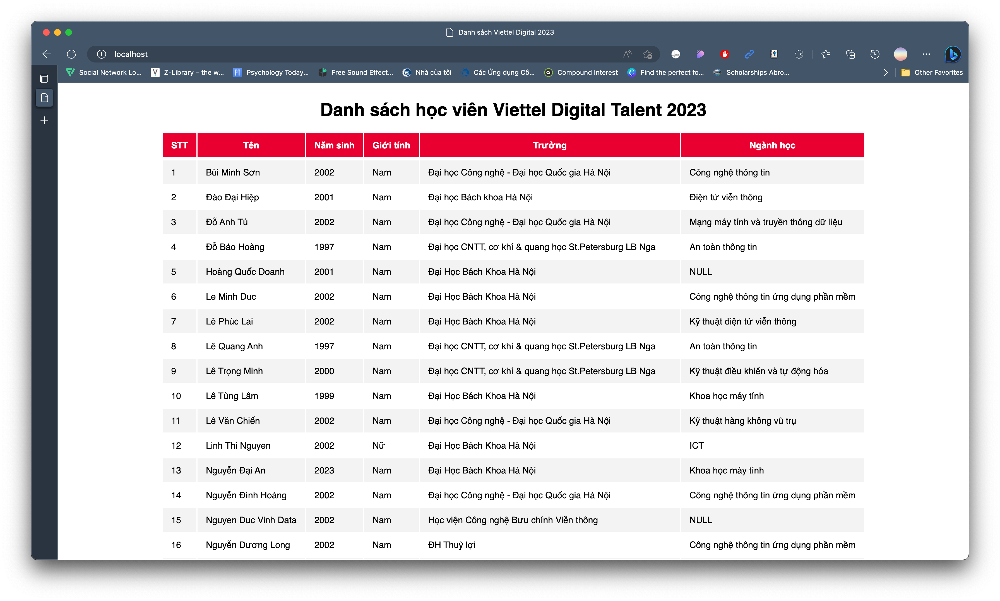

# Containerization

## **Answer Questions**

> **Q: What are the differences between these instructions?**
>
> &nbsp;&nbsp;&nbsp;&nbsp;&nbsp;&nbsp;**ARG** vs **ENV**
>
> &nbsp;&nbsp;&nbsp;&nbsp;&nbsp;&nbsp;**COPY** vs **ADD**
>
> &nbsp;&nbsp;&nbsp;&nbsp;&nbsp;&nbsp;**CMD** vs **ENTRYPOINT**

### **ARG** vs **ENV**

- **ARG**

* **ENV** sets default values for environment variables that will be used in the future. Environment variables can be accessed by applications running in Docker, which makes them an excellent way to pass configuration values to your project.

* **ARG** values are not accessible once the image is built, meaning that a running container will not be able to access an ARG variable value.

### **COPY** vs **ADD**

- **COPY** is more transparent than **ADD**. This instruction only supports the basic copying of local files into the container. It takes in a source and destination. It only lets you copy in a local or directory from your host (the machine-building the Docker image) into the Docker image itself.

- **ADD** does the same but has some features (like local-only tar extraction and remote URL support). Consequently, the best use for **ADD** is local tar file auto-extraction into the image.

### **CMD** and **ENTRYPOINT**

- **CMD** should be used to run the software contained in the image, along with any arguments. It sets default parameters that can be overridden from the Docker command line interface (CLI) while running a docker container.

- **ENTRYPOINT** set the image’s main command, allowing that image to be run as though it was that command, and then use **CMD** as the default flags. It sets default parameters that cannot be overridden while executing Docker containers with CLI parameters.

---

## **Three-tier web application**

> Set up a three-tier web application that displays the course's attendees' information on the browser using docker-compose
>
> &nbsp;&nbsp;&nbsp;&nbsp;**nginx:1.22.0-alpine**
>
> &nbsp;&nbsp;&nbsp;&nbsp;**python:3.9**
>
> &nbsp;&nbsp;&nbsp;&nbsp;**mongodb:5.0**

### **1. Logic tier**

Initializing and seeding database with existing `attendees.json` file:

```javascript
db = db.getSiblingDB("VDT2023");
db.attendees.drop();

const data = cat("/docker-entrypoint-initdb.d/attendees.json");

db.attendees.insertMany(JSON.parse(data));
```

Create simple backend HTTP API to get list attendees from `mongodb` using `python` script:

```python
def get_database(name):
   pass

class APIHandler(BaseHTTPRequestHandler):
    def do_GET(self):
        pass
    def end_headers (self):
        pass

if __name__ == "__main__":
    print('begin..')
    httpd = HTTPServer(('0.0.0.0', 8000), APIHandler)
    print('Backend running...')
    httpd.serve_forever()
```

Write a Dockerfile to build image:

```dockerfile
FROM python:3.9

WORKDIR /app

COPY requirements.txt requirements.txt

RUN pip3 install -r requirements.txt

COPY . .

EXPOSE 8000

CMD [ "python3", "-u", "/app/app.py"]
```

### **2. Presentation Tier**

First, I configured the NGINX as below to allow the traffic to be able to redirect to suitable resource:

```
server {
 listen 80;
 server_name frontend;
 location / {
   root /app;
   try_files $uri /index.html;
 }

 location /api {
   proxy_set_header X-Real-IP $remote_addr;
   proxy_set_header X-Forwarded-For $proxy_add_x_forwarded_for;
   proxy_set_header X-NginX-Proxy true;
   proxy_pass http://backend:8000/api;
   proxy_ssl_session_reuse off;
   proxy_set_header Host $http_host;
   proxy_cache_bypass $http_upgrade;
   proxy_redirect off;
 }
}
```

- **The server block** listens directive then informs NGINX of the hostname/IP and TCP port, so it recognizes where it must listen for HTTP connections. In my app, I set `80` as the listen port.
- **The location block** assists us in setting up the way in which NGINX responds to requests for resources inside the server. Location directives apply to requests for certain endpoints.

Next, I set up a `Dockerfile` to set up those configurations above:

```dockerfile
FROM nginx:1.22.0-alpine

WORKDIR /app

RUN rm /etc/nginx/conf.d/default.conf

COPY nginx/nginx.conf /etc/nginx/conf.d/default.conf

COPY . .
```

In this `Dockerfile`, I pull the `nginx:1.22.0-alpine` to comply with the requirement, choose `/app` as my working direction, and remove the default configuration file of NGINX and replaces it with my configuration file.

### **3. Data Tier**

I import the `attendees.json` which contains the attendees' information to `mongodb`.

### **4. Docker Compose**

The `docker-compose.yaml` has three services:

- `backend`
- `frontend`
- `mongodb`

```yaml
version: "3.8"

services:
  backend:
    image: backend:latest
    container_name: backend
    depends_on:
      - mongodb
    networks:
      - db
      - app

  mongodb:
    image: mongo:5.0.0
    container_name: mongo
    restart: unless-stopped
    environment:
      MONGO_INITDB_ROOT_USERNAME: kilinh
      MONGO_INITDB_ROOT_PASSWORD: Linh2812
      MONGO_INITDB_DATABASE: VDT2023
    networks:
      - db
    volumes:
      - ./data:/docker-entrypoint-initdb.d

  frontend:
    image: frontend:latest
    container_name: frontend
    ports:
      - 80:80
    networks:
      - app
    depends_on:
      - backend

networks:
  app:
    driver: bridge
  db:
    driver: bridge
```

Finally, we can run the web application by the command:

```
docker-compose up -d
```

After running successfully, we can browse `http://localhost/` and get this result:

