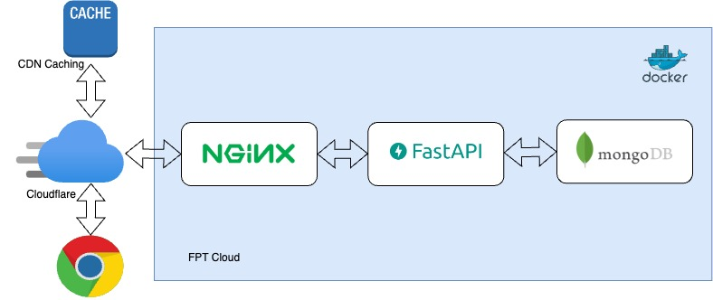

### Part 1: Question about Docker

#### Docker instructions:

- `FROM`: specifies the base image to build upon.

- `RUN`: executes a command inside the container during the build process.

- `CMD`: specifies the default command to run when a container is started.

- `COPY`: copies files or directories from the host machine to the container.

- `ADD`: similar to COPY, but can also handle URLs and automatically unpack compressed archives.

- `EXPOSE`: documents which ports are exposed by the container.

- `ENV`: sets environment variables inside the container.

- `WORKDIR`: sets the working directory for subsequent instructions.

- `USER`: sets the user for subsequent instructions.

- `VOLUME`: creates a mount point for a volume.

- `ARG`: defines a build-time argument to be passed to the Dockerfile.

- `LABEL`: adds metadata to the image.

#### Q: What are the differences between these instructions?

- `ARG` vs `ENV`:

    - `ARG` is used to pass build-time variables to Docker. You can use ARG to set variables that are only available during the build process and are not persisted in the final image.

    - `ENV`, on the other hand, is used to set environment variables in the running container. Environment variables set using ENV are persisted in the final image and can be accessed by any process running inside the container. 

- `COPY` vs `ADD`: 
    - `COPY`: copies files or directories from the host machine to the container.

    - `ADD`: similar to COPY, but can also handle URLs and automatically unpack compressed archives.

- `CMD` vs `ENTRYPOINT`:
    - `CMD` sets default command and/or parameters, which can be overwritten from command line when docker container runs.

    - `ENTRYPOINT` command and parameters will not be overwritten from command line. Instead, all command line arguments will be added after `ENTRYPOINT` parameters.

### Part 2: Student attention Backend application

Base on FastAPI, the application build on asynchronously mechanism that offer higher performance I/O operations.

With FastAPI asynchronous, requests can be handled in a non-blocking manner, which means that the server can handle multiple requests at the same time without waiting for each request to finish before moving on to the next one. This can lead to better resource utilization and higher throughput compared to synchronous frameworks like Flask, which process requests sequentially.

In our example, the static 3-tier application base on I/O operations from MongoDB can improve performance significantly with FastAPI.


- Server host in: https://api.viettelcloud.site/ 

- Visited Swagger site: https://api.viettelcloud.site/docs



### Base components
The application is 3-tier components:
 - FastAPI
 - MongoDB
 - Nginx

I also offer to use Jaeger for tracing and distributed logging with EFK(not implemented yet).

### What we're doing

- Buy a domain from tenten.vn
- Rend a server from FPT Cloud
- Connect DNS from Cloudflare
- Seft host 3-tier application on FPT server
- Configure SSL certificate to secure connection

### How to use

Configuration the enviroment on `.env` file

Start the application: 

```
docker-compose run -d
```

Please use the following URL: `http://localhost:8080\docs`

### Contribute

Feel free to contribute with me!!!