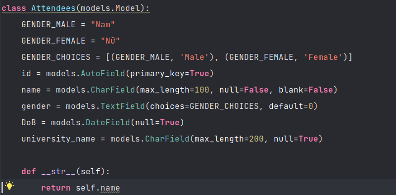

## Bài tập containerization

*Người thực hiện: Trần Mạnh Dũng*

1. **So sánh các tham số được sử dụng trong *Dockerfile***

    1.1 ARG vs ENV
   - Tham số ARG có tính khả dụng trong quá trình build image và sẽ không còn tác dụng khi image đã được build xong.
   - Các containers đang chạy thì sẽ không thể truy cập vào các tham số ARG để lấy giá trị.
   - VD về ARG: giá trị version Ubuntu hay version của thư viện sử dụng để build image (base image)
   - Độ khả dụng của tham số ENV rộng hơn so với ARG. Cụ thể, không chỉ dùng trong quá trình build image mà còn dùng trong quá trình đang chạy container (tức là cả khi image đã được build xong và chạy container).
     - Tham số ENV thường được sử dụng cho API keys, DB URLs, secret keys,...
     
    1.2 COPY vs ADD
   - Điểm giống nhau:
     - Same syntax:
       - `COPY <source> <destination>`
       - `ADD <source> <destination>`
     - Đều có chức năng copy file hoặc folder từ host machine vào trong Docker container
   - Điểm khác nhau:
     - COPY: đơn thuần là sao chép file hoặc folder từ host machine và trong Docker container. `<source>` là file hoặc folder dưới local.
       - ADD: ngoài nhiệm vụ là sao chép file hoặc folder dưới local của host machine thì còn có thể sao chép file hoặc folder thông qua **Remote URL**. Tuy nhiên, sao chép từ Remote URL thường không được khuyên dùng vì nó có thể là tăng dung lượng của Docker image. Thay vì đó, ta có thể dùng lệnh curl hoặc wget để lấy file hoặc folder trên remote rồi sau đó có thể xóa đi khi không cần dùng đến nữa. Ngoài ra ADD còn có thêm tính năng nữa đó là có thể tự động giải nén trong trường hợp file hoặc folder trong phần `<source>` có phần đuôi mở rộng (extension) là *.tar
       
    1.3 CMD vs ENTRYPOINT
   - Điểm giống nhau:
     - Đều được sử dụng để chir định lệnh sẽ được thực thi khi container được khởi chạy.
   - Điểm khác nhau:
     - CMD: 
       - Được sử dụng để cung cấp giá trị mặc định cho một lệnh được thực thi trong container.
       - Có thể có nhiều chỉ thị CMD trong Dockerfile, nhưng chỉ có CMD cuối cùng sẽ được áp dụng.
       - Các tham số trong CMD có thể được ghi đè bởi lệnh khi chạy container (**docker run**).
       - VD: `CMD ["python3", "manage.py", "runserver", "0.0.0.0:8000"]`
     - ENTRYPOINT:
       - Chỉ có một chỉ thị ENTRYPOINT trong Dockerfile. Nếu có nhiều chỉ thị ENTRYPOINT thì chỉ thị cuối cùng sẽ được áp dụng.
       - ENTRYPOINT được coi là "immutable" - không thể thay đổi được trong container.
       
2. **Các tricks tối ưu cho *Dockerfile***
   
    2.1 Chọn base image phù hợp với ứng dụng
   - Base image là image nền tảng được khai báo trong câu lệnh `FROM` xuất hiện ngay đầu tiên trong Dockerfile. Base image quyết định container sau khi được build sẽ sử dụng Linux distro nào hoặc package nào sẽ được cài đặt bên trong container. Khi chọn base image, ta sẽ tìm kiếm các image được cung cấp chính thức bởi các nhà phát hành uy tín trên trang Docker Hub.
   - VD: distribution alpine, slim tag,...
   
    2.2 Sử dụng .dockerignore file
   - File .dockerignore sẽ cho phép ta chọn được các file hoặc folder thực sự cần thiết và các file không cần thiết sẽ không được copy từ host machine vào container trong quá trình build.
   - Công dụng của file .dockerignore không chỉ làm tăng tốc độ build image mà còn làm image có dung lượng nhẹ hơn bởi vì ta đã lọc bỏ các file/folder thừa vào trong image mà vốn dĩ chúng không cần trong việc chạy ứng dụng ta build.
   
    2.3 Sử dụng lệnh RUN hợp lý
   - Khi ta muốn thao tác vào file có tính tạm thời (tải -> cài -> sử dụng -> xóa), thì ta nên đưa tất cả các thao tác trên vào một lệnh RUN duy nhất chứ không nên tách lẻ các thao tác và mỗi thao tác sẽ thực hiện trên một lệnh RUN. Vì sao ta lại nên làm vậy? Bởi vì, với mỗi lệnh RUN thì nó sẽ tạo thêm một lớp (layer) mới vào trong image

    2.4 Sử dụng multi-stage builds
    - Thông thường Docker image có dung lượng lớn hơn bởi vì ứng dụng cần có các dependencies để có thể tải và cài đặt các packages cần thiết. Nhưng các dependencies này chỉ phục vụ cho quá trình build mà không cần trong quá trình chạy ứng dụng.
    - VD: với project python thì ta có package manager là `pip` để cài các package cần cho project nhưng không dùng nó để chạy ứng dụng.
    - Với multi-stage builds, ta có thể chia quá trình build image thành hai hoặc nhiều image: build image và run 

3. **Bài tập thực hành**
- Web app xây dựng dựa trên framework **Django** của python.
  - Viết model Attendees gồm các trường: id, name, gender, DoB, university_name.
  
  
  - Viết view đơn giản, truy vấn tất cả các object có trong model Attendees rồi trả context về cho template frontend.
  
  
  - Viết file html hiển thị kết quả (sử dụng thêm Bootstrap).

  
- Xây dựng Dockerfile build image project django:
    - B1: Khai báo base image (chọn hậu tố slim để tối ưu dung lượng image sau khi build)
    - B2: Chọn thư mục làm việc (container)
    - B3: Sao chép file requirements.txt từ host machine vào trong thư mục đã trỏ tới ở B2.
    - B4: Cài đặt các packages được liệt kê trong file reuqirements.txt (pip3 có sẵn trong base image python)
    - B5: Sao chép toàn bộ file code vào thư mục trỏ tới ở B2.

- Xây dựng file docker-compose.yml gồm 2 dịch vụ đó là project django và postgres database:
  - Dịch vụ 1: Django web app:

  
  - Dịch vụ 2: Postgres database:
  
  
  - Tạo 2 vùng nhớ (volume) cho 2 dịch vụ:
  
  
- Thiết lập kết nối database tới container DB trong django project:

`NOTE: Do là bài tập cá nhân nên tính bảo mật không được đề cao nên các tham số như tên DB, user DB, mật khẩu đều để public. Còn ta có thể cho hết các biến này vào file .env để có thể tính private và bảo mật. Giá trị host ở trong trường hợp này có giá trị là tên của service database postgres (db)`
- Kết quả:
  - image:
  
  
  - container:
  
  
  - web app: (Sau khi thêm dữ liệu thông qua trang quản trị admin của django project)
  
  