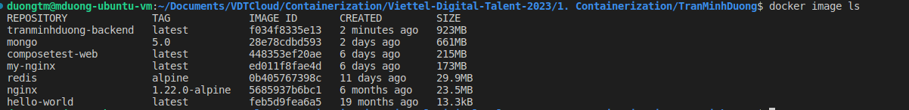
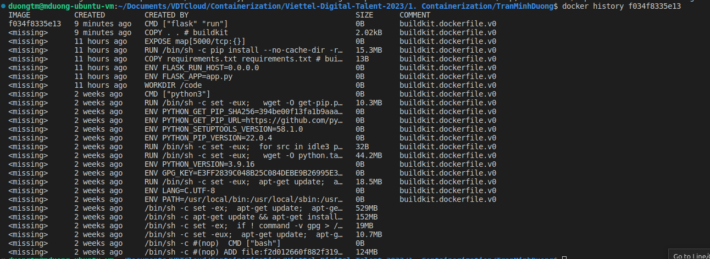
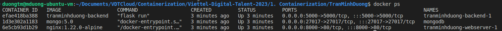

# Practice 1. Containerization

Sinh viên: **Trần Minh Dương**

## Mục lục

[I. Trả lời câu hỏi](#i-trả-lời-câu-hỏi)  
[II. Ứng dụng web 3 tầng](#ii-ứng-dụng-web-3-tầng)

## I. Trả lời câu hỏi

<a name="question"></a>

### 1. What are the differences between these instructions?

`ARG` vs `ENV`

- `ARG` được dùng để truyền các biến build-time trong Dockerfile. Giá trị của các biến định nghĩa bằng `ARG` chỉ có thể sử dụng trong quá trình build image và không thể sử dụng trong quá trình container chạy.

- `ENV` được sử dụng để định nghĩa các biến môi trường cho container. Không giống `ARG`, các biến này có thể được truy cập trong khi chạy container.

`COPY` vs `ADD`  
Cả hai lệnh được sử dụng trong Dockerfile để sao chép các tệp tin từ host machine vào image của Docker.

- `COPY` được sử dụng để sao chép tệp tin từ host machine vào image của Docker. `COPY` chỉ hỗ trợ sao chép tệp tin hoặc thư mục từ máy host và không tự động giải nén tệp tin nếu chúng có định dạng nén.
- `ADD` hỗ trợ sao chép tệp tin hoặc thư mục từ máy host, cũng như giải nén các tệp tin nếu chúng có định dạng nén. `ADD` cũng hỗ trợ URL nhưng không khuyến khích sử dụng vì nó không được hỗ trợ bởi tất cả các build context.

`CMD` vs `ENTRYPOINT`
Đây là hai từ khóa được sử dụng trong Dockerfile để chỉ định lệnh hoặc tập lệnh mà container sẽ chạy khi khởi động.

- `CMD` chỉ định 1 lệnh mặc định cho container khi khởi động. Lệnh này có thể bị ghi đè nếu một lệnh khác được cung cấp khi container chạy. `CMD` còn được sử dụng để chỉ định các tham số cho `ENTRYPOINT`. Nếu không có `ENTRYPOINT` được chỉ định, `CMD` sẽ được thực thi như một `ENTRYPOINT`.
- `ENTRYPOINT` dùng để chỉ định 1 lệnh chính cho container. Lệnh này không bị ghi đè mà những tham số thêm vào sẽ trở thành tham số cho lệnh của `ENTRYPOINT`. `ENTRYPOINT` là bắt buộc phải có trong Dockerfile, nếu không container sẽ không thể khởi động.

### 2. How many optimization tricks used in this Dockerfile?

```Dockerfile
# our base image
FROM alpine:3.5

# Install python and pip
RUN apk add --update py2-pip

# upgrade pip
RUN pip install --upgrade pip

# install Python modules needed by the Python app
COPY requirements.txt /usr/src/app/
RUN pip install --no-cache-dir -r /usr/src/app/requirements.txt

# copy files required for the app to run
COPY app.py /usr/src/app/
COPY templates/index.html /usr/src/app/templates/

# tell the port number the container should expose
EXPOSE 5000

# run the application
CMD ["python", "/usr/src/app/app.py"]
```

**Trả lời**

1. Sử dụng lightweight base image là `alpine:3.5` để giảm kích thước image sau khi build ra.
2. Sử dụng option `--no-cache-dir` với `pip install` để giảm bộ nhớ cache

## II. Ứng dụng web 3 tầng

<a name="webapp"></a>

### 1. Yêu cầu

- Sử dụng các base image:
  - nginx:1.22.0-alpine
  - python:3.9
  - mongo:5.0
- Kích cỡ của image sau khi build chênh lệch không quá lớn so với base image

### 2. Triển khai

**Cấu trúc thư mục chính:**

```bash
├── images
├── data
│   ├── init_db.js
├── flask
│   ├── Dockerfile
│   ├── app.py
│   ├── .dockerignore
│   ├── template
│   │   ├── index.html
├── nginx
│   ├── nginx.conf
├── docker-compose.yml
├── README.md
```

#### a, MongoDB

Base image: mongo:5.0
Em sử dụng file `init_db.js` để khởi tạo database với collection là `attendees`.

```Javascript
db = db.getSiblingDB('vdt2023');
db.attendees.drop();
db.attendees.insertMany(
[
    {
      "id": 1,
      "name": "Bùi Minh Sơn",
      "birthyear": "2002",
      "gender": "Nam",
      "university": "Đại học Công nghệ - Đại học Quốc gia Hà Nội",
      "major": "Công nghệ thông tin"
    },
    {
      "id": 2,
      "name": "Đào Đại Hiệp",
      "birthyear": "2001",
      "gender": "Nam",
      "university": "Đại học Bách khoa Hà Nội",
      "major": "Điện tử viễn thông"
    },
    {
      "id": 3,
      "name": "Đỗ Anh Tú",
      "birthyear": "2002",
      "gender": "Nam",
      "university": "Đại học Công nghệ - Đại học Quốc gia Hà Nội",
      "major": "Mạng máy tính và truyền thông dữ liệu"
    },
    ...
```

### b, Flask app

File `app.py` lấy dữ liệu từ collection `attendees` trong database `vdt2023` sau đó render ra web dựa trên form của file `index.html`

```python
from flask import Flask, render_template
from pymongo import MongoClient

app = Flask(__name__)
client = MongoClient(host='md_mongodb', port=27017, username='mongoAdmin', password='admin123', authSource='admin')

db = client.vdt2023
users = db.attendees

@app.route('/')
def index():
    all_user = users.find().sort("id")
    return render_template('index.html', users=all_user)
```

File `requirements.txt` chứa các package cần thiết.

Viết Dockerfile cho việc build image.

```Dockerfile
FROM python:3.9
WORKDIR /code
ENV FLASK_APP=app.py
ENV FLASK_RUN_HOST=0.0.0.0
COPY requirements.txt requirements.txt
RUN pip install --no-cache-dir -r requirements.txt
EXPOSE 5000
COPY . .
CMD ["flask", "run"]
```

### c, Nginx

Ở đây vì flask app đã chạy web trên cổng 5000 nên với nginx, em chỉ đơn giản là điều hướng từ cổng 80 đến flask app trên cổng 5000.

File `nginx.conf`

```conf
server {
    listen 80;

    location / {
        proxy_pass http://backend:5000;
    }
}
```

### d, docker-compose.yml

Cuối cùng em viết file `docker-compose.yml`

```yml
version: "3.9"
services:
  #flask app
  backend:
    build:
      context: flask
      dockerfile: Dockerfile
    restart: unless-stopped
    ports:
      - "5000:5000"
    depends_on:
      - mongo
    networks:
      - webapp
  #nginx
  webserver:
    image: nginx:1.22.0-alpine
    ports:
      - 8000:80
    volumes:
      - ./nginx/:/etc/nginx/conf.d/
    networks:
      - webapp
  # MongoDB
  mongo:
    container_name: mongodb
    image: mongo:5.0
    restart: unless-stopped
    hostname: md_mongodb
    environment:
      - MONGO_INITDB_DATABASE=vdt2023
      - MONGO_INITDB_ROOT_USERNAME=mongoAdmin
      - MONGO_INITDB_ROOT_PASSWORD=admin123
    volumes:
      - ./data/init_db.js:/docker-entrypoint-initdb.d/init-db.js:ro
    ports:
      - "27017:27017"
    networks:
      - webapp

networks:
  webapp:
    driver: bridge
```

Nginx sẽ đc expose ra cổng 8000.

### 3. Kết quả

Sau khi chạy `docker compose up`, ta được các image sau:

<div align="center">
    
</div>

Image của flask app dựa trên `python:3.9` có kích thước 923MB. Kích thước lớn này chủ yếu đến từ việc image tự update và set up môi trường, còn những thay đổi của ta thì không làm tăng nhiều kích thước image.

<div align="center">
    
</div>

Tương tự với image của `mongo`.

Các container đang chạy:

<div align="center">
    
</div>

Truy cập web tại `127.0.0.1:8000`

<div align="center">
    
</div>
