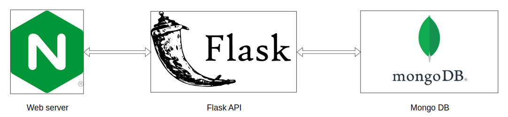
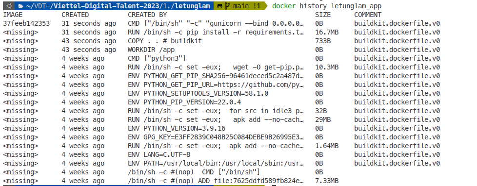
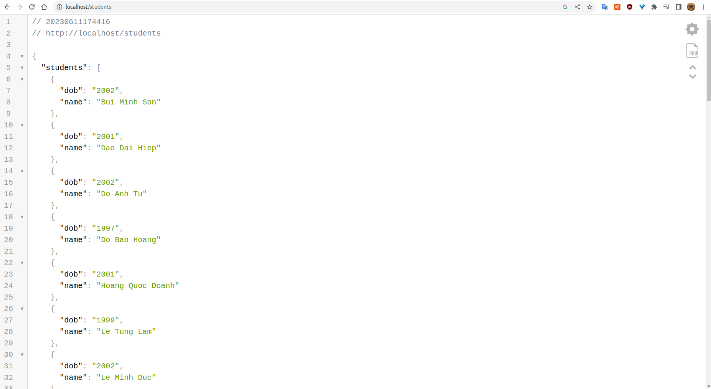

# Containerization

[Nội Dung](#table-of-content)

[1. Phân biệt các câu lệnh trong Docker](#1-phân-biệt-các-câu-lệnh-trong-docker)
  - [1.1. ARG and ENV](#11-arg-và-env)
  - [1.2. COPY and ADD](#12-add-và-copy)
  - [1.3. CMD and ENTRYPOINT](#13-cmd-và-entrypoint)

[2. Các kỹ thuật tối ưu kích thước Docker image](#2-các-kỹ-thuật-tối-ưu-kích-thước-docker-image)
  - [2.1. Tối ưu kích thước Docker image dựa trên các câu lệnh trong Dockerfile](#21-tối-ưu-kích-thước-docker-image-dựa-trên-các-câu-lệnh-trong-dockerfile)
  - [2.2. Tối ưu kích thước Docker image bằng loại bỏ cache của ứng dụng](#22-tối-ưu-kích-thước-docker-image-bằng-loại-bỏ-cache-của-ứng-dụng)

[3. Xây dựng three-tier web-app sử dụng Docker](#3-xây-dựng-three-tier-web-app-sử-dụng-docker)
  - [3.1. Cấu trúc thư mục](#31-cấu-trúc-thư-mục)
  - [3.2. Kiến trúc ứng dụng](#32-kiến-trúc-ứng-dụng)
  - [3.3. Chi tiết cách đóng gói ứng dụng](#33-chi-tiết-cách-đóng-gói-ứng-dụng)

---

# 1. Phân biệt các câu lệnh trong Docker
## 1.1. ARG và ENV
Giống nhau:
* Dùng để khai báo các biến môi trường trong quá trình build Docker image

Khác nhau:
* Các biến được định nghĩa trong ARG có giá trị khi Container được khởi chạy
* Các biến trong ENV chỉ có giá trị trong quá trình build image
## 1.2. ADD và COPY
Giống nhau:
* Được dùng để sao chép một file hoặc một folder từ máy host vào trong container

Khác nhau:
* ADD có thêm hỗ trợ URL, giải nén tập tin tải về từ URL
* COPY chỉ sao chép file, folder
## 1.3. CMD và ENTRYPOINT
* CMD thực hiện lệnh mặc định khi chúng ta khởi tạo container từ image, lệnh mặc định này có thể được ghi đè từ dòng lệnh khi khởi tại container.
* ENTRYPOINT khá giống CMD đều dùng để chạy khi khởi tạo container, nhưng ENTRYPOINT không thể ghi đè từ dòng lệnh khi khi khởi tại container.

# 2. Các kỹ thuật tối ưu kích thước Docker image
## 2.1. Tối ưu kích thước Docker image dựa trên các câu lệnh trong Dockerfile

Mỗi câu lệnh `RUN` trong Dockerfile sẽ tạo ra một layer trong image. Do đó, để tối ưu kích thước của image, chúng ta cần tối ưu số lượng layer trong image.

Thay vì dùng 3 câu lệnh `RUN` như sau:
```Dockerfile
RUN <instruction A>
RUN <instruction B>
RUN <instruction C>
```
chúng ta có thể thay thế bằng một câu lệnh `RUN` duy nhất:
```Dockerfile
RUN <instruction A> && <instruction B> && <instruction C>
```

## 2.2. Tối ưu kích thước Docker image bằng loại bỏ cache của ứng dụng

Các package manager sẽ lưu lại cache trong quá trình cài đặt dependencies. Do đó, để tối ưu kích thước của image, chúng ta cần xóa cache của các package manager sau khi cài đặt dependencies.

Ví dụ với `pip install`:
```Dockerfile
RUN pip install -r requirements.txt --no-cache-dir
```

# 3. Xây dựng three-tier web-app sử dụng Docker

## 3.1. Cấu trúc thư mục
Triển khai một 3-tier web application sử dụng Docker Compose. Đóng gói các services thành các images và tối ưu kích thước của các images.

Cấu trúc thư mục:
```bash
.
├── app
│   ├── Dockerfile
│   ├── requirements.txt
│   └── wsgi.py
├── docker-compose.yml
├── images
│   ├── app-history.png
│   └── list-students.png
├── mongo-init.js
├── nginx.conf
└── README.md
```
trong đó:
  - `app` là thư mục chứa source code của ứng dụng flask.
  - `mongo-init.js` là file khởi tạo database.
  - `nginx.conf` là file cấu hình nginx.
  - `docker-compose.yml` là file cấu hình docker-compose.
  - `images` là thư mục chứa các hình ảnh minh họa trong bài viết.

## 3.2. Kiến trúc ứng dụng
Ảnh minh họa kiến trúc của ứng dụng:


## 3.3. Chi tiết cách đóng gói ứng dụng
Các images trên Dockerhub được sử dụng:
* nginx 1.22.0-alpine
* mongo 5.0-focal
* python 3.9-alpine **(48.16 MB)**

Project này chỉ build **một image app** (flask api backend) duy nhất dựa trên image **python 3.9-alpine**.
- Kích thước image trước khi build: **48.16 MiB**
- Kích thước image **app** sau khi build: **64.89 MiB**

Image **app** [Dockerfile](./app/Dockerfile):
```Dockerfile
FROM python:3.9-alpine

WORKDIR /app

COPY . .

RUN pip install -r requirements.txt --no-cache-dir

CMD gunicorn --bind 0.0.0.0:5000 wsgi:app
```


[mong-init.js](./mongo-init.js) (sample):
```js
db = db.getSiblingDB('students_db');

db.createCollection('names');

db.names.insertMany([
    {
        name: 'Bui Minh Son',
        dob: '2002',
    },
    {
        name: 'Dao Dai Hiep',
        dob: '2001',
    },
]);
```

[nginx.conf](./nginx.conf):
```conf
events {
    worker_connections 1000;
}

http {
    server {
        listen 80;

        location / {
            proxy_pass http://app:5000;
        }
    }
}
```

Docker-compose file:
```yaml
version: '3.8'

services:
  app:
    build:
      context: app
    ports: 
      - "5000"
    links:
      - db

  nginx:
    image: nginx:1.22.0-alpine
    volumes:
      - ./nginx.conf:/etc/nginx/nginx.conf:ro
    depends_on:
      - app
      - db
    ports:
      - "80:80"

  db:
    image: mongo:5.0-focal
    # hostname: mongodb
    container_name: mongodb-server
    restart: always
    # environment:
    #     MONGO_INITDB_ROOT_USERNAME: <admin-user>
    #     MONGO_INITDB_ROOT_PASSWORD: <admin-password>
    #     MONGO_INITDB_DATABASE: <database to create>
    ports:
        - 27017:27017
    volumes:
        - ./mongo-init.js:/docker-entrypoint-initdb.d/mongo-init.js:ro
```

Câu lệnh chạy và build images:
```bash
docker compose up --build
```

History của image **app**:
```bash
docker history letunglam_app
```



Kết quả là một **Json Object** chứa họ tên của các sinh viên được trả về tại địa chỉ:
**<http://localhost:80/students>**
