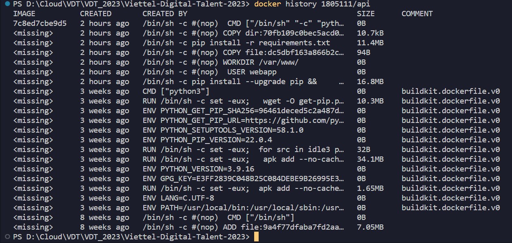
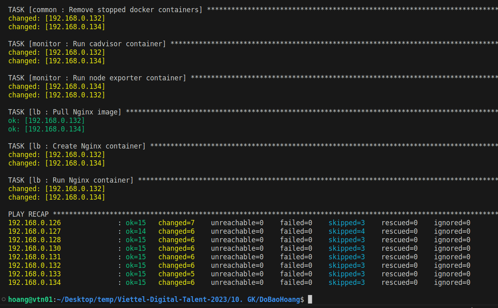
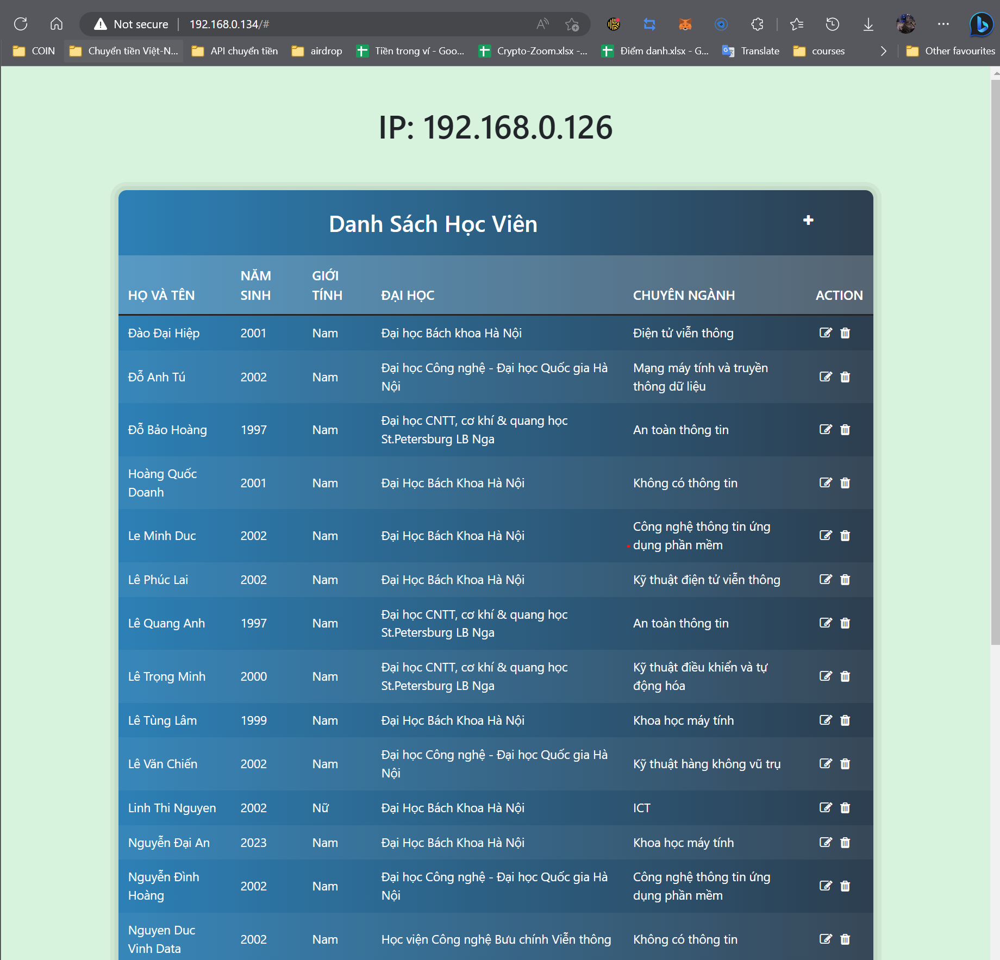

# VDT 2023 Midterm Project

## Phát triển 3-tier Webapp đầy đủ

### **1. Phát triển ứng dụng web**

Mã nguồn được lưu trong thư mục [source](https://github.com/hoang97/Viettel-Digital-Talent-2023/tree/mid_term/10.%20GK/DoBaoHoang/source)

### **2. Triển khai sử dụng các DevOps tools**

**2.1 Containerization**

File Docker cho từng dịch vụ được lưu trong từng thư mục của [source](https://github.com/hoang97/Viettel-Digital-Talent-2023/tree/mid_term/10.%20GK/DoBaoHoang/source)

Docker history của image web:

  

  <i>Pic. 1 - Web image docker history</i>

Docker history của image api:

  

  <i>Pic. 2 - API image docker history</i>

Docker history của image database:

  

  <i>Pic. 3 - Database image docker history</i>

**2.2 Continous Integration**

File setup CI trên github - [Test API](https://github.com/hoang97/Viettel-Digital-Talent-2023/blob/mid_term/.github/workflows/test_api.yaml)

`Luồng CI`: kiểm tra xem có thay đổi nào trong thư mục "10. GK/DoBaoHoang" không? -> nếu có mới thực hiện build mock database và test API 

Hình ảnh demo:

  

  <i>Pic. 4 - Output log của luồng CI</i>

### **3. Continuos Delivery**

  

  <i>Pic. 5 - Ảnh minh họa kiến trúc hệ thống</i>

  

  <i>Pic. 6 - Ảnh minh họa CD pipeline</i>

File setup CD trên github - [Build and Publish](https://github.com/hoang97/Viettel-Digital-Talent-2023/blob/mid_term/.github/workflows/build_push_images.yaml)

  

  <i>Pic. 7 - Output log của luồng CD Github</i>

  

  <i>Pic. 8 - Output log của ansible</i>

  

  <i>Pic. 9 - Demo Webapp ha</i>

  

  <i>Pic. 10 - Demo Webapp ha</i>

### **4. Monitoring**

Thư mục Role Monitor chứa playbook cài đặt Node-exporter: [Monitor](https://github.com/hoang97/Viettel-Digital-Talent-2023/tree/mid_term/10.%20GK/DoBaoHoang/roles/monitor)

Thư mục Role Prometheus chứa playbook cài đặt máy chủ prometheus local: [Prometheus](https://github.com/hoang97/Viettel-Digital-Talent-2023/tree/mid_term/10.%20GK/DoBaoHoang/roles/prometheus)

Thư mục chứa File config Prometheus: [Prom config](https://github.com/hoang97/Viettel-Digital-Talent-2023/tree/mid_term/10.%20GK/DoBaoHoang/roles/prometheus)

  

  <i>Pic. 11 - Dashboard giám sát node tại hệ thống tập trung</i>

### **5. Logging**

Thư mục Role Logging chưa playbook triển khai dịch vụ collect log: [Logging](https://github.com/hoang97/Viettel-Digital-Talent-2023/tree/mid_term/10.%20GK/DoBaoHoang/roles/logging)

Do máy chủ Kibana tập trung đã tắt nên chỉ có ảnh chụp demo service fluentd tập trung tại remote host:

  

  <i>Pic. 12 - Demo Fluentd container</i>

  

  <i>Pic. 13 - Demo Fluentd service</i>

  

  <i>Pic. 14 - Demo Webapp create</i>

  

  <i>Pic. 15 - Demo Webapp edit</i>

  

  <i>Pic. 16 - Demo Webapp delete</i>

