# VDT 2023 - Midterm task
# 1. Write a 3-tier web application (2pts)
### 1.1 Write a CRUD web application to execute:

1. Show the list of students participating in the VDT 2023  - Cloud program in the form of a table (0.5pts) ✅
2. Allow to view details/add/delete/update student information(0.5pts) ✅
Requirement: Source code of each service
[Sources here](https://github.com/letrongminh/Viettel-Digital-Talent-2023/tree/dev-midterm/1.%20Containerization/Le-Trong-Minh)

Used `FastAPI` to write backend because `FastAPI` supports API testing through `SwaggerUI` interface

Dockerfile for each service:
<div align="center">
  
</div>
<div align="center">
  <i><a href=>
         Main page, all students, can delete, update and add user
        </a></i>
</div>


<div align="center">
  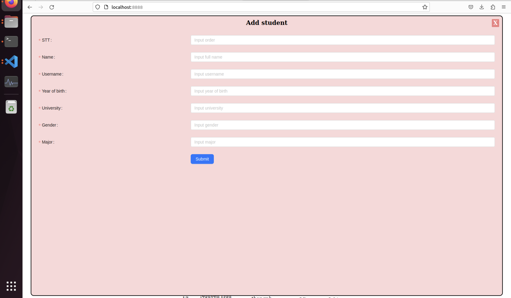
</div>
<div align="center">
  <i><a href=>
         Add User
        </a></i>
</div>


### 1.2 System design with three services: (0.5pts) ✅

○ web: Web interface written in HTML + CSS + Javascript deployed on the web server nginx
- Source: [Frontend Source code here](https://github.com/letrongminh/Viettel-Digital-Talent-2023/tree/dev-midterm/1.%20Containerization/Le-Trong-Minh/frontend)

○ api: RESTful API written in optional programming language (prefer Python), with full functions: list, get, create, update, delete student information records
- Source: [Backend - api Source code here](https://github.com/letrongminh/Viettel-Digital-Talent-2023/blob/dev-midterm/1.%20Containerization/Le-Trong-Minh/backend)

○ db: A SQL or NoSQL database that stores student information (the initialization data of this DB is given by the table in Appendix I.)
- Source: [Database Source code here](https://github.com/letrongminh/Viettel-Digital-Talent-2023/blob/dev-midterm/1.%20Containerization/Le-Trong-Minh/backend/database.py)


### 1.3 Write unit tests for APIs functionality (0.5pts) ✅

The API's unit test file is as follows:

        ```python
        import pytest
        from fastapi.testclient import TestClient
        from main import app
        import logging

        client = TestClient(app)

        @pytest.fixture(scope="module")
        def student_data():
            return {
                "stt": "100",
                "name": "Le Minh",
                "username": "minhle",
                "year_of_birth": "2000",
                "gender": "male",
                "university": "ITMO",
                "major": "CS"
            }

        def test_post_student(student_data):
            response = client.post("/api/v1/students", json=student_data)
            assert response.status_code == 200
            response_data = response.json()
            del response_data['data']['id']
            expected_data = {
                "data": {
                    "stt": 100,
                    "name": "Le Minh",
                    "username": "minhle",
                    "year_of_birth": 2000,
                    "gender": "male",
                    "university": "ITMO",
                    "major": "CS"
                },
                "code": 200,
                "message": "Student added successfully."
            }
            assert response_data == expected_data

        def test_get_all_students():
            response = client.get("/api/v1/students")
            assert response.status_code == 200
            assert response.json() is not None

        def test_get_student_by_id(student_data):
            response1 = client.post("/api/v1/students", json=student_data)
            student_id = response1.json()['data']['id']
            response2 = client.get(f"/api/v1/students/{student_id}")
            assert response2.status_code == 200
            response2_data = response2.json()
            del response2_data['data']['_id']
            expected_data = {
                'data': {
                    "stt": 100,
                    "name": "Le Minh",
                    "username": "minhle",
                    "year_of_birth": 2000,
                    "gender": "male",
                    "university": "ITMO",
                    "major": "CS"
                },
                'code': 200,
                'message': 'Student data retrieved successfully'
            }
            assert response2_data == expected_data

        def test_update_student(student_data):
            response1 = client.post("/api/v1/students", json=student_data)
            student_id = response1.json()['data']['id']
            updated_data = {
                "stt": 100,
                "name": "Le Minh",
                "username": "minhle",
                "year_of_birth": 2000,
                "gender": "male",
                "university": "ITMO",
                "major": "CS"
            }
            response2 = client.put(f"/api/v1/students/{student_id}", json=updated_data)
            assert response2.status_code == 200
            expected_data = {
                "data": f"Student with ID: {student_id} name update is successful",
                "code": 200,
                "message": "Student name updated successfully"
            }
            assert response2.json() == expected_data

        def test_delete_student(student_data):
            response1 = client.post("/api/v1/students", json=student_data)
            student_id = response1.json()['data']['id']
            response2 = client.delete(f"/api/v1/students/{student_id}")
            assert response2.status_code == 200
            expected_data = {
                "data": f"Student with ID: {student_id} removed",
                "code": 200,
                "message": "Student deleted successfully"
            }
            assert response2.json

        ```

### 1.4 * Write unit tests for interface functions, write integration tests ❌

# 2. Deploy web application using DevOps tools & practices (8 points)

1. Containerization (1 pt)
Request:
    - Write Dockerfile to package the above services into container images (0.5pt) ✅
    - Image requirements ensure optimal build time and occupied size, recommend to use the recommended build image tricks (layer-caching, optimized RUN instructions, multi-stage build etc.) (0.5d) ✅
Output:
    - Dockerfile for each service ✅
    - Output build command and docker history information of each image ✅

### Dockerfiles:

`Frontend`:
```
FROM node:18.2.0-alpine
WORKDIR /app
COPY . /app
RUN npm install 
RUN npm run build
CMD ["npm", "start"]

```
`Frontend Logs`:

<div align="center">
  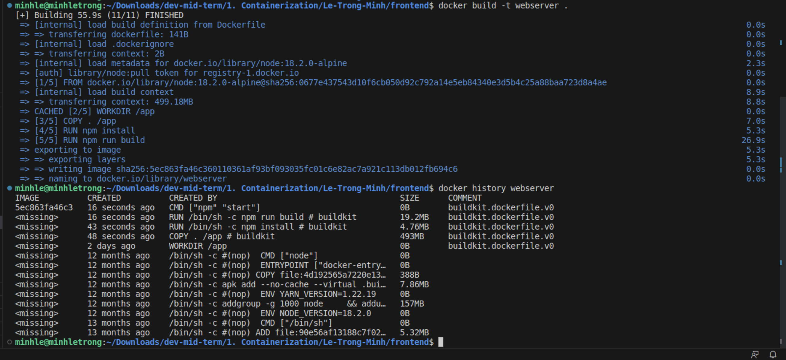
</div>
<div align="center">
  <i><a href=>
         Logs while building frontend
        </a></i>
</div>


`Backend`:

```
FROM python:3.9
WORKDIR /code
COPY . /code
RUN pip install --no-cache-dir --upgrade -r requirements.txt
CMD ["uvicorn", "main:app", "--host", "0.0.0.0"]
```

`Backend Logs`:

<div align="center">
  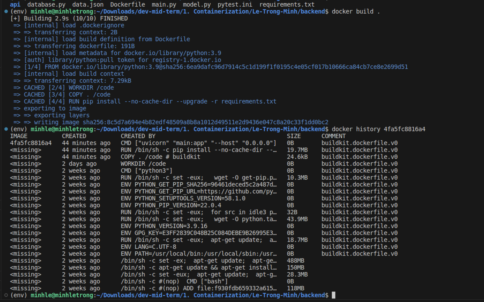
</div>
<div align="center">
  <i><a href=>
         Logs while building backend
        </a></i>
</div>


`Database Logs`:
<div align="center">
  
</div>
<div align="center">
  <i><a href=>
         Logs while building database
        </a></i>
</div>


2. Continuous Integration (1pt)

Request:

- Automatically run unit test when creating PR on main branch (0.5pt) ✅

- Automatically run unit test when push commit to a branch (0.5pt) ✅

Output:

1. CI tool setup file

The CI flow has been set up as follows:
```yaml
name: Build and test unittest

on:
  push:
    branches: [ "*" ]
  pull_request:
    branches: [ "main" ]

env:
  # Use docker.io for Docker Hub if empty
  REGISTRY: docker.io
  # github.repository as <account>/<repo>
  IMAGE_NAME: ${{ github.repository }}

jobs:

  build:

    runs-on: ubuntu-latest

    steps:
    - uses: actions/checkout@v3
    - name: Build the Docker image
      run: cd 1.\ Containerization/Le-Trong-Minh/ && docker-compose build
  test:
    runs-on: ubuntu-latest
    steps:
      - uses: actions/checkout@v3
      - name: Test the Docker image
        run: cd 1.\ Containerization/Le-Trong-Minh/ && docker-compose up -d db
      
      ## Unitest
      - name: Install dependencies
        run: |
          python -m pip install --upgrade pip
          cd 1.\ Containerization/Le-Trong-Minh/backend/ && pip install -r requirements.txt
          pip install pytest pytest-cov
        
      - name: Test api
        run: |
          cd 1.\ Containerization/Le-Trong-Minh/backend/api/
          pwd
          pytest test_api.py

```    
- Output log of CI stream

<div align="center">
  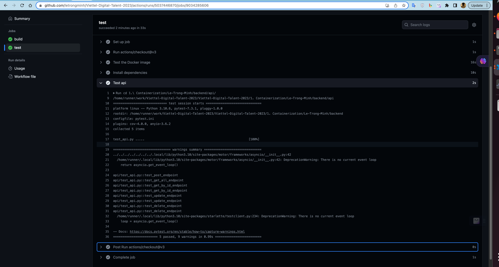
</div>
<div align="center">
  <i><a href=>
         CI stream
        </a></i>
</div>

-  ## More demo images

Pipe deploying CI - CD.

<div align="center">
  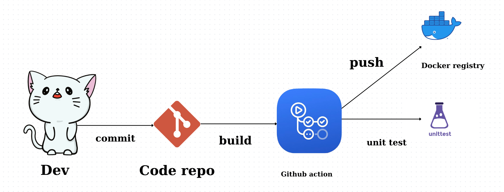
</div>
<div align="center">
  <i><a href=>
         CI-CD Pipline
        </a></i>
</div>


# 3. Continuous Delivery (4 pts)
Request:
- Write a service release flow using GitHub/GitLab's CI/CD tool, perform a build docker image and push a docker image to Docker Hub when a new tag is created by the developer on GitHub (1pt) ✅
- Write ansible playbook that performs the following tasks:
    - ○ Setup environment: Install docker on service deployment nodes (1 pt) ✅
    - ○ Deploy services by version using docker (1 pt) ✅
    - ○ * Deploy services on many different hosts 

- Ensure BP calculation for web services and api: ✅
    - ○ Each web service and api deployed on at least 02 different containers (0.5d) ✅
    - ○ Requests to web and api endpoints are load balanced through load balancer tools, e.g. nginx, haproxy and traefik (0.5d) ✅
    - ○ * Load balancer tools are also deployed under the cluster model ✅
    - ○ * Deploy db as cluster ✅

Output:
- Deployment architecture illustration and description

<div align="center">
  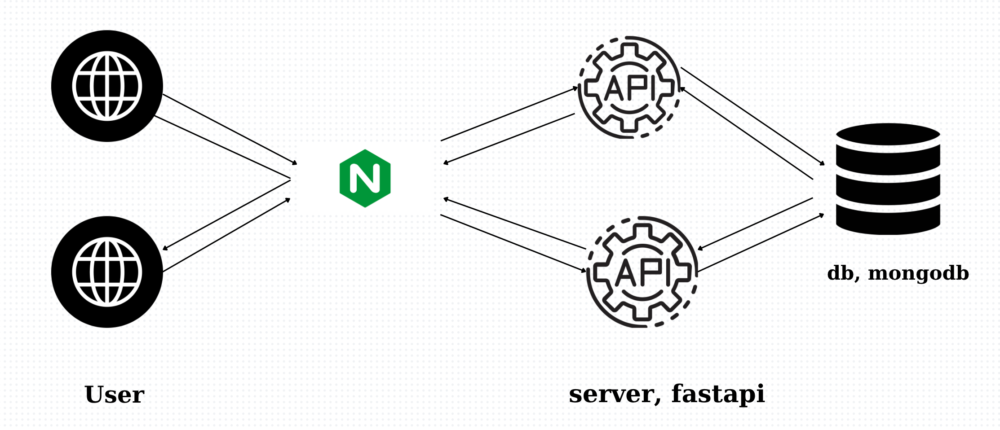
</div>
<div align="center">
  <i><a href=>
         Deployment architecture
        </a></i>
</div>

Nginx is used as a load balancer and revserse proxy. From there, it is possible to deploy a larger number of containers to ensure HA. Multiple Nginx clusters can be used together for a more guaranteed HA. Due to time limitations as well as my work, I have not been able to deploy and configure as desired.

- The directory containing the ansible playbook used to deploy the service, in this directory it is required
    - ○ The inventory file contains the list of deployed hosts
    - ○ Playbook files
    - ○ The roles directory contains the roles:
        - common: Setup environment before deploy
        - web: Deploying a web service
        - api: Deploy api service
        - db: Deploy the db service
        - lb: Deploy load balancing service

    
    ## Structure of Ansible task:

```sh
minhle@minhletrong:~/Downloads/dev-mid-term/10. GK/Le-Trong-Minh$ tree 
.
├── api.yml
├── db.yml
├── deploy-aio.yml
├── fluentd.yml
├── frontend.yml
├── images
├── inventories
│   └── inventory.yml
├── lb.yml
├── log.yml
├── monitoring.yaml
├── README.md
├── roles
│   ├── api
│   │   ├── defaults
│   │   │   └── main.yml
│   │   ├── files
│   │   └── tasks
│   │       └── main.yml
│   ├── common
│   │   ├── defaults
│   │   │   └── main.yml
│   │   ├── handlers
│   │   │   └── main.yml
│   │   ├── molecule
│   │   │   └── default
│   │   │       ├── converge.yml
│   │   │       └── molecule.yml
│   │   ├── tasks
│   │   │   ├── docker-compose.yml
│   │   │   ├── docker-users.yml
│   │   │   ├── main.yml
│   │   │   ├── setup-Debian.yml
│   │   │   └── setup-RedHat.yml
│   │   └── vars
│   │       ├── Alpine.yml
│   │       ├── Archlinux.yml
│   │       └── main.yml
│   ├── db
│   │   ├── defaults
│   │   │   └── main.yml
│   │   ├── tasks
│   │   │   └── main.yml
│   │   ├── templates
│   │   │   └── users.js.j2
│   │   ├── tests
│   │   │   ├── inventory
│   │   │   └── test.yml
│   │   └── vars
│   │       └── main.yml
│   ├── frontend
│   │   ├── defaults
│   │   │   └── main.yml
│   │   ├── files
│   │   └── tasks
│   │       └── main.yml
│   ├── log
│   │   ├── defaults
│   │   │   └── main.yaml
│   │   ├── files
│   │   │   ├── Dockerfile
│   │   │   └── fluentd.conf
│   │   └── tasks
│   │       └── main.yml
│   ├── monitoring
│   │   ├── defaults
│   │   │   └── main.yml
│   │   ├── files
│   │   │   └── prometheus.yml
│   │   └── tasks
│   │       └── main.yaml
│   └── nginx
│       ├── defaults
│       │   └── main.yml
│       ├── files
│       │   └── student.conf
│       ├── tasks
│       │   └── main.yml
│       └── vars
│           └── main.yml
└── test-ha.yaml

37 directories, 44 files
```

Roles:
- [common](https://github.com/letrongminh/Viettel-Digital-Talent-2023/blob/dev-midterm/10.%20GK/Le-Trong-Minh/roles/common/tasks/main.yml)
- [api](https://github.com/letrongminh/Viettel-Digital-Talent-2023/tree/dev-midterm/10.%20GK/Le-Trong-Minh/roles/api/tasks)
- [webserver](https://github.com/letrongminh/Viettel-Digital-Talent-2023/blob/dev-midterm/10.%20GK/Le-Trong-Minh/roles/frontend/tasks/main.yml)
- [db](https://github.com/letrongminh/Viettel-Digital-Talent-2023/blob/dev-midterm/10.%20GK/Le-Trong-Minh/roles/db/tasks/main.yml)
- [lb](https://github.com/letrongminh/Viettel-Digital-Talent-2023/blob/dev-midterm/10.%20GK/Le-Trong-Minh/roles/nginx/tasks/main.yml)

  
#  - CD Setup File

```sh
name: Push Docker Image to Docker Hub

on:
  push:
    tags:
      - '**'
env:
  # Use docker.io for Docker Hub if empty
  REGISTRY: docker.io
  # github.repository as <account>/<repo>
  IMAGE_NAME: ${{ github.repository }}

jobs:

  build:

    runs-on: ubuntu-latest

    steps:
    - uses: actions/checkout@v3
    - name: Build the Docker image
      run: cd 1.\ Containerization/Le-Trong-Minh/ && docker-compose build


  push_to_registry:
    name: Push Docker image to Docker Hub
    runs-on: ubuntu-latest
    steps:
      - name: Check out the repo
        uses: actions/checkout@v3

      - name: Set up Docker Buildx      
        uses: docker/setup-buildx-action@v2

      - name: Log in to Docker Hub
        uses: docker/login-action@f054a8b539a109f9f41c372932f1ae047eff08c9
        with:
          username: ${{ secrets.USER_DOCKERHUB }}
          password: ${{ secrets.PASSWORD_DOCKERHUB }}
      # - name: docker login
      #   env:
      #     DOCKER_USER: ${{secrets.DOCKER_USER}}
      #     DOCKER_PASSWORD: ${{secrets.DOCKER_PASSWORD}}
      #   run: |
      #     docker login -u $DOCKER_USER -p $DOCKER_PASSWORD 


      # - name: Extract metadata (tags, labels) for Docker
      #   id: meta
      #   uses: docker/metadata-action@98669ae865ea3cffbcbaa878cf57c20bbf1c6c38
      #   with:
      #     images: ${{ env.REGISTRY }}/${{ env.IMAGE_NAME }}

      - name: Build and push api image to Docker hub
        uses: docker/build-push-action@v4
        with:
          context: "{{defaultContext}}:1. Containerization/Le-Trong-Minh/backend"
          platforms: linux/arm64
          push: true
          tags: "trongminhjr/api:latest"
          # labels: "trongminhjr/api"

      - name: Build and push webserver image to Docker hub
        uses: docker/build-push-action@v4
        with:
          context: "{{defaultContext}}:1. Containerization/Le-Trong-Minh/frontend"
          platforms: linux/arm64
          push: true
          tags: "trongminhjr/webserver:latest"
          # labels: "trongminhjr/webserver"

```
- Output of build flow and push Docker Image to Docker Hub

<div align="center">
  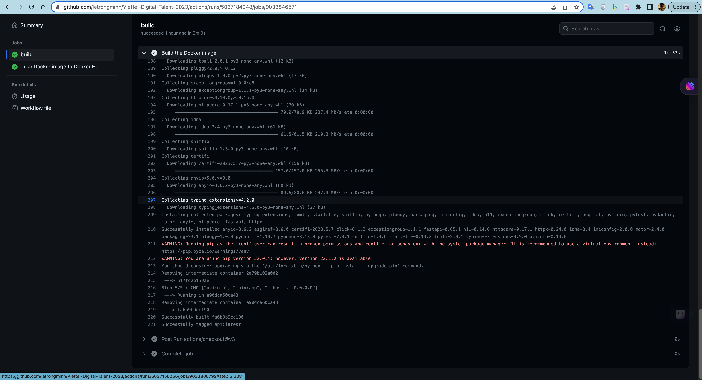
</div>
<div align="center">
  <i>
         Building
         </i>
</div>


<div align="center">
  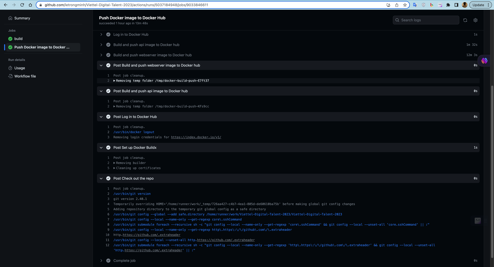
</div>
<div align="center">
  <i>
         Pushing
        </i>
</div>

- Instructions for using ansible playbook to deploy system components

For each component, a playbook playbook has been written corresponding to each role. If you want to install it manually, can use the commands:

```sh
  mkdir -p env
  virtualenv env/
  source env/bin/activate

  sudo ansible-playbook -i inventories/inventory.yml **.yml 

  
```
- `note: deploy-aio.yml - deploy all-in-one`

- `** - the component that you want to deploy`

- ### Output log of system deployment

<div align="center">
  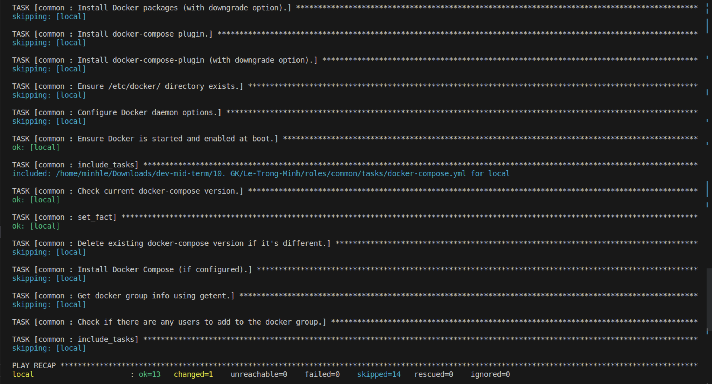
</div>
<div align="center">
  <i>
         Deploy Docker
        </i>
</div>


<div align="center">
  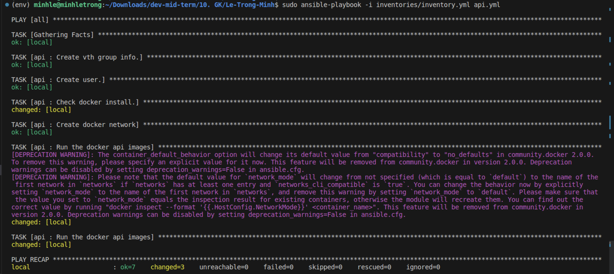
</div>
<div align="center">
  <i>
         Backend
        </i>
</div>


<div align="center">
  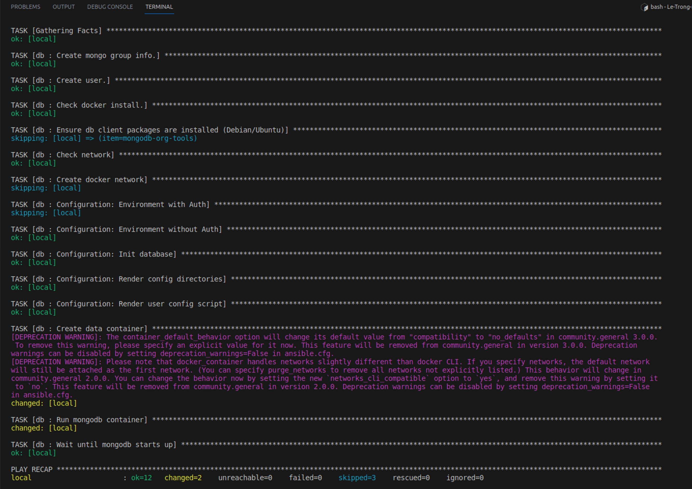
</div>
<div align="center">
  <i>
         DB
        </i>
</div>


<div align="center">
  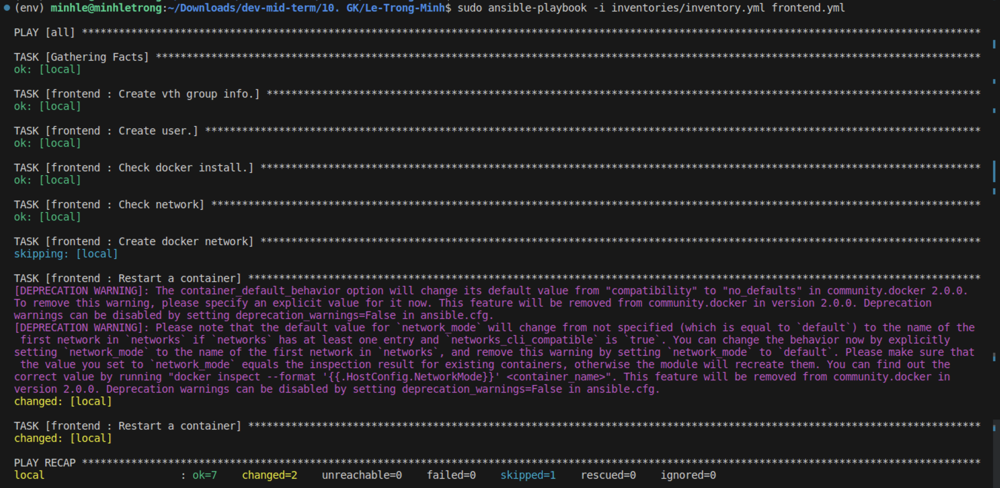
</div>
<div align="center">
  <i>
         Frontend
        </i>
</div>


<div align="center">
  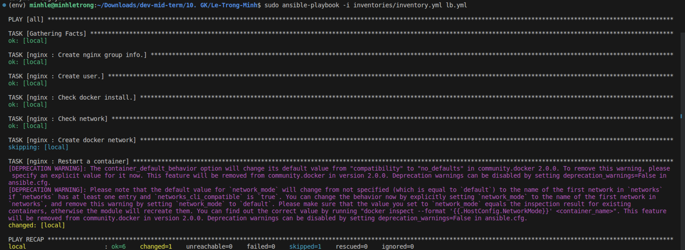
</div>
<div align="center">
  <i>
         Load balancer
        </i>
</div>


# 4. Monitoring (1 point) ✅
- Request:
    - Write ansible playbook roles monitor that performs the following tasks: ✅
        - ○ Install node exporter and cadvisor services as containers ✅
        - ○ Push monitoring parameters to centralized Prometheus monitoring system ✅
        - ○ Note: Container names are prefixed with <username>_ to distinguish the service monitoring parameters of students on the centralized monitoring system. ✅
        - Information <username> of each student is given by the table in Appendix I. ✅

Output:
- ● Role monitor contains playbooks and monitor configurations for the system
- ● A snapshot of the nodes & containers monitoring dashboard, can use the centralized prometheus system at 171.236.38.100:9090

[Ansible role file for monitoring here](https://github.com/letrongminh/Viettel-Digital-Talent-2023/blob/dev-midterm/10.%20GK/Le-Trong-Minh/roles/monitoring/tasks/main.yaml)
[config file here](https://github.com/letrongminh/Viettel-Digital-Talent-2023/blob/dev-midterm/10.%20GK/Le-Trong-Minh/roles/monitoring/files/prometheus.yml)
### Deploy

<div align="center">
  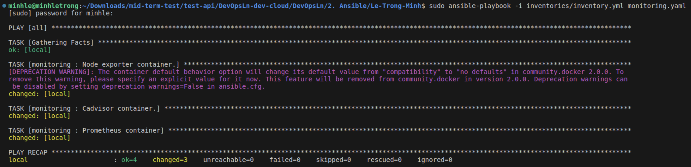
</div>
<div align="center">
  <i>
         Deploy Prometheus, cAdvisor, node-exporter
        </i>
</div>

### Snapshots of the nodes & containers monitoring dashboard

<div align="center">
  
</div>
<div align="center">
  <i>
         Prometheus on the centralized monitoring system with my username `minlt`
        </i>
</div>

<div align="center">
  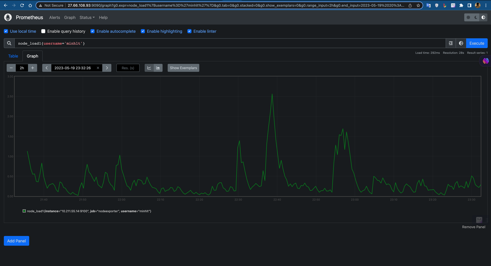
</div>
<div align="center">
  <i>
         Prometheus on the centralized monitoring system with my username `minlt`
        </i>
</div>


# 5. Logging (1 pt) ✅
Request:
- ● Write ansible playbook that performs the following tasks: ✅
        - ○ Install logstash or fluentd service to collect logs from web, api and db services ✅
        - ○ Push service log to centralized Elasticsearch system 171,236.38.100:9200 ✅
        - ○ Log must have at least the following information: IP access, time, action effect, result (success/failure/status code) ✅
        - ○ Logs are indexed with <username>_ prefix to distinguish service logs of different students. Information <username> of each student is given by the table in Appendix I. ✅
Output:
- ● Ansible playbook implementing collect log services (separate logging module)
- ● Sample log snapshot from Kibana 171,236.38.100:5601

[Ansible role file for logging here](https://github.com/letrongminh/Viettel-Digital-Talent-2023/blob/dev-midterm/10.%20GK/Le-Trong-Minh/roles/log/tasks/main.yml)
[Config file for Fluentd here](https://github.com/letrongminh/Viettel-Digital-Talent-2023/blob/dev-midterm/10.%20GK/Le-Trong-Minh/roles/log/files/fluentd.conf)

### Ansible playbook implementing collect log services (separate logging module)

## [For Fluentd here](https://github.com/letrongminh/Viettel-Digital-Talent-2023/tree/dev-midterm/10.%20GK/Le-Trong-Minh/roles/log)
## [For Logstash here](https://github.com/letrongminh/Viettel-Digital-Talent-2023/tree/dev-midterm/10.%20GK/Le-Trong-Minh/roles/logstash)


### Log while deploying
<div align="center">
  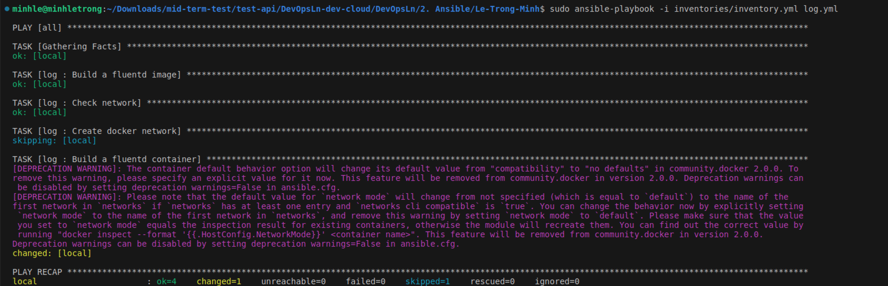
</div>
<div align="center">
  <i>
         Deploying Fluentd
        </i>
</div>


<div align="center">
  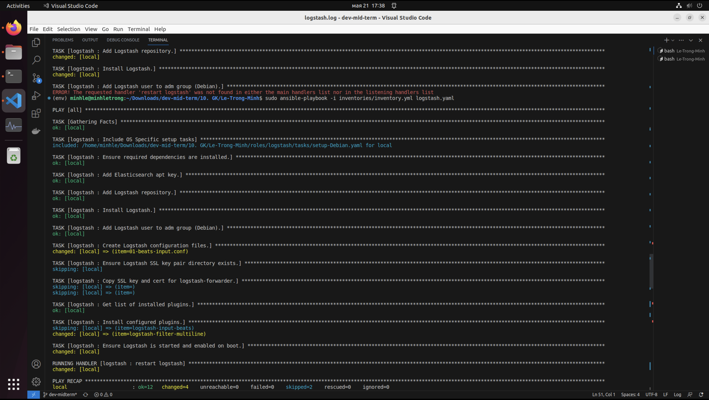
</div>
<div align="center">
  <i>
         Deploying Logstash
        </i>
</div>


### Sample log snapshots from Kibana 171.236.38.100:5601

<div align="center">
  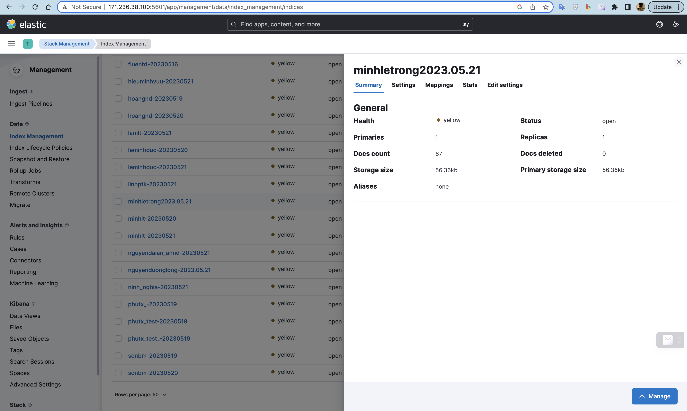
</div>
<div align="center">
  <i>
          Snapshot 1
        </i>
</div>


<div align="center">
  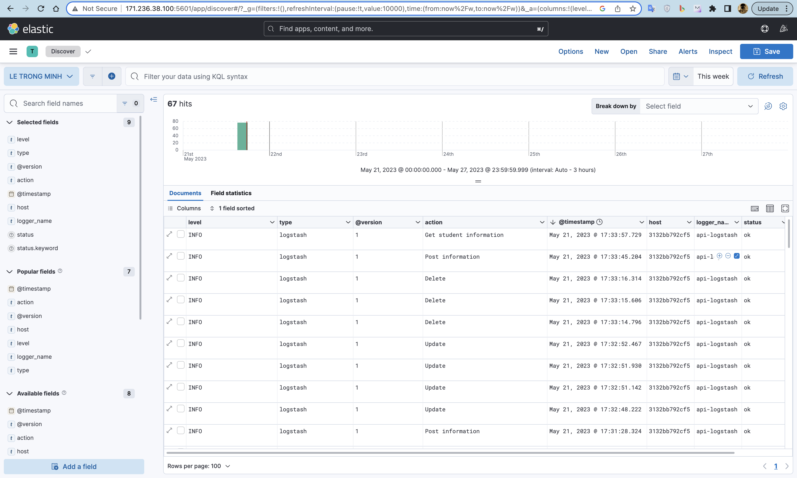
</div>
<div align="center">
  <i>
         Shapshot 2
        </i>
</div>


<div align="center">
  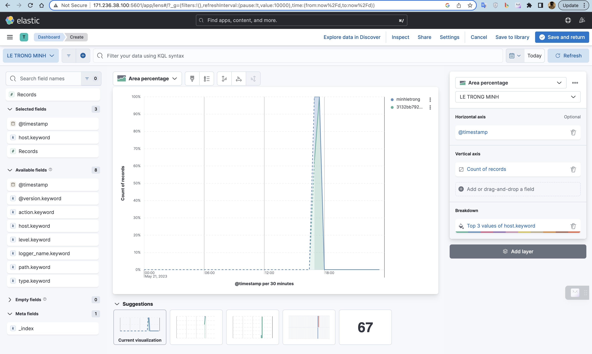
</div>
<div align="center">
  <i>
         Snapshot 3
        </i>
</div>


# References:

All logs are in this [directory](https://github.com/letrongminh/Viettel-Digital-Talent-2023/tree/dev-midterm/10.%20GK/Le-Trong-Minh/ansible-logs).


