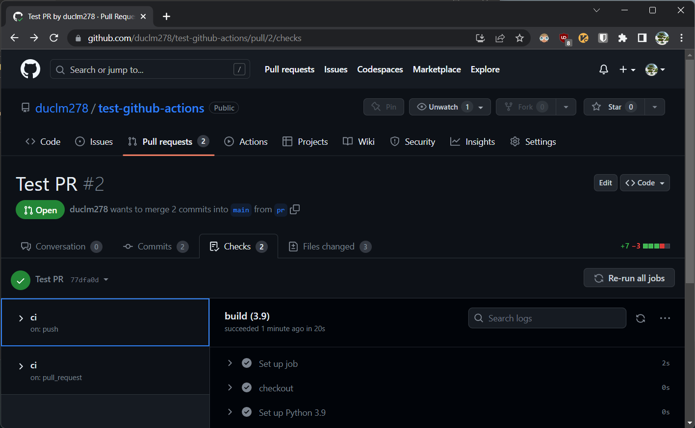
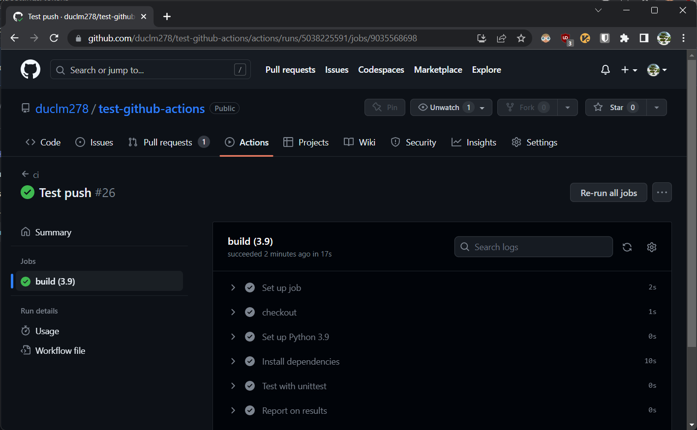
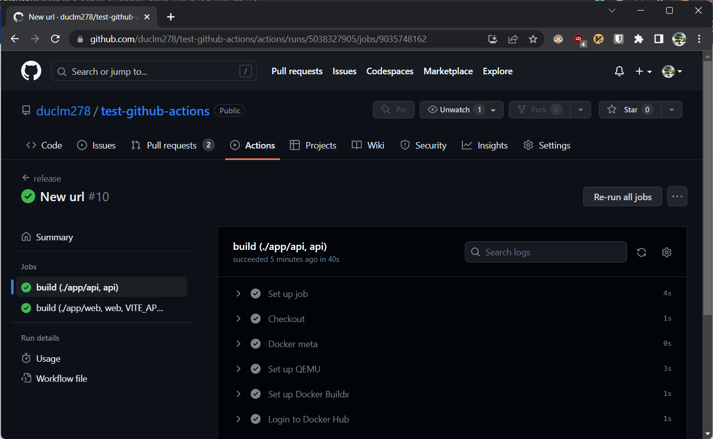
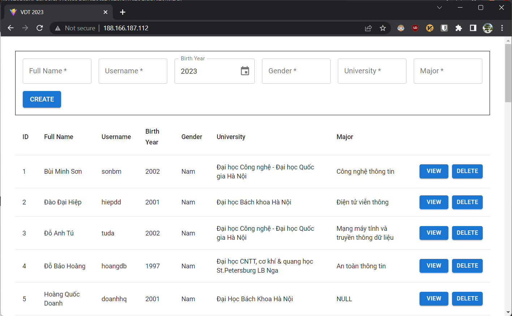
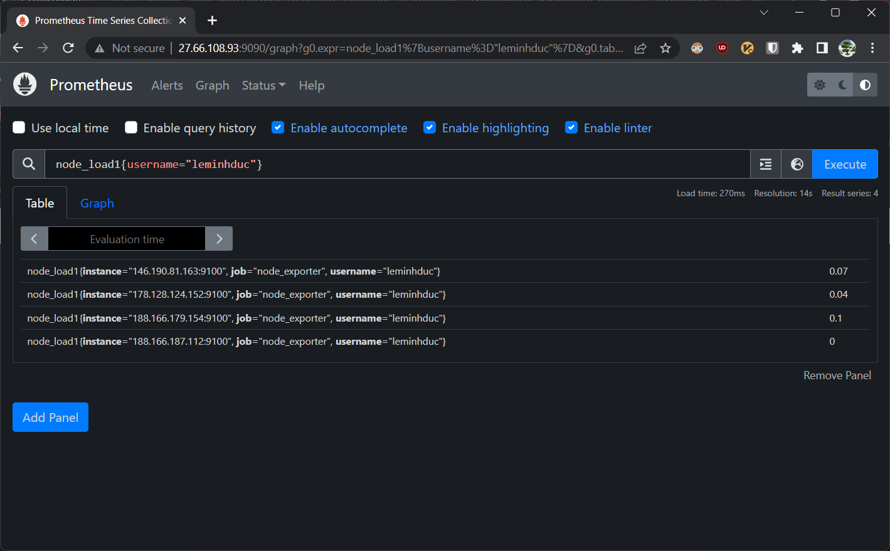
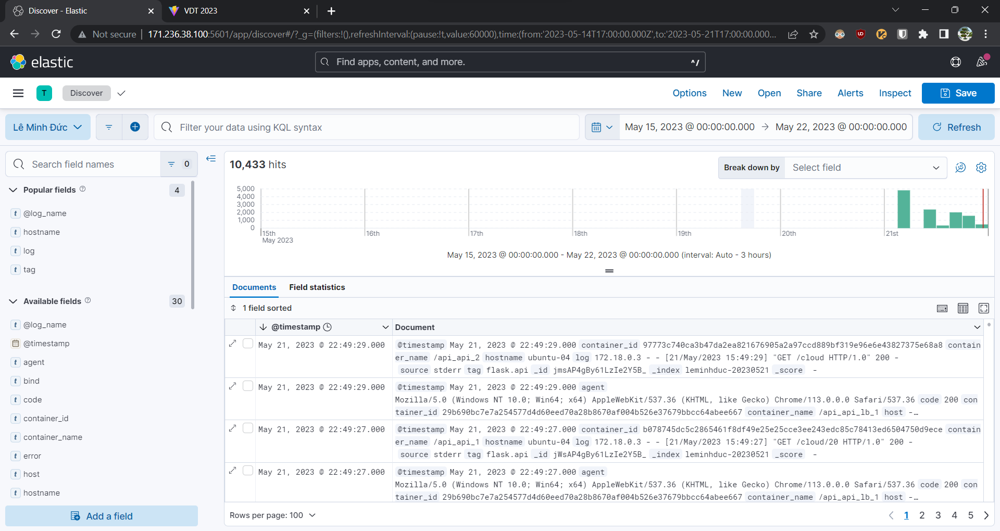

 # Mini Project <!-- omit in toc -->

Author: **Le Minh Duc**

## Table of Contents <!-- omit in toc -->

- [0. Requirements](#0-requirements)
- [1. Developing Simple 3-Tier Web Application](#1-developing-simple-3-tier-web-application)
- [2. Continuous Integration](#2-continuous-integration)
- [3. Continuous Delivery](#3-continuous-delivery)
  - [3.1. Architecture Design](#31-architecture-design)
  - [3.2. GitHub Actions Workflow](#32-github-actions-workflow)
  - [3.3. Using Ansible to Deploy Application](#33-using-ansible-to-deploy-application)
- [4. Monitoring](#4-monitoring)
- [5. Logging](#5-logging)
- [6. References](#6-references)

## 0. Requirements

- To see the requirements in Vietnamese, please visit [here](./assets/requirements.pdf).

## 1. Developing Simple 3-Tier Web Application

- For the frontend, I used [Vite](https://vitejs.dev/) to build the web app with [React](https://reactjs.org/) and [Material-UI](https://mui.com/). The static web files are served by [Nginx](https://www.nginx.com/).

- For the backend, I used [Flask](https://flask.palletsprojects.com/en/) to build the API with [MongoDB](https://www.mongodb.com/) as the database.

- All the source code can be found [here](./app).

- I tested the API with `unittest` and `mongomock` to avoid the need of a real database. The test cases can be found [here](./app/api/tests).

- Dockerfile for each service:
  - db: None
  - [api](./app/api/Dockerfile)
  - [web](./app/web/Dockerfile)

- Output log of the `docker build` command for each service:
  - db: None
  - [api](./app/api_build.log)

  ```shell
  docker build --no-cache -t duclm278/api api 2>&1 | tee api_build.log
  ```

  - [web](./app/web_build.log)

  ```shell
  docker build --no-cache -t duclm278/web web --build-arg "VITE_APP_BASE_URL=http://178.128.124.152:5000" 2>&1 | tee web_build.log
  ```

- The API endpoint must be bundled into the static web files as they cannot access the environment variables when being served on the client sides. Therefore, I pass `VITE_APP_BASE_URL` as the build argument to the `docker build` command.

- Output log of the `docker history` command for each service:
  - db: None
  - [api](./app/api_history.log)

  ```shell
  docker history duclm278/api 2>&1 | tee api_history.log
  ```

  - [web](./app/web_history.log)

  ```shell
  docker history duclm278/web 2>&1 | tee web_history.log
  ```

- Techniques I used to optimize the images have already been documented in the practice 1, containerization.

## 2. Continuous Integration

- GitHub Action CI workflow: [here](./.github/workflows/ci.yml)

- Output log of the CI workflow: [github](https://github.com/duclm278/test-github-actions/actions/runs/5038225591/jobs/9035568698)
  - Raw logs: [here](./.github/workflows/ci.log)

- Demo PR creating:

  

- Demo commit pushing:

  

## 3. Continuous Delivery

### 3.1. Architecture Design


- I deploy each service `logger`, `monitor`, `db`, `api` & `web` on multiple different hosts and scale `api` & `web` easily with `docker-compose` command.

- For load balancing, I deploy `nginx` on the same `api` or `web` hosts and use `nginx` as the reverse proxy to distribute the requests to the containers.

- By deploying the load balancer on the same host as the target service, I take advantage of Docker's embedded DNS server to resolve the service name to the actual container IPs. It implements DNS round-robin, so a client sees the list of IPs shuffled each time it resolves the service name.

- I just need to configure `nginx` to use this DNS server (127.0.0.11) and it will automatically load balance the requests to the containers.

  ```conf
  http {
    server {
      listen 80;
      server_name localhost;
    
      location / {
        resolver 127.0.0.11;
        set $api api;
        proxy_pass http://$api:5000;
      }
    }
  }
  ```

- However, this approach sacrifices the high availability of the load balancer. If the host goes down, the load balancer will be unavailable. I also lose nice features provided by nginx's `upstream` module like load-balancing policies, weights and health checks.

- One solution might be looping through the list of hosts to generate the `nginx` configuration file. If I had more time, I would try this looping technique with Ansible Jinja2 template.

### 3.2. GitHub Actions Workflow

- GitHub Action release workflow: [here](./.github/workflows/release.yml)

- Output log of the release workflow: [github](https://github.com/duclm278/test-github-actions/actions/runs/5038327905)
  - Raw logs for api: [here](./.github/workflows/release-api.log)
  - Raw logs for web: [here](./.github/workflows/release-web.log)

- Demo tagging v0.1.0:

  

### 3.3. Using Ansible to Deploy Application

- To use the playbook, the main three files to interact with are: `ansible/group_vars/all/vars`, `ansible/inventory.yml` and `ansible/site.yml`.

- You can put encrypted variables in `ansible/group_vars/all/vault`. To edit this file, run:

  ```shell
  $ ansible-vault edit ansible/group_vars/all/vault
  vault_become_password=123456
  ```

- The `vars` file contains every settings one needs to config such as the service name, service directory to be created on the host, whether to clean up the old configuration or not, etc.

  ```yml
  # Settings for api
  api_service: api
  api_image: duclm278/api
  api_image_tag: "{{ app_ver }}"
  api_dest: /etc/api # Absolute path on remote host
  api_dest_cleanup: true
  api_container_port: 5000
  api_scale: 2
  ```

- The default password is `123456`.

- Edit the inventory file to add your hosts and use the tagging system specified in the `site.yml` file to run tasks on demand.

- To deploy the application from start to finish, run:

  ```shell
  ansible-playbook -i inventory.yml site.yml --ask-vault-pass
  ```

- To skip installing Docker, run:

  ```shell
  ansible-playbook -i inventory.yml site.yml --ask-vault-pass --skip-tags "common"
  ```

- To tear down existing services, run:

  ```shell
  ansible-playbook -i inventory.yml site.yml --ask-vault-pass -t "cleanup"
  ```

- Or even run multiple tags:

  ```shell
  ansible-playbook -i inventory.yml site.yml --ask-vault-pass -t "common,cleanup"
  ```

- Or even override variables:

  ```shell
  ansible-playbook -i inventory.yml site.yml --ask-vault-pass -t "cleanup" -e "which=db"
  ```

- The final application can be visited at: [http://188.166.187.112](http://188.166.187.112/).



- Output log of deploying the application: [here](./ansible/deploy.log)

## 4. Monitoring

- Role `monitor`: [here](./ansible/roles/monitor)

  ```yml
  # ansible/site.yml
  - name: Deploy monitors
    hosts: app
    become: true
    gather_facts: false
    roles:
      - monitor
    tags: [deploy, monitor]
  ```

- Dashboard monitoring nodes and containers:

  

## 5. Logging

- Role `logger`: [here](./ansible/roles/logger)

  ```yml
  # ansible/site.yml
  - name: Deploy logger
    hosts: logger
    become: true
    gather_facts: false
    roles:
      - log
    tags: [deploy, log]
  ```

- Note that this role needs to be deployed before other app's services as they need to register their log outputs to any existing logging services or else they will fail to start.

- Dashboard monitoring nodes and containers:

  

## 6. References

[1] [Basic Blog App Built in Flask](https://github.com/pallets/flask/tree/2.3.2/examples/tutorial)

[2] [Unit Testing Pymongo Flask Applications With Mongomock](https://github.com/reritom/Flask-PyMongo-Unittest-Guide)

[3] [Docker-Compose Build Environment Variable](https://stackoverflow.com/questions/52429984/docker-compose-build-environment-variable)

[4] [Docker-Compose --Scale X nginx.conf Configuration](https://stackoverflow.com/questions/50203408/docker-compose-scale-x-nginx-conf-configuration)

[5] [Dynamic Nginx Configuration for Docker With Python](https://www.ameyalokare.com/docker/2017/09/27/nginx-dynamic-upstreams-docker.html)

[6] [GitHub Actions Starter Workflows](https://github.com/actions/starter-workflows)

[7] [Sample Workflows by Mentor `haminhcong`](https://github.com/haminhcong/demo-ci-cd-netbox)

[8] [How to Configure Prometheus Server as a Remote-Write Receiver](https://faun.pub/how-to-configure-prometheus-server-as-a-remote-write-receiver-4c8e265011c2)

[9] [Cannot Unmarshal http_listen_address and http_listen_port](https://github.com/grafana/agent/issues/1935)

[10] [Enabling the Remote Write Receiver Endpoint](https://prometheus.io/docs/prometheus/latest/storage/#overview)

[11] [Connect to the Localhost of the Machine From Inside of a Docker Container](https://stackoverflow.com/questions/24319662/from-inside-of-a-docker-container-how-do-i-connect-to-the-localhost-of-the-mach)

[12] [Exploring Default Docker Networking Part 1](https://blogs.cisco.com/learning/exploring-default-docker-networking-part-1)

[13] [Sample DockProm by Mentor `vanduc95`](https://github.com/vanduc95/dockprom)

[14] [Sample EFK Stack by Mentor `quynhvuongg`](https://github.com/quynhvuongg/EFK-stack)
