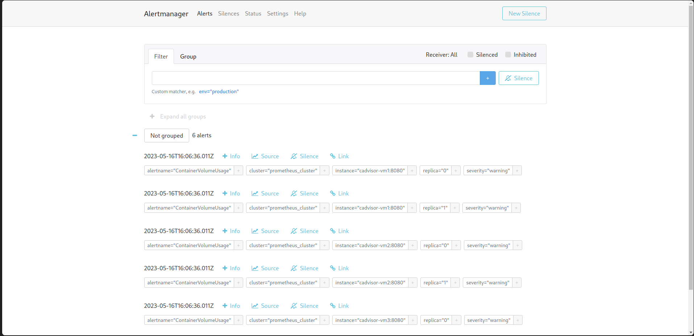
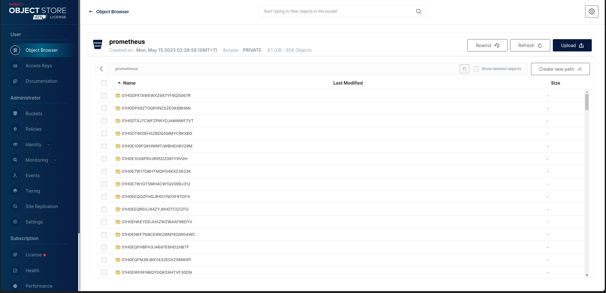

## VDT - Midterm Project

### **`Containerization`**
1. Move to [`frontend`](./webapp/frontend/) directory and build docker image
    ```bash
    docker build -t hoangndst/vdt-frontend:latest .
    ```
  - **`Docker History`**
    ```bash
    docker history hoangndst/vdt-frontend:latest
    ```
    <div align="center">
        
    </div> 
2. Move to [`backend`](./webapp/backend/) directory and build docker image
    ```bash
    docker build -t hoangndst/vdt-backend:latest .
    ```
  - **`Docker History`**
    ```bash
    docker history hoangndst/vdt-backend:latest
    ```
    <div align="center">
        
    </div>
3. Login to docker hub if you have not logged in
    ```bash
    docker login
    ```
4. Push docker images to docker hub
    ```bash
    docker push hoangndst/vdt-frontend:latest
    docker push hoangndst/vdt-backend:latest
    ```
### **`Continuous Integration`**
#### 1. Setup backend test.
  - Using pytest to test backend: [**test.py**](./webapp/backend/app/test.py)
  - Deploy test mongo database
  - Setup Github Action Workflow: [**test_backend.yml**](.github/workflows/test_backend.yml)
  - Run when push to master branch or open pull request
    ``` yaml
    ...
    on:
    push:
      branches: [master]
      paths:
        - "webapp/backend/**"
    pull_request:
      branches: [master]
      paths:
        - "webapp/backend/**"
    ...
    ```
#### 2. Auto run unit test when push to github

  <div align="center">
    
  </div>

#### 3. Auto run unit test when open pull request
  <div align="center">
    
  </div>

#### 4. Test result
  <div align="center">
    
  </div>

### **`Continuous Delivery`**
1. Setup Github Action Workflow: [**ci_backend.yml**](.github/workflows/ci_backend.yaml)
  - Config run when has new release with format `release/v*`
    ``` yaml
    ...
    push:
      tags:
        - release/v*
    ...
    ```
2. Auto build docker image and push to docker hub
  - Create new `tag/release`
    <div align="center">
      
    </div>
  - Auto Build and Push to Docker Hub
    <div align="center">
      
    </div>
### **`Create NFS server for sharing data between nodes`**
1. Overview
We will use 10GB disk to create NFS server for sharing data between containers. **`/dev/sda`**
    <div align="center">
        
    </div>
2. Install **`nfs-kernel-server`** package
    ```bash
    sudo apt update
    sudo apt install nfs-kernel-server
    ```
3. Create directory for sharing data
    ```bash
    sudo mkdir -p /mnt/nfs_volume/docker_nfs_share
    ```
4. Change ownership of the directory to nobody user
    ```bash
    sudo chown nobody:nogroup /mnt/nfs_volume/docker_nfs_share
    ```
5. Export the directory
    ```bash
    sudo vi /etc/exports
    ```
    Add the following line to the file
    ```bash
    /mnt/nfs_volume/docker_nfs_share    *(rw,sync,no_subtree_check,no_root_squash,no_all_squash,insecure)
    ```
    - **`rw`**: Allow both read and write requests on the NFS volume.
    - **`sync`**: Reply to requests only after the changes have been committed to stable storage.
    - **`no_subtree_check`**: Disable subtree checking. When a shared directory is the subdirectory of a larger file system, nfs performs scans of every directory above it, in order to verify its permissions and details. Disabling the subtree check may increase the reliability of NFS, but reduce security.
    - **`no_root_squash`**: Enable root squashing. This prevents root users connected remotely from having root privileges and assigns them the user ID for the user nfsnobody.
    - **`no_all_squash`**: Enable all squashing. This option is the converse of no_root_squash and makes root users on the client machine appear as root users on the NFS server. This option is generally used for diskless clients.
    - **`insecure`**: This option allows the NFS server to respond to requests from unprivileged ports (ports greater than 1024). This option is useful for mounting NFS volumes from older clients such as NFS version 3.
6. Restart the NFS server
    ```bash
    sudo systemctl restart nfs-kernel-server
    ```

### **`Project Structure Overview`**
<div align="center">
  
</div>

1. Infrastructure
- **`Digital Ocean`**: We will use Digital Ocean to create 3 droplets for our project. 
  - **`VM1`**: This droplet will be used to deploy application and act as NFS server.
  - **`VM2`**: This droplet will be used to deploy application.
  - **`VM3`**: This droplet will be used to deploy application.
2. Technologies
- **`Ansible`**: We will use Ansible to provision and deploy application to our droplets.
- **`Docker`**: We will use Docker to containerize our application.
- **`NFS`**: We will use NFS to share data between containers.
- **`Traefik`**: We will use Traefik as a reverse proxy and load balancer for our application.
- **`MongDB Replica Set`**: We will use MongoDB Replica Set to store data of our application.
  <div align="center">
    
  </div>
  A replica set in MongoDB is a group of mongod processes that maintain the same data set. Replica sets provide redundancy and high availability, and are the basis for all production deployments. This section introduces replication in MongoDB as well as the components and architecture of replica sets. The section also provides tutorials for common tasks related to replica sets.

- **`Nginx`**: We will use Nginx as web server for our application.
- **`Flask`**: We will use Flask as backend framework for our application.

### **`Deploy Application`**
1. Move to [`ansible`](./ansible/) directory
2. Setup docker for your target environments in role **`common`**
- Tasks:
  - [**`repository.yaml`**](./ansible/roles/common/tasks/repository.yaml): Add docker repository to apt source list
  - [**`docker.yaml`**](./ansible/roles/common/tasks/docker.yaml): Install Docker Engine, containerd, and Docker Compose
  - [**`main.yaml`**](./ansible/roles/common/tasks/main.yaml): Include all tasks
- Ansible:
  ```bash
  ansible-playbook -i inventories/digitalocean/hosts install_docker.yaml -K
  ```
  Type your sudo password when prompted
  <div align="center">
    
  </div>
3. Deploy MongoDB Replica Set
- Default variables:
  - [**`main.yaml`**](./ansible/roles/db/defaults/main.yaml): Default variables for MongoDB Replica Set
- Tasks:
  - [**`setup.yaml`**](./ansible/roles/db/tasks/setup.yaml): Setup required docker models for ansible, create docker network, volume if not exists.
  - [**`deploy.yaml`**](./ansible/roles/db/tasks/deploy.yaml): Deploy MongoDB
  - [**`init.yaml`**](./ansible/roles/db/tasks/init.yaml): Initiate MongoDB Replica Set
  - [**`main.yaml`**](./ansible/roles/db/tasks/main.yaml): Include all tasks
- Ansible:
  ```bash
  ansible-playbook -i inventories/digitalocean/hosts deploy.yaml -K
  ```
  Type your sudo password when prompted
  <div align="center">
    
  </div>
- Init MongoDB root user on Primary node
  ```bash
  docker exec -it database mongosh admin --eval "db.createUser({user: 'hoangndst', pwd: 'Hoang2002',roles: [ 'root' ]});"
  ```
  <div align="center">
    
  </div>
- For backend connect to MongoDB Replica Set: [**`models`**](./webapp/backend/app/models/__init__.py)
  ``` python
  client = MongoClient(
    host=[Config.MONGO_HOST1, Config.MONGO_HOST2, Config.MONGO_HOST3],
    replicaset=Config.MONGO_REPLICASET,
    port=Config.MONGO_PORT,
    username=Config.MONGO_USERNAME,
    password=Config.MONGO_PASSWORD,
  )
  ```
- Show config, status of MongoDB Replica Set
  ```bash
  docker exec -it database mongosh admin --eval "rs.conf();"
  docker exec -it database mongosh admin --eval "rs.status();"
  ```
  It should look like this:
  ``` bash
  set: 'mongo-rs',
  date: ISODate("2023-05-11T06:23:04.502Z"),
  myState: 2,
  term: Long("2"),
  syncSourceHost: '10.114.0.4:27017',
  ...
  members: [
    {
      _id: 0,
      name: '10.114.0.2:27017',
      health: 1,
      state: 2,
      stateStr: 'SECONDARY',
      uptime: 321,
      ...
    },
    {
      _id: 1,
      name: '10.114.0.3:27017',
      health: 1,
      state: 1,
      stateStr: 'PRIMARY',
      uptime: 319,
      ...
    },
    {
      _id: 2,
      name: '10.114.0.4:27017',
      health: 1,
      state: 2,
      stateStr: 'SECONDARY',
      uptime: 319,
      ...
    }
  ],
  ok: 1,
  '$clusterTime': {
    clusterTime: Timestamp({ t: 1683786175, i: 1 }),
    signature: {
      hash: Binary(Buffer.from("0000000000000000000000000000000000000000", "hex"), 0),
      keyId: Long("0")
    }
  },
  operationTime: Timestamp({ t: 1683786175, i: 1 })
  ```
4. Deploy API
- Default variables:
  - [**`main.yaml`**](./ansible/roles/api/defaults/main.yaml): Default variables for API
    - `NETWORK_NAME`: Name of docker network
    - `MONGO_HOST1`, `MONGO_HOST2`, `MONGO_HOST3`: IP address of MongoDB Replica Set
    - `MONGO_REPLICASET`: Mongo Replica Set name
    - `MONGO_PORT`: MongoDB port
    - `MONGO_USERNAME`: MongoDB username
    - `MONGO_PASSWORD`: MongoDB password
- Tasks:
  - [**`setup.yaml`**](./ansible/roles/api/tasks/setup.yaml): Setup required docker models for ansible, create docker network if not exists.
  - [**`deploy.yaml`**](./ansible/roles/api/tasks/deploy.yaml): Deploy API
  - [**`main.yaml`**](./ansible/roles/api/tasks/main.yaml): Include all tasks
- Ansible:
  ```bash
  ansible-playbook -i inventories/digitalocean/hosts deploy.yaml -K
  ```
  Type your sudo password when prompted
  <div align="center">
    
  </div>
- Backend URL: [**`https://vdt-backend.hoangnd.freeddns.org`**](https://vdt-backend.hoangnd.freeddns.org/test)
5. Deploy web
-  Default variables:
  - [**`main.yaml`**](./ansible/roles/web/defaults/main.yaml): Default variables for web
    - `NETWORK_NAME`: Name of docker network
- Tasks:
  - [**`setup.yaml`**](./ansible/roles/web/tasks/setup.yaml): Setup required docker models for ansible, create docker network if not exists.
  - [**`deploy.yaml`**](./ansible/roles/web/tasks/deploy.yaml): Deploy web
  - [**`main.yaml`**](./ansible/roles/web/tasks/main.yaml): Include all tasks
- Ansible:
  ```bash
  ansible-playbook -i inventories/digitalocean/hosts deploy.yaml -K
  ```
  Type your sudo password when prompted
  <div align="center">
    
  </div>
- Frontend URL: [**`https://vdt-frontend.hoangnd.freeddns.org`**](https://vdt-frontend.hoangnd.freeddns.org)
6. Deploy Traefik
- Default variables:
  - [**`main.yaml`**](./ansible/roles/lb/defaults/main.yaml): Default variables for Traefik
    - `NETWORK_NAME`: Name of docker network
    - `LB_VOLUME`: Volume name of Traefik
    - `NFS_SERVER_IP`: IP address of NFS server
    - `NFS_SHARE_PATH`: Path of NFS share folder
    - `MAIN_DOMAIN`: Your main domain
    - `FRONTEND_DOMAIN`: Your frontend domain (subdomain)
    - `BACKEND_DOMAIN`: Your backend domain (subdomain)
    - `TRAEFIK_DOMAIN`: Your Traefik domain (subdomain)
    - `VM1_IP`: IP address of VM1
    - `VM2_IP`: IP address of VM2
    - `VM3_IP`: IP address of VM3
    - `DYNU_API_KEY`: Your dns provider API key (This depends on your dns provider: [**`Traefik DNS providers docs`**](https://doc.traefik.io/traefik/https/acme/#providers))
    - `EMAIL`: Your email
- Templates:
  - [**`traefik.yaml.j2`**](./ansible/roles/lb/templates/traefik.yaml.j2): Traefik static configuration
  - [**`dynamic.yaml.j2`**](./ansible/roles/lb/templates/dynamic.yaml.j2): Traefik dynamic configuration
    
    Set up Load Balancer service
    ``` yaml
    ...
    services:
    vdt-frontend:
      loadBalancer:
        healthCheck:
          path: /
          port: 3000
        servers:
          - url: http://{{ VM1_IP }}:3000
          - url: http://{{ VM2_IP }}:3000
          - url: http://{{ VM3_IP }}:3000
    vdt-backend:
      loadBalancer:
        healthCheck:
          path: /test
          port: 5000
        servers:
          - url: http://{{ VM1_IP }}:5000
          - url: http://{{ VM2_IP }}:5000
          - url: http://{{ VM3_IP }}:5000
    ```
- Tasks:
  - [**`setup.yaml`**](./ansible/roles/lb/tasks/setup.yaml): Setup required docker models for ansible, create docker network if not exists. Copy Traefik configuration files to NFS share folder. This is preparation step for clustering Traefik.
  - [**`deploy.yaml`**](./ansible/roles/lb/tasks/deploy.yaml): Deploy Traefik
  - [**`main.yaml`**](./ansible/roles/lb/tasks/main.yaml): Include all tasks
- Ansible:
  ```bash
  ansible-playbook -i inventories/digitalocean/hosts deploy.yaml -K
  ```
  Type your sudo password when prompted
  <div align="center">
    
  </div>
- Traefik Dashboard: [**`https://traefik.hoangnd.freeddns.org`**](https://traefik.hoangnd.freeddns.org/)
  <div align="center">
    
  </div>

- Frontend Load Balancer:
  <div align="center">
    
  </div>
- Backend Load Balancer:
  <div align="center">
    
  </div>

### **`Deploy Monitoring`**
#### 1. Monitoring Architecture:
  <div align="center">
    
  </div>

#### 2. Technologies used:
  - [**`Prometheus`**](https://prometheus.io/): Collect metrics from targets by scraping metrics HTTP endpoints on these targets.
  - [**`Alertmanager`**](https://prometheus.io/docs/alerting/latest/alertmanager/): Handle alerts sent by Prometheus server and send notifications to receivers.
  - [**`Grafana`**](https://grafana.com/): Visualize metrics from Prometheus server.
  - [**`Minio`**](https://min.io/): Object storage for Prometheus server.
  - [**`Thanos`**](https://thanos.io/): Thanos provides a global query view, high availability, data backup with historical, cheap data access as its core features in a single binary. 
  Those features can be deployed independently of each other. This allows you to have a subset of Thanos features ready for immediate benefit or testing, while also making it flexible for gradual roll outs in more complex environments.
    - Sidecar: connects to Prometheus, reads its data for query and/or uploads it to cloud storage.
    - Store Gateway: serves metrics inside of a cloud storage bucket.
    - Compactor: compacts, downsamples and applies retention on the data stored in the cloud storage bucket.
    - Querier/Query: implements Prometheus’s v1 API to aggregate data from the underlying components.

  - Why I use **`Thanos`** for High Availability Prometheus + Alertmanager:
    - Like usual, using Load Balancer to balance traffic to multiple Prometheus servers is not a good idea because Prometheus server stores data in local storage. If we use Load Balancer, we will have to use sticky session to make sure that all requests from a client will be sent to the same Prometheus server. This will make the load balancing not effective. 
    - Thanos solves this problem. Thanos provides a global query view, high availability, data backup with historical, cheap data access as its core features in a single binary.
    - Thanos can query data from multiple Prometheus servers, clusters and store data in cloud storage. This makes it easy to scale Prometheus server and make it highly available. Data is dedublicated and compressed before storing in cloud storage. This makes it cheap to store data in cloud storage. 
    - You can easily scale Thanos by adding more Sidecar, Store Gateway, Compactor, Querier/Query.
    - You can easily backup data by using Compactor to compact, downsample and apply retention on the data stored in the cloud storage bucket.
    - You can easily query data from multiple Prometheus servers, clusters by using Querier/Query.
#### 3. Deploy Monitoring
- Default variables:
  - [**`main.yaml`**](./ansible/roles/monitor/defaults/main.yaml): Default variables for motoring
    - `VDT_MONITOR_NET`: Monitoring network
    - `PROMETHEUS_VOLUME`: Prometheus data volume
    - `MINIO_ACCESS_KEY`: Minio access key
    - `MINIO_SECRET_KEY`: Minio secret key
    - `MINIO_VOLUME`: Minio data volume
    - `GRAFANA_VOLUME`: Grafana data volume
- Files:
  - [**`Alert Manager configuration`**](./ansible/roles/monitor/files/alertmanager/config.yaml): Alert Manager configuration file
  - [**`Grafana configuration`**](./ansible/roles/monitor/files/grafana): Include Grafana data source, dashboard configuration and dashboard json files.
  - [**`Prometheus Rules`**](./ansible/roles/monitor/files/rules): All prometheus rules files
- Templates:
  - [**`prometheus.yaml.j2`**](./ansible/roles/monitor/templates/prometheus.yaml.j2): Prometheus configuration file
  - [**`storage.yaml.j2`**](./ansible/roles/monitor/templates/storage.yaml.j2): Thanos storage configuration file
  - [**`docker-compose.yaml.j2`**](./ansible/roles/monitor/templates/docker-compose.yaml.j2): Monitoring docker-compose file
- Tasks:
  - [**`setup.yaml`**](./ansible/roles/monitor/tasks/setup.yaml): Setup required docker models for ansible, create docker network if not exists. Copy monitoring configuration files to NFS share folder. This is preparation step for clustering monitoring.
  - [**`deploy.yaml`**](./ansible/roles/monitor/tasks/deploy.yaml): Deploy monitoring
  - [**`main.yaml`**](./ansible/roles/monitor/tasks/main.yaml): Include all tasks
- Ansible:
  ```bash
  ansible-playbook -i inventories/digitalocean/hosts deploy.yaml -K
  ```
  Type your sudo password when prompted
  <div align="center">
    
  </div>
#### 4. Result
- **`Grafana`**: [**`https://grafana.hoangnd.freeddns.org`**](https://grafana.hoangnd.freeddns.org/)
  - Username: `viewer`
  - Password: `Hoang1999`
  <div align="center">
    
    
  </div>
- **`Thanos - Prometheus`**: [**`https://thanos.hoangnd.freeddns.org`**](https://thanos.hoangnd.freeddns.org/)
  <div align="center">
    
    
  </div>
- **`Alert Manager - Slack`**: [**`https://alertmanager.hoangnd.freeddns.org`**](https://alertmanager.hoangnd.freeddns.org/)
  <div align="center">
    
    
  </div>
- **`Minio`**: [**`https://minio.hoangnd.freeddns.org`**](https://minio.hoangnd.freeddns.org/)
  <div align="center">
    
  </div>

### **`Deploy Logging`**
#### 1. Build Fluentd Docker Image
  - [**`Dockerfile`**](./webapp/fluentd/Dockerfile)
    Install elasticsearch and fluent-plugin-elasticsearch.
    ``` dockerfile
    FROM fluent/fluentd:v1.12.0-debian-1.0
    USER root
    RUN ["gem", "install", "elasticsearch", "--no-document", "--version", "< 8"]
    RUN ["gem", "install", "fluent-plugin-elasticsearch", "--no-document", "--version", "5.2.2"]
    USER fluent
    ```
  - Build docker image
    ``` bash
    docker build -t hoangndst/fluentd:latest .
    ```
  - Push docker image to docker hub
    ``` bash
    docker push hoangndst/fluentd:latest
    ```
#### 2. Deploy Logging
- Default variables:
  - [**`main.yaml`**](./ansible/roles/log/defaults/main.yaml): Default variables for logging
    - `NETWORK_NAME`: Logging network
- Files:
  - [**`Fluentd configuration`**](./ansible/roles/log/files/fluentd/fluent.conf): Fluentd configuration files
    ``` conf
    <source>
      @type forward # Receive events using HTTP or TCP protocol
      port 24224 # The port to listen to
      bind 0.0.0.0 # The IP address to listen to
    </source>

    <match docker.**> # Match events from Docker containers
      @type copy
      <store>
        @type elasticsearch # Send events to Elasticsearch
        host 171.236.38.100 # The IP address of the Elasticsearch server
        port 9200 # The port of the Elasticsearch server
        index_name hoangnd # The name of the index to be created
        logstash_format true # Enable Logstash format
        logstash_prefix hoangnd # The prefix of the index to be created
        logstash_dateformat %Y%m%d # The date format of the index to be created
        include_tag_key true # Enable including the tag in the record
        type_name access_log 
        flush_interval 1s # The interval to flush the buffer
      </store>
      <store>
        @type stdout
      </store>
    </match>
    ```
- Tasks:
  - [**`setup.yaml`**](./ansible/roles/log/tasks/setup.yaml): Setup required docker models for ansible, create docker network if not exists.
  - [**`deploy.yaml`**](./ansible/roles/log/tasks/deploy.yaml): Deploy logging
  - [**`main.yaml`**](./ansible/roles/log/tasks/main.yaml): Include all tasks
- Ansible:
  ```bash
  ansible-playbook -i inventories/digitalocean/hosts deploy.yaml -K
  ```
  Type your sudo password when prompted
  <div align="center">
    
  </div>
#### 3. Result
- Fluentd Container Logs
  <div align="center">
    
  </div>
- Kibana
  <div align="center">
    
  </div>

### **`All Project Website`**
- **`Frontend`**: [**`https://vdt-frontend.hoangnd.freeddns.org`**](https://vdt-frontend.hoangnd.freeddns.org)
- **`Backend`**: [**`https://vdt-backend.hoangnd.freeddns.org`**](https://vdt-backend.hoangnd.freeddns.org/interns)
- **`Traefik`**: [**`https://traefik.hoangnd.freeddns.org`**](https://traefik.hoangnd.freeddns.org/)
- **`Grafana`**: [**`https://grafana.hoangnd.freeddns.org`**](https://grafana.hoangnd.freeddns.org/)
  - username: `viewer`
  - password: `Hoang1999`
- **`Thanos - Prometheus`**: [**`https://thanos.hoangnd.freeddns.org`**](https://thanos.hoangnd.freeddns.org/)
- **`Alert Manager`**: [**`https://alertmanager.hoangnd.freeddns.org`**](https://alertmanager.hoangnd.freeddns.org/)
- **`Minio`**: [**`https://minio.hoangnd.freeddns.org`**](https://minio.hoangnd.freeddns.org/)

### **`References`**
- [**`Prometheus`**](https://prometheus.io/)
- [**`Alertmanager`**](https://prometheus.io/docs/alerting/latest/alertmanager/)
- [**`Grafana`**](https://grafana.com/)
- [**`Minio`**](https://min.io/)
- [**`Thanos`**](https://thanos.io/)
- [**`Fluentd`**](https://www.fluentd.org/)
- [**`Github Actions`**](https://docs.github.com/en/actions)