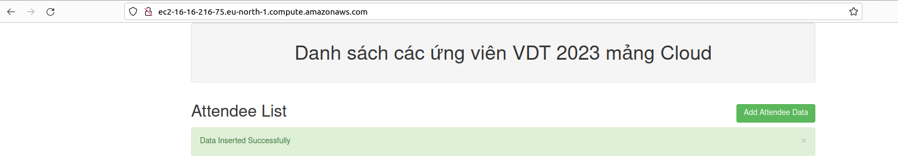
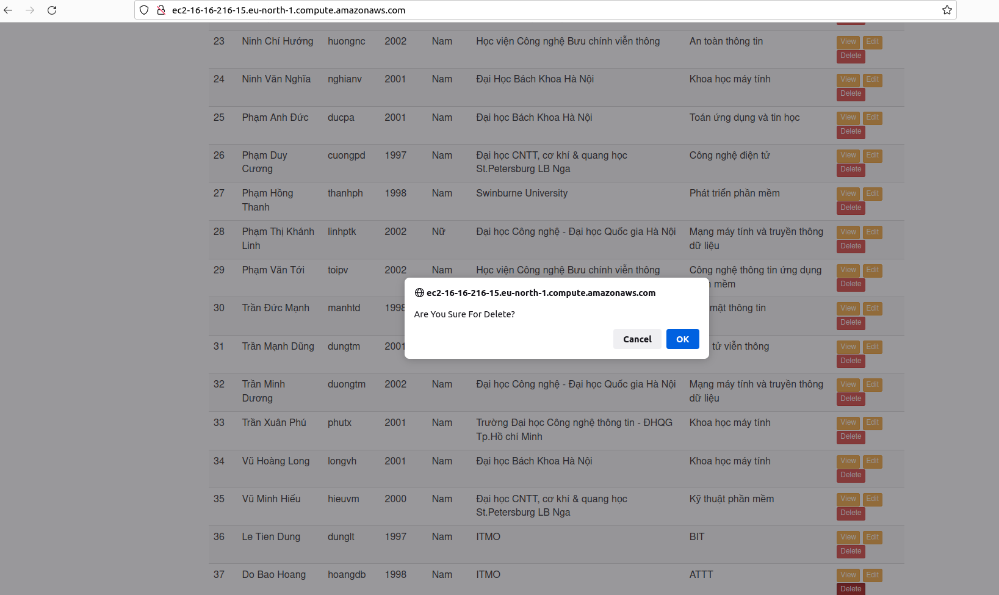
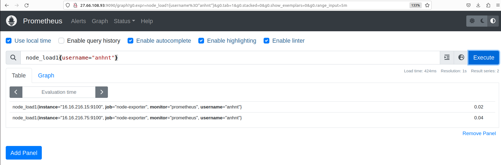
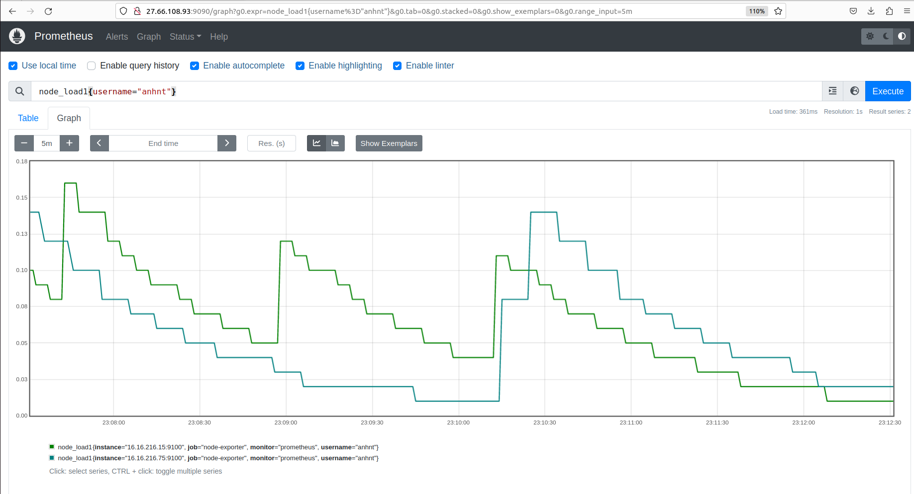
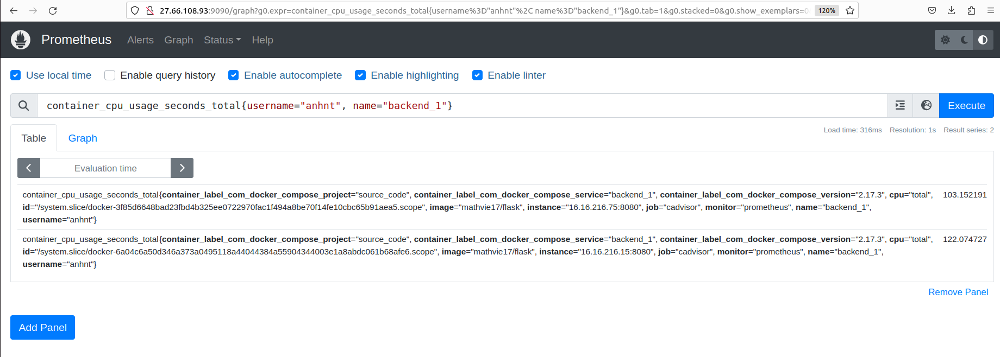

# Bài tập lớn giữa kỳ 
## Phát triển một 3-tier web application đơn giản
**Yêu cầu:**
- Viết một CRUD web application đơn giản thực hiện các chức năng:
    - Liệt kê danh sách sinh viên tham gia khóa đào tạo chương trình VDT 2023 lĩnh
vực cloud dưới dạng bảng 
    - Cho phép xem chi tiết/thêm/xóa/cập nhật thông tin sinh viên 
- Thiết kế hệ thống với ba dịch vụ:
  - web: Giao diện web viết bằng HTML + CSS + Javascript được triển khai trên nền
  web server nginx 
  - api: RESTful API viết bằng ngôn ngữ lập trình tùy chọn (prefer Python), có đầy
  đủ các chức năng: list, get, create, update, delete các bản ghi thông tin sinh viên 
  - db: Database SQL hoặc NoSQL lưu trữ thông tin sinh viên (dữ liệu khởi tạo của
  DB này được cho bởi bảng trong Phụ lục I.)
- Viết unit tests cho các chức năng APIs

**Output:**
- Mã nguồn được lưu trong thư mục **[source_code](https://github.com/tuananhitmo97/Viettel-Digital-Talent-2023/tree/midterm/10.%20GK/NguyenTuanAnh/source_code)**.
## Triển khai web application sử dụng các DevOps tools & practices 
### 1. Containerization
**Yêu cầu:**
- Viết Dockerfile để đóng gói các dịch vụ trên thành các container image.
- Yêu cầu image đảm bảo tối ưu thời gian build và kích thước chiếm dụng, khuyến khích
sử dụng các thủ thuật build image đã được giới thiệu (layer-caching, optimized RUN
instructions, multi-stage build, etc.)

**Output:**
- File Docker cho từng dịch vụ được lưu trong từng thư mục nhỏ của **[source_code](https://github.com/tuananhitmo97/Viettel-Digital-Talent-2023/tree/midterm/10.%20GK/NguyenTuanAnh/source_code)**.
- Output câu lệnh build và thông tin docker history của từng image.

       
       <i>Hình 1. Output build images.</i>

       
       <i>Hình 2. Docker history của backend image.</i>

       
       <i>Hình 3. Docker history của webserver image.</i>

       
       <i>Hình 4. Docker history của mysql image.</i>

### 2. Continuous Integration

**Yêu cầu:**
- Tự động chạy unit test khi tạo PR vào branch main
- Tự động chạy unit test khi push commit lên một branch

**Output:**
- File setup công cụ CI trên github: **[ci.yml](https://github.com/tuananhitmo97/Viettel-Digital-Talent-2023/blob/6addaf410a77446979fd194a7e95843718686ca6/.github/workflows/ci.yml)**.
- Output log của luồng CI:

       
       <i>Hình 5. Output log của luồng CI.</i>

### 3. Continuous Delivery
**Yêu cầu:**

- Viết luồng release dịch vụ bằng công cụ CI/CD của GitHub/GitLab, thực hiện build
docker image và push docker image lên Docker Hub khi có event một tag mới được
developer tạo ra trên GitHub
- Viết ansible playbook thực hiện các nhiệm vụ:
  - Setup môi trường: Cài đặt docker trên các node triển khai dịch vụ
  - Deploy các dịch vụ theo version sử dụng docker
  - Triển khai các dịch vụ trên nhiều hosts khác nhau
- Đảm bảo tính HA cho các dịch vụ web và api:
  - Mỗi dịch vụ web và api được triển khai trên ít nhất 02 container khác nhau 
  - Requests đến các endpoint web và api được cân bằng tải thông qua các công
    cụ load balancer, ví dụ: nginx, haproxy và traefik
  
**Output:**
- Ảnh minh họa kiến trúc triển khai:

       
        
       <i>Hình 6. Ảnh minh họa kiến trúc triển khai.</i>

- File setup công cụ CD trên github: **[cd.yml](https://github.com/tuananhitmo97/Viettel-Digital-Talent-2023/blob/midterm/.github/workflows/cd.yml)**.
- Output log của luồng CD:

       
       <i>Hình 7. Output log của luồng CD.</i>

- Output của luồng build và push Docker image lên Docker Hub:

       
        
       <i>Hình 8. Image frontend in Dockerhub.</i>

       
        
       <i>Hình 9. Image backend in Dockerhub.</i>

- Thư mục chứa ansible playbook dùng để triển khai các dịch vụ: **[Ansible](https://github.com/tuananhitmo97/Viettel-Digital-Talent-2023/tree/midterm/10.%20GK/NguyenTuanAnh/Ansible)**.

       
        
       <i>Hình 10. Cấu trúc các thư mục Ansible.</i>

- Output log của Ansible:

       
       
       
       
        
       <i>Hình 11. Output log của Ansible.</i>

- Hình ảnh demo Web application và các chức năng trên remote hosts EC2 AWS:

       
        
       <i>Hình 12. Demo CRUD Web application hiển thị danh sách các ứng viên.</i>

- Hình ảnh test các chức năng trên các remote hosts:

       
       
       
        
       <i>Hình 13. Add attendee data.</i>

       
       <i>Hình 14. View attendee data.</i>

       
       
        
       <i>Hình 15. Update attendee data.</i>

       
       
       
        
       <i>Hình 16. Delete attendee data.</i>

### 4. Monitoring
**Yêu cầu:**

Viết ansible playbook roles monitor thực hiện các nhiệm vụ:
- Cài đặt các dịch vụ node exporter và cadvisor dưới dạng container 
- Đẩy thông số giám sát lên hệ thống giám sát Prometheus tập trung 
- Chú ý: Tên các container có tiền tố là <username>_ để phân biệt thông số giám
sát dịch vụ của các sinh viên trên hệ thống giám sát tập trung. Thông tin
<username> của từng sinh viên cho bởi bảng trong Phụ lục I.

**Output:**
- Thư mục **[monitor](https://github.com/tuananhitmo97/Viettel-Digital-Talent-2023/tree/midterm/10.%20GK/NguyenTuanAnh/Ansible/roles/monitor)** bao gồm setup role **monitor** chứa các playbook và file cấu hình **[prometheus.yaml](https://github.com/tuananhitmo97/Viettel-Digital-Talent-2023/blob/109b4fcfac58f43a30a0717e46a2e408b3b8b84d/10.%20GK/NguyenTuanAnh/Ansible/roles/monitor/files/prometheus.yaml)** giám sát cho hệ thống:
- Ảnh chụp dashboard giám sát nodes & containers sử dụng hệ thống prometheus tập trung ở **171.236.38.100:900**.

       
       
       
       
        
       <i>Hình 17. Giám sát nodes và containers sử dụng Prometheus.</i>

### 5. Logging
**Yêu cầu:**

Viết ansible playbook thực hiện các nhiệm vụ:
- Cài đặt dịch vụ logstash hoặc fluentd để collect log từ các dịch vụ web, api và db
- Đẩy log dịch vụ lên hệ thống Elasticsearch tập trung 171.236.38.100:9200
- Log phải đảm bảo có ít nhất các thông tin: IP truy cập, thời gian, action tác động,
kết quả (thành công/không thành công/status code)
- Log được index với tiền tố <username>_ để phân biệt log dịch vụ của các sinh
viên khác nhau. Thông tin <username> của từng sinh viên cho bởi bảng trong
Phụ lục I.

**Output:**
- Ansible playbook **[logging](https://github.com/tuananhitmo97/Viettel-Digital-Talent-2023/tree/109b4fcfac58f43a30a0717e46a2e408b3b8b84d/10.%20GK/NguyenTuanAnh/Ansible/roles/logging)** triển khai các dịch vụ collect log và file cấu hình **[fluentd.conf](https://github.com/tuananhitmo97/Viettel-Digital-Talent-2023/blob/109b4fcfac58f43a30a0717e46a2e408b3b8b84d/10.%20GK/NguyenTuanAnh/Ansible/roles/logging/templates/fluentd.conf)** để collect log.