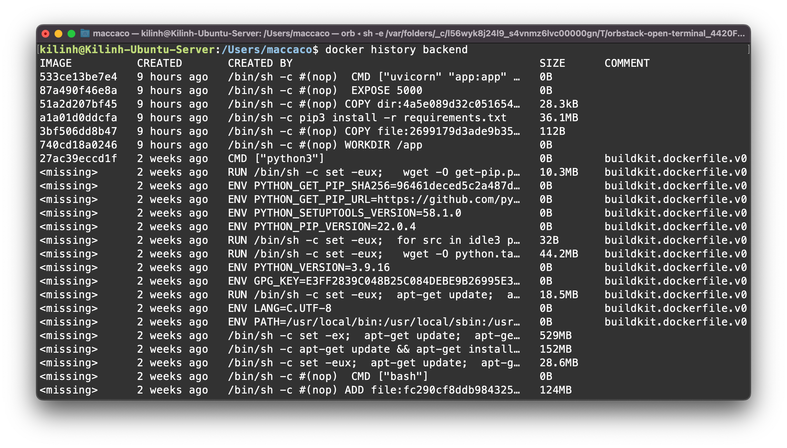
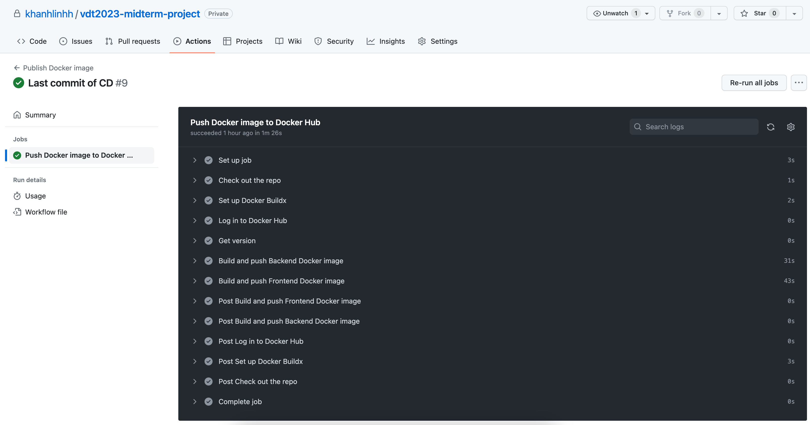

# VDT2023 Midterm Project

## Phát triển một 3-tier web application đơn giản

### **1. Containerization**

Output:

- **Mã nguồn của từng dịch vụ:**

  1. [Web](https://github.com/khanhlinhh/Viettel-Digital-Talent-2023/tree/midterm/10.%20GK/PhamThiKhanhLinh/roles/web)
  2. [API](https://github.com/khanhlinhh/Viettel-Digital-Talent-2023/tree/midterm/10.%20GK/PhamThiKhanhLinh/roles/api)
  3. [Database](https://github.com/khanhlinhh/Viettel-Digital-Talent-2023/tree/midterm/10.%20GK/PhamThiKhanhLinh/roles/db)

<br/>

- **File Dockerfile cho từng dịch vụ**

  1. [Web](https://github.com/khanhlinhh/Viettel-Digital-Talent-2023/blob/midterm/10.%20GK/PhamThiKhanhLinh/app/frontend/Dockerfile)
  2. [API](https://github.com/khanhlinhh/Viettel-Digital-Talent-2023/blob/midterm/10.%20GK/PhamThiKhanhLinh/app/backend/Dockerfile)
  3. [Database](https://github.com/khanhlinhh/Viettel-Digital-Talent-2023/blob/midterm/10.%20GK/PhamThiKhanhLinh/roles/db/tasks/main.yaml)

<br/>

- **Thông tin docker history của từng image**
  <br/>

  **1. Web**
  

  **2. API**
  

  **3. Database**
  

### **2. Continuous Integration**

Output:

- **File setup công cụ CI:** [`test_api.yaml`](https://github.com/khanhlinhh/Viettel-Digital-Talent-2023/blob/midterm/10.%20GK/PhamThiKhanhLinh/.github/workflows/test_api.yaml)
- **Output log của luồng CI:** [`CI-log.txt`](https://github.com/khanhlinhh/Viettel-Digital-Talent-2023/blob/midterm/10.%20GK/PhamThiKhanhLinh/Output/CI-log.txt)
  <br/>

  

### **3. Continuous Delivery**

Output:

```
├── app
│   ├── backend
│   │   ├── Dockerfile
│   │   ├── app.py
│   │   ├── config
│   │   │   └── database.py
│   │   ├── models
│   │   │   └── attendee_model.py
│   │   ├── requirements.txt
│   │   ├── routes
│   │   │   └── attendee_route.py
│   │   ├── schemas
│   │   │   └── attendee_schema.py
│   │   └── tests
│   │       ├── conftest.py
│   │       └── test_crud_api.py
│   ├── data
│   │   ├── attendees.json
│   │   └── init-db.js
│   └── frontend
│       ├── Dockerfile
│       ├── README.md
│       ├── nginx.conf
│       ├── package-lock.json
│       ├── package.json
│       ├── public
│       │   ├── favicon.ico
│       │   ├── index.html
│       │   └── manifest.json
│       └── src
│           ├── App.css
│           ├── App.js
│           ├── forms
│           │   ├── AddAttendeeForm.js
│           │   ├── AttendeeForm.css
│           │   └── EditAttendeeForm.js
│           ├── index.css
│           ├── index.js
│           ├── services
│           │   └── api.js
│           └── tables
│               ├── AttendeeTable.css
│               └── AttendeeTable.js
├── inventory.yaml
├── roles
│   ├── api
│   │   ├── defaults
│   │   │   └── main.yaml
│   │   └── tasks
│   │       └── main.yaml
│   ├── common
│   │   └── tasks
│   │       └── main.yaml
│   ├── db
│   │   ├── defaults
│   │   │   └── main.yaml
│   │   └── tasks
│   │       └── main.yaml
│   ├── lb
│   │   ├── defaults
│   │   │   └── main.yaml
│   │   ├── tasks
│   │   │   └── main.yaml
│   │   └── templates
│   │       └── nginx.conf
│   ├── log
│   │   ├── defaults
│   │   │   └── main.yaml
│   │   ├── fluentd
│   │   │   ├── Dockerfile
│   │   │   └── conf
│   │   │       └── fluent.conf
│   │   └── tasks
│   │       └── main.yaml
│   ├── monitor
│   │   ├── prometheus
│   │   │   └── prometheus.yml
│   │   └── tasks
│   │       └── main.yaml
│   └── web
│       ├── defaults
│       │   └── main.yaml
│       └── tasks
│           └── main.yaml
└── site.yaml
```

- **File setup CD:** [`test_api.yaml`](https://github.com/khanhlinhh/Viettel-Digital-Talent-2023/blob/midterm/10.%20GK/PhamThiKhanhLinh/.github/workflows/cd.yaml)

- **Output của luồng build và push Docker Image lên Docker Hub:** [`CD-log.txt`](https://github.com/khanhlinhh/Viettel-Digital-Talent-2023/blob/midterm/10.%20GK/PhamThiKhanhLinh/Output/CD-log.txt)

  

- **Sử dụng ansible playbook để triển khai các thành phần hệ thống:** Chạy lệnh ansible playbook và nhập mật khẩu để thực hiện các lệnh cần `sudo`

  ```
  ansible-playbook -i inventory.yaml site.yaml --ask-vault-pass -K
  ```

- **Output log triển khai hệ thống:** [`ansible-log.txt`](https://github.com/khanhlinhh/Viettel-Digital-Talent-2023/blob/midterm/10.%20GK/PhamThiKhanhLinh/Output/ansible-log.txt)

### **4. Monitoring**

Output:

- Role [monitor](https://github.com/khanhlinhh/Viettel-Digital-Talent-2023/tree/midterm/10.%20GK/PhamThiKhanhLinh/roles/monitor) chứa các playbook và cấu hình giám sát cho hệ thống
- Dashboard giám sát nodes & containers sử dụng hệ thống prometheus

  

### **5. Logging**

Output:

- Ansible playbook triển khai các dịch vụ collect log: [Log FLuentd](https://github.com/khanhlinhh/Viettel-Digital-Talent-2023/tree/midterm/10.%20GK/PhamThiKhanhLinh/roles/log)
- Sample log từ Kibana
  
