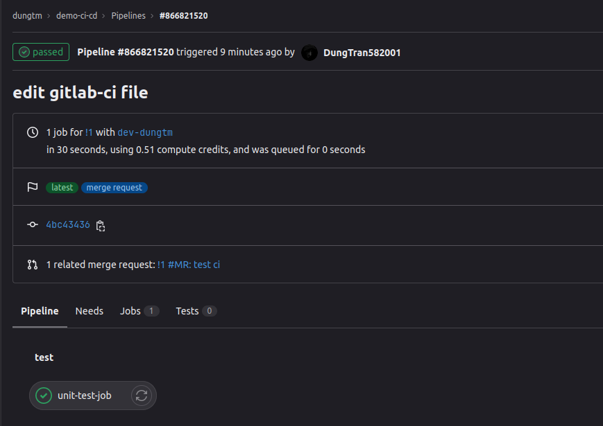
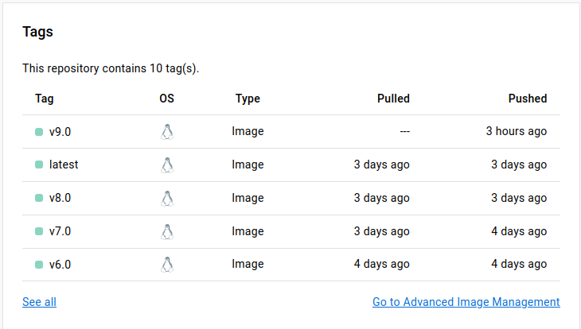

## Bài tập giữa kỳ

*Người thực hiện: Trần Mạnh Dũng*

### 1. Phát triển một 3-tier web application đơn giản

- **Web frontend:**
  - Ngôn ngữ sử dụng: HTML, CSS, JS và được triển khai trên nền web server nginx.
  - Hiển thị các thông tin học viên kèm theo các chức năng cơ bản như: thêm, sửa, xóa học viên.
  - Kết quả:
    - Đã hiển thị được data từ api của server backend cung cấp.
    - Chức năng xóa học viên đã hoạt động tốt.
    - Chức năng cập nhật thông tin học viên bị lỗi 500 server error khi xác nhận cập nhật (lỗi ở phía frontend còn phía backend api METHOD PATCH vẫn có response status code 200).
  - Xem mã nguồn tại [đây](./code/web/web/)

    
    - Chức năng thêm mới học viên chưa được phát triển.
  - Một số hình ảnh demo
  

- **API backend:**
  - Ngôn ngữ sử dụng: python (Django restframework)
  - Xây dựng các API: GET, LIST, PUT, PATCH, DELETE
  - Kết quả: Tất cả các method đều hoạt động tốt.
  - Xem mã nguồn tại [đây](./code/api/)

- **Unit tests cho các chức năng APIs**
  - Mã nguồn viết trong file tests.py của app core. Xem mã nguồn test tại [đây](./code/api/core/tests.py)
  - Tạo data ảo để sử dụng trong quá trình test (kết thúc test thì data ảo sẽ bị hủy cùng database ảo)

  - Viết unit test cho lần lượt các method: LIST, POST, GET, PUT, PATCH, DELETE.

  - Kết quả:

- **Database:**
  - Hệ quản trị cơ sở dữ liệu: PostgreSQL
  - Triển khai dịch vụ database bằng docker container và docker compose.
  - Chuẩn bị file dump *.sql có chứa sẵn cấu trúc bảng, model, dữ liệu khởi tạo (thông tin các học viên) với các bước như sau:
    - Kết nối django project với postgres container.
    - Viết model trong file `models.py`.
    - Tạo tài khoản superuser, migrate database sau đó chạy server backend (`python manage.py runserver`)
    - Truy cập vào trang admin của django project và thêm data vào model đã dựng.
    - Truy cập vào terminal của postgresql container và dump file .sql
  - Xem mã nguồn tại [đây](./code/db/)
### 2. Triển khai web application sử dụng các DevOps tools & practices
#### 2.1. Containerization
- Dịch vụ Frontend:
  - Xem mã nguồn tại [đây](./code/web/Dockerfile)

- Dịch vụ Backend api:
  - Xem mã nguồn tại [đây](./code/api/Dockerfile)

- Dịch vụ Database:
  - Xem mã nguồn tại [đây](./code/db/Dockerfile)

#### 2.2. Continuous Integration
- Sử dụng công cụ: GitlabCI
- Tự động chạy unit test khi có merge request vào nhánh main hoặc khi push commit lên một nhánh nào đó khác nhánh main.
- Xem mã nguồn tại [đây](./gitlabci-config/.gitlab-ci.yml)
- Hình ảnh file config:

- Hình ảnh log:

- Kết quả:

#### 2.3. Continuous Delivery
- Viết luồng CD release dịch vụ bằng công cụ GitLab.
  - Xem mã nguồn tại [đây](./gitlabci-config/.gitlab-ci.yml)
  - Hình ảnh file config:

  
  - Hình ảnh log:

  
  
  
  - Cài đặt các biến username và password để đăng nhập vào dockerhub

  
  
  - Kết quả:

  
  
- Viết ansible playbook setup môi trường docker và deploy các dịch vụ theo version.
  - 3 dịch vụ db, api, web sẽ được triển khai trên 3 host khác nhau. Host1 (192.168.238.128): vừa làm control node vừa làm managed node và triển khai dịch vụ database. Host2 (192.168.238.133): làm managednode triển khai dịch vụ web frontend. Host3 (192.168.238.134): làm managednode triển khai dịch vụ api backend
  - Mã nguồn:
    - [inventory](./ansible/inventory/inventory.yml)
    - [docker-ansibleplaybook](./ansible/ansible-playbook/roles/common/tasks/main.yml)
- Đảm bảo tính HA cho các dịch vụ web và api:
  - Minh họa kiến trúc triển khai:

- Với kiến trúc thiết kế như trên thì tính chất HA chỉ đảm bảo được ở mức container, chưa được đảm bảo ở mức host bằng cách triển khai dịch vụ trên multihosts. Cụ thể, nếu host triển khai dịch vụ api hoặc web sập thì cả hệ thống cũng sẽ coi là sập và không thể cung cấp dịch vụ được tới cho phía client.
- Với mỗi dịch vụ sẽ sử dụng nginx có chức năng làm bộ cân bằng tải loadbalancer.
- Log hệ thống HA của từng dịch vụ:

**API**

**WEB**

- Dựa theo log có thể thấy rằng thuật toán cân bằng tải được nginx mặc định áp dụng đó là Round Robin - chia tải một cách tuần tự lần lượt.
#### 2.4. Monitoring
- Cài đặt node exporter và cadvisor dưới dạng container. Xem mã nguồn tại [đây](./ansible/ansible-playbook/roles/monitor/tasks/main.yml)

- Cài đặt và xây dựng file config cho prometheus local.

- Đẩy metric lên prometheus remote. Xem mã nguồn file config [prometheus](./code/monitoring/prometheus.yml)
- Kết quả:

#### 2.5. Logging
- Viết ansible playbook triển khai dịch vụ fluentd để collect log từ các dịch vụ web, api, db. Xem mã nguồn tại [đây](./ansible/ansible-playbook/roles/logging/tasks/main.yml)
- Hình ảnh chụp sample log từ Kibana sau khi đẩy log lên hệ thống Elasticsearch tập trung:

**NOTE:** *Hình ảnh chạy một vài tasks ansible-playbook*
- Câu lệnh chạy ansible-playbook `ansible-playbook -i inventory/inventory.yml ansible-playbook/ansible-playbook.yml --ask-vault-pass`
- Mật khẩu của các host trong inventory đều đã được mã hóa bằng cách sử dụng ansible-vault.

