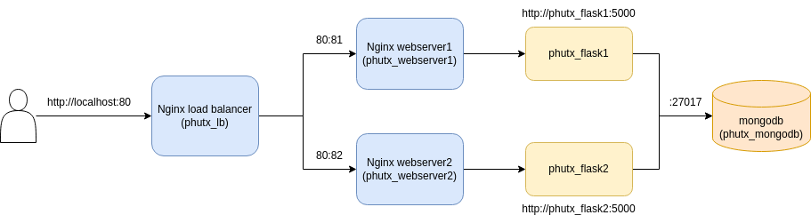

# Kiến trúc triển khai
## Hình ảnh kiến trúc

## Bản mô tả kiến trúc
- Khi user request trang web tại http://localhost:80 thì sẽ được nginx load balancer (phutx_lb) tiếp nhận.
- Từ đây, load balancer sẽ phân phối requests qua 2 nginx servers là phutx_webserver1 và phutx_webserver2 chạy trên 2 port lần lượt là 81 và 82. 
- Từ một trong 2 web server, request được chuyển đến flask containers (phutx_flask1 hoặc phutx_flask2).
- Flask app chạy các logic bên dưới và có thể sẽ request hoặc thao tác data trên MongoDb (phutx_mongodb).
- Flask app trả về các responses và chuyển về nginx server.
- Nginx trả response về cho user thông qua nginx load balancer.
