## Project giữa kỳ
### Bùi Minh Sơn

### Phát triển một 3-tier web application đơn giản 
 - Mã nguồn backend: [api.py](./sonbm/app/api.py)
 - Mã nguồn frontend: [app.js](./sonbm/frontend/src/App.js)
 - Mã nguồn unittest cho các chức năng API: [test_backend.py](./sonbm/app/test_backend.py)

### Triển khai web application sử dụng các DevOps tools & practices

#### 1. Containerization 
 - Dockerfile cho từng dịch vụ: 
- [Frontend](./sonbm/frontend/Dockerfile) 
    ```Dockerfile
    FROM node:18.16.0-alpine3.17 AS build
    WORKDIR /app
    COPY package*.json ./
    RUN npm install
    RUN npm install axios
    COPY . .
    RUN npm run build

    FROM nginx:1.22.0-alpine AS production
    COPY --from=build /app/build /usr/share/nginx/html
    COPY nginx.conf /etc/nginx/conf.d/default.conf
    EXPOSE 80
    CMD [ "nginx", "-g", "daemon off;" ]
    ```
- [Backend](./sonbm/app/Dockerfile)

    ```Dockerfile
    FROM python:3.9
    WORKDIR /app
    ENV FLASK_APP=api.py
    ENV FLASK_RUN_HOST=0.0.0.0
    COPY ./requirements.txt .
    RUN pip install -r requirements.txt
    EXPOSE 5000
    COPY . .
    CMD ["python3", "-m", "flask", "run"]
    ```
- Output câu lệnh build và history image frontend

    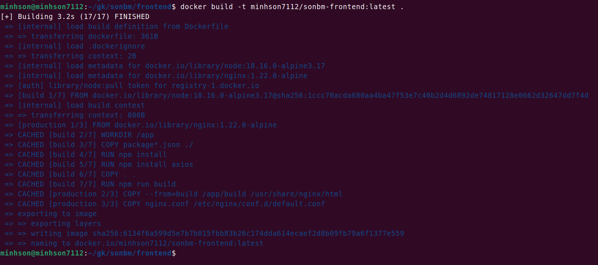
    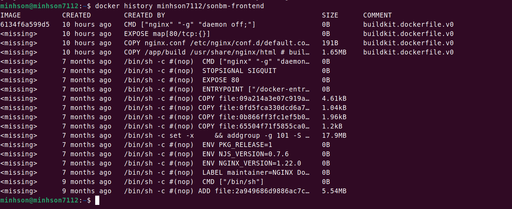

- Output câu lệnh build và history image backend

    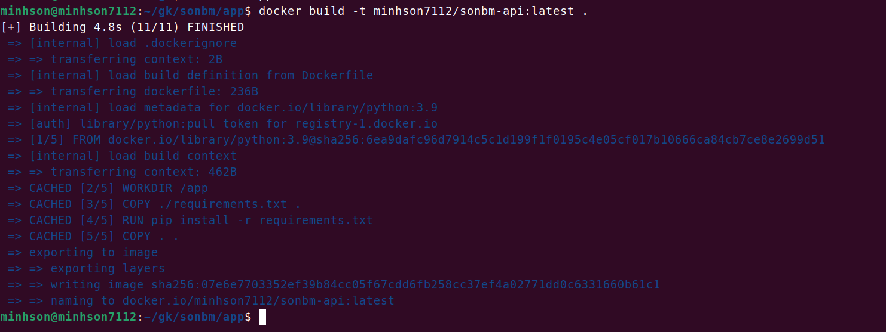
    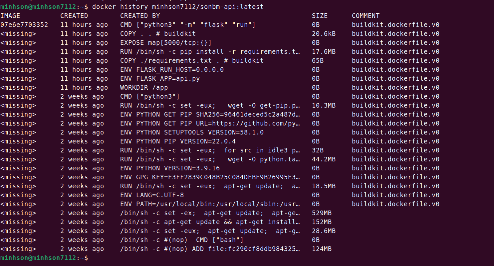

- Output history database

    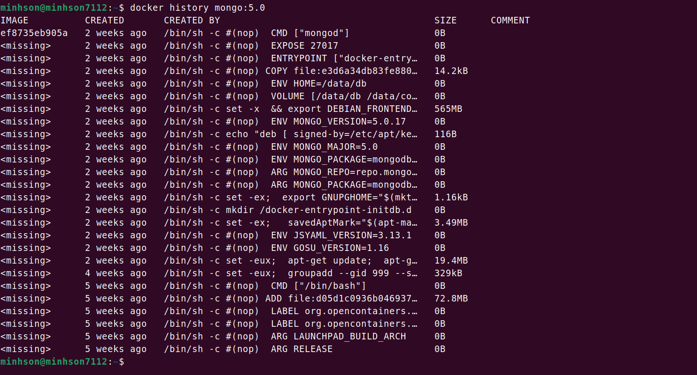

#### 2. Continuous Integration
 - File setup công cụ CI:

    ```yaml
    # This workflow will install Python dependencies, run tests and lint with a single version of Python
    # For more information see: https://docs.github.com/en/actions/automating-builds-and-tests/building-and-testing-python

    name: Python application

    on:
      push:
        branches:
          - '*'
      pull_request:
        branches: [ "master" ]

    permissions:
      contents: read
      pull-requests: write
    jobs:
      build:

        runs-on: ubuntu-latest

        steps:
        - uses: actions/checkout@v3
        - name: Set up Python 3.10
          uses: actions/setup-python@v3
          with:
            python-version: "3.10"
        - name: Install dependencies
          run: |
            python -m pip install --upgrade pip
            python -m pip install flake8 pytest pytest-cov bson
            pip install -r ./sonbm/app/requirements.txt
        - name: Lint with flake8
          run: |
            # stop the build if there are Python syntax errors or undefined names
            flake8 . --count --select=E9,F63,F7,F82 --show-source --statistics
            # exit-zero treats all errors as warnings. The GitHub editor is 127 chars wide
            flake8 . --count --exit-zero --max-complexity=10 --max-line-length=127 --statistics
        - name: Test with pytest
          run: |
            pytest --cov-report "xml:coverage.xml"  --cov=.
        - name: Create Coverage 
          if: ${{ github.event_name == 'pull_request' }}
          uses: orgoro/coverage@v3
          with:
              coverageFile: coverage.xml
              token: ${{ secrets.GITHUB_TOKEN }}

    ```
- Output log của luồng CI
     
     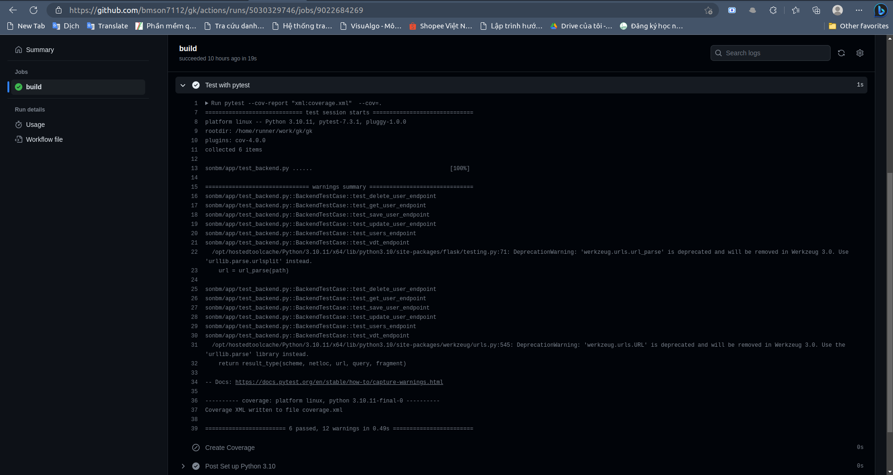

- Lịch sử chạy CI

    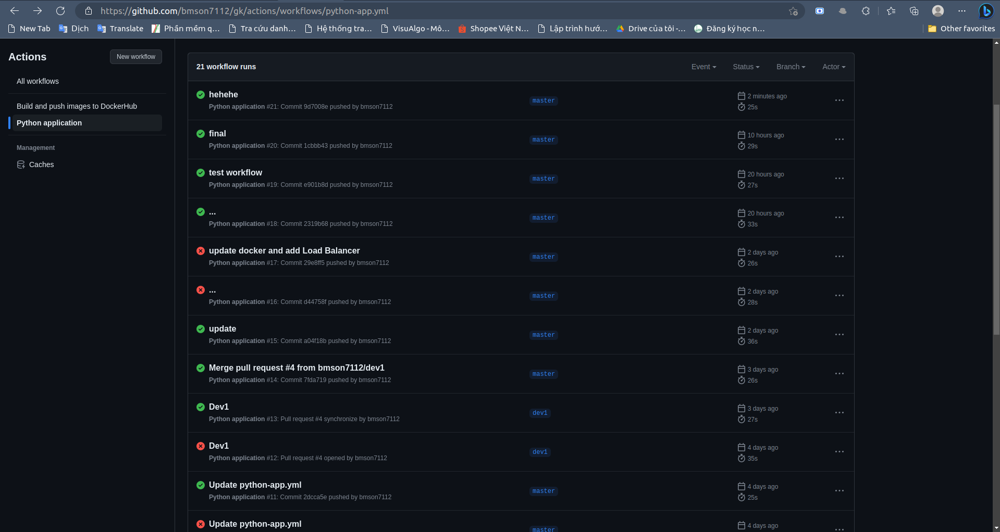
    
- Tự động chạy test khi Pull request, Python Coverage

    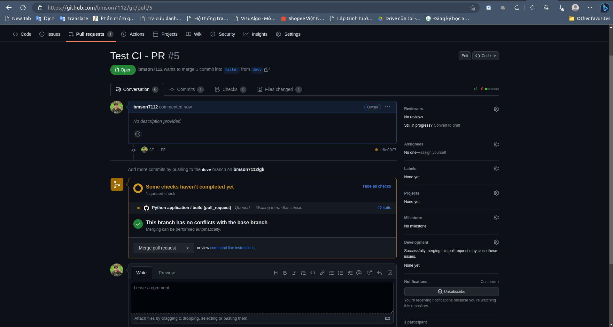

    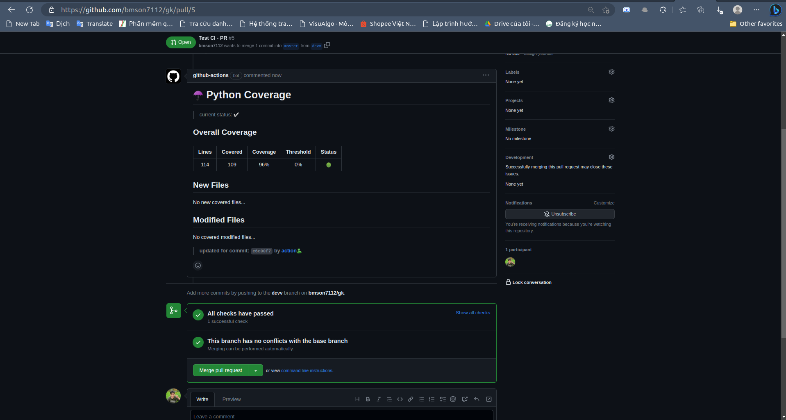

#### 3. Continuous Delivery

- Ảnh minh họa kiến trúc triển khai và bản mô tả

    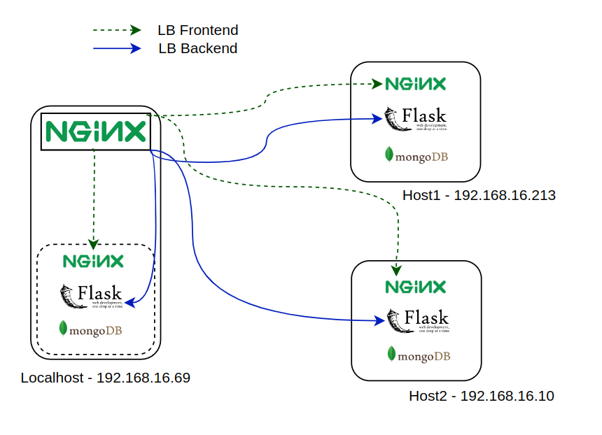

    - Hệ thống có 3 host bao gồm 1 máy chính(localhost) và 2 máy ảo bên trong nó. Mỗi host sẽ đều triển khai cả 3 service của Webapp đó là frontend, backend, database.
    => Tổng cộng mỗi dịch vụ sẽ được triển khai trên 3 Container khác nhau

    - 1 con nginx sẽ được triển khai trên máy chính nhằm thực hiện việc cân bằng tải frontend, backend trên cả 3 máy 
    - File cấu hình Load balancer được hiển thị tại [đây](./Ansible/roles/lb/templates/nginx.conf) 

- Video kiểm tra hoạt động của bộ cân bằng tải ( bên trong thư mục images)

  

- File setup CD 

    ```yaml
    name: Build and push images to DockerHub

  on:
    push:
      tags:
        - '*'

  jobs:
    build-and-push:
      name: Build and Push image to DockerHub
      runs-on: ubuntu-latest
      steps:   
        - name: Check out the repo
          uses: actions/checkout@v3

        - name: Log in to Docker Hub
          uses: docker/login-action@v2
          with:
            username: ${{ secrets.DOCKERHUB_USERNAME }}
            password: ${{ secrets.DOCKERHUB_PASSWORD }}

        - name: Set up Docker Buildx
          uses: docker/setup-buildx-action@v2

        - name: Build and push Backend Docker image
          uses: docker/build-push-action@v4
          with:
            context: "{{defaultContext}}:sonbm/app"
            push: true
            tags: ${{ secrets.DOCKERHUB_USERNAME }}/sonbm-app:${{  github.ref_name }}

        - name: Build and push Frontend Docker image
          uses: docker/build-push-action@v4
          with:
            context: "{{defaultContext}}:sonbm/frontend"
            push: true
            tags: ${{ secrets.DOCKERHUB_USERNAME }}/sonbm-frontend:${{  github.ref_name }}
      ```

- Output của luồng build và push Docker Image lên Docker Hub

    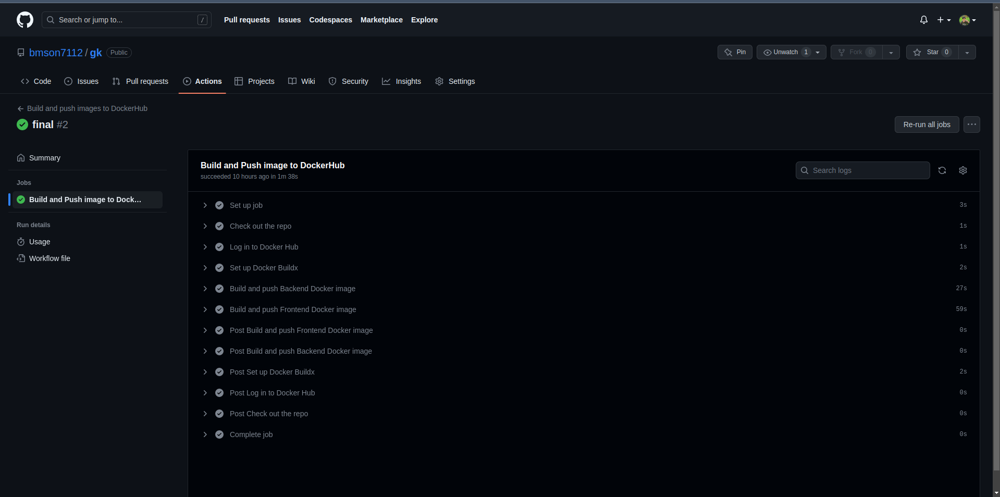

  - Output log Backend

    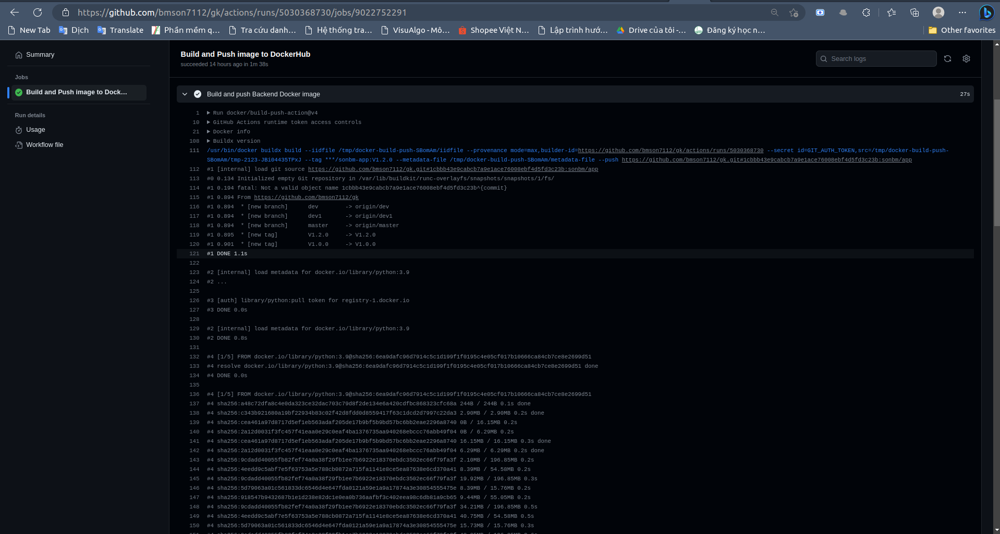

  - Output log Frontend

    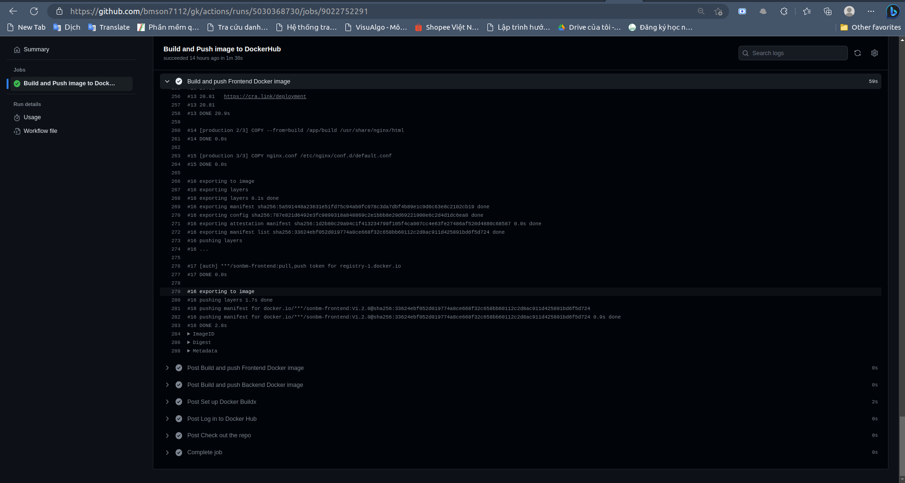

- Lịch sử CD

    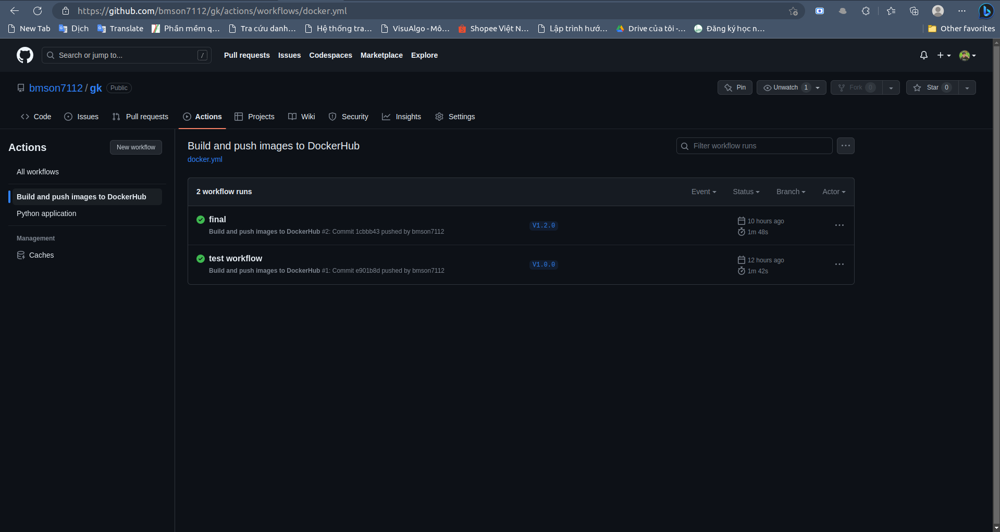

- Hướng dẫn sử dụng `ansible playbook` để triển khai các thành phần hệ thống

  Kiến trúc Ansible: 

    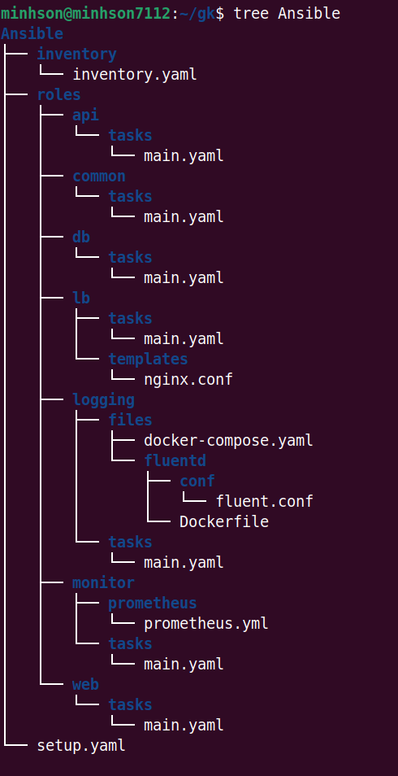

  - Danh sách các roles: 
     
    - [common](./Ansible/roles/common/tasks/main.yaml)
    - [web](./Ansible/roles/web/tasks/main.yaml)
    - [api](./Ansible/roles/api/tasks/main.yaml)
    - [db](./Ansible/roles/db/tasks/main.yaml)
    - [lb](./Ansible/roles/lb/tasks/main.yaml)


  Sử dụng lệnh sau để chạy Ansible playbook:
  `ansible-playbook -i Ansible/inventory/inventory.yaml Ansible/setup.yaml`

  Với cấu hình file playbook là [setup.yaml](./Ansible/setup.yaml)

  ```yaml
  ---
  - name: log
    hosts: localhost
    become: true
    gather_facts: true
    roles:
      - logging


  - name: sonbm
    hosts: all
    become: true
    gather_facts: true
    roles:
      - common
      - db
      - web
      - api
      - monitor

  - name: lb
    hosts: localhost
    become: true
    gather_facts: true
    roles:
      - lb
  ```

- Output log triển khai hệ thống

    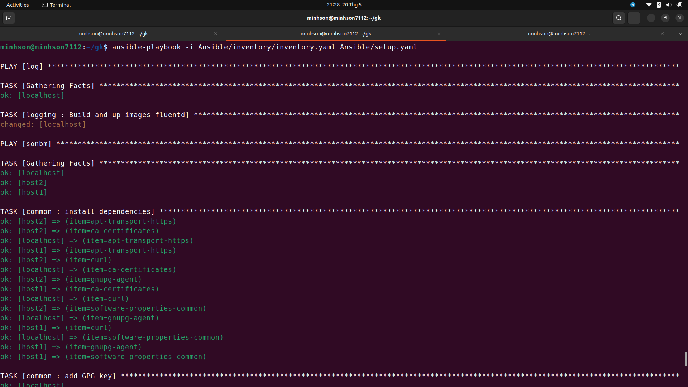

    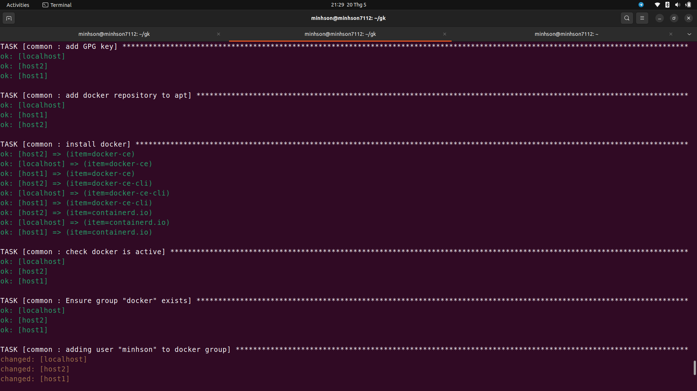

    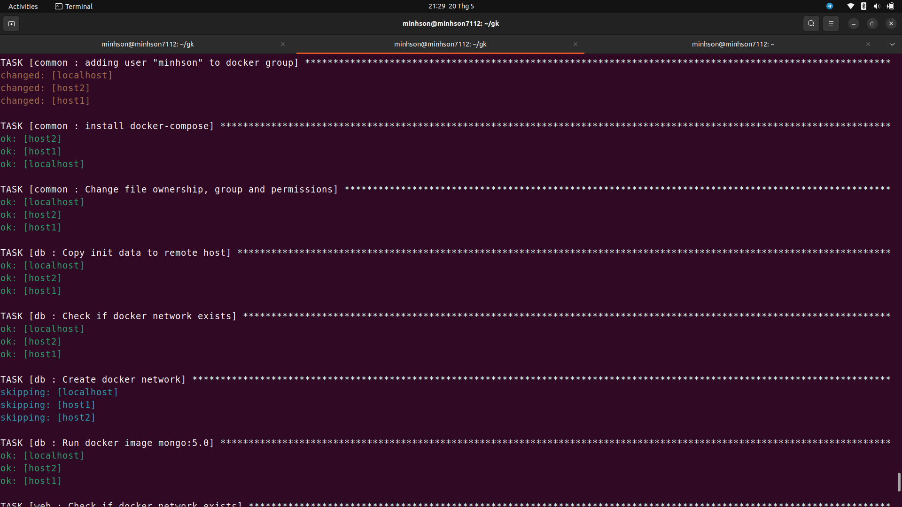

    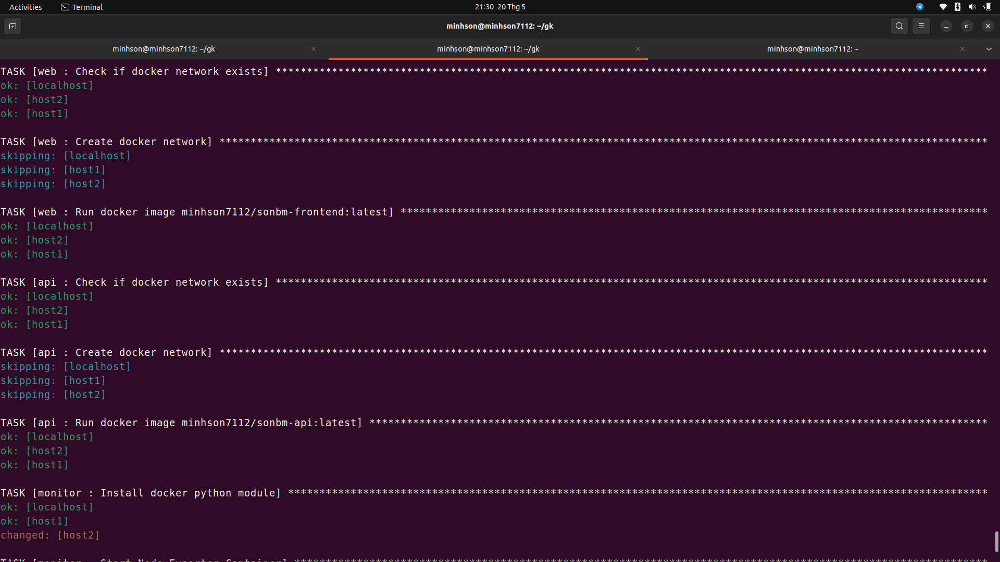

    

    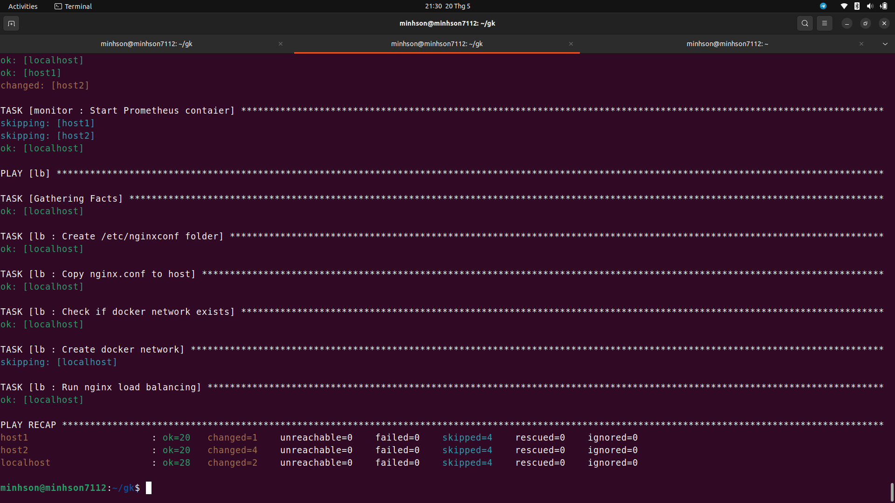

#### 4. Monitoring
- Role monitor chứa các playbook và cấu hình giám sát cho hệ thống
  - Ta có file thực thi role monitor lại [đây](./Ansible/roles/monitor/tasks/main.yaml) 
  - File cấu hình Prometheus tại [đây](./Ansible/roles/monitor/prometheus/prometheus.yml)

- Ảnh chụp dashboard giám sát nodes & containers, có thể sử dụng hệ thống prometheus tập trung ở 171.236.38.100:9090

  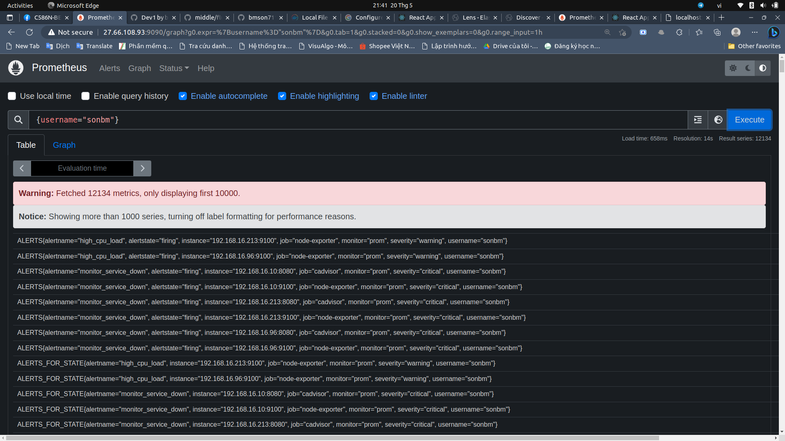

#### 5. Logging

- Ansible playbook triển khai các dịch vụ collect log (tách module logging)

  - File thực thi role logging tại [đây](./Ansible/roles/logging/tasks/main.yaml)

  - File cấu hình FLuentd tại [đây](./Ansible/roles/logging/files/fluentd/conf/fluent.conf)

  - Kết quả index lấy từ Kibana

    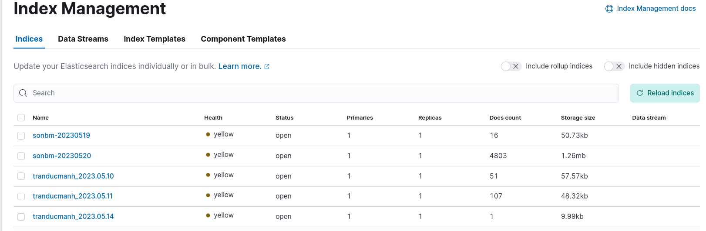

  - Kết quả sample log lấy từ Kibana

    

