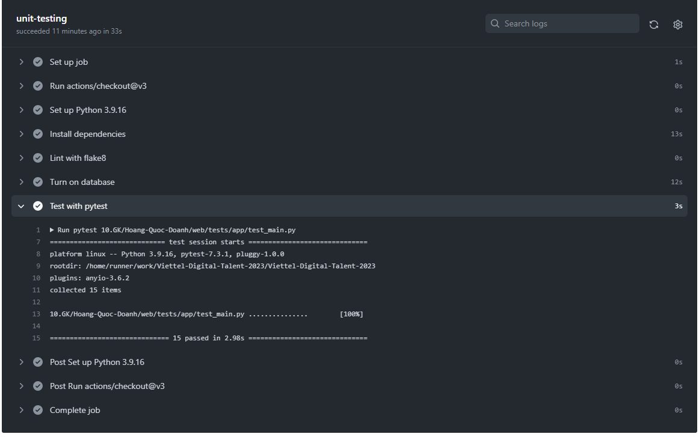
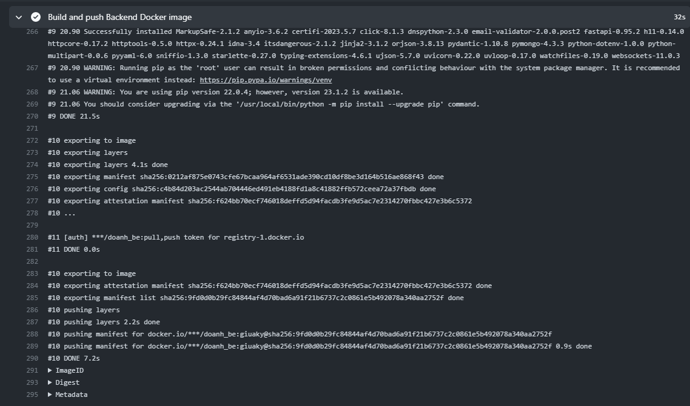
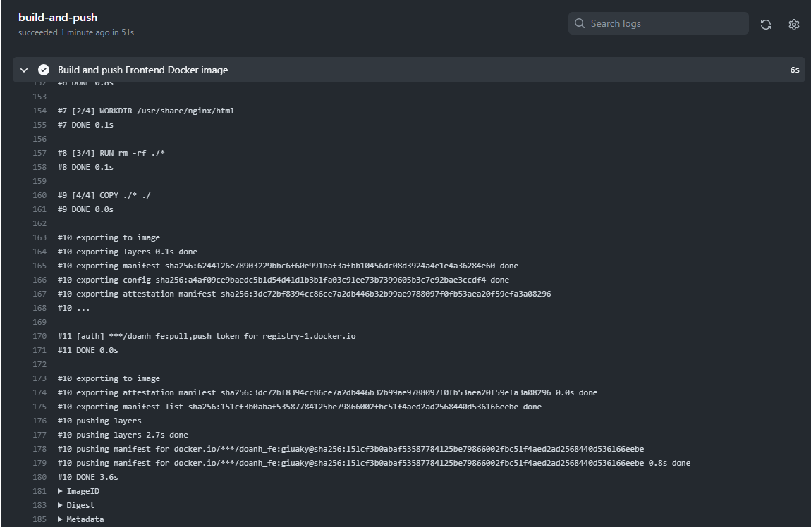

# Project giữa kỳ - Hoàng Quốc Doanh
## Phát triển một 3-tier web application đơn giản

 - Mã nguồn backend: [main.py](./web/app/main.py)
 - Mã nguồn frontend: [index.html](./web/nginx/index.html)
 - Mã nguồn unittest cho các chức năng API: [test_main.py](./web/tests/templates/test_main.py)

## Triển khai web application sử dụng các DevOps tools & practices

### 1. Containerization

- Dockerfile cho backend:
```Dockerfile
FROM python:3.9-alpine

WORKDIR /app

COPY . .

RUN pip install "fastapi[all]" pymongo --no-cache-dir

CMD uvicorn main:app --reload --host 0.0.0.0 --port 8000

```
- Dockerfile cho frontend:
```Dockerfile
FROM nginx:1.22.0-alpine

WORKDIR /usr/share/nginx/html

RUN rm -rf ./*

COPY ./* ./

ENTRYPOINT [ "nginx", "-g", "daemon off;" ]

```

- Output và history image `doanh_fe`

    
    

- Output và history image `doanh_be`

    
    
    
### 2. CI

- Source code phần setup CI:
```

on:
  push:
    branches: [ "main", "midterm" ]
  pull_request:
    branches: [ "main" ]

permissions:
  contents: read

jobs:
  unit-testing:

    runs-on: ubuntu-latest

    steps:
    - uses: actions/checkout@v3
    - name: Set up Python 3.9.16
      uses: actions/setup-python@v3
      with:
        python-version: "3.9.16"
    - name: Install dependencies
      run: |
        python -m pip install --upgrade pip
        pip install flake8 pytest
        if [ -f ./10.GK/Containerization/requirements.txt ]; then pip install -r ./10.GK/Containerization/requirements.txt; fi
    - name: Lint with flake8
      run: |
        # stop the build if there are Python syntax errors or undefined names
        flake8 . --count --select=E9,F63,F7,F82 --show-source --statistics
        # exit-zero treats all errors as warnings. The GitHub editor is 127 chars wide
        flake8 . --count --exit-zero --max-complexity=10 --max-line-length=127 --statistics
    - name: Turn on database
      run: |
        docker compose -f ./10.GK/Containerization/docker-compose-db.yaml up -d
    - name: Test with pytest
      run: |
        pytest 10.GK/Containerization/tests/app/test_main.py
  
  
```

- Output nguồn log của CI khi push commit lên 1 branch:
  
  
### 3. CD
- Source code phần set up CD:
```

  
  build-and-push:
    runs-on: ubuntu-latest
    steps:
      -
        name: Checkout
        uses: actions/checkout@v3
      -
        name: Login to Docker Hub
        uses: docker/login-action@v2
        with:
          username: ${{ secrets.DOCKERHUB_USERNAME }}
          password: ${{ secrets.DOCKERHUB_TOKEN }}
      -
        name: Set up Docker Buildx
        uses: docker/setup-buildx-action@v2
      -
        name: Build and push Backend Docker image
        uses: docker/build-push-action@v4
        with:
          context: 10.GK/Hoang-Quoc-Doanh/web/app
          file: 10.GK/Hoang-Quoc-Doanh/web/app/Dockerfile
          push: true
          tags: ${{ secrets.DOCKERHUB_USERNAME }}/doanh_be:${{  github.ref_name }}
      -
        name: Build and push Frontend Docker image
        uses: docker/build-push-action@v4
        with:
          context: 10.GK/Hoang-Quoc-Doanh/nginx/app
          file: 10.GK/Hoang-Quoc-Doanh/web/nginx/Dockerfile
          push: true
          tags: ${{ secrets.DOCKERHUB_USERNAME }}/doanh_fe:${{  github.ref_name }}
```

- Output luồng build và push image backend lên dockerhub:
  
 
- Output luồng build và push image frontend lên dockerhub:
  

