# Midterm assignment - VDT Cloud

## 0. Phát triển three-tier web app
Web app có các chức năng đơn giản như liệt kê danh sách các sinh viên, tìm kiếm theo username, xóa, cập nhật thông tin một sinh viên, thêm thông tin sinh viên mới.
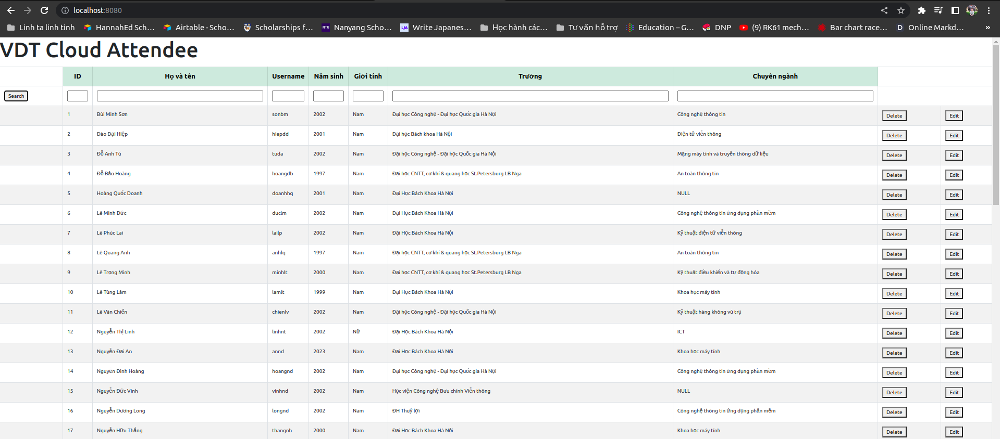

Hệ thống gồm ba dịch vụ:

- Web: Giao diện viết bằng html + css + javascript, triển khai trên nền nginx.
- Api: Sử dụng Flask với các chức năng get, create, delete, update các thông tin. Các chức năng trong api đều có unit tests, sử dụng thư viện pytest.
- Database: Sử dụng Mongodb

## 1. Containerization
Các dịch vụ đều được đóng gói thành các container.

Output câu lệnh build các image (bằng docker-compose):
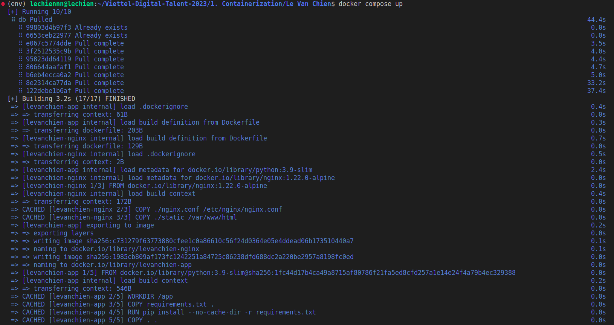
### Web

Dockerfile
```
FROM nginx:1.22.0-alpine
COPY ./nginx.conf /etc/nginx/nginx.conf
COPY ./static /var/www/html
```
Docker history
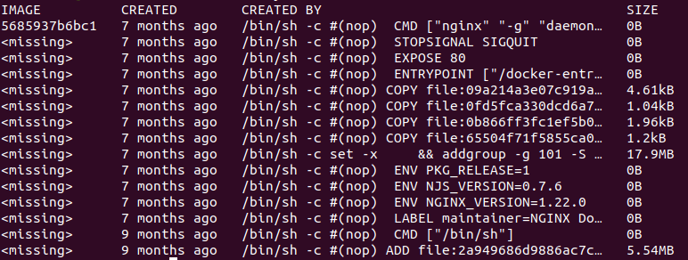
### Api
Dockerfile
```
FROM python:3.9-slim
WORKDIR /app
COPY requirements.txt .
RUN pip install --no-cache-dir -r requirements.txt
ENV FLASK_APP=app.py
COPY . .
CMD ["python", "app.py"]
```
Docker history
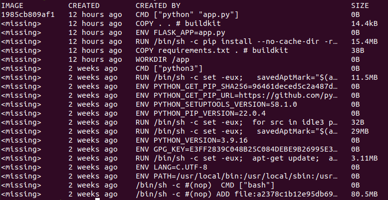
### Db
Docker history
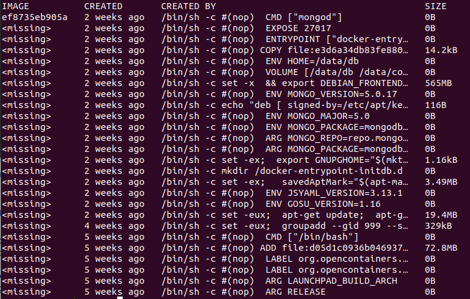

Kích thước các images:
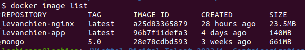

## 2. Continuous Integration
File setup công cụ CI:
```
name: CI

on:
  push:
    branches:
      - midterm
  pull_request:
    branches:
      - midterm
 
jobs:
  test:
    runs-on: ubuntu-20.04

    steps:
      - name: checkout code
        uses: actions/checkout@v3

      - name: setup Python
        uses: actions/setup-python@v3
        with:
          python-version: 3.8
          
      - name: install dependencies
        run: |
                pip install --upgrade pip
                pip install -r 1.\ Containerization/Le\ Van\ Chien/app/tests/test_requirements.txt
      - name: run tests
        working-directory: 1. Containerization/Le Van Chien/app
        run: pytest

```
Việc chỉ định branch `midterm` trong `on.push` và `on.pull_request` là để github actions tự động thực hiện jobs test (chạy các unit tests đã viết ở phần trước) khi có sự kiện push commit hoặc tạo PR vào branch `midterm`

Github Actions thực hiện test sau khi push commit:
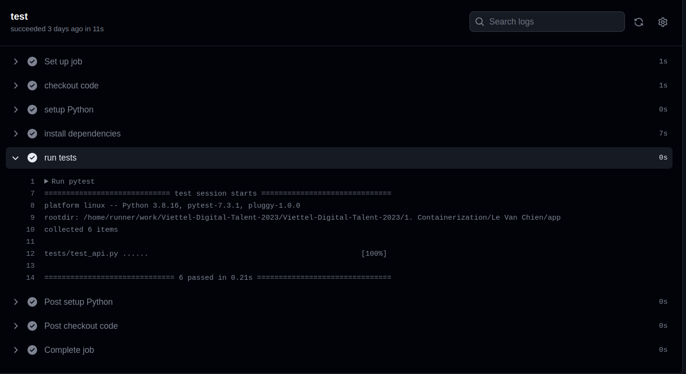

## 3. Continuous Delivery

Phần này sử dụng Ansible-playbook để setup và build các container trên một host.

### File setup CD
```
name: Build Dockerfile and push

on:
  push:
    tags:
      - v*

jobs:
  docker:
    runs-on: ubuntu-20.04
    steps:
      - name: Checkout
        uses: actions/checkout@v3
      
      - name: Setup Docker Buildx
        uses: docker/setup-buildx-action@v2

      - name: Login to Docker Hub
        uses: docker/login-action@v2
        with:
          username: ${{ secrets.DOCKERHUB_USERNAME }}
          password: ${{ secrets.DOCKERHUB_TOKEN }}

      - name: Build and push app image
        uses: docker/build-push-action@v4
        with:
          context: 1. Containerization/Le Van Chien/app/
          push: true
          tags: ${{ secrets.DOCKERHUB_USERNAME }}/app:${{ github.ref_name }}

      - name: Build and push web image
        uses: docker/build-push-action@v4
        with:
          context: 1. Containerization/Le Van Chien/nginx/
          push: true
          tags: ${{ secrets.DOCKERHUB_USERNAME }}/web:${{ github.ref_name }}

```
Việc chỉ định `tags` trong `on.push` là để Github Actions tự động build các Dockerfile của dịch vụ web và api và push lên docker hub:

- Sau khi push một tag mới:
```
git tag v1.2
git push origin midterm v1.2
```
- Github action tự động build image và push lên dockerhub với tag vừa push:

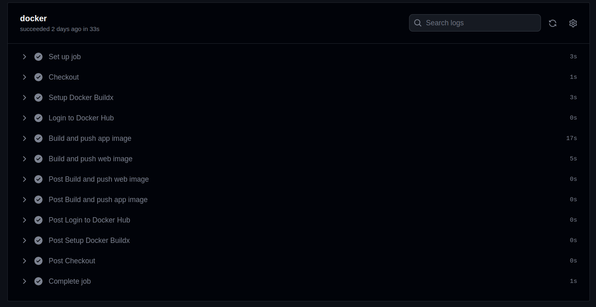
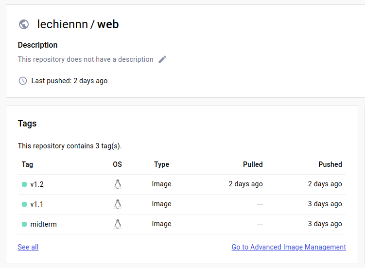

Kế quả thực hiện 2 actions CI, CD trên github mỗi lần push:

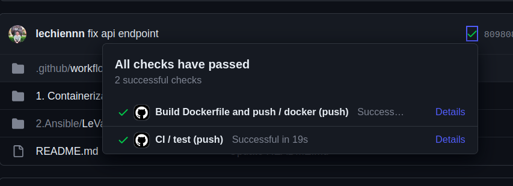

---

### **Cấu trúc cây thư mục các roles và các file playbooks**
```
├── ansible.cfg
├── inventories
│   └── inventory.yaml
├── requirements.yaml
├── roles
│   ├── api
│   │   ├── defaults
│   │   │   └── main.yaml
│   │   └── tasks
│   │       └── main.yaml
│   ├── common
│   │   ├── defaults
│   │   │   └── main.yaml
│   │   ├── handlers
│   │   │   └── main.yaml
│   │   └── tasks
│   │       ├── main.yaml
│   │       ├── setup_centos.yaml
│   │       └── setup_ubuntu.yaml
│   ├── db
│   │   ├── defaults
│   │   │   └── main.yaml
│   │   └── tasks
│   │       └── main.yaml
│   ├── lb
│   │   ├── defaults
│   │   │   └── main.yaml
│   │   ├── files
│   │   │   ├── Dockerfile
│   │   │   └── nginx.conf
│   │   └── tasks
│   │       └── main.yaml
│   └── web
│       ├── defaults
│       │   └── main.yaml
│       └── tasks
│           └── main.yaml
└── setup.yaml
```
Các roles web và api pull images từ dockerhub và triển khai các dịch vụ web và api trên 2 container khác nhau cho mỗi dịch vụ:

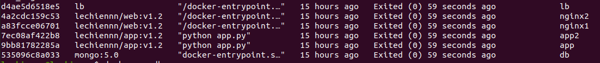

Các container `nginx1` và `nginx2` đóng vai trò là các web server, container `lb` cũng sử dụng nginx nhưng đóng vai trò là load balancer, reverse proxy, được cấu hình để gửi request đến một trong hai web server:
```
upstream server {
		server nginx1:80;
		server nginx2:80;
	}
```

Output triển khai hệ thống:
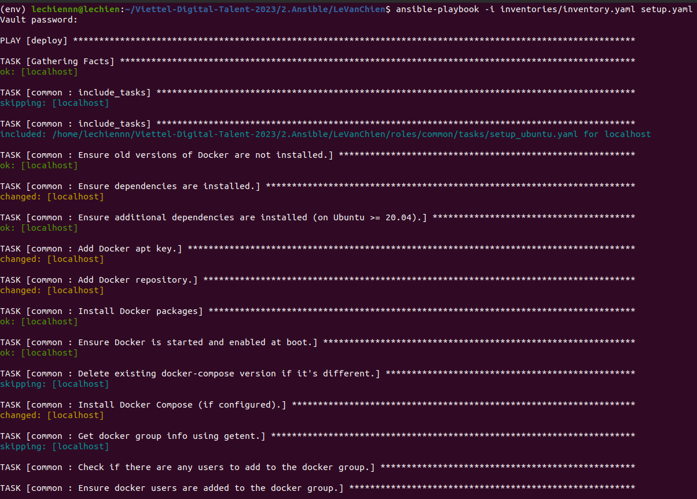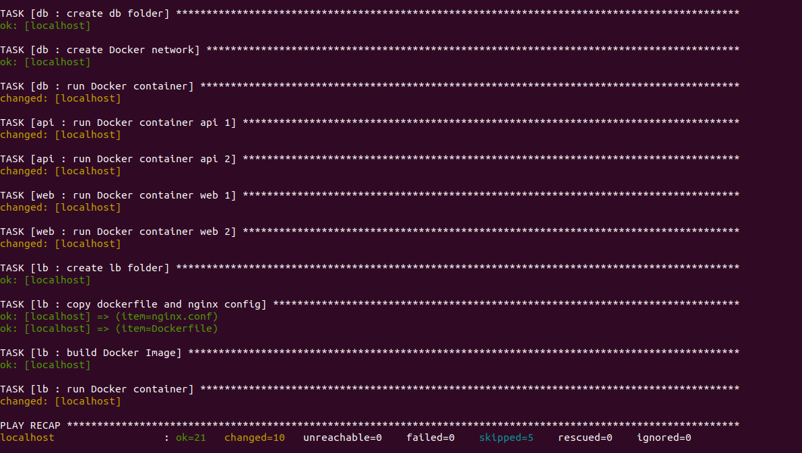

## 4. Monitoring
Role `monitor` cài đặt các dịch vụ `Node-exporter` và `cadvisor` dưới dạng các container, gửi các thông số giám sát đến hệ thống prometheus tập trung http://27.66.108.93:9090/ với label `username='levanchien'`

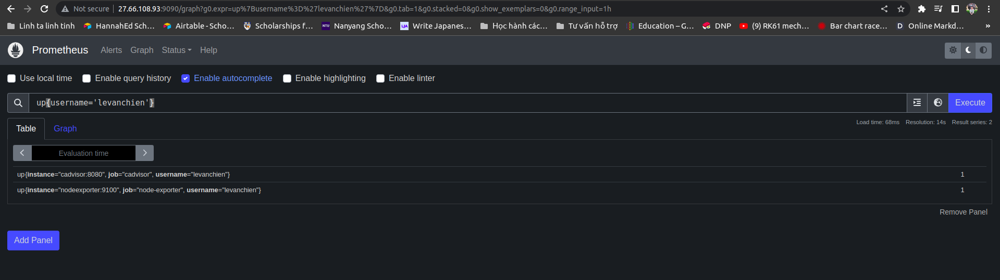

Dashboard giám sát nodes & container trên grafana:
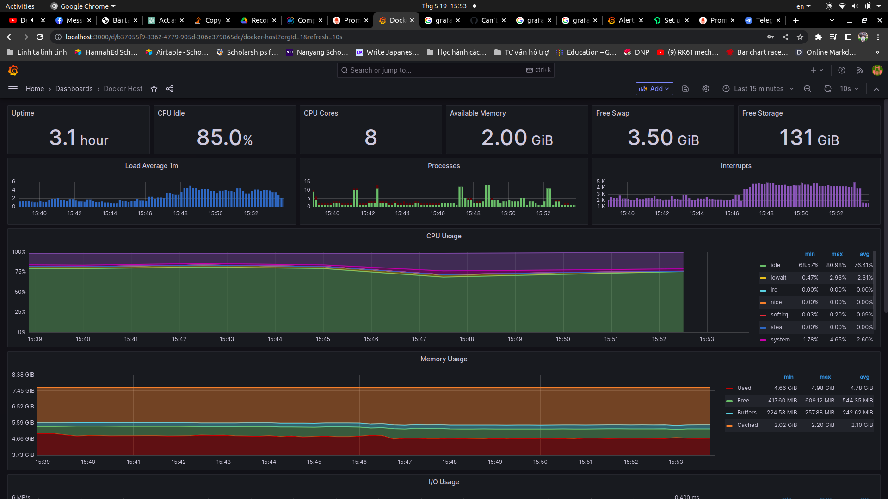 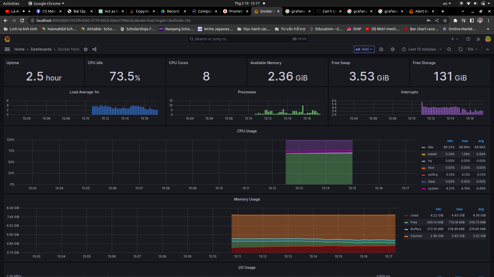

## 5. Logging

Role `log` cài đặt dịch vụ fluentd để collect log từ load balancer `lb`, đẩy log lên hệ thống Elasticsearch tập trung `171.236.38.100:9200` với index `chienlv`

Kibana:

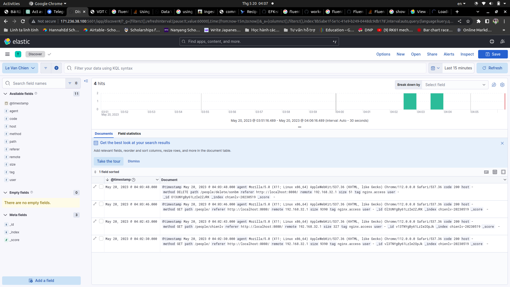

Log có các thông tin về thời gian, action, kêt quả (status code),...

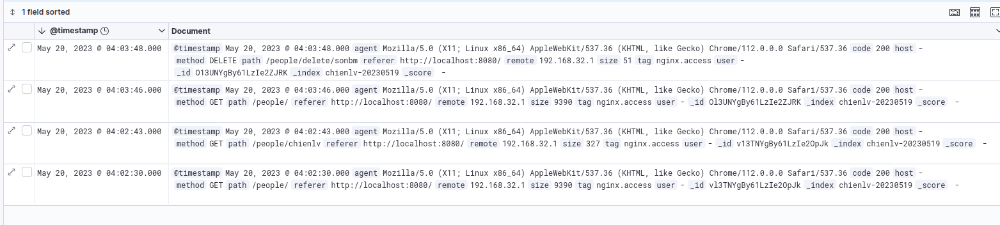

