# Midterm Project

# Table of contents
## [I. Three-tier Web Application](#1-3-tier-web-application)

## [II. Deploying the application using DevOps tools and practices](#2-deploying-the-application-using-devops-tools-and-practices)

-   ### [1. Containerization](#21-containerization)
-   ### [2. Continuous Integration](#22-continuous-integration)
-   ### [3. Continuous Delivery](#23-continuous-delivery)
-   ### [4. Monitoring](#24-monitoring)
-   ### [5. Logging](#24-logging)
  
## [III. Results](#3-results)

# 1. 3-tier Web Application

*Requirements*

Design and develop a simple CRUD web application that performs the following functions:
- Display a list of students participating in the VDT 2023 program in the Cloud field.
- Allow viewing, adding, deleting, and updating student information.

Design the system with three services:
- Web: A web interface written in HTML + CSS + Javascript implemented on an Nginx web server.
- API: A RESTful API written in a programming language of your choice (preferably Python) with all necessary functions: list, get, create, update, and delete student information records.
- DB: An SQL or NoSQL database that stores student information.

Write unit tests for the API functions. (*Write unit tests for the interface functions, and write integration tests*)

*Results*

Check source code [here](./source_code)!

**Unit test:**
```python
import unittest
from mongomock import MongoClient
from bson import ObjectId
from app import create_app
from utils import insert_attendee
import logging


def mock_data():
    test_client = MongoClient()
    db = test_client["testdb"]
    test_collection = db["test_collection"]
    if test_collection.estimated_document_count() == 0:
        students = [
            {
                'stt': '1',
                'name': 'Nguyen Van Chi',
                'username': 'chinv',
                'birth_year': '1990',
                'gender': 'Nam',
                'university': 'XYZ University',
                'major': 'Computer Science'
            },
        ]

        for student in students:
            insert_attendee(test_collection, student)

    return test_collection


class AppTestCase(unittest.TestCase):

    def setUp(self):
        logging.basicConfig()
        self.test_collection = mock_data()
        self.app = create_app(self.test_collection)
        self.app.config["TESTING"] = True
        self.app_client = self.app.test_client()
        self.log = logging.getLogger("LOG")

        self.INIT_COLLECTION_SIZE = self.test_collection.estimated_document_count()
        self.test_student = self.test_collection.find_one({})
        self.new_student = {
            'name': 'Nguyen Thi No',
            'username': 'nont',
            'birth_year': '1995',
            'gender': 'Nữ',
            'university': 'ABC University',
            'major': 'Engineering'
        }

    def tearDown(self):
        self.test_collection.drop()

    def test_index_route(self):
        response = self.app_client.get('/')

        self.assertEqual(response.status_code, 200)

    def test_get_list_students_(self):
        response = self.app_client.get('/students')

        self.assertEqual(response.status_code, 200)

    def test_add_student(self):
        response = self.app_client.post('/students/add', data=self.new_student)

        self.assertEqual(self.INIT_COLLECTION_SIZE +1, self.test_collection.estimated_document_count())

        result = self.test_collection.find_one({"name": self.new_student["name"]})

        self.assertIsNotNone(result)
        self.assertEqual(result["birth_year"], self.new_student["birth_year"])
        self.assertEqual(result["username"], self.new_student["username"])
        self.assertEqual(result["gender"], self.new_student["gender"])
        self.assertEqual(result["university"], self.new_student["university"])
        self.assertEqual(result["major"], self.new_student["major"])
        self.assertEqual(response.json, {'message': 'Student added successfully'})

    def test_view_student(self):
        student_id = str(self.test_student['_id'])
        response = self.app_client.get('/students/view?student_id=' + student_id)

        self.assertEqual(response.status_code, 200)

        student_data = response.data.decode('utf-8')
        self.assertIn(self.test_student['name'], student_data)
        self.assertIn(self.test_student["birth_year"], student_data)
        self.assertIn(self.test_student["username"], student_data)
        self.assertIn(self.test_student["gender"], student_data)
        self.assertIn(self.test_student["university"], student_data)
        self.assertIn(self.test_student["major"], student_data)

    def test_edit_route(self):
        student_id = str(self.test_student['_id'])
        response = self.app_client.get('/students/edit?student_id=' + student_id)
        self.assertEqual(response.status_code, 200)

    def test_update_student(self):
        student_id = str(self.test_student['_id'])
        response = self.app_client.post('/students/edit?student_id=' + student_id, data=self.new_student)

        updated_student = self.test_collection.find_one({'_id': ObjectId(student_id)})

        self.assertEqual(self.INIT_COLLECTION_SIZE, self.test_collection.estimated_document_count())
        self.assertIsNotNone(updated_student)
        self.assertEqual(updated_student["birth_year"], self.new_student["birth_year"])
        self.assertEqual(updated_student["username"], self.new_student["username"])
        self.assertEqual(updated_student["gender"], self.new_student["gender"])
        self.assertEqual(updated_student["university"], self.new_student["university"])
        self.assertEqual(updated_student["major"], self.new_student["major"])
        self.assertEqual(response.json, {'message': 'Student Details Updated Successfully'})

    def test_delete_student(self):
        student_id = str(self.test_student['_id'])
        response = self.app_client.delete('/students/' + student_id)

        self.assertEqual(self.INIT_COLLECTION_SIZE -1, self.test_collection.estimated_document_count())

        deleted_student = self.test_collection.find_one({'_id': ObjectId(student_id)})

        self.assertIsNone(deleted_student)
        self.assertEqual(response.json, {'message': 'Student Details Deleted Successfully'})


if __name__ == '__main__':
    unittest.main()

```

<p align = "center">
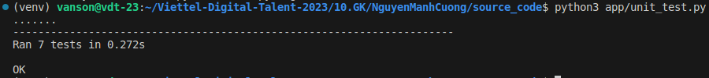 
<br>Picture 1. Unittest
</p>

<p align = "center">
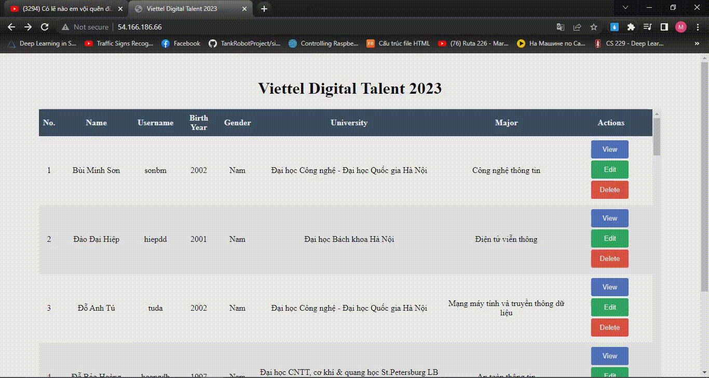 
<br>Picture 2. Demo web
</p>

# 2. Deploying the application using DevOps tools and practices

## 2.1 Containerization

*Requirements*:
- Write a Dockerfile to package services into container images 
- The image must ensure optimal build time and minimal disk space usage, and it is encouraged
to use image build tricks that have been introduced (layer-caching, optimized RUN instructions, multi-stage build, etc.)

*Results*

**Dockerfile for api**

```Dockerfile
FROM python:3.9-alpine3.17
WORKDIR /app
EXPOSE 5000
RUN pip install --no-cache-dir -U pip

COPY requirements.txt ./

RUN pip install --no-cache-dir -r requirements.txt && \
    rm requirements.txt
COPY . .
CMD [ "python3", "app.py" ]
```
**File config for nginx server**
```conf
server {
    listen 80;

    root /etc/static;
    index index.html;

    location / {
        try_files $uri $uri/ =404;
    }
    location /api {
        proxy_pass http://flask_app:5000/;
        
    }
    location /add {
        default_type text/html;
        alias /etc/static/add.html;
    }
    location /view {
        default_type text/html;
        alias /etc/static/view.html;
    }
    
    location /edit {
        default_type text/html;
        alias /etc/static/edit.html;
    }
}
```

**Dockerfile for web service**

```Dockerfile
FROM nginx:1.22.0-alpine
COPY ./nginx.conf  /etc/nginx/conf.d/default.conf
COPY ./static /etc/static
EXPOSE 80
CMD ["nginx", "-g", "daemon off;"]
```

<p align = "center">
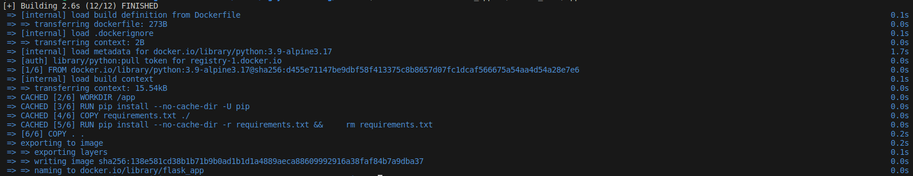 
<br>Picture 3. Output of building image api
</p>

<p align = "center">
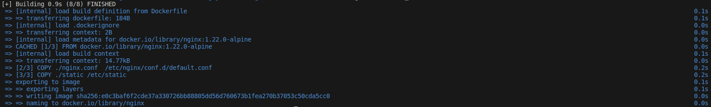 
<br>Picture 4. Output of building image web (nginx)
</p>
<p align = "center">
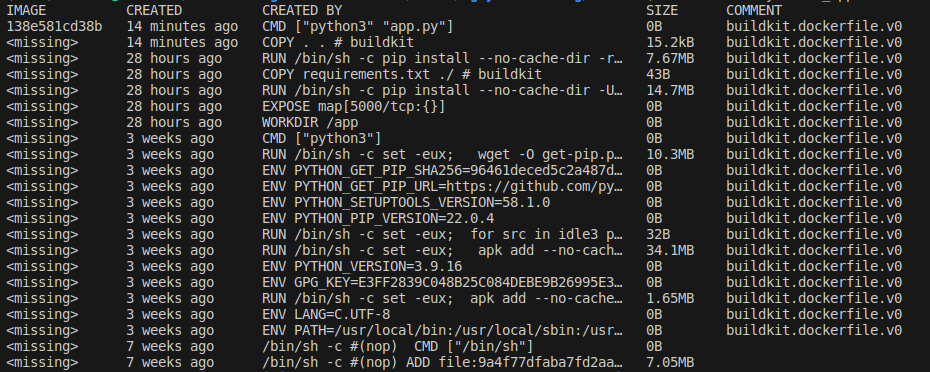 
<br>Picture 5. Output of Docker history for image api
</p>
<p align = "center">
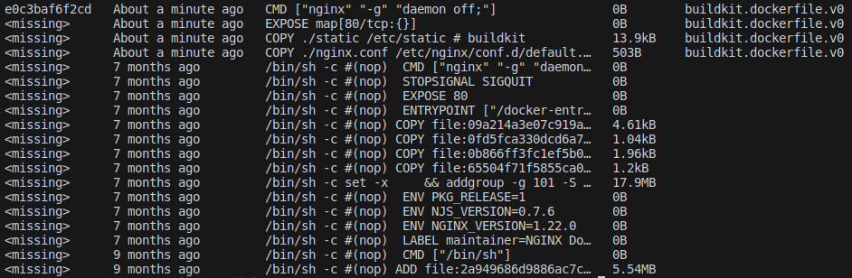 
<br>Picture 6. Output of Docker history for image web
</p>

## 2.2 Continuous Integration

*Requirements*:

- Automatically run unit tests when creating a pull request to the main branch.
- Automatically run unit tests when pushing commits to a branch.

*Results*

**Check file setup CI workflow:**

```yaml
    name: CI workflow

    on:
      pull_request:
        branches:
          - main
      
      push:
        branches:
        - midterm

    permissions:
      contents: read
      pull-requests: write

    jobs:
      unittest:
        runs-on: ubuntu-latest

        steps:
          - uses: actions/checkout@v3
          - name: Set up Python 
            uses: actions/setup-python@v3
            with:
              python-version: "3.10.6"

          - name: Install dependencies
            run: |
              python -m pip install --upgrade pip
              pip install mongomock
              pip install -r 10.GK/NguyenManhCuong/source_code/app/requirements.txt
          
          - uses: ricardochaves/python-lint@v1.4.0
            with:
              python-root-list: "10.GK/NguyenManhCuong/source_code/app"
              use-pylint: false
              use-pycodestyle: false
              use-flake8: true
              use-black: false
              use-mypy: false
              use-isort: false
              extra-flake8-options: "--exit-zero --max-line-length=127"

          - name: Run unit test
            run: |
              cd 10.GK/NguyenManhCuong/source_code/app
              python3 -m unittest unit_test.py

```
<p align = "center">
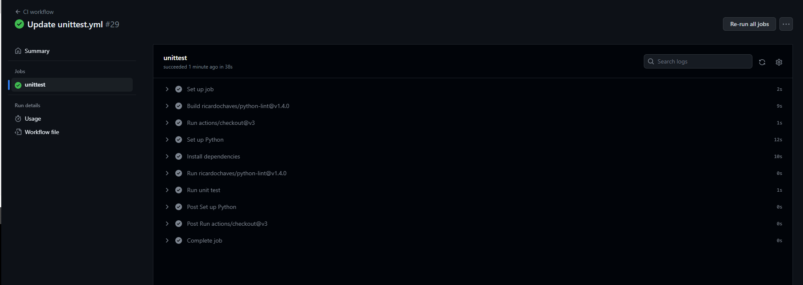 
<br>Picture 7. Output log CI workflow
</p>

<p align = "center">
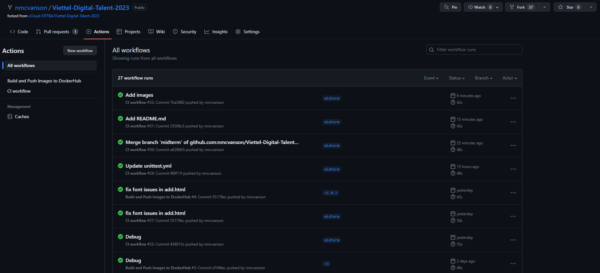 
<br>Picture 8. Workflow runs
</p>

## 2.3 Continuous Delivery

**Setup CD workflow:**

```yaml
name: Build and Push Images to DockerHub

on:
  push:
    tags:
      - '*'
  
jobs:
  build_and_push:
    name: Build and Push Images to DockerHub
    runs-on: ubuntu-latest
    steps:
      - uses: actions/checkout@v3

      - name: Log in to Docker Hub
        uses: docker/login-action@v2
        with:
          username: ${{ secrets.DOCKER_USERNAME }}
          password: ${{ secrets.DOCKER_PASSWORD }}
      
      - name: Set up Docker Buildx
        uses: docker/setup-buildx-action@v2
        
      - name: Get tag name
        if: startsWith(github.ref, 'refs/tags/')
        run: echo "TAG=$(echo ${{ github.ref }} | sed 's/refs\/tags\///')" >> $GITHUB_ENV
      
      - name: Build and Push Backend Images
        uses: docker/build-push-action@v4
        with:
          context: 10.GK/NguyenManhCuong/source_code/app
          push: true
          file: 10.GK/NguyenManhCuong/source_code/app/Dockerfile
          tags: |
            ${{ secrets.DOCKER_USERNAME }}/backend:${{ env.TAG }}
            ${{ secrets.DOCKER_USERNAME }}/backend:latest
            
      - name: Build and Push Frontend Images
        uses: docker/build-push-action@v4
        with:
          context: 10.GK/NguyenManhCuong/source_code/web
          file: 10.GK/NguyenManhCuong/source_code/web/Dockerfile
          push: true
          tags: |
            ${{ secrets.DOCKER_USERNAME }}/frontend:${{ env.TAG }}
            ${{ secrets.DOCKER_USERNAME }}/frontend:latest
```

<p align = "center">
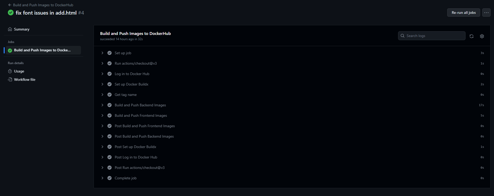 
<br>Picture 9. Output log CD workflow
</p>

<p align = "center">
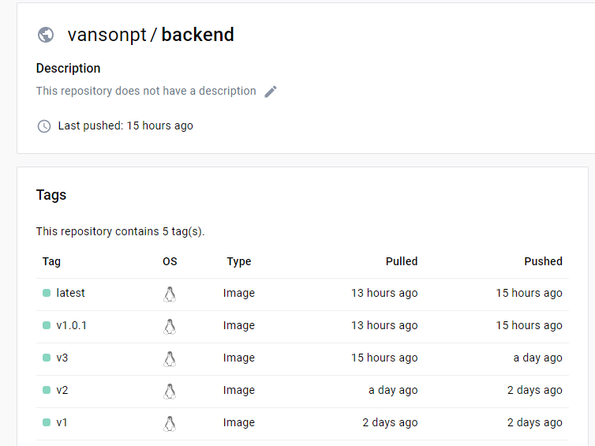 
<br>Picture 10. Image backend (api) in DockerHub
</p>

<p align = "center">
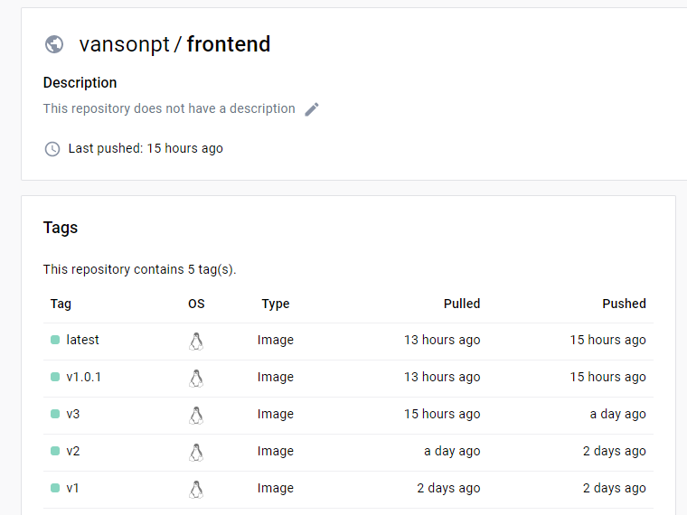 
<br>Picture 11. Image frontend (nginx) in DockerHub
</p>

**Application Architecture**

Deploy the web and API service on 3 different containers located on EC2 hosts, which will connect to a database located on a separate host. Requests to the web and API endpoints will be load balanced using the Nginx tool located on localhost.

<p align = "center">
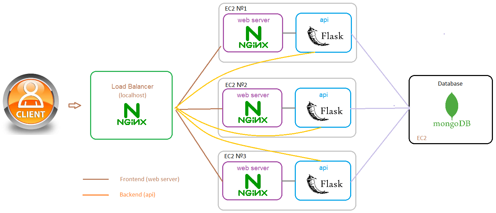 
<br>Picture 12. Application Architecture
</p>

**File config for load balancer:**
```config
upstream frontend {
    server  54.166.186.66:80 weight=3;
    server 44.203.194.242:80 weight=2;
    server 18.205.151.59:80 weight=1;
}

upstream backend {
    server 54.166.186.66:5000 weight=3;
    server 44.203.194.242:5000 weight=2;
    server 18.205.151.59:5000 weight=1;
}

server {
    listen 80;
    server_name localhost;

    location / {
        proxy_pass http://frontend/;
        proxy_set_header Host $host;
        proxy_set_header X-Real-IP $remote_addr;
    }

    location /flask_api {
        proxy_pass http://backend/;
        proxy_set_header Host $host;
        proxy_set_header X-Real-IP $remote_addr;
    }
}
```
**Using ansible for deployment** (check source [here](./Ansible))

**Inventory file:**
```yaml
all:
  hosts:
    localhost:
      ansible_connection: local
      ansible_python_interpreter: ../venv/bin/python3
      ansible_become_user: root
      ansible_become_password: vanson1997
      hostname: vdt-23
  children:
    remote_hosts:
      hosts:
        node1:
          ansible_ssh_host: 54.166.186.66
          ansible_ssh_user: ubuntu
          ansible_ssh_private_key_file: ~/Desktop/ec2/vdt_2023.pem
        node2:
          ansible_ssh_host: 44.203.194.242
          ansible_ssh_user: ubuntu
          ansible_ssh_private_key_file: ~/Desktop/ec2/vdt_2023.pem
        node3:
          ansible_ssh_host: 18.205.151.59
          ansible_ssh_user: ubuntu
          ansible_ssh_private_key_file: ~/Desktop/ec2/vdt_2023.pem

```
**Ansible playbook:**

``` yaml
- name: Setup Docker
  hosts: all
  become: true
  gather_facts: true
  roles:
  - common

- name: Setup Logging
  hosts: remote_hosts
  become: true
  gather_facts: true
  roles:
  - logging

- name: Setup database
  hosts: node1
  become: true
  gather_facts: true
  roles:
  - db

- name: Deploy the application on remote machines
  hosts: remote_hosts
  become: true
  gather_facts: true
  roles:
  - api
  - web

- name: Setup Monitoring
  hosts: remote_hosts
  become: true
  gather_facts: true
  roles:
  - monitor

- name: Setup Loadbalancer
  hosts: localhost
  become: true
  gather_facts: true
  roles:
  - lb
```
**Instructions for using ansible playbook to deployment:**

For each component, a playbook has been written corresponding to each role.

<p align = "center">
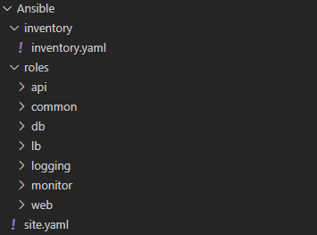
<br>Picture 13. Ansible folder
</p>

```shell
  #Setup virtual environment
  mkdir -p env
  virtualenv env/
  source env/bin/activate

  #run ansible playbook
  ansible-playbook -i inventoty/inventory.yml site.yml 
```
**Output log of system deployment**

<p align = "center">
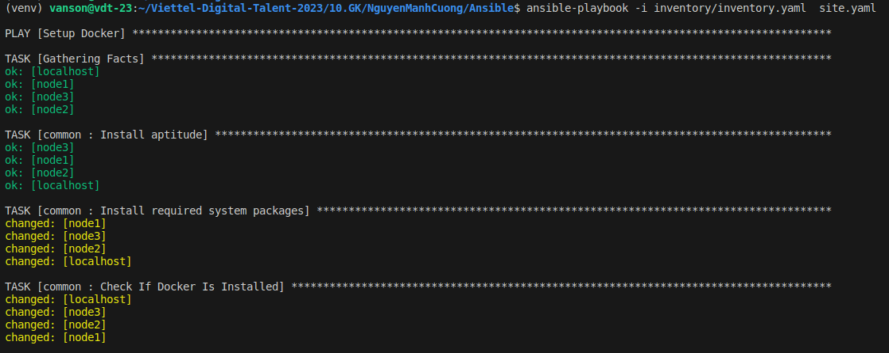
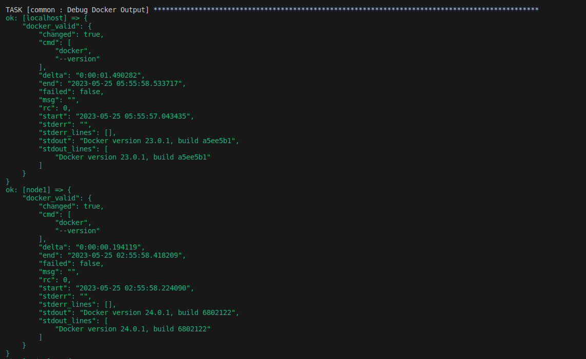
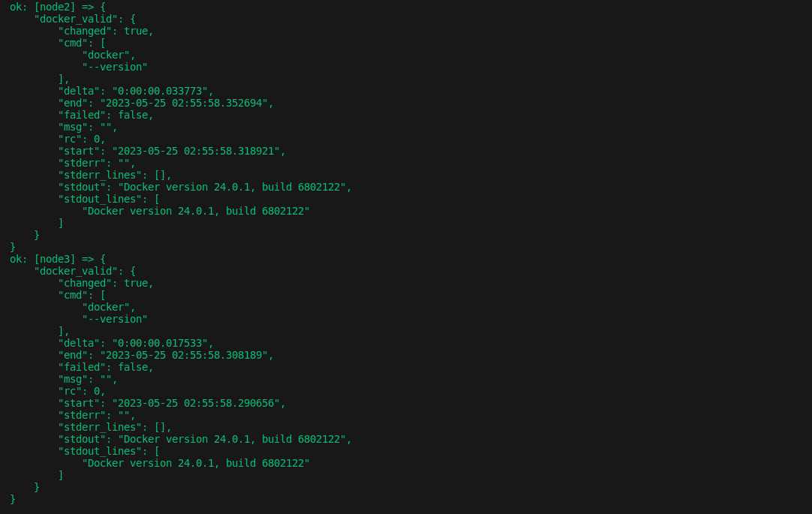
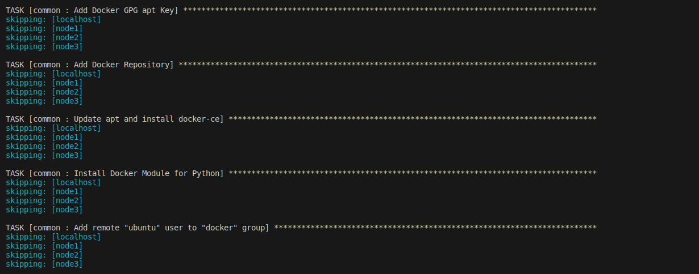
<br>Picture 14. Ansible log for setup docker
</p>

<p align = "center">
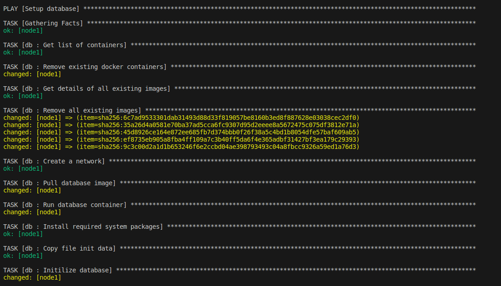
<br>Picture 15. Ansible log for database
</p>

<p align = "center">
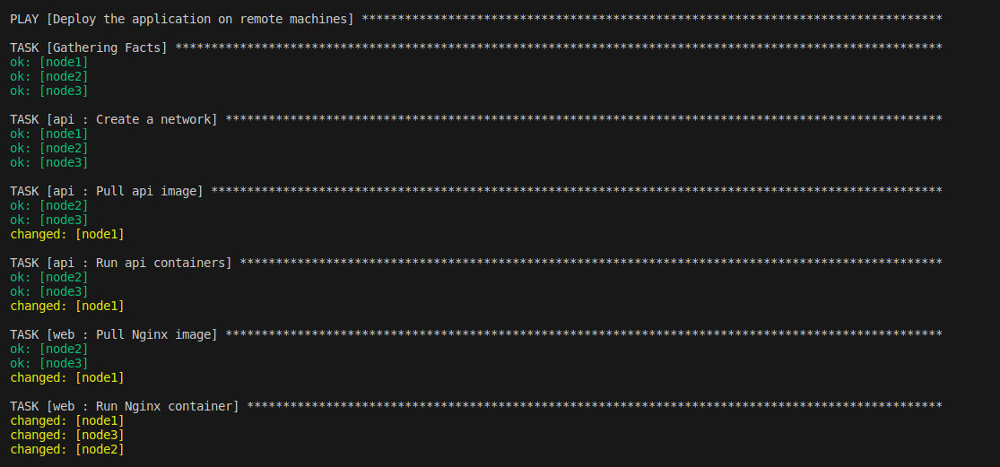
<br>Picture 16. Ansible log for api and web service
</p>

<p align = "center">
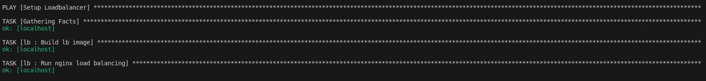
<br>Picture 17. Ansible log for lb
</p>

## 2.4 Monitoring

**Ansible playbook for monitoring**
```yaml
- name: Check network
  docker_network_info:
    name: "{{ NETWORK }}"
  register: docker_network
  become: yes
  tags: docker

- name: Create docker network
  docker_network: 
    name: "{{ NETWORK }}"
  when: docker_network.exists == false
  register: docker_network
  become: yes
  tags: docker

- name: Run cadvisor container
  docker_container:
    image: gcr.io/cadvisor/cadvisor
    name: cadvisor
    ports:
      - 8080:8080
    networks:
      - name: "{{ NETWORK }}"
    volumes:
      - /:/rootfs:ro
      - /var/run:/var/run:rw
      - /sys:/sys:ro
      - /var/lib/docker/:/var/lib/docker:ro

- name: Run node exporter container
  docker_container:
    image: prom/node-exporter
    name: node-exporter
    networks: 
      - name: "{{NETWORK}}"
    ports:
      - 9100:9100
    restart_policy: "unless-stopped"
    volumes:
      - /proc:/host/proc:ro
      - /sys:/host/sys:ro
      - /:/rootfs:ro
    command:
      - '--path.procfs=/host/proc'
      - '--path.rootfs=/rootfs'
      - '--path.sysfs=/host/sys'
      - '--collector.filesystem.mount-points-exclude=^/(sys|proc|dev|host|etc)($$|/)'

- name: Copy prometheus config
  copy:
    src: ./roles/monitor/files/prometheus.yml
    dest: /tmp
  become: yes

- name: Run Prometheus container
  docker_container:
    image: prom/prometheus
    name: prometheus
    networks: 
      - name: "{{NETWORK}}"
    restart_policy: "unless-stopped"
    volumes: /tmp/prometheus.yml:/etc/prometheus/prometheus.yml
    ports:
      - 9090:9090
    command:
      - --config.file=/etc/prometheus/prometheus.yaml
```

**File config for prometheus**

```yaml
global:
  scrape_interval: 10s
  evaluation_interval: 10s
  external_labels:
      monitor: 'prometheus'
      username: 'cuongnm'

remote_write:
  - url: "http://27.66.108.93:9090/api/v1/write"
    name: cuongnm

scrape_configs:
  - job_name: "node-exporter"
    static_configs:
      - targets: [
      "54.166.186.66:9100",
      "44.203.194.242:9100",
      "18.205.151.59:9100",
    ]

  - job_name: "cadvisor"
    static_configs: 
      - targets: [
      "54.166.186.66:8080",
      "44.203.194.242:8080",
      "18.205.151.59:8080"
    ]
```  
**Ansible log for monitoring**

<p align = "center">
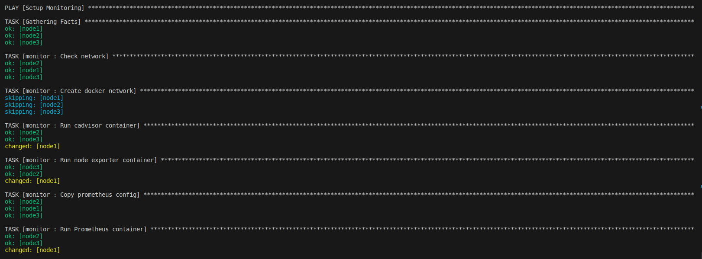
<br>Picture 18. Ansible log for monitoring
</p>

**Dashboard monitoring nodes & containers using Prometheus system centralized at 171.236.38.100:9090.**

<p align = "center">
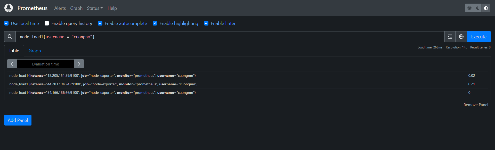
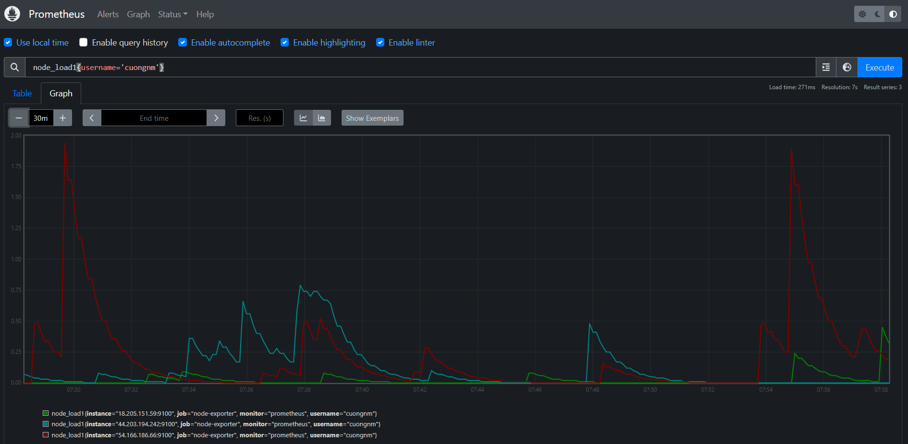
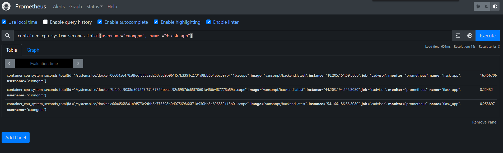
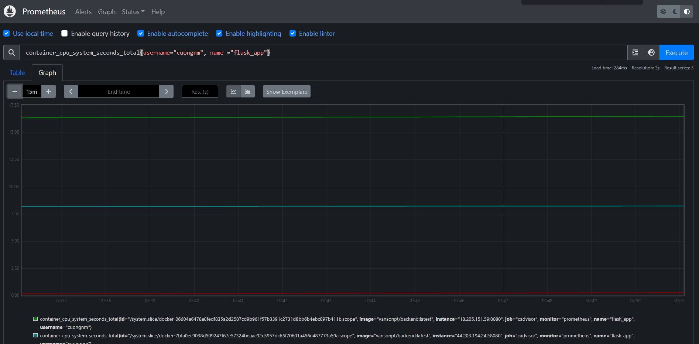
<br>Picture 19. Dashboard monitoring nodes and containers using Prometheus
</p>

## 2.5 Logging

**Dockerfile for building fluentd image**

```Dockerfile
FROM fluent/fluentd:v1.12.0-debian-1.0
USER root
RUN ["gem", "install", "elasticsearch", "--no-document", "--version", "< 8"]
RUN ["gem", "install", "fluent-plugin-elasticsearch", "--no-document", "--version", "5.2.2"]
USER fluent
```

**File config for fluentd**

```conf
<source>
  @type forward
  port 24224
  bind 0.0.0.0
</source>

<match *.**>
  @type elasticsearch
  host 171.236.38.100
  port 9200
  logstash_format true
  logstash_prefix cuongnm
  logstash_dateformat %Y%m%d
  include_tag_key true
  type_name fluentd
  flush_interval 5s
</match>
```
**Ansible playbook for logging**

```yaml
- name: copy files config to host logging
  copy:
    src: ./roles/logging/templates
    dest: /tmp

- name: Build fluentd image
  docker_image:
    name: fluentd_image
    build:
       path: /tmp/templates
    source: build
    force_source: true

- name: Run fluentd container
  docker_container:
    name: fluentd
    image: fluentd_image
    volumes: /tmp/templates/fluentd.conf:/fluentd/etc/fluent.conf
    restart_policy: unless-stopped
    network_mode: host
```
**Ansible log for role logging**

<p align = "center">
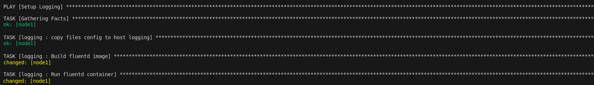
<br>Picture 20. Ansible log for lb
</p>

Because the logs were not pushed to the server before shutting down, I was unable to capture a sample log from Kibana :((

## 3. Results

<p align = "center">

<br>Picture 21. Demo Web with load balancer
</p>

<p align = "center">
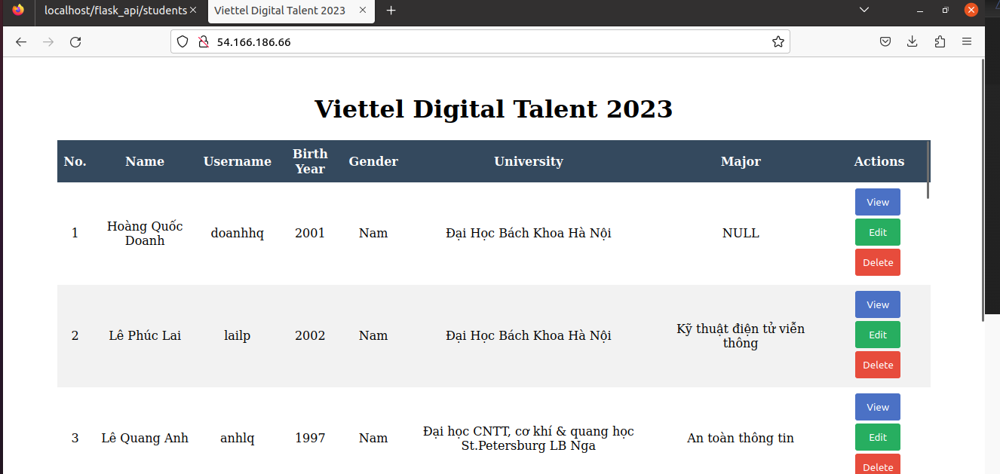
<br>Picture 22. Running web in host ec2 №1 http://54.166.186.66/
</p>


<p align = "center">
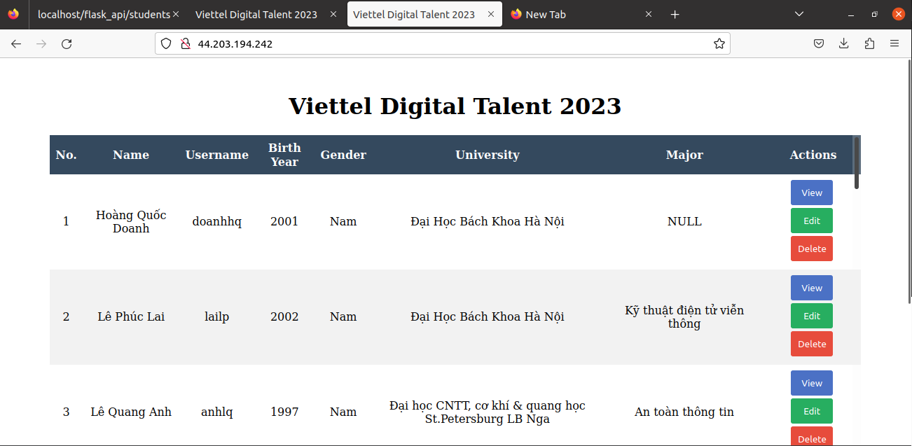
<br>Picture 23. Running web in host ec2 №2 http://44.203.194.242/
</p>

<p align = "center">
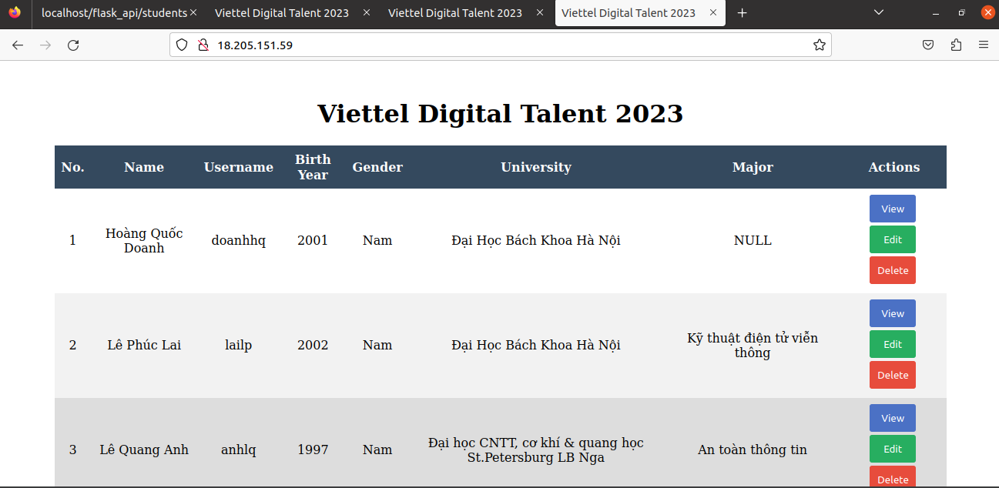
<br>Picture 24. Running web in host ec2 №3 http://18.205.151.59/
</p>
