# HOME WORK FROM VIETTEL DIGITAL TALENT

### _LittleHawk03-Nguyễn Mạnh Đức_


####Table of contents

[1. Phát triển một 3-tier web application đơn giản (2đ)](#1-phát-triển-một-3-tier-web-application-đơn-giản-2đ)
  
  Yêu cầu:
  - [Viết một CRUD web application đơn giản thực hiện các chức năng:](#11-viết-một-crud-web-application-đơn-giản-thực-hiện-các-chức-năng)
    - Liệt kê danh sách sinh viên tham gia khóa đào tạo chương trình VDT 2023 lĩnh vực cloud dưới dạng bảng (0.5đ)
    - Cho phép xem chi tiết/thêm/xóa/cập nhật thông tin sinh viên (0.5đ)
  - Thiết kế hệ thống với ba dịch vụ: (0.5đ)
    - web: Giao diện web viết bằng HTML + CSS + Javascript được triển khai trên nền web server nginx
    - api: RESTful API viết bằng ngôn ngữ lập trình tùy chọn (prefer Python), có đầy đủ các chức năng: list, get, create, update, delete các bản ghi thông tin sinh viên
    - db: Database SQL hoặc NoSQL lưu trữ thông tin sinh viên (dữ liệu khởi tạo của DB này được cho bởi bảng trong Phụ lục I.)
  - Viết unit tests cho các chức năng APIs (0.5đ)


  Output:
  - Mã nguồn của từng dịch vụ
  
Triển khai web application sử dụng các DevOps tools & practices
(8đ)
1. Containerization (1đ)
Yêu cầu:
- Viết Dockerfile để đóng gói các dịch vụ trên thành các container image (0.5đ)
- Yêu cầu image đảm bảo tối ưu thời gian build và kích thước chiếm dụng, khuyến khích
sử dụng các thủ thuật build image đã được giới thiệu (layer-caching, optimized RUN
instructions, multi-stage build, etc.) (0.5đ)
Output:
- File Dockerfile cho từng dịch vụ
Output câu lệnh build và thông tin docker history của từng image
2. Continuous Integration (1đ)
Yêu cầu:
- Tự động chạy unit test khi tạo PR vào branch main (0.5đ)
- Tự động chạy unit test khi push commit lên một branch (0.5đ)
Output:
- File setup công cụ CI
- Output log của luồng CI
- Các hình ảnh demo khác
3. Continuous Delivery (4đ)
Yêu cầu:
- Viết luồng release dịch vụ bằng công cụ CI/CD của GitHub/GitLab, thực hiện build
docker image và push docker image lên Docker Hub khi có event một tag mới được
developer tạo ra trên GitHub (1đ)
- Viết ansible playbook thực hiện các nhiệm vụ:
  - Setup môi trường: Cài đặt docker trên các node triển khai dịch vụ (1đ)
  - Deploy các dịch vụ theo version sử dụng docker (1đ)
  - Triển khai các dịch vụ trên nhiều hosts khác nhau
- Đảm bảo tính HA cho các dịch vụ web và api:
  - Mỗi dịch vụ web và api được triển khai trên ít nhất 02 container khác nhau (0.5đ)
  - Requests đến các endpoint web và api được cân bằng tải thông qua các công cụ load balancer, ví dụ: nginx, haproxy và traefik (0.5đ)
  - Các công cụ load balancer cũng được triển khai theo mô hình cluster
  - Triển khai db dưới dạng cluster
Output:
- Ảnh minh họa kiến trúc triển khai và bản mô tả
- Thư mục chứa ansible playbook dùng để triển khai dịch vụ, trong thư mục này cần có
○ File inventory chứa danh sách các hosts triển khai
○ Các file playbook
○ Thư mục roles chứa các role:
■ common: Setup môi trường trước deploy
■ web: Triển khai dịch vụ web
■ api: Triển khai dịch vụ api
■ db: Triển khai dịch vụ db
■ lb: Triển khai dịch vụ load balancing
● File setup CD
● Output của luồng build và push Docker Image lên Docker Hub
● Hướng dẫn sử dụng ansible playbook để triển khai các thành phần hệ thống
● Output log triển khai hệ thống4. Monitoring (1đ)
Yêu cầu:
● Viết ansible playbook roles monitor thực hiện các nhiệm vụ:
○ Cài đặt các dịch vụ node exporter và cadvisor dưới dạng container
○ Đẩy thông số giám sát lên hệ thống giám sát Prometheus tập trung
○ Chú ý: Tên các container có tiền tố là <username>_ để phân biệt thông số giám
sát dịch vụ của các sinh viên trên hệ thống giám sát tập trung. Thông tin
<username> của từng sinh viên cho bởi bảng trong Phụ lục I.
Output:
● Role monitor chứa các playbook và cấu hình giám sát cho hệ thống
● Ảnh chụp dashboard giám sát nodes & containers, có thể sử dụng hệ thống prometheus
tập trung ở 171.236.38.100:9090
● …...
5. Logging (1đ)
Yêu cầu:
● Viết ansible playbook thực hiện các nhiệm vụ:
○ Cài đặt dịch vụ logstash hoặc fluentd để collect log từ các dịch vụ web, api và db
○ Đẩy log dịch vụ lên hệ thống Elasticsearch tập trung 171.236.38.100:9200
○ Log phải đảm bảo có ít nhất các thông tin: IP truy cập, thời gian, action tác động,
kết quả (thành công/không thành công/status code)
○ Log được index với tiền tố <username>_ để phân biệt log dịch vụ của các sinh
viên khác nhau. Thông tin <username> của từng sinh viên cho bởi bảng trong
Phụ lục I.
Output:
● Ansible playbook triển khai các dịch vụ collect log (tách module logging)
● Ảnh chụp sample log từ Kibana 171.236.38.100:5601

# 1. Develop a simple 3-tier web application (2đ)

#### 1.1 Write a simple CRUD web application that implements the functions

##### 1.1.1 List the list of students participating in the cloud training VDT 2023 program in the form of a table (0.5đ)

For this request I have designed a website that lists the candidates in the form of a table

<div align="center">
  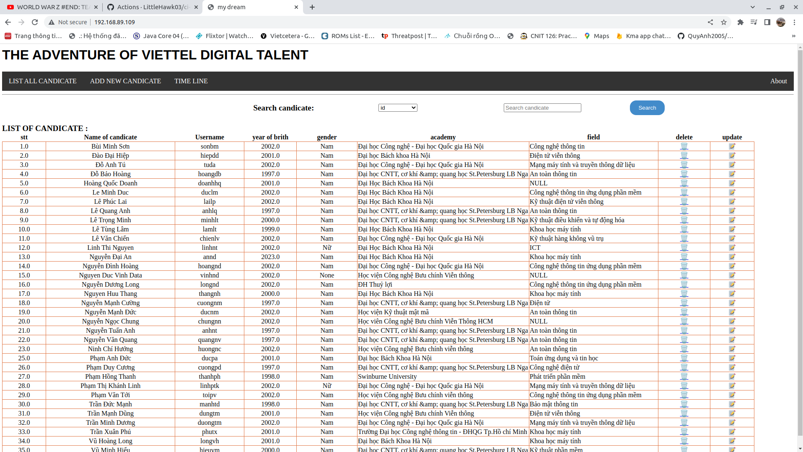
</div>

<div align="center">
  <i>list all cadidate</i>
</div>

##### 1.1.2 view details/add/delete/update student information (0.5đ)

And my website have some feature : view detail, search, delete, update, add new candidate

- **search**:

<div align="center">
  
</div>

<div align="center">
  <i>search cadidate</i>
</div>

- **delete**

<div align="center">
  
</div>

<div align="center">
  <i>delete cadidate</i>
</div>
  
- **update**

<div align="center">
  
</div>

<div align="center">
  <i>update cadidate</i>
</div>

- **add new candidate**

<div align="center">
  
</div>

<div align="center">
  <i>add new cadidate</i>
</div>


#### 1.2  System design with three services: (0.5đ)

##### 1.2.1 web: Web interface written in HTML + CSS + Javascript

- source code of web in [web](./web)

##### 1.2.2 api: RESTful API written in optional programming language (prefer Python), with full functions: list, get, create, update, delete student information records

- source code of api in [api](./api/)

##### 1.2.3 db: Database SQL or NoSQL stores student information (dữ liệu khởi tạo của DB này được cho bởi bảng trong Phụ lục I.)

- i using mongodb and import data when container is created. and source code in [db](./db/)


#### 1.3 Write unit tests for APIs function (0.5pt)

- in this lab i using module unittest of python to test the api

- source code in [tests](./tests/)

```python
  import unittest
  import requests
  import os


  base_host = os.environ.get('API_HOST', 'http://localhost')
  base_port = os.environ.get('API_POST', '5500')


  class TestCandidatesAPI(unittest.TestCase):
      
      port_id = ''

      def __init__(self, *args, **kwargs) -> None:
          super(TestCandidatesAPI, self).__init__(*args, **kwargs)
          self.mockdata = {
              "STT": 0,
              "fullname": "TESTing this shit",
              "year of birth": 2002,
              "gender": "Nam",
              "university": "academy of cryptography techniques",
              "Username": "testxx",
              "field": "cyber security"
          }
          response=requests.post(f'{base_host}:{base_port}/candidates',json=self.mockdata)
          data = response.json()
          self._id = data['_id']
          print("DONE")

      
      def test_post_candidate(self):
          test_mock_data = {
              "STT": 0,
              "fullname": "data for post",
              "year of birth": 2003,
              "gender": "Nữ",
              "university": "academy of cryptography techniques",
              "Username": "testxx",
              "field": "cyber security"
          }
          response=requests.post(f'{base_host}:{base_port}/candidates',json=test_mock_data)
          data = response.json()
          self.port_id = data['_id']
          print("DONE")
          
          
    
      def test_get_all_candidates(self):
          response1=requests.get(f'{base_host}:{base_port}/candidates')
          response2=requests.get(f'{base_host}:{base_port}/')
          self.assertEqual(response1.status_code,200)
          self.assertEqual(response2.status_code,200)
          self.assertGreater(len(response1.json()), 0)
          self.assertGreater(len(response2.json()), 0)   
          print("DONE")
            
          
      def test_get_one_candidate(self):
          # print(self._id)
          response = response = requests.get(f'{base_host}:{base_port}/candidates/{self._id}')
          self.assertEqual(response.status_code,200)
          self.assertGreater(len(response.json()),0)
          print("DONE")
          
      def test_put_change_candidate(self):
          mock_data_change ={
              "STT": 0,
              "fullname": "test this change",
              "year of birth": 2010,
              "gender": "Nữ",
              "university": "harvard",
              "Username": "testYY",
              "field": "stream"
          }
          response = requests.put(f"{base_host}:{base_port}/candidates/update/{self._id}",json=mock_data_change)
          responseget=requests.get(f'{base_host}:{base_port}/candidates/{self._id}')
          data=responseget.json()
          self.assertEqual(response.status_code,200)
          self.assertEqual(data[0]["fullname"],mock_data_change["fullname"])
          self.assertEqual(data[0]["year of birth"],mock_data_change["year of birth"])
          self.assertEqual(data[0]["gender"],mock_data_change["gender"])
          self.assertEqual(data[0]["university"],mock_data_change["university"])
          self.assertEqual(data[0]["Username"],mock_data_change["Username"])
          self.assertEqual(data[0]["field"],mock_data_change["field"])
          print("DONE")
          
        
          
      def test_delete_candicate(self):
          response = requests.delete(f"{base_host}:{base_port}/candidates/{self._id}")
          self.assertEqual(response.status_code,200)
          print("DONE")
          
      
                  
      def tearDown(self) -> None:
          response=requests.delete(f'{base_host}:{base_port}/candidates/{self._id}')
          response=requests.delete(f'{base_host}:{base_port}/candidates/{self.port_id}')
          return super().tearDown()

  if __name__ == '__main__':
    # suite = unittest.TestLoader().loadTestsFromTestCase(TestCandidatesAPI)
    # unittest.TextTestRunner().run(suite)
      unittest.main()
```

# Deploy web application using DevOps tools and practices (8 points)

#### 1. Containerization (1đ)
##### 1.1 Write Dockerfile to package the above services into container images

- the docker file build of web [Dockerfile](web/Dockerfile):
- the docker file to build api [Dockerfile](api/Dockerfile)
- in to build images for mongodb i using docker-compose to simplify the process of automatically importing data, you must first initialize data for the database [docker-compose.yml](db/docker-compose.yml) and and the file to initialize the data is [init.js](db/init.js)

##### 1.2 Image requirements ensure optimal build time and size of occupancy, recommending the use of the recommended build image tricks

- In order to reduce the size of an image I use the method of choosing base images built on alpine operating system in a very small amount and in addition using the technique ``multi-stage build`` và opimize run line

```docker
  FROM python:3.9-alpine3.15 as builder

  WORKDIR /app

  COPY requirements.txt .

  RUN pip install --user --no-cache-dir -r requirements.txt

  # Second stage: Actual image
  FROM python:3.9-alpine3.15

  WORKDIR /app

  COPY --from=builder /root/.local /root/.local

  COPY . .

  CMD ["python", "api.py"]
```

and the built command

```docker
  docker build -t api:latest .
```

and docker history


<div align="center">
  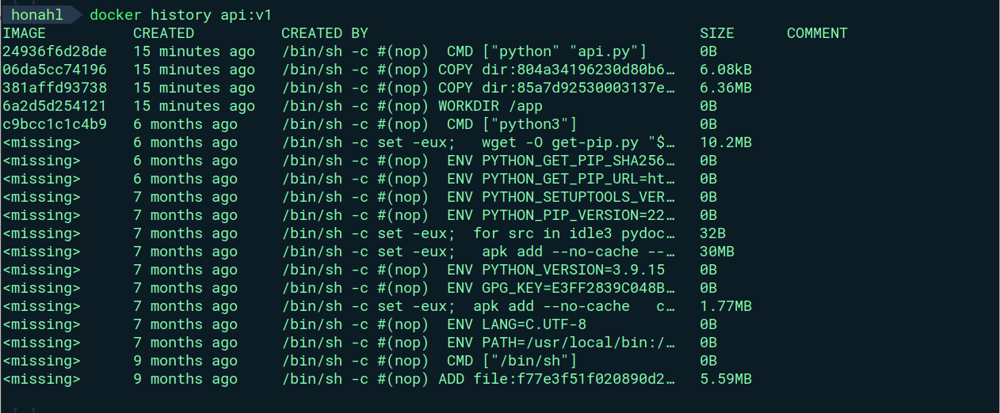
</div>

<div align="center">
  <i>docker history</i>
</div>


### 2. Continuous Integration (1đ)

- Using the unittest written above, we build the CI pipeline

- i write a File setup in git hub action in [.github](.github/workflows/main.yml)

```yml
  name: Python package

  on:
    push:
    # paths:
    #   - "!README.md"
    pull_request:
      # paths:
      #   - "!README.md"

  jobs:
    build:
      runs-on: ubuntu-latest
      strategy:
        matrix:
          python-version: ["3.10"]

      steps:
        - uses: actions/checkout@v3
        - name: Set up Python ${{ matrix.python-version }}
          uses: actions/setup-python@v4
          with:
            python-version: ${{ matrix.python-version }}
        # You can test your matrix by printing the current Python version
        - name: Display Python version
          run: python -c "import sys; print(sys.version)"

        - name: install some independencies
          run: |
            pip install --upgrade pip
            if [ -f "api/requirements.txt" ]; then pip install -r "api/requirements.txt"; fi
            if [ -f "tests/requirements.txt" ]; then pip install -r "tests/requirements.txt"; fi

        - name: pull docker image
          run: |
            docker pull mongo:5.0
            docker pull python:3.9-alpine3.15

        - name: Start containers
          run: docker-compose -f "api/docker-compose.yml" up -d --build

          # it make sure api container is running Adjust the sleep duration as needed to allow the API container to start
        - name: Wait for API to start
          run: sleep 5 


        - name: check docker container running
          run:
            docker ps
        
        - name: runtest
          run:
            python -u "tests/unit-test.py"
```
As you can see in ``push:`` and ``pull_request:`` will trigger when have ``push`` and ``pull request `` event then the CI pipeline will run.

- **pull resquest**

<div align="center">
  
</div>

<div align="center">
  <i>full request work flow</i>
</div>

**the pipeline**

<div align="center">
  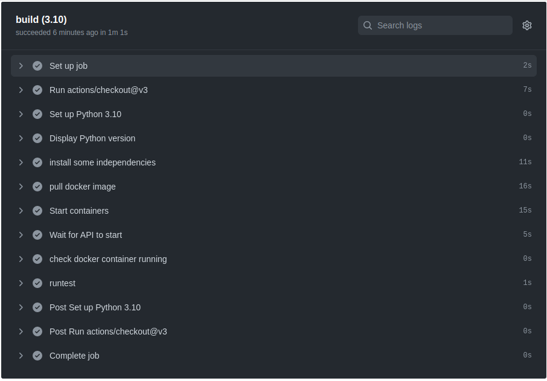

</div>


**The result of the workflow full is saved in [log-githubaction/full-request](10.GK/NguyenManhDuc/log-githubaction/full-request)**

the log of unittest
```
2023-05-22T04:35:25.2133261Z ##[group]Run python -u "tests/unit-test.py"
2023-05-22T04:35:25.2133645Z python -u "tests/unit-test.py"
2023-05-22T04:35:25.2210993Z shell: /usr/bin/bash -e {0}
2023-05-22T04:35:25.2211270Z env:
2023-05-22T04:35:25.2211567Z   pythonLocation: /opt/hostedtoolcache/Python/3.10.11/x64
2023-05-22T04:35:25.2211956Z   PKG_CONFIG_PATH: /opt/hostedtoolcache/Python/3.10.11/x64/lib/pkgconfig
2023-05-22T04:35:25.2213803Z   Python_ROOT_DIR: /opt/hostedtoolcache/Python/3.10.11/x64
2023-05-22T04:35:25.2214209Z   Python2_ROOT_DIR: /opt/hostedtoolcache/Python/3.10.11/x64
2023-05-22T04:35:25.2214575Z   Python3_ROOT_DIR: /opt/hostedtoolcache/Python/3.10.11/x64
2023-05-22T04:35:25.2214950Z   LD_LIBRARY_PATH: /opt/hostedtoolcache/Python/3.10.11/x64/lib
2023-05-22T04:35:25.2215253Z ##[endgroup]
2023-05-22T04:35:25.8475847Z DONE
2023-05-22T04:35:25.8520543Z DONE
2023-05-22T04:35:25.8581736Z DONE
2023-05-22T04:35:25.8646439Z DONE
2023-05-22T04:35:25.8712617Z DONE
2023-05-22T04:35:25.8781417Z DONE
2023-05-22T04:35:25.9054064Z DONE
2023-05-22T04:35:25.9212740Z DONE
2023-05-22T04:35:25.9383917Z DONE
2023-05-22T04:35:25.9644727Z DONE
2023-05-22T04:35:25.9745237Z .....
2023-05-22T04:35:25.9747305Z ----------------------------------------------------------------------
2023-05-22T04:35:25.9750762Z Ran 5 tests in 0.103s
2023-05-22T04:35:25.9751341Z 
2023-05-22T04:35:25.9751784Z OK
```

<div align="center">
  <i>the log of unittest</i>
</div>

- **push**

<div align="center">
  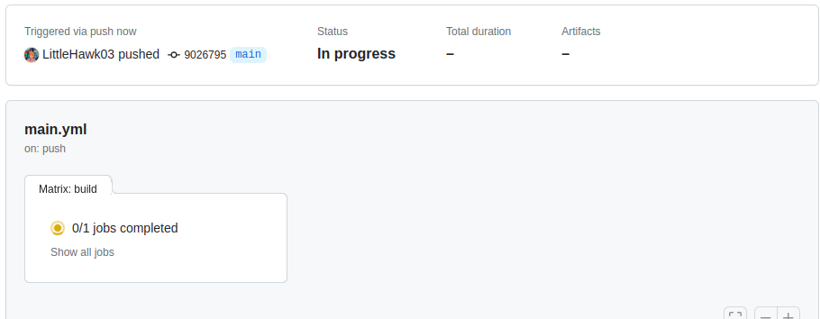
</div>

<div align="center">
  <i></i>
</div>

<div align="center">
  
</div>

<div align="center">
  <i></i>
</div>

**The result of the workflow full is saved in [log-githubaction/push](10.GK/NguyenManhDuc/log-githubaction/push)**

```
2023-05-22T04:35:25.2133261Z ##[group]Run python -u "tests/unit-test.py"
2023-05-22T04:35:25.2133645Z python -u "tests/unit-test.py"
2023-05-22T04:35:25.2210993Z shell: /usr/bin/bash -e {0}
2023-05-22T04:35:25.2211270Z env:
2023-05-22T04:35:25.2211567Z   pythonLocation: /opt/hostedtoolcache/Python/3.10.11/x64
2023-05-22T04:35:25.2211956Z   PKG_CONFIG_PATH: /opt/hostedtoolcache/Python/3.10.11/x64/lib/pkgconfig
2023-05-22T04:35:25.2213803Z   Python_ROOT_DIR: /opt/hostedtoolcache/Python/3.10.11/x64
2023-05-22T04:35:25.2214209Z   Python2_ROOT_DIR: /opt/hostedtoolcache/Python/3.10.11/x64
2023-05-22T04:35:25.2214575Z   Python3_ROOT_DIR: /opt/hostedtoolcache/Python/3.10.11/x64
2023-05-22T04:35:25.2214950Z   LD_LIBRARY_PATH: /opt/hostedtoolcache/Python/3.10.11/x64/lib
2023-05-22T04:35:25.2215253Z ##[endgroup]
2023-05-22T04:35:25.8475847Z DONE
2023-05-22T04:35:25.8520543Z DONE
2023-05-22T04:35:25.8581736Z DONE
2023-05-22T04:35:25.8646439Z DONE
2023-05-22T04:35:25.8712617Z DONE
2023-05-22T04:35:25.8781417Z DONE
2023-05-22T04:35:25.9054064Z DONE
2023-05-22T04:35:25.9212740Z DONE
2023-05-22T04:35:25.9383917Z DONE
2023-05-22T04:35:25.9644727Z DONE
2023-05-22T04:35:25.9745237Z .....
2023-05-22T04:35:25.9747305Z ----------------------------------------------------------------------
2023-05-22T04:35:25.9750762Z Ran 5 tests in 0.103s
2023-05-22T04:35:25.9751341Z 
2023-05-22T04:35:25.9751784Z OK

```

<div align="center">
  <i>the log of unittest</i>
</div>

### 3. Continuous Delivery (4đ)

##### 3.1 Write service release flow using GitHub/GitLab CI/CD tool, execute docker image build and push docker image to Docker Hub when a new tag is created by developer on GitHub

the CD config file:

```yaml

name: docker built and push
on:
    push: 
        tags:
            - "*"
jobs:
    docker:
        runs-on: ubuntu-latest
        steps:
            - 
                name: checkout
                uses: actions/checkout@v3
            -
                name: Set up QEMU
                uses: docker/setup-qemu-action@v2
            -
                name: Set up Docker Buildx
                uses: docker/setup-buildx-action@v2
            - 
                name: login to docker hub
                uses: docker/login-action@v1
                with:
                    username: ${{ secrets.DOCKER_USERNAME }}
                    password: ${{ secrets.DOCKER_ACCESS_TOKEN }}
            - 
                name: Opimize cache dokcer image
                uses: actions/cache@v2
                with:
                  path: /tmp/.buildx-cache
                  key: ${{ runner.os }}-buildx-${{ github.sha }}
                  restore-keys: |
                    ${{ runner.os }}-buildx-
            - 
                name: Get Latest Tag
                id: get-tag
                run: echo "tag=${GITHUB_REF#refs/*/}" >> $GITHUB_OUTPUT
            - 
                name: build and push docker image api
                uses: docker/build-push-action@v2
                env:
                    RELEASE_VERSION: ${{ steps.get-tag.outputs.tag }}
                with:
                    context: ./api
                    file: ./api/Dockerfile
                    builder: ${{ steps.buildx.outputs.name }}
                    push: true
                    tags: ${{ secrets.DOCKER_USERNAME }}/api:${{ steps.get-tag.outputs.tag }}
                    cache-from: type=local,src=/tmp/.buildx-cache
                    cache-to: type=local,dest=/tmp/.buildx-cache
            - 
                name: build and push docker image web
                uses: docker/build-push-action@v2
                env:
                    RELEASE_VERSION: ${{ steps.get-tag.outputs.tag }}
                with:
                    context: ./web
                    file: ./web/Dockerfile
                    builder: ${{ steps.buildx.outputs.name }}
                    push: true
                    tags: ${{ secrets.DOCKER_USERNAME }}/web:${{ steps.get-tag.outputs.tag }}
                    cache-from: type=local,src=/tmp/.buildx-cache
                    cache-to: type=local,dest=/tmp/.buildx-cache
            - 
                name: Verify
                run: echo ${{ steps.docker_build.outputs.digest }}
```

**my idea is that when a developer pushes a new tag to github the action will automatically build and push the image to docker hub and the tag of the images is the tag that the developer pushes**

- demo 

```sh
  git tag v1.6.0
  git push origin v1.6.0 
```

<div align="center">
  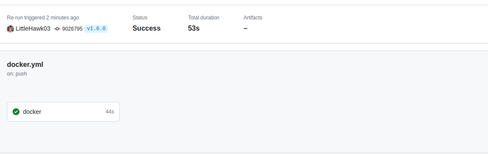
</div>

<div align="center">
  <i></i>
</div>

<div align="center">
  
</div>

<div align="center">
  <i></i>
</div>


- and the result:

<div align="center">
  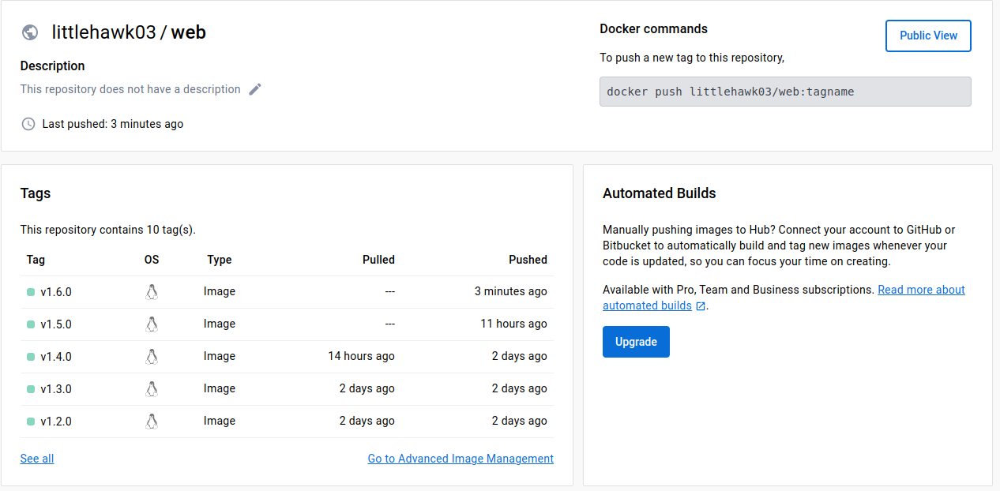
</div>

<div align="center">
  <i>image web build with tag v1.6.0</i>
</div>

- the result of api images

<div align="center">
  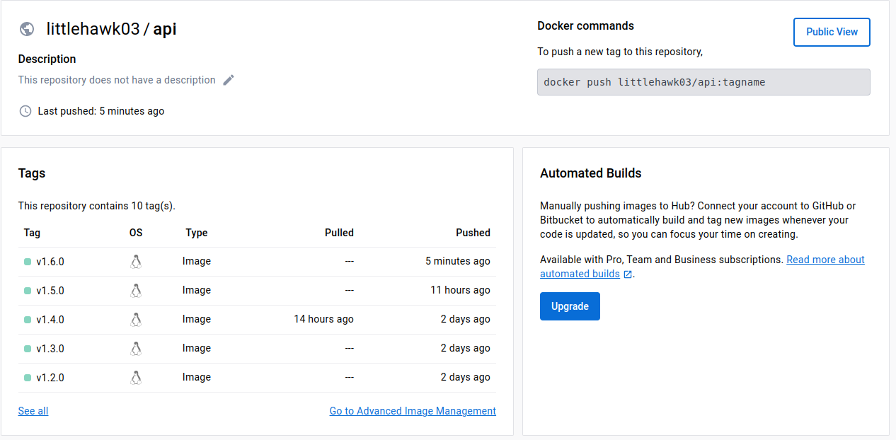
</div>

<div align="center">
  <i>image api build with tag v1.6.0</i>
</div>

#### 3.2 Write ansible playbook that does the following tasks:

##### 3.2.1 : Create a inventory file [inventory.yaml](10.GK/NguyenManhDuc/playbook/inventories/inventory.yaml)

```yaml
  ---
  all:
    hosts:
      localhost:
        ansible_connection: local
        ansible_become_user: honahl
        ansible_become_password: 684239715

      # this vps for web
      vps1:
        ansible_host: 192.168.89.109
        ansible_user: root
        ansible_password: 1
      
      # this vps for api
      vps2:
        ansible_host: 192.168.89.110
        ansible_user: root
        ansible_password: 1

      #this vps for database
      vps3:
        ansible_host: 192.168.89.114
        # ansible_become: true
        ansible_user: root
        ansible_password: 1
```

##### 3.2.2 : Install docker to all host and node

the role is used to install docker is [common](10.GK/NguyenManhDuc/playbook/roles/common)

```sh
  ommon
  ├── defaults
  │   └── main.yml
  ├── files
  ├── handlers
  ├── meta
  ├── tasks
  │   └── main.yml
  ├── templates
  │   └── main.yaml
  └── vars
      └── main.yml

  7 directories, 4 files

```

the variables required for the installation are located at [main.yml](playbook/roles/common/vars/main.yml)

```yaml
  ---
  docker_dependencies:
    - ca-certificates
    - curl
    - gnupg
    - lsb-release
  docker_gpg_key: https://download.docker.com/linux/ubuntu/gpg
  docker_repo_url: https://download.docker.com/linux/ubuntu
  docker_repo_cmd: "deb {{ docker_repo_url }} {{ ansible_distribution_release }} stable"
  docker_apts:
    - docker-ce
    - docker-ce-cli
    - containerd.io
  docker_compose_url: https://github.com/docker/compose/releases/download/v2.2.3/docker-compose-Linux-x86_64

```
**docker_dependencies:** required system packages
**docker_gpg_key :** GPG key is added to verify the download
**docker_repo_url :** install the latest version of Docker from the official repository
**docker_apts:** packages for install docker
**docker_compose_url :** url install docker-compose

The next we will use file [tasks/main.yaml](/playbook/roles/common/tasks/main.yml) to setup the task

- The first, we will use apt again to install required system packages using loop get name of package by ``docker_dependencies`` list

```yaml
  - name: install docker_dependencies
    apt:
      name : "{{ item }}"
      state: present
      update_cache: yes
    loop: "{{ docker_dependencies }}"

```

- The Docker GPG key is added to verify the download, the official repository is added as a new package source, ``state`` parameter is used to ensure the key is present (added).

```yaml
  - name: add GPG key 
    apt_key:
      url: "{{ docker_gpg_key }}"
      state: present
```

- After that we will install the latest version of Docker from the official repository.

```yaml
  - name: add repository of docker to local apt
    apt_repository:
      repo: "{{ docker_repo_cmd }}"
      state: present

```

- And we use ``apt`` to install ```docker-ce``` and some package 

```yaml
  - name: install docker
    apt:
      name: "{{ item }}"
      state: latest
      update_cache: yes
    loop: "{{ docker_apts }}"
```

- to install the module python support docker we must install ```pip```

```yaml
  - name: install pip
    apt: 
      name: python3-pip
      state: latest
      update_cache: yes
```

- Use pip to install the module for ```Python```.

```yaml
  - name: install Docker Module for python using pip
    pip:
      name: docker
      executable: pip3

  - name: install docker-compose module for python using pip
    pip:
      name: docker-compose
      executable: pip3
```
- install docker-compose:

```yaml
  - name: install docker-compose
    get_url:
      url: "{{ docker_compose_url }}"
      dest: /usr/local/bin/docker-compose
      mode: 'u+x,g+x'
```

- and finally, to make sure docker is installed we use enable start docker:
```yaml
  - name: start and enable docker
    service:
      name: docker
      state: started
      enabled: yes
```


To run the role we write a playbook [playbook_install_docker.yaml](10.GK/NguyenManhDuc/playbook/roles/playbook_install_docker.yaml)

```yaml
  ---
  - name: setup docker
    ## hosts : all to install to all hosts in inventory file 
    hosts: all
    become: true
    gather_facts: false
    vars:
      ## The value is the version ubuntu of node
      - ansible_distribution_release: xenial
    roles:
      - common
```

Run ```playbook_install_docker.yaml``` using the command:

```shell
  ansible-playbook -i inventories/inventory.yaml roles/playbook_install_docker.yaml
```


#### 3.2.3: Deploy services by version using docker (1d)

in this lab i will setup in 3 node vps1(web),vps2(api),vps3(db) 

**deployment architecture**

<div align="center">
  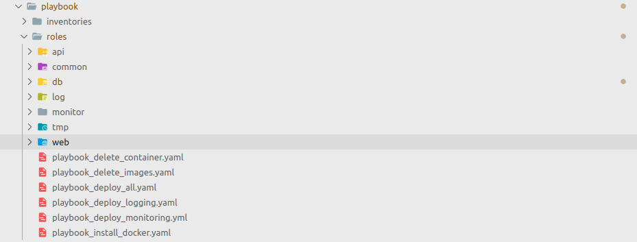
</div>

<div align="center">
  <i>deployment architecture</i>
</div>


##### 3.2.3.1 DB : deploy database with mongodb in vpss3

the role is used to install docker is [common](10.GK/NguyenManhDuc/playbook/roles/db)

```sh
  db
  ├── defaults
  ├── files
  │   └── init.js
  ├── handlers
  ├── meta
  ├── tasks
  │   └── main.yaml
  ├── templates
  └── vars
      └── main.yaml

```

vars : enviroment variable [vars](10.GK/NguyenManhDuc/playbook/roles/db/vars/main.yaml)

```yaml
  ---
  docker_image_name: mongo:5.0
  docker_container_name: db
```

the main task to deploy database and import data when container is created. [task](10.GK/NguyenManhDuc/playbook/roles/db/tasks/main.yaml)

```yaml
  ---
  # copy the init file to the node to imposrt data to database
  - name: copy docker-compose.yml
    copy:
      src: init.js
      dest: /etc/mongodbdata/
  # run the data base 
  - name: creat a docker container and port maping
    docker_container:
      name: "{{ docker_container_name }}"
      image: "{{ docker_image_name }}"
      # restart_policy: unless-stopped
      volumes:    
          - /etc/mongodbdata/init.js:/docker-entrypoint-initdb.d/init.js
      ports:
        - "27017:27017"
      log_driver: fluentd
      log_options:
        fluentd-address: "192.168.89.107:24224"
        tag: "docker.db.nguyenmanhduc"
```

##### 3.2.3.2 : Deploy api services by version using docker

the role is used to install api is [common](10.GK/NguyenManhDuc/playbook/roles/api)

```sh
  api
  ├── defaults
  │   └── main.yml
  ├── files
  │   └── nginx.conf
  ├── github
  ├── handlers
  ├── meta
  │   └── main.yml
  ├── tasks
  │   └── main.yaml
  ├── templates
  │   └── main.yml
  └── vars
      └── main.yaml
```


vars : enviroment variable [vars](10.GK/NguyenManhDuc/playbook/roles/api/vars/main.yaml)

```yaml
  ---
    api_image_name: littlehawk03/api
    api_container_name: api
    # api_image_tag: latest

    FLUENTD_HOST: "192.168.89.107"
    MONGO_HOST: "192.168.89.114"
    MONGO_PORT: "27017"
    FLASK_ENV: development
```

My idea is that after every github tagging the docker images will have the same tag so i will get the newest tag same as the latest github tag

```yaml
  - name: Clone the Repository
  git:
    repo: https://github.com/LittleHawk03/ci-cd-practice.git
    dest: "/home/honahl/Documents/ci-cd-practice/playbook/roles/api/github"
    version: "/home/honahl/Documents/ci-cd-practice/playbook/roles/api/github"
    update: no

- name: Fetch Tags
  command: git fetch --tags
  args:
    chdir: "/home/honahl/Documents/ci-cd-practice/playbook/roles/api/github"
  register: fetch_output
  changed_when: false

- name: get latest tag name
  shell: "git describe --tags `git rev-list --tags --max-count=1`"
  args:
    chdir: "/home/honahl/Documents/ci-cd-practice/playbook/roles/api/github"
  register: latest_tag

- name: Display Latest Tag
  debug:
    var: latest_tag.stdout
```

<div align="center">
  <i>get the latest tag</i>
</div>


And after get the tag of images we will pull and run the container


```sh
  - name: full image of api from docker hub
    docker_image:
      name: "{{ api_image_name }}"
      tag: "{{ latest_tag.stdout }}"
      source: pull

  - name: creat a docker container for api 1
    docker_container:
      name: "{{ api_container_name }}1"
      image: "{{ api_image_name }}:{{ latest_tag.stdout }}"
      restart_policy: unless-stopped
      ports:
        - "5501:5500"
      env:
        MONGO_HOST: "{{ MONGO_HOST }}"
        MONGO_PORT: "{{ MONGO_PORT }}"
        FLASK_ENV: "{{ FLASK_ENV }}"
      # state: started
      log_driver: fluentd
      log_options:
        fluentd-address: "192.168.89.107:24224"
        tag: "docker.api.nguyenmanhduc1"

```

##### 3.2.3.3 : Deploy web services by version using docker

the role is used to install api is [common](10.GK/NguyenManhDuc/playbook/roles/api)

```sh
  api
  ├── defaults
  │   └── main.yml
  ├── files
  │   └── nginx.conf
  ├── github
  ├── handlers
  ├── meta
  │   └── main.yml
  ├── tasks
  │   └── main.yaml
  ├── templates
  │   └── main.yml
  └── vars
      └── main.yaml
```


vars : enviroment variable [vars](10.GK/NguyenManhDuc/playbook/roles/api/vars/main.yaml)

```yaml
  ---
    web_image_name: littlehawk03/web
    web_container_name: web
   

    API_HOST: "192.168.89.110"
    API_POST: "80"
    FLASK_ENV: development
    FLUENTD_HOST: "192.168.89.107"
```

My idea is that after every github tagging the docker images will have the same tag so i will get the newest tag same as the latest github tag

```yaml
  - name: Clone the Repository
  git:
    repo: https://github.com/LittleHawk03/ci-cd-practice.git
    dest: "/home/honahl/Documents/ci-cd-practice/playbook/roles/api/github"
    version: "/home/honahl/Documents/ci-cd-practice/playbook/roles/api/github"
    update: no

- name: Fetch Tags
  command: git fetch --tags
  args:
    chdir: "/home/honahl/Documents/ci-cd-practice/playbook/roles/api/github"
  register: fetch_output
  changed_when: false

- name: get latest tag name
  shell: "git describe --tags `git rev-list --tags --max-count=1`"
  args:
    chdir: "/home/honahl/Documents/ci-cd-practice/playbook/roles/api/github"
  register: latest_tag

- name: Display Latest Tag
  debug:
    var: latest_tag.stdout
```

<div align="center">
  <i>get the latest tag</i>
</div>


And after get the tag of images we will pull and run the container


```sh
  - name: full image of web application from docker hub
    docker_image:
      name: "{{ web_image_name }}"
      tag: "{{ latest_tag.stdout }}"
      source: pull

  - name: creat a docker container for web application and mapping port
    docker_container:
      name: "{{ web_container_name }}1"
      image: "{{ web_image_name }}:{{ latest_tag.stdout }}"
      ports:
        - "5001:5000"
      env:
        API_HOST: "http://{{ API_HOST }}"
        API_POST: "{{ API_POST }}"
        FLASK_ENV: "{{ FLASK_ENV }}"
      # state: started
      log_driver: fluentd
      log_options:
        fluentd-address: "192.168.89.107:24224"
        tag: "docker.web.nguyenmanhduc1"

```

##### 3.2.3.4 : run the play book

playbook of this role [playbook_deploy_all.yaml](10.GK/NguyenManhDuc/playbook/roles/playbook_deploy_all.yaml)

```yaml
  ---
  - name: setup database in vps3
    hosts: vps3
    become: true
    gather_facts: false
    roles:
      - db

  - name: set up api in vps2
    hosts: vps2
    become: true
    gather_facts: false
    roles:
      - api

  - name: set up web in vps1
    hosts: vps1
    become: true
    gather_facts: false
    roles:
      - web
```

and run the comand

```sh
   ansible-playbook -i inventories/inventory.yaml roles/playbook_deploy_all.yaml 
```

<div align="center">
  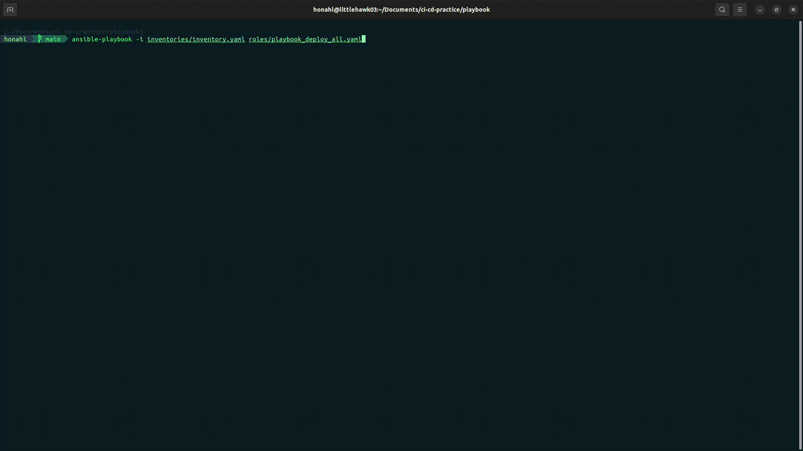
</div>

<div align="center">
  <i>run ansibleplaybook</i>
</div>

and for checking we ssh to 3 node :

<div align="center">
  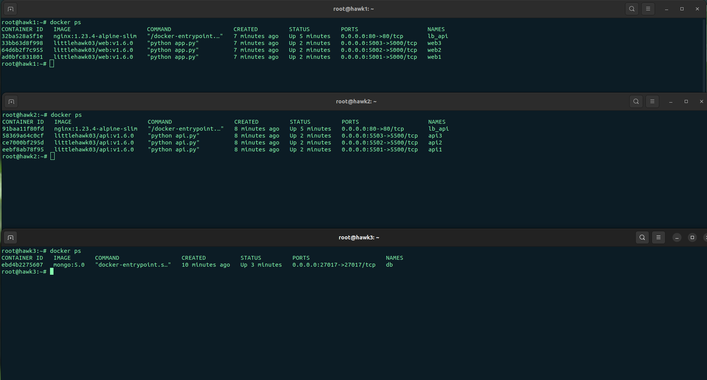
</div>

<div align="center">
  <i>done its worked</i>
</div>


##### 3.2.3.5: Deploy services on many different hosts

in this lab i using virtualbox to creat to node run ubuntu 22.04 server (light) and ssh to node 

<div align="center">
  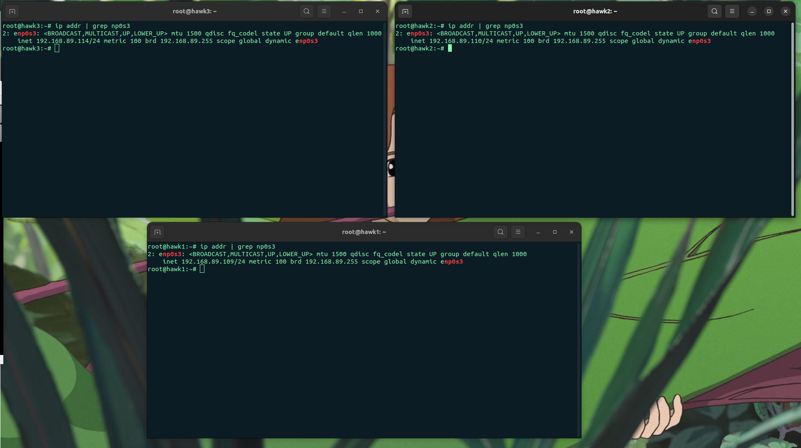
</div>

<div align="center">
  <i>3 vps</i>
</div>

#### 3.3 : Make sure HA for web services and api:

##### 3.3.1 : Each web service and api is deployed on at least 02 different containers

i run 3 container api in node vps2 and 3 container web in vps1


<div align="center">
  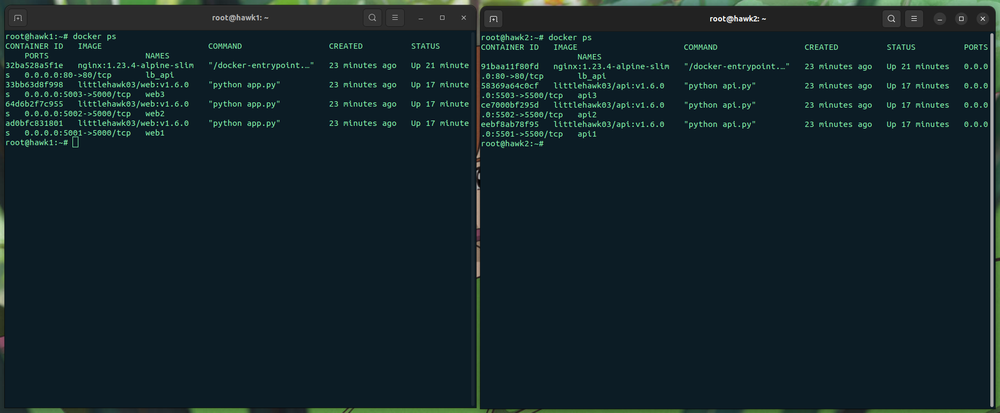
</div>

<div align="center">
  <i>container</i>
</div>

#### 3.3.2 : Requests to web and api endpoints are load balanced via load balancer tools, e.g. nginx, haproxy and traefik

### 4. Monitoring (1đ)
#### 4.1 Write ansible playbook roles monitor that performs the following tasks:
##### 4.1.1 Install node exporter and cadvisor services as containers and Push monitoring parameters to centralized Prometheus monitoring system

the role is used to install docker is [common](110.GK/NguyenManhDuc/playbook/roles/monitor)

```sh
  monitor
  ├── grafana
  │   ├── defaults
  │   ├── files
  │   ├── handlers
  │   ├── meta
  │   ├── tasks
  │   │   └── main.yml
  │   ├── templates
  │   └── vars
  │       └── main.yml
  ├── node-export-cadvisor
  │   ├── defaults
  │   ├── files
  │   │   └── docker-compose.yml
  │   ├── handlers
  │   ├── meta
  │   ├── tasks
  │   │   └── main.yml
  │   ├── templates
  │   └── vars
  │       └── main.yml
  └── prometheus
      ├── defaults
      ├── files
      │   ├── alert_rules.yml
      │   └── prometheus.yml
      ├── handlers
      ├── meta
      ├── tasks
      │   └── main.yml
      ├── templates
      └── vars
          └── main.yml

```
###### 4.1.1.1 install prometheus

the first we install prometheus

the prometheus config file [prometheus.yml](playbook/roles/monitor/prometheus/files/prometheus.yml) and aler_rule in [alert_rules.yml](playbook/roles/monitor/prometheus/files/prometheus.yml)

```yaml

  global:
  scrape_interval: 15s
  evaluation_interval: 15s

rule_files:
  - "/etc/prometheus/alert_rules.yml"
  - "/etc/prometheus/node_rules.yml"

remote_write:
  - url: http://27.66.108.93:9090/api/v1/write

scrape_configs:

  - job_name: prometheus
    static_configs:
      - targets: ['localhost:9090','27.66.108.93:9090']
        labels:
          username: 'nguyenmanhduc03'


  - job_name: "node-expoter"
    static_configs:
      - targets: ['192.168.89.116:9100','192.168.89.110:9100','192.168.89.114:9100']
        labels:
            username: 'nguyenmanhduc03'


  - job_name: cadvisor
    static_configs:
      - targets: ['192.168.89.116:8080','192.168.89.110:8080','192.168.89.114:8080']
        labels:
          username: 'nguyenmanhduc03'

```

install promethem

```yaml
---

  - name: pull docker image prometheus from registry
    docker_image:
      name: "{{ docker_image }}"
      source: pull
  - name: copy rule alert file to temp
    copy:
      src: alert_rules.yml
      dest: ./tmp
  - name: Copy prometheus.yml to temp 
    copy:
      src:  prometheus.yml
      dest: ./tmp
  - name: run docker image prometheus
    docker_container:
      name: "{{ container_name }}"
      image: "{{ docker_image }}"
      restart_policy: unless-stopped
      volumes:
        - ./tmp/prometheus.yml:{{ prometheus_dir_config }}/prometheus.yml
        - ./tmp/alert_rules.yml:{{ prometheus_dir_config }}/alert_rules.yml
      command:
        - '--config.file={{prometheus_dir_config}}/prometheus.yml'
      ports:
        - 9090:9090
```

###### 4.1.1.2  Install node exporter and cadvisor services as containers

i install exporter and advisor service by docker compose

```yaml
  version: '3.7'
  services:
    cadvisor:
      image: zcube/cadvisor
      container_name: cadvisor
      privileged: true
      devices:
        - /dev/kmsg:/dev/kmsg
      volumes:
        - /:/rootfs:ro
        - /var/run:/var/run:ro
        - /sys:/sys:ro
        - /var/lib/docker:/var/lib/docker:ro
      restart: unless-stopped
      ports:
        - 8080:8080
    
    node_exporter:
      image: prom/node-exporter
      container_name: node_exporter
      restart: unless-stopped
      ports:
        - 9100:9100
  networks:
    default:

```

playbook:

```yaml
  ---
  - name: copy docker-compose.yml to a foler
    copy:
      src: docker-compose.yml
      dest: /tmp/docker_exporter/

  - name: run the docker-compose.yml 
    docker_compose:
      project_src: /tmp/docker_exporter/
      state: present

```