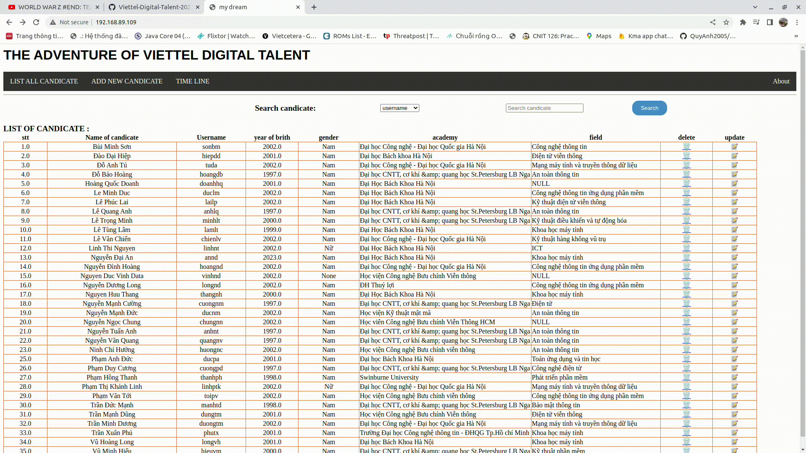

# HOME WORK FROM VIETTEL DIGITAL TALENT

### _LittleHawk03-Nguyễn Mạnh Đức_


####Table of contents

[1. Phát triển một 3-tier web application đơn giản (2đ)](#1-phát-triển-một-3-tier-web-application-đơn-giản-2đ)
  
  Yêu cầu:
  - [Viết một CRUD web application đơn giản thực hiện các chức năng:](#11-viết-một-crud-web-application-đơn-giản-thực-hiện-các-chức-năng)
    - Liệt kê danh sách sinh viên tham gia khóa đào tạo chương trình VDT 2023 lĩnh vực cloud dưới dạng bảng (0.5đ)
    - Cho phép xem chi tiết/thêm/xóa/cập nhật thông tin sinh viên (0.5đ)
  - Thiết kế hệ thống với ba dịch vụ: (0.5đ)
    - web: Giao diện web viết bằng HTML + CSS + Javascript được triển khai trên nền web server nginx
    - api: RESTful API viết bằng ngôn ngữ lập trình tùy chọn (prefer Python), có đầy đủ các chức năng: list, get, create, update, delete các bản ghi thông tin sinh viên
    - db: Database SQL hoặc NoSQL lưu trữ thông tin sinh viên (dữ liệu khởi tạo của DB này được cho bởi bảng trong Phụ lục I.)
  - Viết unit tests cho các chức năng APIs (0.5đ)


  Output:
  - Mã nguồn của từng dịch vụ
  
Triển khai web application sử dụng các DevOps tools & practices
(8đ)
1. Containerization (1đ)
Yêu cầu:
- Viết Dockerfile để đóng gói các dịch vụ trên thành các container image (0.5đ)
- Yêu cầu image đảm bảo tối ưu thời gian build và kích thước chiếm dụng, khuyến khích
sử dụng các thủ thuật build image đã được giới thiệu (layer-caching, optimized RUN
instructions, multi-stage build, etc.) (0.5đ)
Output:
- File Dockerfile cho từng dịch vụ
Output câu lệnh build và thông tin docker history của từng image
2. Continuous Integration (1đ)
Yêu cầu:
- Tự động chạy unit test khi tạo PR vào branch main (0.5đ)
- Tự động chạy unit test khi push commit lên một branch (0.5đ)
Output:
- File setup công cụ CI
- Output log của luồng CI
- Các hình ảnh demo khác
3. Continuous Delivery (4đ)
Yêu cầu:
- Viết luồng release dịch vụ bằng công cụ CI/CD của GitHub/GitLab, thực hiện build
docker image và push docker image lên Docker Hub khi có event một tag mới được
developer tạo ra trên GitHub (1đ)
- Viết ansible playbook thực hiện các nhiệm vụ:
  - Setup môi trường: Cài đặt docker trên các node triển khai dịch vụ (1đ)
  - Deploy các dịch vụ theo version sử dụng docker (1đ)
  - Triển khai các dịch vụ trên nhiều hosts khác nhau
- Đảm bảo tính HA cho các dịch vụ web và api:
  - Mỗi dịch vụ web và api được triển khai trên ít nhất 02 container khác nhau (0.5đ)
  - Requests đến các endpoint web và api được cân bằng tải thông qua các công cụ load balancer, ví dụ: nginx, haproxy và traefik (0.5đ)
  - Các công cụ load balancer cũng được triển khai theo mô hình cluster
  - Triển khai db dưới dạng cluster
Output:
- Ảnh minh họa kiến trúc triển khai và bản mô tả
- Thư mục chứa ansible playbook dùng để triển khai dịch vụ, trong thư mục này cần có
○ File inventory chứa danh sách các hosts triển khai
○ Các file playbook
○ Thư mục roles chứa các role:
■ common: Setup môi trường trước deploy
■ web: Triển khai dịch vụ web
■ api: Triển khai dịch vụ api
■ db: Triển khai dịch vụ db
■ lb: Triển khai dịch vụ load balancing
● File setup CD
● Output của luồng build và push Docker Image lên Docker Hub
● Hướng dẫn sử dụng ansible playbook để triển khai các thành phần hệ thống
● Output log triển khai hệ thống4. Monitoring (1đ)
Yêu cầu:
● Viết ansible playbook roles monitor thực hiện các nhiệm vụ:
○ Cài đặt các dịch vụ node exporter và cadvisor dưới dạng container
○ Đẩy thông số giám sát lên hệ thống giám sát Prometheus tập trung
○ Chú ý: Tên các container có tiền tố là <username>_ để phân biệt thông số giám
sát dịch vụ của các sinh viên trên hệ thống giám sát tập trung. Thông tin
<username> của từng sinh viên cho bởi bảng trong Phụ lục I.
Output:
● Role monitor chứa các playbook và cấu hình giám sát cho hệ thống
● Ảnh chụp dashboard giám sát nodes & containers, có thể sử dụng hệ thống prometheus
tập trung ở 171.236.38.100:9090
● …...
5. Logging (1đ)
Yêu cầu:
● Viết ansible playbook thực hiện các nhiệm vụ:
○ Cài đặt dịch vụ logstash hoặc fluentd để collect log từ các dịch vụ web, api và db
○ Đẩy log dịch vụ lên hệ thống Elasticsearch tập trung 171.236.38.100:9200
○ Log phải đảm bảo có ít nhất các thông tin: IP truy cập, thời gian, action tác động,
kết quả (thành công/không thành công/status code)
○ Log được index với tiền tố <username>_ để phân biệt log dịch vụ của các sinh
viên khác nhau. Thông tin <username> của từng sinh viên cho bởi bảng trong
Phụ lục I.
Output:
● Ansible playbook triển khai các dịch vụ collect log (tách module logging)
● Ảnh chụp sample log từ Kibana 171.236.38.100:5601

# 1. Develop a simple 3-tier web application (2đ)

#### 1.1 Write a simple CRUD web application that implements the functions

##### 1.1.1 List the list of students participating in the cloud training VDT 2023 program in the form of a table (0.5đ)

For this request I have designed a website that lists the candidates in the form of a table

<div align="center">
  
</div>

<div align="center">
  <i>list all cadidate</i>
</div>

##### 1.1.2 view details/add/delete/update student information (0.5đ)

And my website have some feature : view detail, search, delete, update, add new candidate

- **search**:

<div align="center">
  
</div>

<div align="center">
  <i>search cadidate</i>
</div>

- **delete**

<div align="center">
  
</div>

<div align="center">
  <i>delete cadidate</i>
</div>
  
- **update**

<div align="center">
  
</div>

<div align="center">
  <i>update cadidate</i>
</div>

- **add new candidate**

<div align="center">
  
</div>

<div align="center">
  <i>add new cadidate</i>
</div>


#### 1.2  System design with three services: (0.5đ)

##### 1.2.1 web: Web interface written in HTML + CSS + Javascript

- source code of web in [web](./web)

##### 1.2.2 api: RESTful API written in optional programming language (prefer Python), with full functions: list, get, create, update, delete student information records

- source code of api in [api](./api/)

##### 1.2.3 db: Database SQL or NoSQL stores student information (dữ liệu khởi tạo của DB này được cho bởi bảng trong Phụ lục I.)

- i using mongodb and import data when container is created. and source code in [db](./db/)


#### 1.3 Write unit tests for APIs function (0.5pt)

- in this lab i using module unittest of python to test the api

- source code in [tests](./tests/)

```python
  import unittest
  import requests
  import os


  base_host = os.environ.get('API_HOST', 'http://localhost')
  base_port = os.environ.get('API_POST', '5500')


  class TestCandidatesAPI(unittest.TestCase):
      
      port_id = ''

      def __init__(self, *args, **kwargs) -> None:
          super(TestCandidatesAPI, self).__init__(*args, **kwargs)
          self.mockdata = {
              "STT": 0,
              "fullname": "TESTing this shit",
              "year of birth": 2002,
              "gender": "Nam",
              "university": "academy of cryptography techniques",
              "Username": "testxx",
              "field": "cyber security"
          }
          response=requests.post(f'{base_host}:{base_port}/candidates',json=self.mockdata)
          data = response.json()
          self._id = data['_id']
          print("DONE")

      
      def test_post_candidate(self):
          test_mock_data = {
              "STT": 0,
              "fullname": "data for post",
              "year of birth": 2003,
              "gender": "Nữ",
              "university": "academy of cryptography techniques",
              "Username": "testxx",
              "field": "cyber security"
          }
          response=requests.post(f'{base_host}:{base_port}/candidates',json=test_mock_data)
          data = response.json()
          self.port_id = data['_id']
          print("DONE")
          
          
    
      def test_get_all_candidates(self):
          response1=requests.get(f'{base_host}:{base_port}/candidates')
          response2=requests.get(f'{base_host}:{base_port}/')
          self.assertEqual(response1.status_code,200)
          self.assertEqual(response2.status_code,200)
          self.assertGreater(len(response1.json()), 0)
          self.assertGreater(len(response2.json()), 0)   
          print("DONE")
            
          
      def test_get_one_candidate(self):
          # print(self._id)
          response = response = requests.get(f'{base_host}:{base_port}/candidates/{self._id}')
          self.assertEqual(response.status_code,200)
          self.assertGreater(len(response.json()),0)
          print("DONE")
          
      def test_put_change_candidate(self):
          mock_data_change ={
              "STT": 0,
              "fullname": "test this change",
              "year of birth": 2010,
              "gender": "Nữ",
              "university": "harvard",
              "Username": "testYY",
              "field": "stream"
          }
          response = requests.put(f"{base_host}:{base_port}/candidates/update/{self._id}",json=mock_data_change)
          responseget=requests.get(f'{base_host}:{base_port}/candidates/{self._id}')
          data=responseget.json()
          self.assertEqual(response.status_code,200)
          self.assertEqual(data[0]["fullname"],mock_data_change["fullname"])
          self.assertEqual(data[0]["year of birth"],mock_data_change["year of birth"])
          self.assertEqual(data[0]["gender"],mock_data_change["gender"])
          self.assertEqual(data[0]["university"],mock_data_change["university"])
          self.assertEqual(data[0]["Username"],mock_data_change["Username"])
          self.assertEqual(data[0]["field"],mock_data_change["field"])
          print("DONE")
          
        
          
      def test_delete_candicate(self):
          response = requests.delete(f"{base_host}:{base_port}/candidates/{self._id}")
          self.assertEqual(response.status_code,200)
          print("DONE")
          
      
                  
      def tearDown(self) -> None:
          response=requests.delete(f'{base_host}:{base_port}/candidates/{self._id}')
          response=requests.delete(f'{base_host}:{base_port}/candidates/{self.port_id}')
          return super().tearDown()

  if __name__ == '__main__':
    # suite = unittest.TestLoader().loadTestsFromTestCase(TestCandidatesAPI)
    # unittest.TextTestRunner().run(suite)
      unittest.main()
```

# Deploy web application using DevOps tools and practices (8 points)

#### 1. Containerization (1đ)
##### 1.1 Write Dockerfile to package the above services into container images

- the docker file build of web [Dockerfile](web/Dockerfile):
- the docker file to build api [Dockerfile](api/Dockerfile)
- in to build images for mongodb i using docker-compose to simplify the process of automatically importing data, you must first initialize data for the database [docker-compose.yml](db/docker-compose.yml) and and the file to initialize the data is [init.js](db/init.js)

##### 1.2 Image requirements ensure optimal build time and size of occupancy, recommending the use of the recommended build image tricks

- In order to reduce the size of an image I use the method of choosing base images built on alpine operating system in a very small amount and in addition using the technique ``multi-stage build`` và opimize run line

```docker
  FROM python:3.9-alpine3.15 as builder

  WORKDIR /app

  COPY requirements.txt .

  RUN pip install --user --no-cache-dir -r requirements.txt

  # Second stage: Actual image
  FROM python:3.9-alpine3.15

  WORKDIR /app

  COPY --from=builder /root/.local /root/.local

  COPY . .

  CMD ["python", "api.py"]
```

and the built command

```docker
  docker build -t api:latest .
```

and docker history


<div align="center">
  
</div>

<div align="center">
  <i>docker history</i>
</div>


#### 2. Continuous Integration (1đ)

- Using the unittest written above, we build the CI pipeline

- i write a File setup in git hub action in [.github](.github/workflows/main.yml)

```yml
  name: Python package

  on:
    push:
    # paths:
    #   - "!README.md"
    pull_request:
      # paths:
      #   - "!README.md"

  jobs:
    build:
      runs-on: ubuntu-latest
      strategy:
        matrix:
          python-version: ["3.10"]

      steps:
        - uses: actions/checkout@v3
        - name: Set up Python ${{ matrix.python-version }}
          uses: actions/setup-python@v4
          with:
            python-version: ${{ matrix.python-version }}
        # You can test your matrix by printing the current Python version
        - name: Display Python version
          run: python -c "import sys; print(sys.version)"

        - name: install some independencies
          run: |
            pip install --upgrade pip
            if [ -f "api/requirements.txt" ]; then pip install -r "api/requirements.txt"; fi
            if [ -f "tests/requirements.txt" ]; then pip install -r "tests/requirements.txt"; fi

        - name: pull docker image
          run: |
            docker pull mongo:5.0
            docker pull python:3.9-alpine3.15

        - name: Start containers
          run: docker-compose -f "api/docker-compose.yml" up -d --build

          # it make sure api container is running Adjust the sleep duration as needed to allow the API container to start
        - name: Wait for API to start
          run: sleep 5 


        - name: check docker container running
          run:
            docker ps
        
        - name: runtest
          run:
            python -u "tests/unit-test.py"
```
- As you can see in ``push:`` and ``pull_request:`` will trigger when have ``push`` and ``pull request `` event then the CI pipeline will run.


