# **Viettel-Digital-Talent-2023**

## **Bài tập lớn giữa kỳ giai đoạn 1 **

## **Mục Lục**

- [**Viettel-Digital-Talent-2023](#viettel-digital-talent-2023)
  - [**Bài tập lớn giữa kỳ giai đoạn 1**](#Bài-tập-lớn-giữa-kỳ-giai-đoạn-1)
  - [**Mục Lục**](#mục-lục)
  - [**I. Phát triển một 3-tier web application đơn giản**](#i-Phát-triển-một-3-tier-web-application-đơn-giản)
    - [**Trang web khi hoàn thành với đầy đủ chức năng RESTful API**](#Trang-web-khi-hoàn-thành-với-đầy-đủ-chức-năng-RESTful-API)
    - [**Unit test cho API**](#Unit-test-cho-API)
  - [**II. Triển khai web application sử dụng các DevOps tools & practices**](#ii-Triển-khai-web-application-sử-dụng-các-DevOps-tools-&-practices)
    - [**1. Containerization**](#1-Containerization)
    - [**2. Continuous Integration**](#2-Continuous-Integration)
    - [**3. Continuous Delivery**](#3-Continuous-Delivery)
    - [**4. Monitoring**](#4-Monitoring)
    - [**5. Logging**](#5-Logging)


## **I. Phát triển một 3-tier web application đơn giản**

Web apllication trong bài tập này gồm 3 phần:

- Database: Sử dụng `Mongdb`
- Web: Giao diện web được viết bằng `HTML`
- API: Sử dụng ngôn ngữ `python` với thư viện của `flask api'

### **Trang web khi hoàn thành với đầy đủ chức năng RESTful API**


  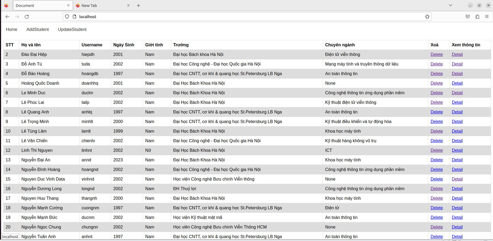

### **Unit test cho API**
- Test API bằng cách gửi các yêu cầu HTTP đến và so sánh kết quả trả về với các giá trị mong đợi.
`test_api.py`: 

```python
import unittest
import requests
import time
API_URL = "http://localhost:80/api"
class TestApp(unittest.TestCase):

    def test_insert_data_api(self):
        data = {
            "id": "100",
            "name": "chungngoc",
            "username": "chungnn",
            "birth": "2002",
            "sex": "Male",
            "university": "PTIT",
            "major": "dtvt"
        }
        response = requests.post(f"{API_URL}/create/", json=data)

        responseJson = response.json()

        self.assertEqual(response.status_code, 200)
        self.assertEqual(responseJson["id"], "100")
        requests.get("http://localhost:80/api/delete/100")

    def test_update_data_api(self):
        data = {
            "id": "100",
            "name": "chungngoc",
            "username": "chungnn",
            "birth": "2002",
            "sex": "Male",
            "university": "PTIT",
            "major": "dtvt"
        }
        response = requests.post("http://localhost:80/api/update/", json=data)
        responseJson = response.json()

        self.assertEqual(response.status_code, 200)
        self.assertEqual(responseJson["id"], "100")

    def test_read_data_api(self):
        response = requests.get("http://localhost:80/api/read/15")

        self.assertEqual(response.status_code, 200)
        self.assertEqual(response.json()[0]['id'], '15')

    def test_delete_data_api(self):
        response = requests.get("http://localhost:80/api/delete/0")
        self.assertEqual(response.status_code, 200)
        self.assertEqual(response.text, "Delete successfully")

if __name__ == '__main__':
    unittest.main()
```
- Kết quả test API :
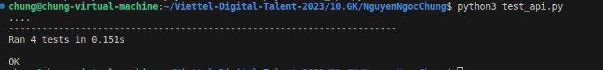

## **II. Triển khai web application sử dụng các DevOps tools & practices**

### **1. Containerization**

- Docker file cho api:
```yaml
FROM python:3.9-alpine

WORKDIR /app
COPY . /app

RUN pip install -r requirements.txt

CMD ["python","-u", "app.py"]
```
- Docker file cho database sử dụng Mongo và đẩy dữ liệu ban đầu vào database:
```yaml
FROM mongo:5.0

COPY ./init-db.js /docker-entrypoint-initdb.d/init-db.js

EXPOSE 27017

```
- Docker file cho web:
```yaml
FROM nginx:1.22.0-alpine

COPY ./nginx.conf /etc/nginx/conf.d/default.conf

COPY ./frontend/index.html /usr/share/nginx/html
COPY ./frontend/update.html /usr/share/nginx/html
COPY ./frontend/create.html /usr/share/nginx/html

EXPOSE 80
```
Docker history Nginx:
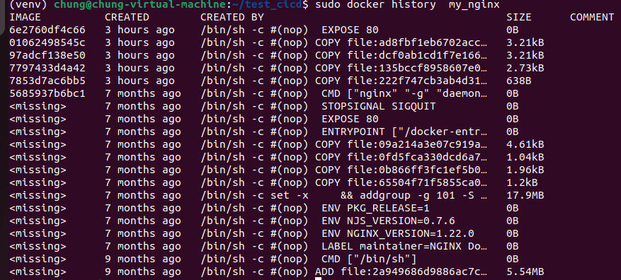

Docker history database:
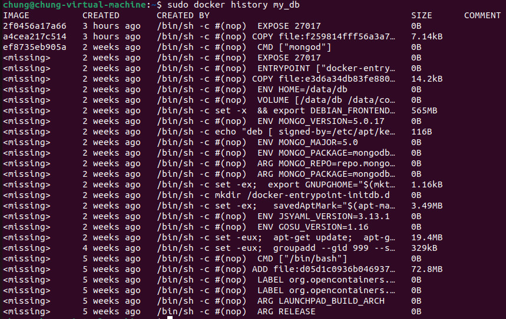

Docker history API:
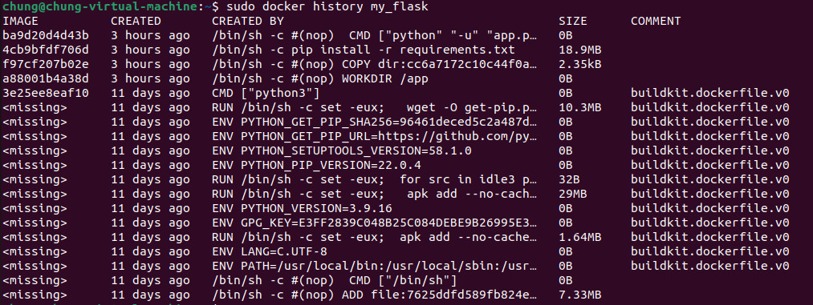


Dung lượng sau khi build images:

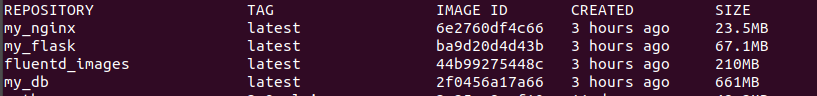


### **2. Continuous Integration**

Sử dụng github action để cấu hình CI. Khi có một push commit lên một branch hoặc PR vào main sẽ tự động chạy unit test.

`.github/workflows/CI.yaml`: 

```yaml
name: CI

on:
  push:
  pull_request:
    branches:
      - main

jobs:
  build:
    runs-on: ubuntu-latest  
    steps:
      - name: Check out the repo
        uses: actions/checkout@v3

      - name: Run container
        run: |
          sudo docker compose build
          sudo docker compose up -d
      
      - name: check container
        run: sudo docker ps 


      - name: Test api
        run:  python test_api.py

```
Out put log của luồng CI:
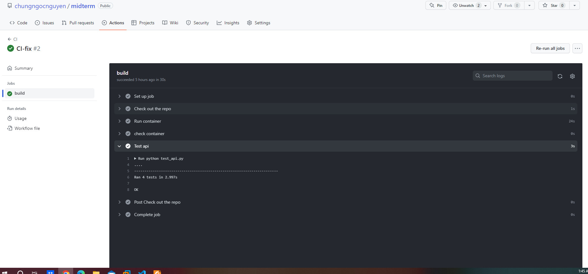

### ** 3. Continuous Delivery **

Bài giữa kì này em sử dụng ansible để deploy trang web tại 1 node là localhost. Sử dụng roles common để setup docker lên máy.

- Mô hình triển khai:

  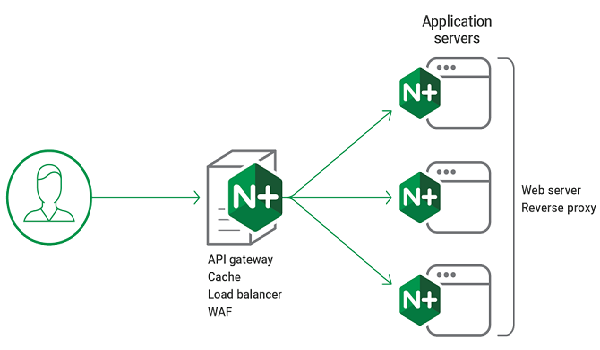

- Web, api, db được trển khai trên 3 container và giữa web và api có nginx để cân bằng tải. 

- Trong source code các cấu hình của web, api, db, load balancing nằm trong các roles khác nhau của ansible.

- File setup CD để mỗi lần build docker image và push docker image lên Docker Hub khi có event một tag mới được developer tạo ra trên GitHub

`.github/workflows/cd.yaml:`

```yaml
name: CD
on:
  push:
    tags:
      - 'v*'

jobs:
  build:
    runs-on: ubuntu-latest  
    steps:
      - name: Check out the repo
        uses: actions/checkout@v3

      - name: Login to Docker Hub
        uses: docker/login-action@f054a8b539a109f9f41c372932f1ae047eff08c9
        with:
          username: ${{ secrets.DOCKERHUB_USERNAME }}
          password: ${{ secrets.DOCKERHUB_TOKEN }}
      
      - name: Build and Push Docker Image Mongodb
        uses: docker/build-push-action@v2
        with:  
          context: roles/db/files
          push: true
          tags: chungnguyenngoc/mongodb-midterm:${{github.ref_name}}
      
      - name: Build and Push Docker Image web
        uses: docker/build-push-action@v2
        with:  
          context: roles/web/files
          push: true
          tags: chungnguyenngoc/web-midterm:${{github.ref_name}}
      
      - name: Build and Push Docker Image api
        uses: docker/build-push-action@v2
        with:  
          context: roles/api/files
          push: true
          tags: chungnguyenngoc/api-midterm:${{github.ref_name}}
      
```
- Outout của luồng build:

 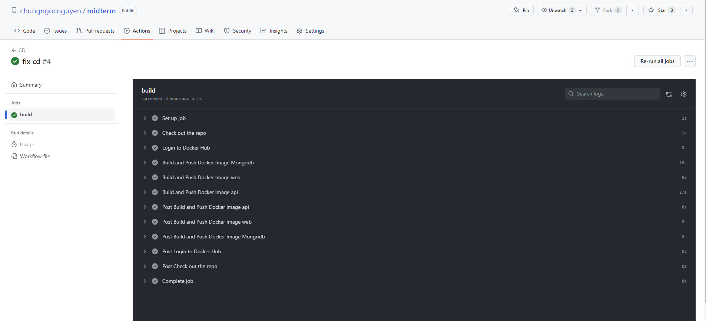

- Kết quả trên Docker hub:

 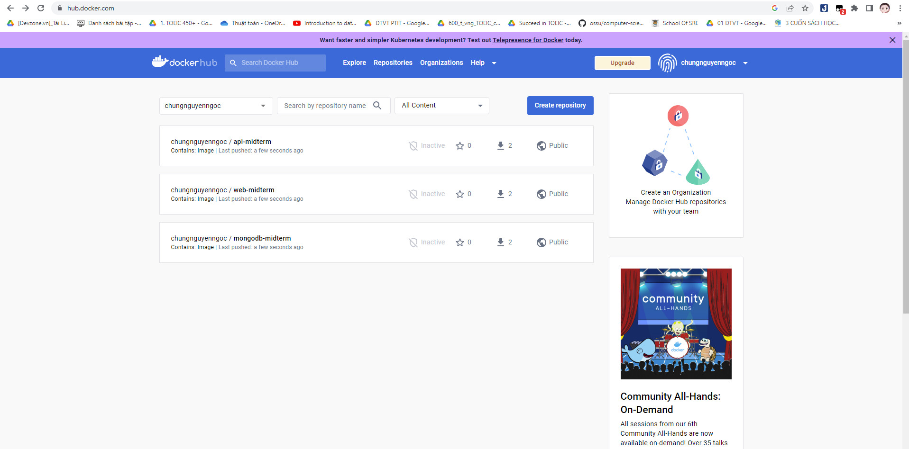

 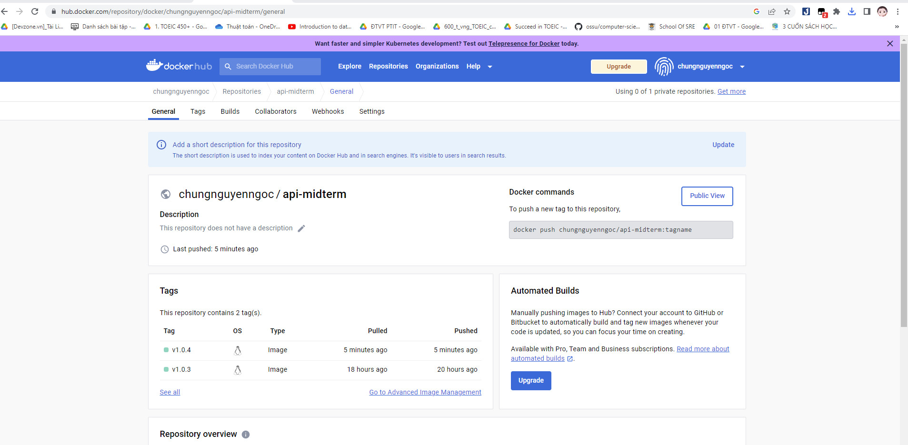

- Output của triển  khai hệ thống:

 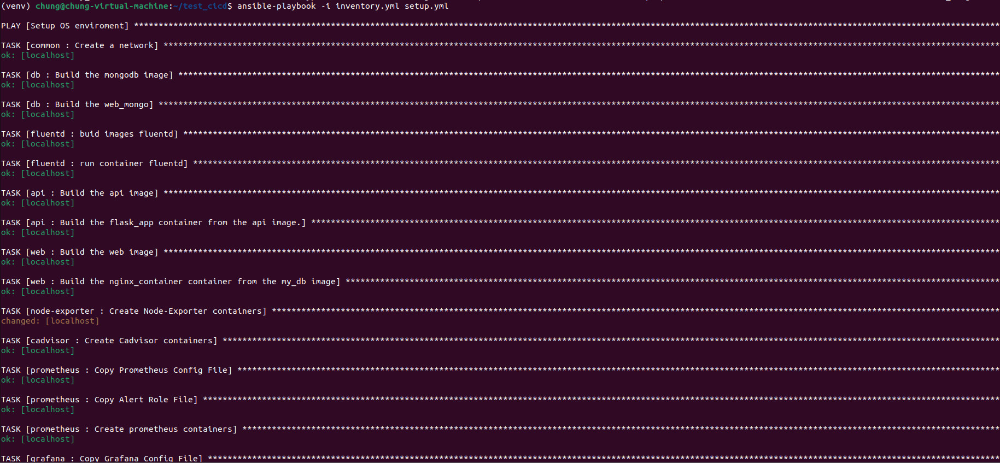

### ** 4. Monitoring**

Sử dụng roles cadvisor để giám sát container, node-exporer để giám sát máy. Các giám sát được đẩy lên local host: 9090 và promtheus tập trung tại đỉa chỉ 27.66.108.93:9090.

Các Metrics đã được đẩy lên promtheus tập trung:

 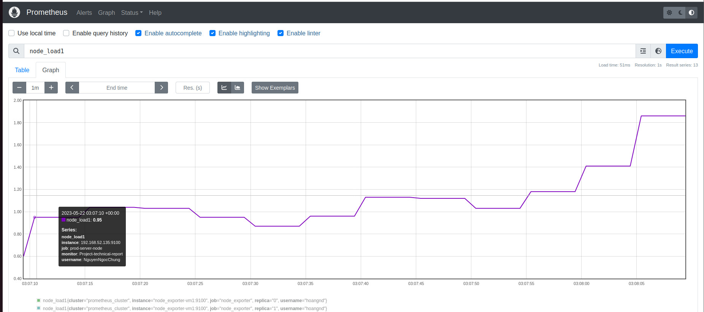

Dashboard giám sát nodes & containers: 

 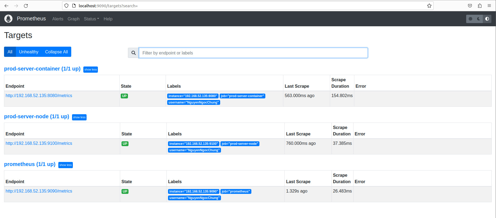

Vẽ biểu đồ giám sát container và host bằng Grafana tại địa chỉ localhost:4000

 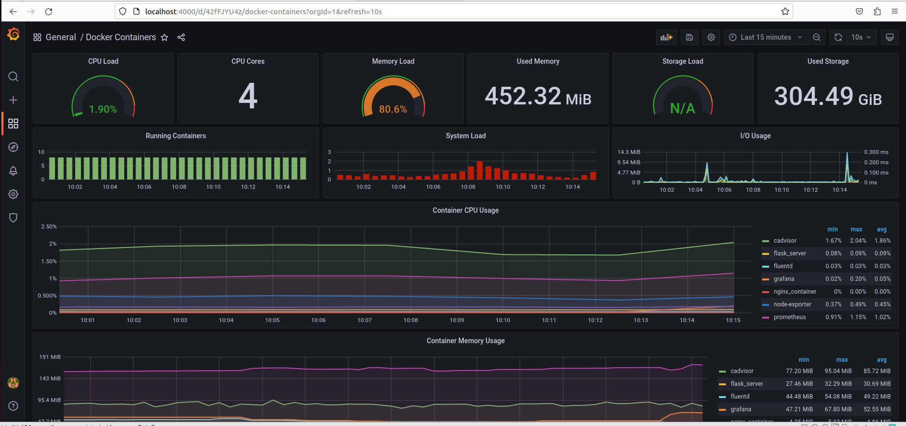

 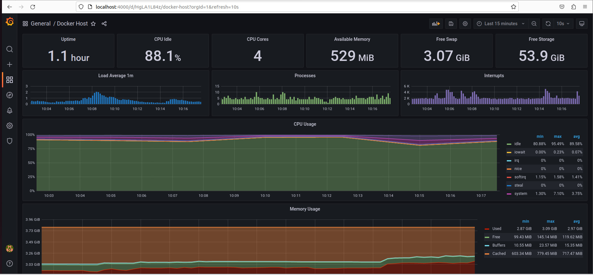

### ** 5. Logging**

Sử dụng roles fluentd để thu thập log của dịch vụ web tại địa chỉ localhost:24224. Sau đó Đẩy log dịch vụ lên hệ thống Elasticsearch tập trung 171.236.38.100:9200.

Index management Kibana 171.236.38.100:5601

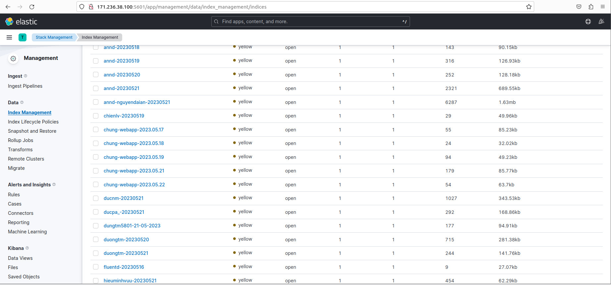

Log từ Kibana 171.236.38.100:5601

 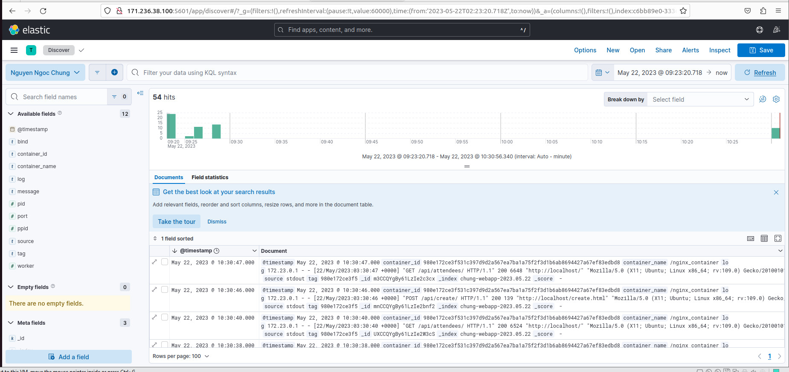
