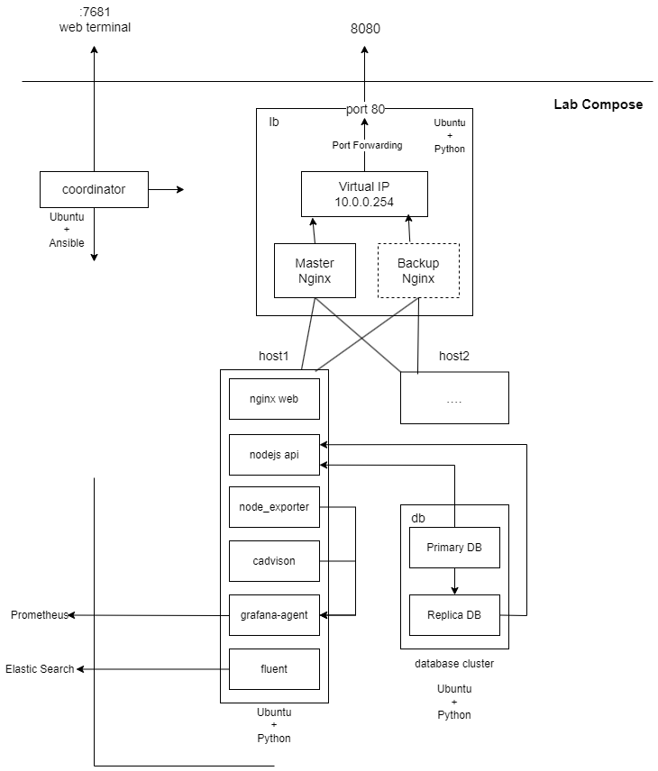
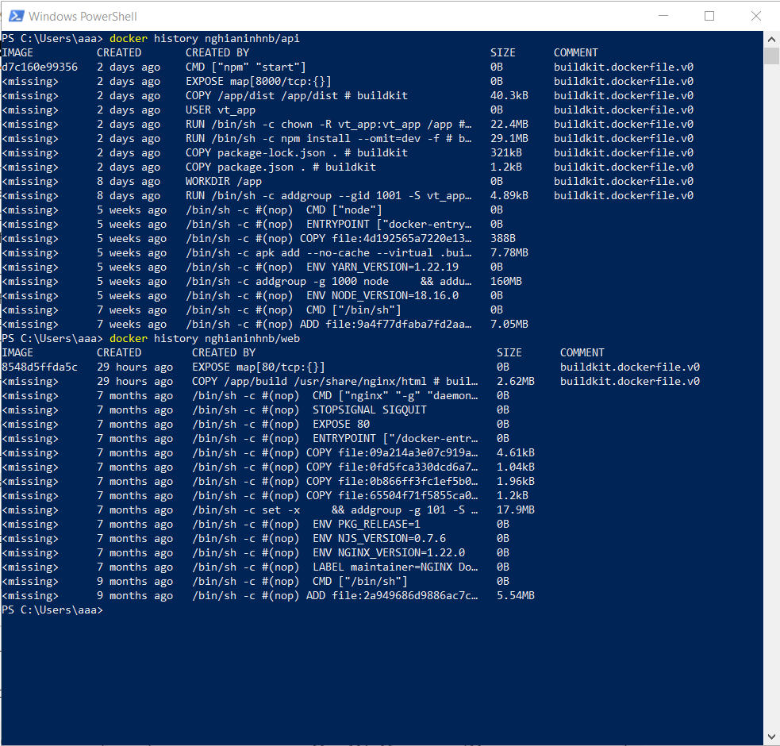
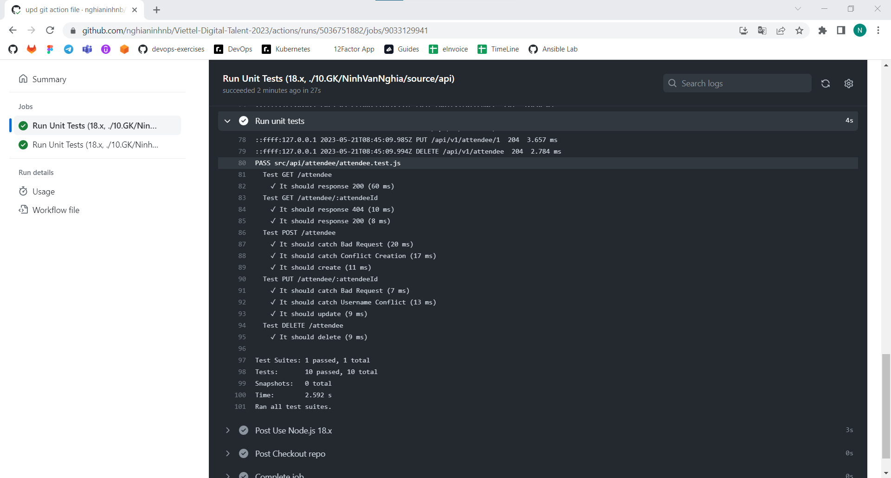
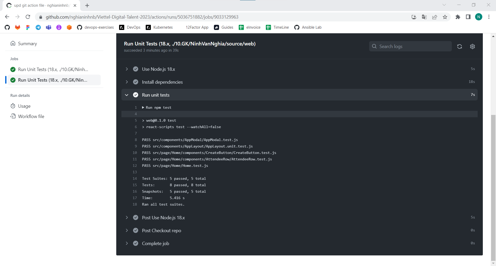
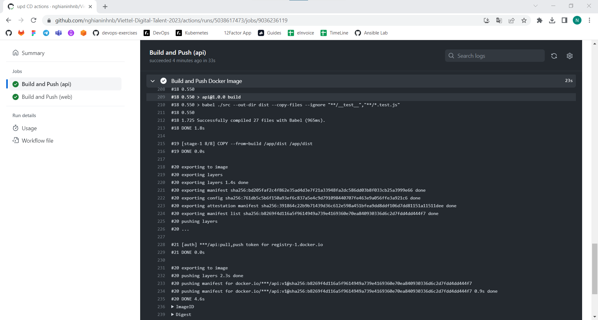
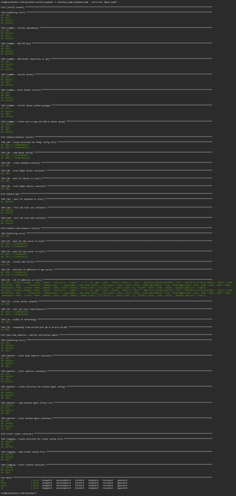

## Tổng quan project
### 1. Kiến trúc hệ thống

- File [compose](./docker-compose.yaml) khởi tạo lab
### 2. Cấu trúc file
```
├── ansible             |
    ├─ roles            | 
    ├─ inventory.yaml   | -> Ansible
    ├─ playbook.yaml    |
    └─ vars.yaml        |

├── images              | -> result images

├── source
    ├─ api              | -> back end code
    ├─ fluent           | -> Dockerfile for custom fluent
    ├─ lb               | -> Dockerfile for HA Nginx cluster
    └─ web              | -> front end code

└── docker-compose.yaml   -> lab compose
```

## Kết quả đạt được
-----
- [x] 1. Phát triển một 3-tier web application đơn giản
  - [x] Liệt kê danh sách sinh viên tham gia khóa đào tạo chương trình VDT 2023 lĩnh
  vực cloud dưới dạng bảng
  - [x] Cho phép xem chi tiết/thêm/xóa/cập nhật thông tin sinh viên
  - [x] web: Giao diện web viết bằng HTML + CSS + Javascript được triển khai trên nền
  web server nginx
  - [x] api: RESTful API viết bằng ngôn ngữ lập trình tùy chọn, có đầy
  đủ các chức năng: list, get, create, update, delete các bản ghi thông tin sinh viên
  - [x] db: Database SQL lưu trữ thông tin sinh viên
  - [x] Viết [unit tests](./source/api/src/api/attendee/attendee.test.js) cho các chức năng APIs (0.5đ)
  - [x] * Viết [unit tests](./source/web/src/components/AppLayout/AppLayout.unit.test.js) cho các chức năng giao diện, viết [integration tests](./source/web/src/components/AppModal/AppModal.test.js)
- mã nguồn [api](./source/api)
- mã nguồn [web](./source/web)
-----
- [x] 2. Containerization
  - [x] Viết Dockerfile để đóng gói các dịch vụ trên thành các container image
  - [x] Yêu cầu image đảm bảo tối ưu thời gian build và kích thước chiếm dụng, khuyến khích
sử dụng các thủ thuật build image đã được giới thiệu (layer-caching, optimized RUN
instructions, multi-stage build, etc.)
- [Dockerfile api](./source/api/Dockerfile)
- [Dockerfile web](./source/web/Dockerfile)
----


--------
- [x] 3. Continuous Integration
  - [x] Tự động chạy unit test khi tạo PR vào branch main
  - [x] Tự động chạy unit test khi push commit lên một branch
- File setup công cụ CI: .github/workflows
----



--------
- [x] 4. Continuous Delivery
  - [x] Viết luồng release dịch vụ bằng công cụ CI/CD của GitHub/GitLab, thực hiện build
docker image và push docker image lên Docker Hub khi có event một tag mới được
developer tạo ra trên GitHub
  - [x] Viết ansible playbook thực hiện các nhiệm vụ:
    - [x] Setup môi trường: Cài đặt docker trên các node triển khai dịch vụ [common role](./ansible/roles/common/tasks/main.yaml)
    - [x] Deploy các dịch vụ theo version sử dụng docker [api, web,... role](./ansible/roles)
    - [x] * Triển khai các dịch vụ trên nhiều hosts khác nhau
  - [x] Đảm bảo tính HA cho các dịch vụ web và api:
    - [x] Mỗi dịch vụ web và api được triển khai trên ít nhất 02 container khác nhau [api, web role](./ansible/roles)
    - [x] Requests đến các endpoint web và api được cân bằng tải thông qua các công
cụ load balancer [lb role](./ansible/roles/lb)
    - [x] * Các công cụ load balancer cũng được triển khai theo mô hình cluster [lb role](./ansible/roles/lb)
    - [x] * Triển khai db dưới dạng cluster [db role](./ansible/roles/db)
- Ảnh minh họa kiến trúc triển khai và bản mô tả ( phần đầu báo cáo )
- Thư mục chứa ansible playbook dùng để triển khai dịch vụ, trong thư mục này cần có
  - File [inventory](./ansible/inventory.yaml) chứa danh sách các hosts triển khai
  - File [playbook](./ansible/playbook.yaml)
  - Thư mục [roles](./ansible/roles) chứa các role
- File setup CD: .github/workflows\
Kết quả chạy CD:


- Hướng dẫn sử dụng ansible playbook để triển khai các thành phần hệ thống:\
Tài nguyên tối thiểu cho docker: 2 core, 4GB RAM\
Tại folder 10.GK/NinhVanNghia khởi tạo môi trường lab:
```
docker compose up
```
Truy cập [localhost:7681](http://localhost:7681) vào bash của coordinator. Chạy các lệnh:
```
cd /vdt/ansible
ansible-playbook -i inventory.yaml playbook.yaml --extra-vars "@vars.yaml"
```
Kết quả:



--------------
- [x] 5. Monitoring
  - [x] Viết ansible playbook roles [monitor](./ansible/roles/monitor) thực hiện các nhiệm vụ:
    - [x] Cài đặt các dịch vụ node exporter và cadvisor dưới dạng container
    - [x] Đẩy thông số giám sát lên hệ thống giám sát [Prometheus](http://27.66.108.93:9090/graph?g0.expr=%7Busername%3D%27ninh_nghia%27%7D&g0.tab=1&g0.stacked=0&g0.show_exemplars=0&g0.range_input=1h&g0.end_input=2023-05-21%2005%3A31%3A54&g0.moment_input=2023-05-21%2005%3A31%3A54) tập trung
--------------
- [x] 6. Logging
  - [x] Viết ansible playbook roles [logging](./ansible/roles/logging) thực hiện các nhiệm vụ:
    - [x] Cài đặt dịch vụ logstash hoặc fluentd để collect log từ các dịch vụ web, api và db
    - [x] Đẩy log dịch vụ lên hệ thống [Elasticsearch](http://171.236.38.100:5601/app/discover#/?_g=(filters:!(),refreshInterval:(pause:!t,value:60000),time:(from:now-15d,to:now))&_a=(columns:!(),filters:!(),index:c647a44a-6c26-49ae-9c09-2af8000ad694,interval:auto,query:(language:kuery,query:''),sort:!(!('@timestamp',desc)))) tập trung
    - [x] Log phải đảm bảo có ít nhất các thông tin: IP truy cập, thời gian, action tác động,
kết quả (thành công/không thành công/status code)
