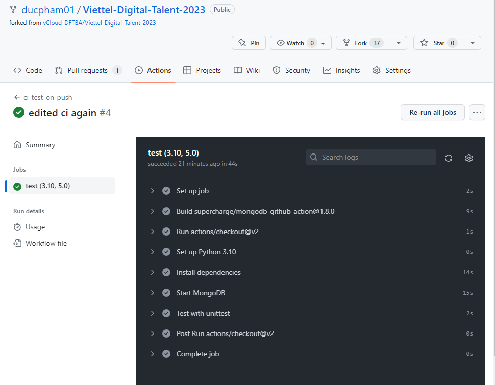
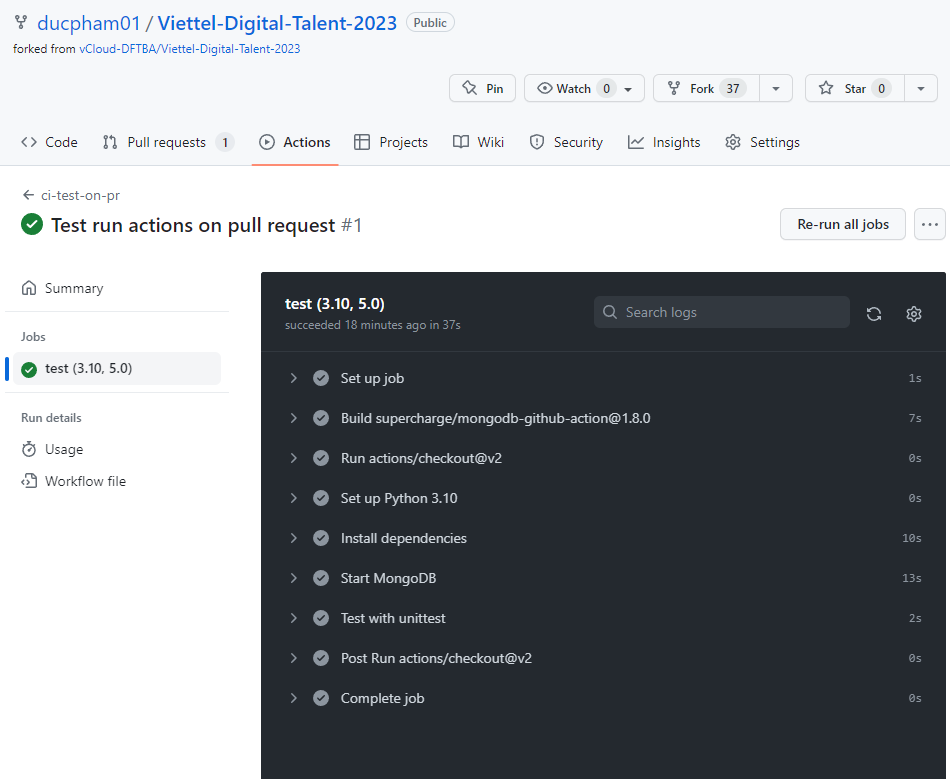
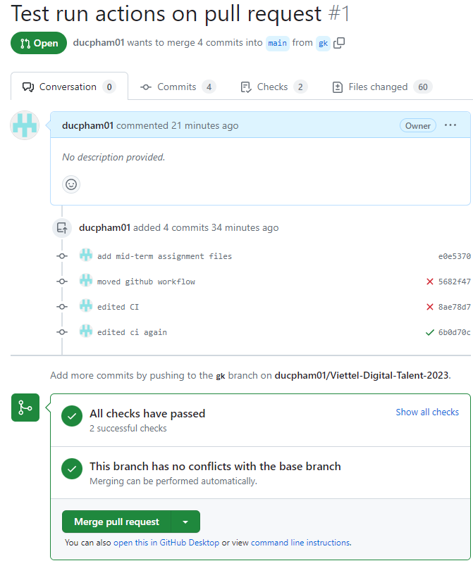
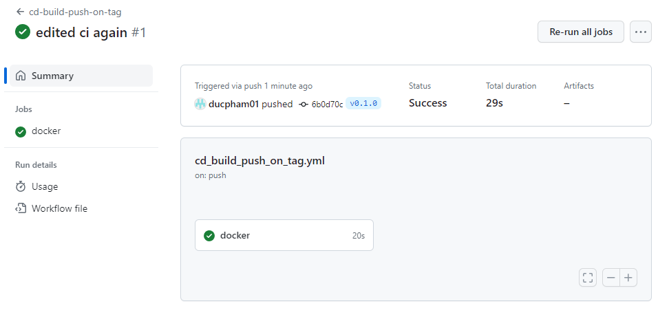
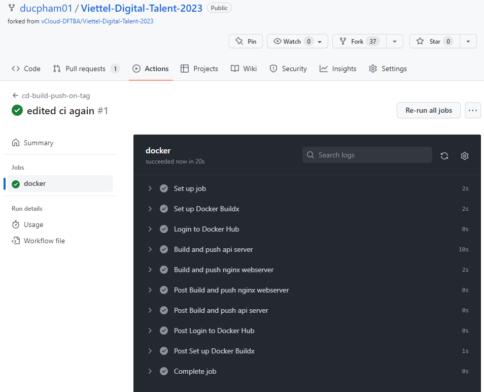
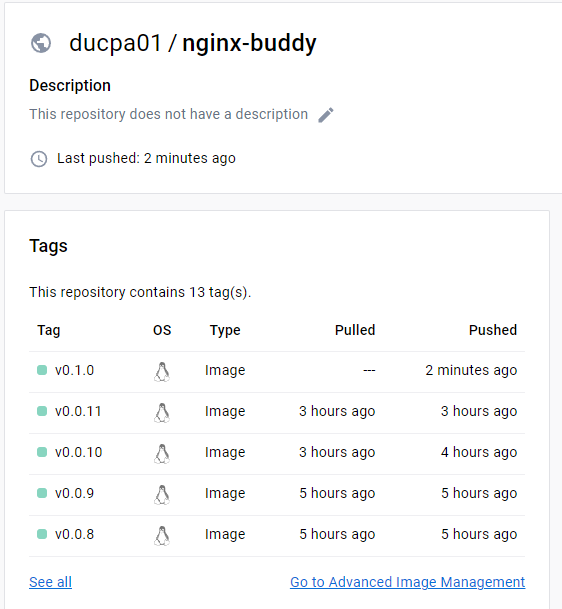
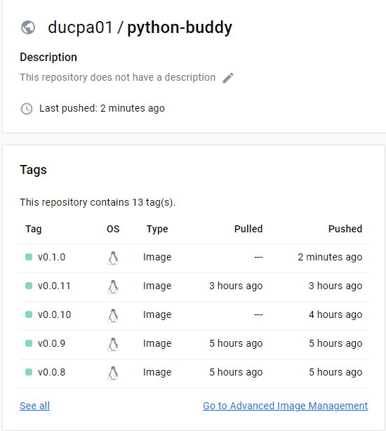

# Phát triển 3-tier web application đơn giản

Ouput: mã nguồn các dịch vụ
- [Danh sách sinh viên](./src/app/services)
- [CRUD sinh viên](./src/app/services)
- [Giao diện HTML, CSS, JS](./src/nginx/index.html)
- [nginx.conf](./src/nginx/nginx.conf)
- [unit tests](./src/test)

# Triển khai web applications dùng devops tools
## 1. Containerization
- [Dockerfile API](./src/app/Dockerfile)
- [Dockerfile Nginx](./src/nginx/Dockerfile)
- Câu lệnh build:
	- nginx: `docker build -t ducpa01/nginx-buddy .`
	- python api server: `docker build -t ducpa01/python-buddy .`
- Docker history:
	- [nginx web server](./src/nginx/history.txt)
	- [python api server](./src/app/history.txt)
## 2. CI
2.1 File setup CI
Test khi push lên 1 branch
```yml
name: ci-test-on-push

on:
  push:
    branches: "*"

jobs:
  test:
    runs-on: ubuntu-latest
    strategy:
      matrix:
        python-version: ["3.10"]
        mongodb-version: ['5.0']
    steps:
      - uses: actions/checkout@v2
      - name: Set up Python ${{ matrix.python-version }}
        uses: actions/setup-python@v1
        with:
          python-version: ${{ matrix.python-version }}
      - name: Install dependencies
        run: |
          python -m pip install --upgrade pip
          pip install -r ./10.GK/PhamAnhDuc/src/app/requirements.txt
          pip install boto3
      - name: Start MongoDB
        uses: supercharge/mongodb-github-action@1.8.0
        with:
            mongodb-version: ${{ matrix.mongodb-version }}
            mongodb-port: 27018
    
      - name: Test with unittest
        run: |
          cd ./10.GK/PhamAnhDuc/src
          python -m unittest discover -s app -p '*_test.py' -v
```
Test khi tạo pull request
```yml
name: ci-test-on-pr

on:
    pull_request:
      branches: ["main","master"]
  

jobs:
  test:
    runs-on: ubuntu-latest
    strategy:
      matrix:
        python-version: ["3.10"]
        mongodb-version: ['5.0']
    steps:
      - uses: actions/checkout@v2
      - name: Set up Python ${{ matrix.python-version }}
        uses: actions/setup-python@v1
        with:
          python-version: ${{ matrix.python-version }}
      - name: Install dependencies
        run: |
          python -m pip install --upgrade pip
          pip install -r ./10.GK/PhamAnhDuc/src/app/requirements.txt
          pip install boto3
      - name: Start MongoDB
        uses: supercharge/mongodb-github-action@1.8.0
        with:
            mongodb-version: ${{ matrix.mongodb-version }}
            mongodb-port: 27018
    
      - name: Test with unittest
        run: |
          cd ./10.GK/PhamAnhDuc/src
          python -m unittest discover -s app -p '*_test.py' -v
```
2.2 Output logs
- Test khi push lên 1 branch: [link](./logs/test_on_push.txt)
- Test khi tạo pull request: [link](./logs/test_on_pull_request.txt)

2.3 Các hình ảnh demo:
- test khi push lên 1 branch: 
- Test khi tạo pull request:  

## 3. CD
3.1 File setup CD
```
name: cd-build-push-on-tag

on:
    push:
      tags:
        - 'v[0-9]+.[0-9]+.[0-9]+'
        # - '*'

jobs:
  docker:
    runs-on: ubuntu-latest
    steps:

      - name: Set up Docker Buildx
        uses: docker/setup-buildx-action@v2

      - name: Login to Docker Hub
        uses: docker/login-action@v2
        with:
          username: ${{ secrets.DOCKERHUB_USERNAME }}
          password: ${{ secrets.DOCKERHUB_TOKEN }}
      - name: Build and push api server
        uses: docker/build-push-action@v4
        with:
          push: true
          tags: ducpa01/python-buddy:${{github.ref_name}}
          context: "{{defaultContext}}:10.GK/PhamAnhDuc/src/app"

      - name: Build and push nginx webserver
        uses: docker/build-push-action@v4
        with:
          push: true
          tags: ducpa01/nginx-buddy:${{github.ref_name}}
          context: "{{defaultContext}}:10.GK/PhamAnhDuc/src/nginx"
      
      - name: Build and push fluentd
        uses: docker/build-push-action@v4
        with:
          push: true
          tags: ducpa01/fluentd-vdt:${{github.ref_name}}
          context: "{{defaultContext}}:10.GK/PhamAnhDuc/src/logging/fluentd"

```
3.2 Output luồng build





3.3 Hướng dẫn sử dụng ansible playbook
	- Thêm các machine vào file `inventory.yml`
	- trong file `main.yml`:
		- config prometheus tập trung: `remote_write_server` 
		- config elasticsearch server tập trung: `remote_logging_server`
		- config `tag_version` muốn deploy
		- config các endpoint cho load_balancer
	- Chạy lệnh `ansible-playbook -i inventory.yml main.yml` để triển khai.
3.4 Output [log triển khai](./ansible/final_log.txt)

## 4. Monitoring
4.1 [Role monitor](./ansible/roles/monitor)
4.2 Ảnh chụp dashboard

## 5. Logging
5.1 [Role logging](./ansible/roles/logging)
5.2 Sample log từ kibana
