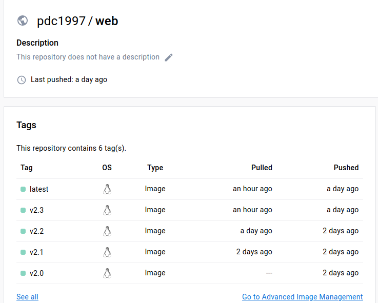

# **Viettel-Digital-Talent-2023**

## **Bài tập lớn giữa kỳ**

## **Mục Lục**

<!-- TOC -->

- [**Viettel-Digital-Talent-2023**](#viettel-digital-talent-2023)
    - [**Bài tập lớn giữa kỳ**](#b%C3%A0i-t%E1%BA%ADp-l%E1%BB%9Bn-gi%E1%BB%AFa-k%E1%BB%B3)
    - [**Mục Lục**](#m%E1%BB%A5c-l%E1%BB%A5c)
    - [**I. Phát triển một 3-tier web application đơn giản**](#i-ph%C3%A1t-tri%E1%BB%83n-m%E1%BB%99t-3-tier-web-application-%C4%91%C6%A1n-gi%E1%BA%A3n)
        - [**Trang web khi hoàn thành với đầy đủ chức năng RESTful API**](#trang-web-khi-ho%C3%A0n-th%C3%A0nh-v%E1%BB%9Bi-%C4%91%E1%BA%A7y-%C4%91%E1%BB%A7-ch%E1%BB%A9c-n%C4%83ng-restful-api)
        - [**Units test cho API**](#units-test-cho-api)
    - [**II. Triển khai web application sử dụng các DevOps tools & practices**](#ii-tri%E1%BB%83n-khai-web-application-s%E1%BB%AD-d%E1%BB%A5ng-c%C3%A1c-devops-tools--practices)
        - [**1. Containerization**](#1-containerization)
        - [**2. Continuous Integration**](#2-continuous-integration)
        - [**3. Continuous Delivery**](#3-continuous-delivery)
        - [**4. Monitoring**](#4-monitoring)
        - [**5. Logging**](#5-logging)

<!-- /TOC -->
## **I. Phát triển một 3-tier web application đơn giản**

CRUD web application gồm 3 phần:

- Database: Sử dụng `Mongdb`
- Web: Sủ dụng `nginx`
- API: Sử dụng ngôn ngữ `python` với thư viện của `flask api'

### **Trang web khi hoàn thành với đầy đủ chức năng RESTful API**


  

### **Units test cho API**

- Test các chức năng CRUD của web  bằng cách gửi các yêu cầu HTTP đến APIs. Testkết quả trả về với kết quả kì vọng. 
- Thay đổi database được thực hiện trên mockdatabse ảo sử dụng thư viện ``mongomock` tránh ảnh hưởng đến database gốc.
```python
# importing sys
from bson.objectid import ObjectId
from Flask_CRUD.app import create_app
import unittest
import mongomock


def mockdatabase():
    clientMongo = mongomock.MongoClient()
    db = clientMongo["mydatabase"]
    collection = db["mycollection"]
    collection.insert_one(
        {
            "full_name": "Init student",
            "birth_year": "1945",
            "major": "AI",
            "unversity": "ITMO",
            "gender": "Nam",
        }
    )
    return collection


class FlaskAppTestCase(unittest.TestCase):
    def setUp(self):
        self.db = mockdatabase()
        self.app = create_app(self.db)
        self.app.config["TESTING"] = True
        self.client = self.app.test_client()
        self.init_data = self.db.find_one({})
        self.test_data = {
            "full_name": "Test student",
            "birth_year": "1975",
            "major": "ML",
            "unversity": "ITMO",
            "gender": "Nữ",
        }

    def tearDown(self):
        # Restart database
        self.db.drop()

    def test_index(self):
        # Check home page
        response = self.client.get("/")
        self.assertEqual(response.status_code, 200)

    def test_add_student(self):
        # Test add student
        response = self.client.post("/action_add", data=self.test_data)
        self.assertEqual(response.status_code, 302)
        result = self.db.find_one({"full_name": "Test student"})
        self.assertIsNotNone(result)
        self.assertEqual(result["birth_year"], "1975")
        self.assertEqual(result["major"], "ML")
        self.assertEqual(result["unversity"], "ITMO")
        self.assertEqual(result["gender"], "Nữ")

    def test_remove_student(self):
        # Test remove student
        response = self.client.delete("/remove", data={"_id": self.init_data["_id"]})
        self.assertEqual(response.status_code, 302)

        removed_student = self.db.find_one({"_id": self.init_data["_id"]})
        self.assertEqual(removed_student, None)

    def test_update(self):
        # Test redirice to page update student
        response = self.client.get(f'/update?_id={str(self.init_data["_id"])}')
        self.assertEqual(response.status_code, 200)

    def test_action_update(self):
        # Test update info student
        url = f"/action_update?_id={str(self.init_data['_id'])}"
        response = self.client.post(url, data=self.test_data)
        assert response.status_code == 302

        # Verify the update was successful
        updated_student = self.db.find_one({"_id": ObjectId(self.init_data["_id"])})
        self.assertIsNotNone(updated_student)
        assert updated_student["birth_year"] == "1975"


if __name__ == "__main__":
    unittest.main()

```


- Kết quả test API :


## **II. Triển khai web application sử dụng các DevOps tools & practices**

### **1. Containerization**

- Docker file cho API:
```yaml
# syntax = docker/dockerfile:experimental
FROM python:3.9-alpine3.17

WORKDIR /src

COPY requirements.txt .
RUN pip3 install -r requirements.txt

COPY . .

ENTRYPOINT ["python3", "run.py"]
```

- Docker file cho web:
```yaml
FROM nginx:1.22.0-alpine

ENV FLASK_SERVER_ADDR=api:5000

COPY nginx.conf /tmp/nginx.conf

CMD ["/bin/sh", "-c", "envsubst < /tmp/nginx.conf > /etc/nginx/conf.d/default.conf && nginx -g 'daemon off;'"]

```

- Docker history Nginx:


- Docker history database: Data chỉ tải xuống image mongo:5.0


- Docker history API:


### **2. Continuous Integration**

- Tự động chạy unit test khi tạo PR vào branch main.
- Tự động chạy unit test khi push commit lên một branch.
`.github/workflows/ci.yaml`
```yaml
name: CI workflow

on:
  pull_request:
    branches:
      - main
  push:
    branches:
     - main
     - 10.GK

permissions:
  contents: read

jobs:
  unit_testing:
    runs-on: ubuntu-latest

    steps:
      - uses: actions/checkout@v3

      - name: Set up Python 
        uses: actions/setup-python@v3
        with:
          python-version: "3.10.6"

      - name: Install dependencies
        run: |
          python -m pip install --upgrade pip
          pip install mongomock
          pip install -r 10.GK/PhamDuyCuong/source/web_CRUD/api/requirements.txt

      - uses: ricardochaves/python-lint@v1.4.0
        with:
          python-root-list: "10.GK/PhamDuyCuong/source/web_CRUD/api"
          use-pylint: false
          use-pycodestyle: false
          use-flake8: true
          use-black: true
          use-mypy: false
          use-isort: false
          extra-flake8-options: "--exit-zero --max-line-length=127"

      - name: Run tests
        run: |
          python 10.GK/PhamDuyCuong/source/web_CRUD/api/tests.py

```

Out put log của luồng CI:


### **3. Continuous Delivery**

- File setup CD:
    ```yaml
    name: CD build and push images

    on:
    push:
        tags:
        - '*'
    
    jobs:
    build:
        runs-on: ubuntu-latest
        steps:
        - uses: actions/checkout@v3

        - name: Log in to Docker Hub
            uses: docker/login-action@v2 
            with:
            username: ${{ secrets.DOCKER_HUB_USERNAME }}
            password: ${{ secrets.DOCKER_HUB_PASSWORD }}
        
        - name: Set up Docker Buildx
            uses: docker/setup-buildx-action@v2

        - name: Get tag name
            if: startsWith(github.ref, 'refs/tags/')
            run: echo "TAG=$(echo ${{ github.ref }} | sed 's/refs\/tags\///')" >> $GITHUB_ENV

        - name: Build and push Docker image backend
            uses: docker/build-push-action@v4
            with:
            context: 10.GK/PhamDuyCuong/source/web_CRUD/api
            push: true
            tags: |
                ${{ secrets.DOCKER_HUB_USERNAME }}/api:${{ env.TAG }}
                ${{ secrets.DOCKER_HUB_USERNAME }}/api:latest
            file: 10.GK/PhamDuyCuong/source/web_CRUD/api/Dockerfile
        
        - name: Build and push Docker image fronend
            uses: docker/build-push-action@v4
            with:
            context: 10.GK/PhamDuyCuong/source/web_CRUD/web
            push: true
            tags: |
                ${{ secrets.DOCKER_HUB_USERNAME }}/web:${{ env.TAG }}
                ${{ secrets.DOCKER_HUB_USERNAME }}/web:latest
            file: 10.GK/PhamDuyCuong/source/web_CRUD/web/Dockerfile
    ```

- Output của luồng build và push Docker Image lên Docker Hub
    

    Các images được gắn tag theo tag của commit đẩy lên github.
    

- Mô tả kiến trúc triển khai: Người dùng có thể truy cập vào web qua địa chỉ: `localhost:100`. Thông qua địa chỉ này LB sẽ chuyển các request tới api,web cả ở localhost (on-premises) và các EC2 (cloud). Cuối cùng tất cả các yêu cầu truy xuất database được thực hiện trên một EC2 riêng biệt, nơi chạy container `mongodb`.

- Minh họa kiến trúc triển khai:
 


- Thư mục chứa ansible playbook dùng để triển khai dịch vụ:


    *Note: Các role thực hiện theo các chắc năng mà bài tập yêu cầu.

- Hướng dẫn sử dụng ansible playbook để triển khai các thành phần hệ thống. Nếu tair xuống toàn bộ code thì truy cập vào thư mục 10.GK/PhamDuyCuong/source/Ansible và thực hiện cmd:

    ```
    sudo ansible-playbook  playbook.yml -i /inventory
    ```

- Output log triển khai hệ thống:
Bao gồm lần lượt các bước:
    - Setup môi trường (role `common`)
    - Set up logging trước khi chạy các container web nhằm thu log của chúng ngay khi mới khởi tạo (role `logging`)
    - Chạy các container api, db,web
    - Cân bằng tải cho api và web (role `lb`)
    - Monitoring (role `monitor`)


### **4. Monitoring**


- Ansible play-book role monitor chứa các playbook và cấu hình giám sát cho hệ thống:

```yaml
---
# tasks file for monitor
- name: Run cadvisor container
  community.docker.docker_container:
    image: gcr.io/cadvisor/cadvisor
    name: cadvisor
    ports:
      - 8080:8080
    volumes:
      - /:/rootfs:ro
      - /var/run:/var/run:rw
      - /sys:/sys:ro
      - /var/lib/docker/:/var/lib/docker:ro

- name: Run node exporter container
  community.docker.docker_container:
    image: prom/node-exporter
    name: node_exporter
    ports:
      - 9100:9100
    restart_policy: "unless-stopped"

- name: Copy prometheus config
  copy:
    src: {{ PATH_CONFIG_FILE }}
    dest: /tmp
  become: yes

- name: Run Prometheus container
  community.docker.docker_container:
    name: prometheus
    image: prom/prometheus
    restart: true
    ports: "9090:9090"
    volumes: /tmp/prometheus.yml:/etc/prometheus/prometheus.yml
```

- Dashboard giám sát nodes & container:
 

### **5. Logging**

Roles `longging` thu thập log của dịch vụ web,api,db từ tất cả các host: localhost, 2 máy ảo EC2, một máy ảo chạy database trên port 24224 của chúng. Sau đó Đẩy log dịch vụ lên hệ thống Elasticsearch tập trung 171.236.38.100:9200.

*Index management Kibana 171.236.38.100:5601

*Log từ Kibana 171.236.38.100:5601

Em đã đẩy lên và tạo dashboard rồi. Các anh check lại và tính điểm  giúp em với ạ.  Sáng hôm sau vào chụp màn hình  thì muộn chắc do các a/c đã đóng server. Em rất xin lỗi vì nộp bài muộn.


