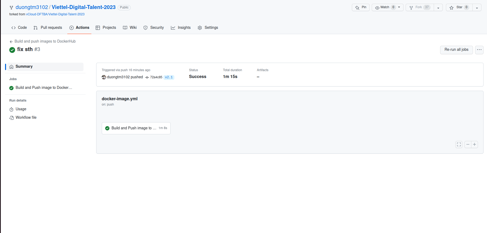

# Bài tập lớn giữa kỳ

Sinh viên: **Trần Minh Dương**

### Các Output và tự đánh giá các yêu cầu thực hiện được

- [x] - Đã thực hiện
- [ ] - Chưa thực hiện

## **`Phát triển một 3-tier web application đơn giản`**

Yêu cầu:

- Viết một CRUD web application đơn giản thực hiện các chức năng:
  - [x] Liệt kê danh sách sinh viên dưới dạng bảng (0.5đ)
  - [x] Cho phép xem chi tiết/thêm/xóa/cập nhật thông tin sinh viên (0.5đ)
- Thiết kế hệ thống với ba dịch vụ: (0.5đ)
  - [x] web: Giao diện web viết bằng ReactJS, triển khai trên nền web server nginx
  - [x] api: RESTful API viết bằng Python,có đầy đủ các chức năng: list, get, create, update, delete các bản ghi thông tin sinh viên
  - [x] db: Database MongoDB lưu trữ thông tin sinh viên
- [x] Viết unit tests cho các chức năng APIs (0.5đ)

  [ ] \* Viết unit tests cho các chức năng giao diện, viết integration tests
  Output:

**Output:** Mã nguồn của từng dịch vụ

- [web](./vtapp/frontend/)
- [api](./vtapp/backend/app.py)
- [test](./vtapp/test/test_api.py)

## **`Triển khai web application sử dụng các DevOps tools & practices(8đ)`**

### **`1. Containerization (1đ)`**

**Yêu cầu:**

- [x] Viết Dockerfile để đóng gói các dịch vụ trên thành các container image (0.5đ)
- [x] Yêu cầu image đảm bảo tối ưu thời gian build và kích thước chiếm dụng (0.5đ)

**Output:**

- File Dockerfile cho từng dịch vụ
  - [Web Dockerfile](./vtapp/frontend/Dockerfile)
  - [API Dockerfile](./vtapp/backend/Dockerfile)
- Output câu lệnh build và thông tin docker history của từng image

_2 image frontend và backend :_

<div align="center">
    
</div>

_Build web(frontend) :_

<div align="center">
    
</div>

_Web image history :_

<div align="center">
    
</div>

_Build api(backend) :_

<div align="center">
    
</div>

_Api image history :_

<div align="center">
    
</div>

### **`2. Continuous Integration (1đ)`**

**Yêu cầu:**

- [x] Tự động chạy unit test khi tạo PR vào branch main (0.5đ)
- [x] Tự động chạy unit test khi push commit lên một branch (0.5đ)

**Output:**

- File setup công cụ CI: [CI workflow](./workflows/python-app.yml)
- Output log của luồng CI

_Tự động chạy unit test khi push commit lên 1 branch:_

<div align="center">
    
</div>

_Log của luồng:_

<div align="center">
    
</div>

- Các hình ảnh demo khác: [Github Actions history](https://github.com/duongtm3102/Viettel-Digital-Talent-2023/actions)

### **`3. Continuous Delivery (4đ)`**

**Yêu cầu:**

- [x] Viết luồng release dịch vụ bằng công cụ CI/CD của GitHub/GitLab, thực hiện build docker image và push docker image lên Docker Hub khi có event một tag mới được developer tạo ra trên GitHub (1đ)
- Viết ansible playbook thực hiện các nhiệm vụ:
  - [x] Setup môi trường: Cài đặt docker trên các node triển khai dịch vụ (1đ)
  - [x] Deploy các dịch vụ theo version sử dụng docker (1đ)
  - [x] Triển khai các dịch vụ trên nhiều hosts khác nhau
- Đảm bảo tính HA cho các dịch vụ web và api:
  - [x] Mỗi dịch vụ web và api được triển khai trên ít nhất 02 container khác nhau (0.5đ)
  - [x] Requests đến các endpoint web và api được cân bằng tải thông qua các công
        cụ load balancer: nginx (0.5đ)
  - [ ] \*Các công cụ load balancer cũng được triển khai theo mô hình cluster
  - [ ] \*Triển khai db dưới dạng cluster

**Output:**

- Ảnh minh họa kiến trúc triển khai và bản mô tả

- Thư mục chứa ansible playbook dùng để triển khai dịch vụ, trong thư mục này cần có
  - File [inventory](./ansible/inventories/inventory.yaml) chứa danh sách các hosts triển khai
  - Các file [playbook](./ansible/site.yaml)
  - Thư mục [roles](./ansible/roles/) chứa các role:
    - [common](./ansible/roles/common/): Setup môi trường trước deploy
    - [web](./ansible/roles/web/): Triển khai dịch vụ web
    - [api](./ansible/roles/api/): Triển khai dịch vụ api
    - [db](./ansible/roles/db/): Triển khai dịch vụ db
    - [lb](./ansible/roles/lb/): Triển khai dịch vụ load balancing
- File setup CD: [CD workflow](./workflows/docker-image.yml)
- Output của luồng build và push Docker Image lên Docker Hub
  _Tự động build và push Docker image khi push 1 tag:_

<div align="center">
    
</div>

_Log của luồng: Build-Push Backend Image_

<div align="center">
    
</div>

_Log của luồng: Build-Push Frontend Image_

<div align="center">
    
</div>

- Hướng dẫn sử dụng ansible playbook để triển khai các thành phần hệ thống

Chuyển đến thư mục [ansible](./ansible/)

Chạy ansible playbooks

```bash
ansible-playbook -i inventories/inventory.yaml site.yaml -K
```

-K: nhập mật khẩu để thực hiện các lệnh cần sudo

- Output log triển khai hệ thống

_Common tasks_

<div align="center">
    
</div>

_DB tasks_

<div align="center">
    
</div>

_API + Web tasks_

<div align="center">
    
</div>

_LB tasks_

<div align="center">
    
</div>

**Full log bao gồm monitor tasks và logging tasks tại [đây](./images/ansiblelog.txt)**

### **`4. Monitoring (1đ)`**

**Yêu cầu:**

- [x] Viết ansible playbook roles monitor thực hiện các nhiệm vụ:
  - Cài đặt các dịch vụ node exporter và cadvisor dưới dạng container
  - Đẩy thông số giám sát lên hệ thống giám sát Prometheus tập trung

**Output:**

- Role monitor chứa các playbook và cấu hình giám sát cho hệ thống
  - [Monitor role](./ansible/roles/monitor/)
  - [Cấu hình](./ansible/roles/monitor/templates/prometheus.yml)
- Ảnh chụp dashboard giám sát nodes & containers sử dụng hệ thống prometheus tập trung ở http://27.66.108.93:9090

_Username **duongtm**:_

<div align="center">
    
</div>

### **`5. Logging (1đ)`**

**Yêu cầu:**

- [x] Viết ansible playbook thực hiện các nhiệm vụ:
  - Cài đặt dịch vụ logstash hoặc fluentd để collect log từ các dịch vụ web, api và db
  - Đẩy log dịch vụ lên hệ thống Elasticsearch tập trung 171.236.38.100:9200
  - Log phải đảm bảo có ít nhất các thông tin: IP truy cập, thời gian, action tác động, kết quả (thành công/không thành công/status code)
  - Log được index với tiền tố <username>\_ để phân biệt log dịch vụ của các sinh
    viên khác nhau.

**Output:**

- Ansible playbook triển khai các dịch vụ collect log
  - [Logging role](./ansible/roles/logging/)
  - [Cấu hình](./ansible/roles/logging/files/fluentd/fluent.conf)
- Ảnh chụp sample log từ Kibana 171.236.38.100:5601

_Username **duongtm**:_

<div align="center">
    
</div>
