## Bài tập lớn Giữa Kỳ

### Lê Tùng Lâm

### Phát triển một 3-tier web application

- Mã nguồn backend APIs: [main.py](./Containerization/app/main.py)
- Mã nguồn frontend (static file): [index.html](./Containerization/nginx/index.html)
- Mã nguồn frontend (rendered by APIs): [attendees.html](./Containerization/app/templates/attendees.html)
- Mã nguồn Unit Tests cho các chức năng APIs: [test_main.py](./Containerization/tests/app/test_main.py)

- MongoDB database được sử dụng thông qua Docker image, database khởi tạo được thực hiện bằng file [init-mongo.js](./Containerization/db/mongo-init.js)

- Web server sử dụng Nginx thông qua Docker image, file cấu hình Nginx tại [nginx.conf](./Containerization/nginx/nginx.conf)

- CRUD APIs endpoints:
  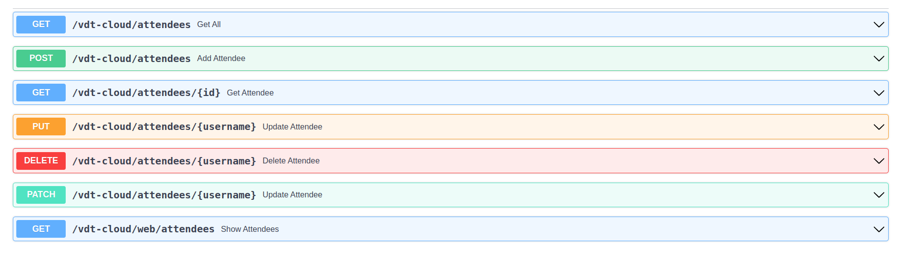

- Static webpage triển khai ở cổng 81 trên Nginx:
  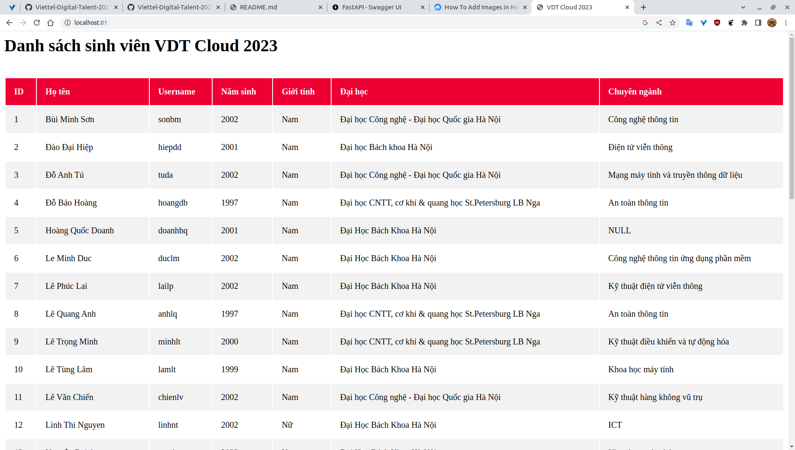

- Rendered webpage được triển khai thông qua python backend APIs:
  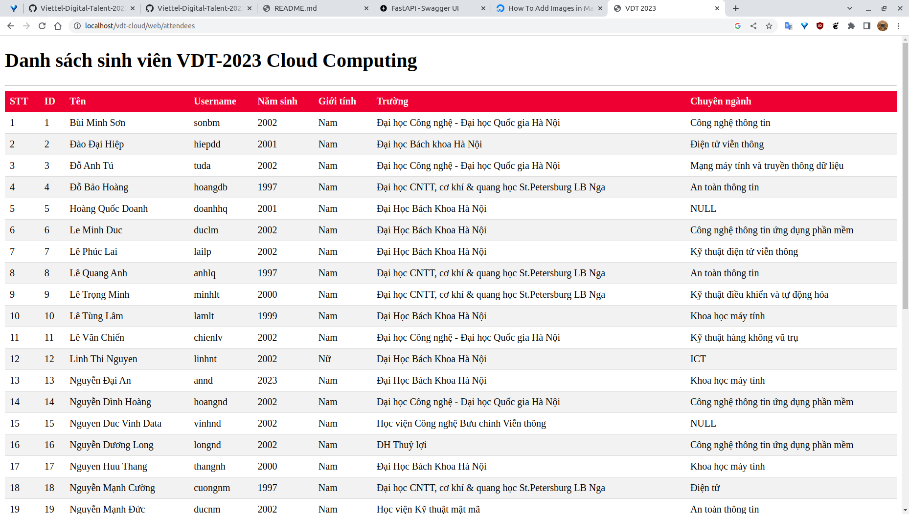

### Triển khai web application sử dụng các DevOps tools & practices

#### 1. Containerization

##### Dockerfile cho từng dịch vụ:

- [APIs](./Containerization/app/Dockerfile)

  ```Dockerfile
    FROM python:3.9-alpine

    WORKDIR /app

    COPY . .

    RUN pip install "fastapi[all]" pymongo --no-cache-dir

    CMD uvicorn main:app --reload --host 0.0.0.0 --port 8000
  ```

- Nginx sử dụng lại [Docker image](https://hub.docker.com/_/nginx) trên Docker Hub mà không cần build image mới. [File cấu hình Nginx](./Containerization/nginx/nginx.conf):

  ```
  events {
      worker_connections 1000;
  }

  http {
      server {
          listen 80;
          server_name app;

          location / {
              proxy_pass http://app:8000;
          }
      }

      server {
          listen 81;
          server_name 127.0.0.1;

          location / {
              root    /usr/share/nginx/html;
              index   index.html;
          }
      }
  }
  ```

- MongoDB database sử dụng lại Docker image trên Docker Hub mà không cần build image mới. File khởi tạo database [mongo-init.js](./Containerization/db/mongo-init.js):

  ```js
  /* Phiên bản demo rút gọn chỉ có 1 bản ghi */

  db = db.getSiblingDB("vdt");

  db.createCollection("attendees");

  db.attendees.insertMany([
    {
      id: 1,
      name: "Bùi Minh Sơn",
      username: "sonbm",
      birthyear: "2002",
      gender: "Nam",
      university: "Đại học Công nghệ - Đại học Quốc gia Hà Nội",
      major: "Công nghệ thông tin",
    },
  ]);
  ```

##### Output câu lệnh build và thông tin docker history của từng image

- APIs

  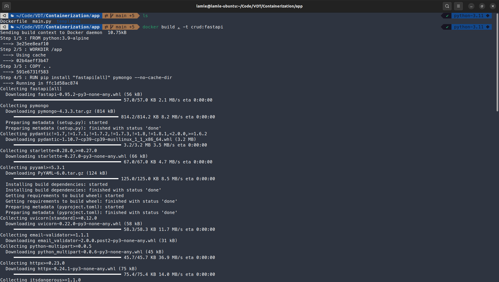

  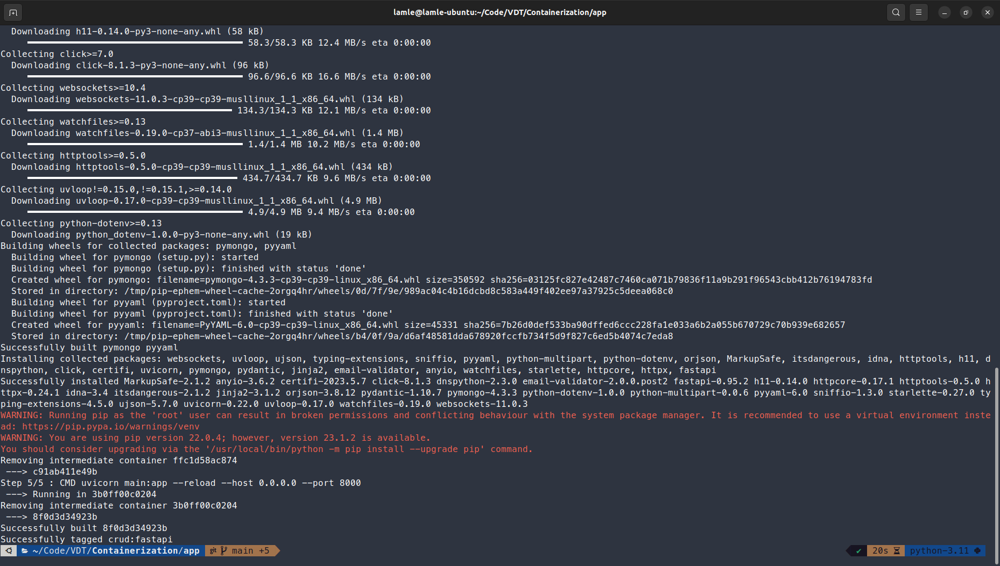

  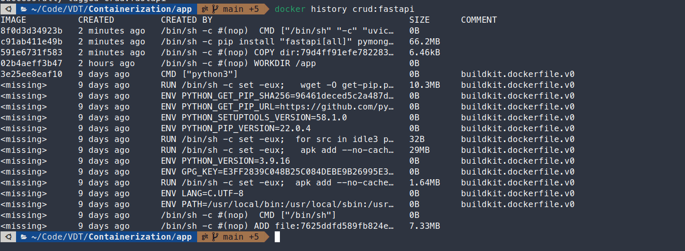

- Nginx (không build lại nên chỉ có history)
  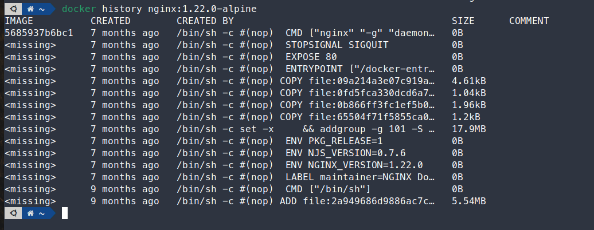

- MongoDB (không build lại nên chỉ có history)
  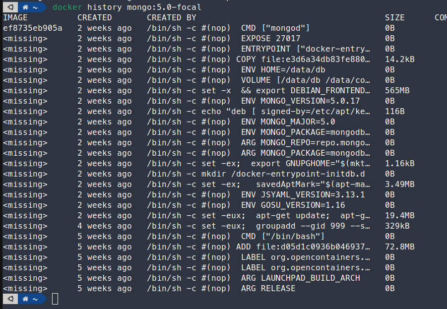

#### 2. Continuous Integration

- File setup công cụ CI:

```yaml
name: CI/CD

on:
  push:
    branches: 
      - '*' 
  pull_request:
    branches: [ "main" ]

permissions:
  contents: read

jobs:
  unit-testing:

    runs-on: ubuntu-latest

    steps:
    - uses: actions/checkout@v3
    - name: Set up Python 3.9.16
      uses: actions/setup-python@v3
      with:
        python-version: "3.9.16"
    - name: Install dependencies
      run: |
        python -m pip install --upgrade pip
        pip install flake8 pytest
        if [ -f ./10.GK/Containerization/requirements.txt ]; then pip install -r ./10.GK/Containerization/requirements.txt; fi
    - name: Lint with flake8
      run: |
        # stop the build if there are Python syntax errors or undefined names
        flake8 . --count --select=E9,F63,F7,F82 --show-source --statistics
        # exit-zero treats all errors as warnings. The GitHub editor is 127 chars wide
        flake8 . --count --exit-zero --max-complexity=10 --max-line-length=127 --statistics
    - name: Turn on database
      run: |
        docker compose -f ./10.GK/Containerization/docker-compose-db.yaml up -d
    - name: Test with pytest
      run: |
        pytest 10.GK/Containerization/tests/app/test_main.py
```

- Output log của luồng CI

  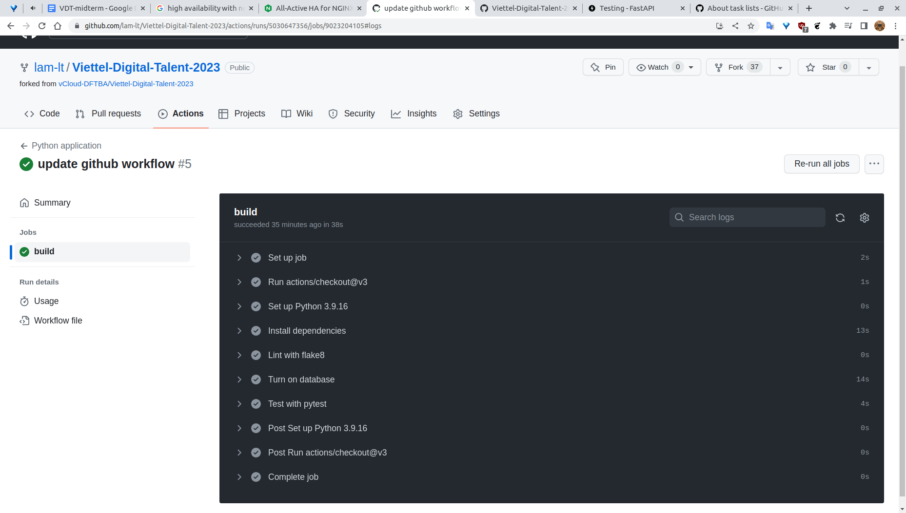
  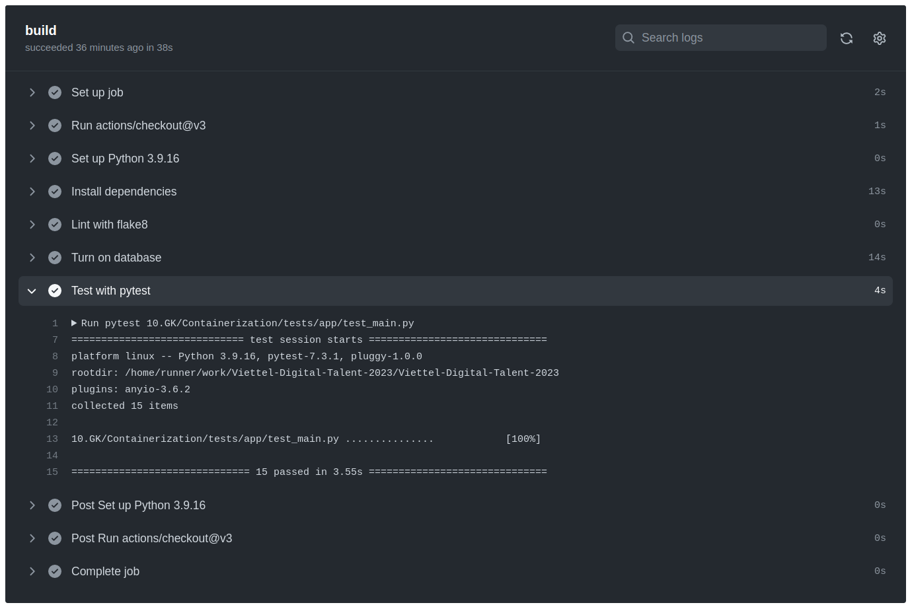
  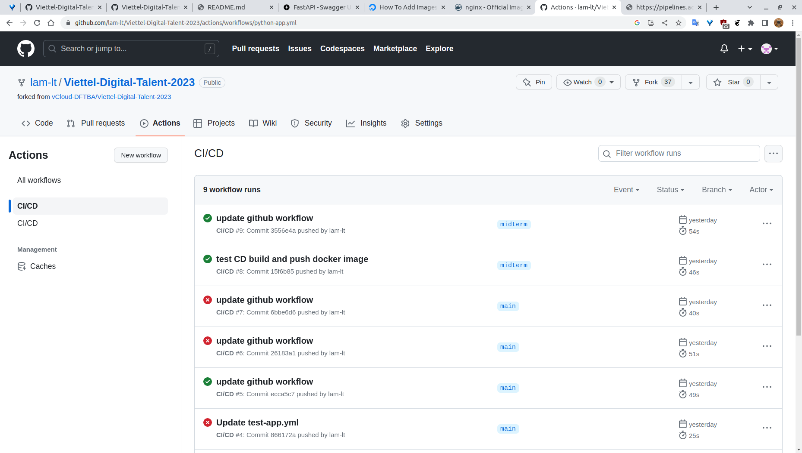

#### 3. Continuous Delivery

##### Viết luồng release dịch vụ bằng công cụ CI/CD của GitHub/GitLab, thực hiện build docker image và push docker image lên Docker Hub khi có event một tag mới được developer tạo ra trên GitHub.

- File set up CD:

  ```yaml
  name: Build and push image to Docker Hub

  on:
    push:
      tags:
        - '*'

  permissions:
    contents: read

  jobs:
    build-and-push:
      runs-on: ubuntu-latest
      steps:
        -
          name: Checkout
          uses: actions/checkout@v3
        -
          name: Login to Docker Hub
          uses: docker/login-action@v2
          with:
            username: ${{ secrets.DOCKERHUB_USERNAME }}
            password: ${{ secrets.DOCKERHUB_TOKEN }}
        -
          name: Set up Docker Buildx
          uses: docker/setup-buildx-action@v2
        -
          name: Build and push
          uses: docker/build-push-action@v4
          with:
            context: 10.GK/Containerization/app
            file: 10.GK/Containerization/app/Dockerfile
            push: true
            tags: ${{ secrets.DOCKERHUB_USERNAME }}/vt_app:${{  github.ref_name }}
  ```


##### Viết ansible playbook thực hiện các nhiệm vụ:
- Setup môi trường: Cài đặt docker trên các node triển khai dịch vụ:

  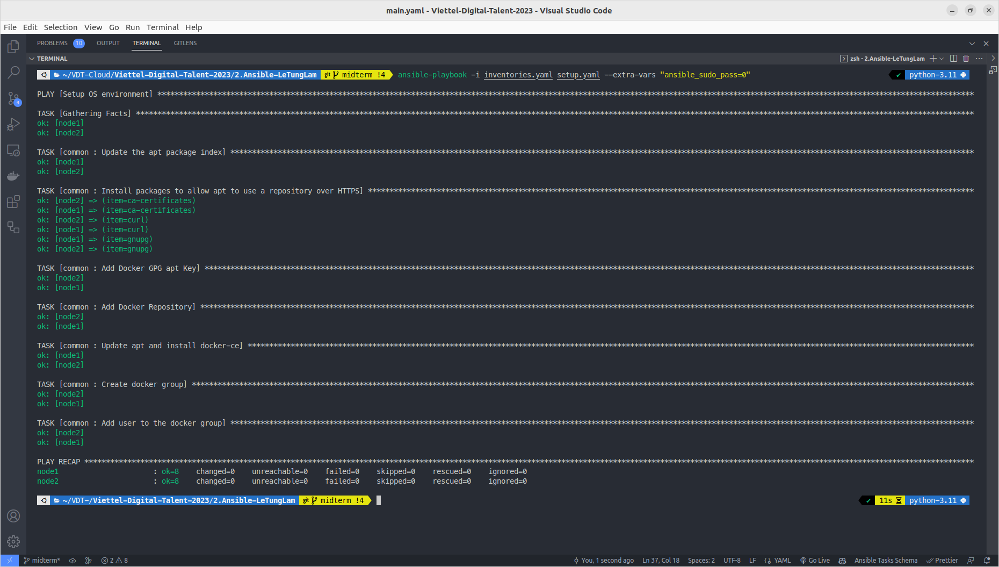

  Role [common](./Ansible/roles/common/tasks/main.yaml) cài đặt Docker:
  ```yaml
  - name: Update the apt package index
    ansible.builtin.package:
      update_cache: "{{ update_cache }}"

  - name: Install packages to allow apt to use a repository over HTTPS
    ansible.builtin.package:
      name: "{{ item }}"
      state: present
    loop:
      - ca-certificates
      - curl
      - gnupg

  - name: Add Docker GPG apt Key
    apt_key:
      url: https://download.docker.com/linux/ubuntu/gpg
      state: present

  - name: Add Docker Repository
    apt_repository:
      repo: deb https://download.docker.com/linux/ubuntu jammy stable
      state: present

  - name: Update apt and install docker-ce
    apt:
      name: docker-ce
      state: latest
      update_cache: true

  - name: Create docker group
    group:
      name: docker

  - name: Add user to the docker group
    user:
      name: "{{ ansible_user }}"
      group: docker
  ```

- Deploy các dịch vụ sử dụng Docker:
  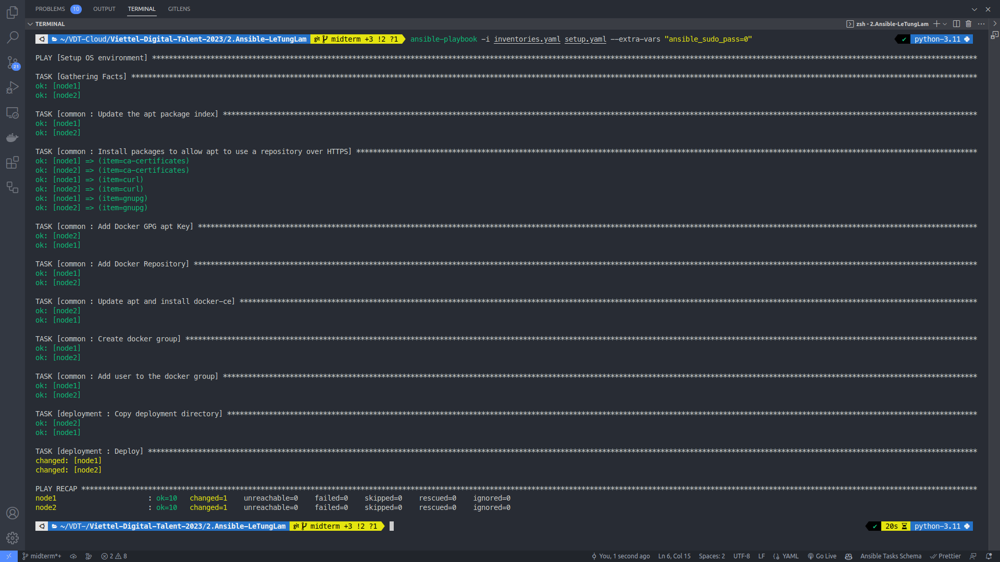
  Role [deployment](./Ansible/roles/deployment/tasks/main.yaml) để đơn giản hóa tác vụ triển khai dịch vụ:
  ```yaml
  - name: Copy deployment directory
    ansible.builtin.copy:
      src: /home/lamle/VDT-Cloud/Viettel-Digital-Talent-2023/10.GK/Deployment/
      dest: ~/Deployment/

  - name: Deploy
    command: chdir=/home/lamle/Deployment/ docker compose up -d
  ```

##### Đảm bảo tính HA cho web và api:
- Mô hình trên một host:

  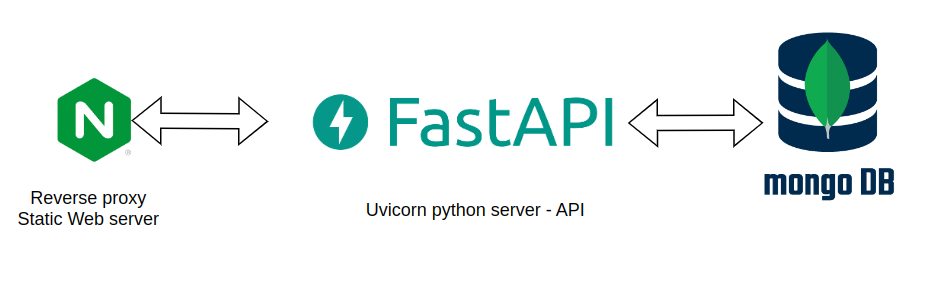

- Mô hình đảm bảo tính HA:
  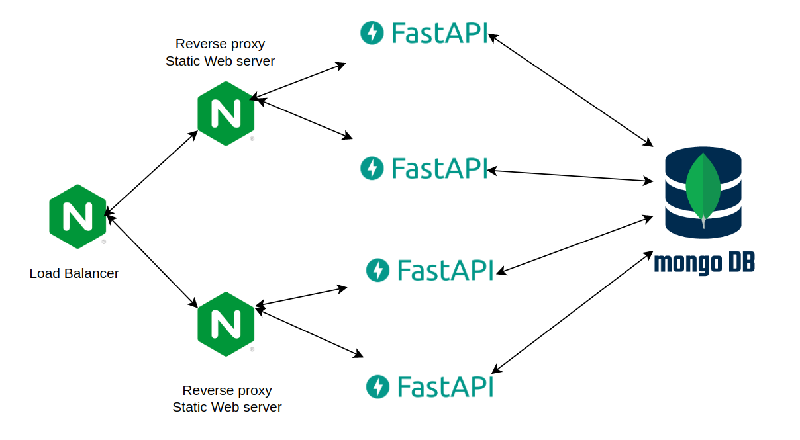
  Trong đó MongoDB sẽ chạy trên một host riêng, Nginx webser + FastAPI sẽ được scale thành 2 hosts để đảm bảo tính HA. Còn Nginx load balancer sẽ chạy trên máy chính để cân bằng tải cho 2 host webserver + fastapi


- Hướng dẫn sử dụng `ansible playbook` để triển khai các thành phần hệ thống

  Cây thư mục Ansible:

  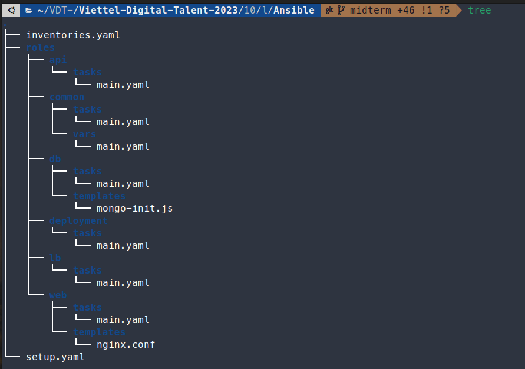

  - Danh sách các roles:
    - [common](./Ansible/roles/common/tasks/main.yaml)
    - [web](./Ansible/roles/web/tasks/main.yaml)
    - [api](./Ansible/roles/api/tasks/main.yaml)
    - [db](./Ansible/roles/db/tasks/main.yaml)
    - [lb](./Ansible/roles/lb/tasks/main.yaml)
    - [deployment](./Ansible/roles/deployment/tasks/main.yaml)

  Chạy ansible playbook sử dụng lệnh:
  ```bash
  ansible-playbook -i inventories.yaml setup.yaml --extra-vars "ansible_sudo_pass=0"
  ```

- Output log triển khai hệ thống
  
    

#### 5. Logging
  - Kết quả sample log lấy từ Kibana

    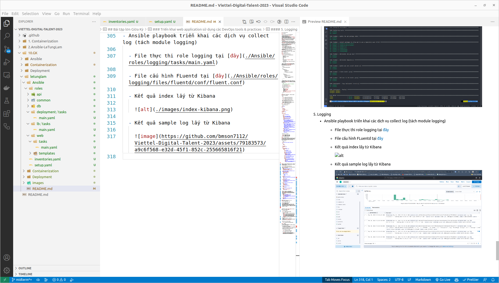
