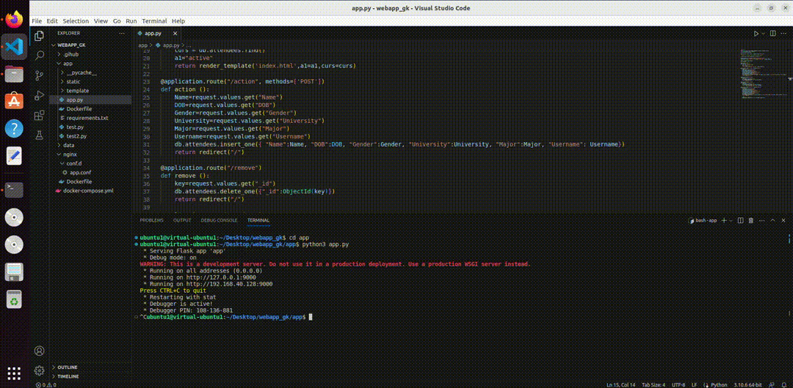
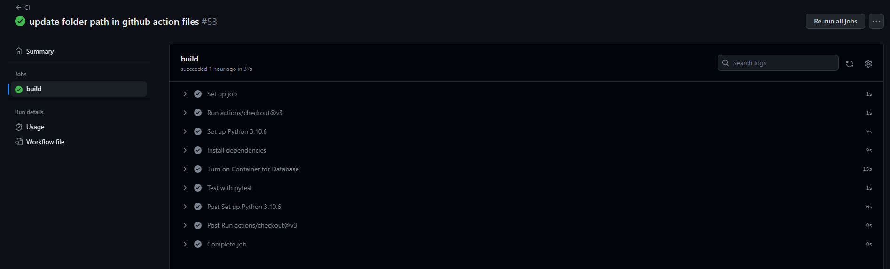
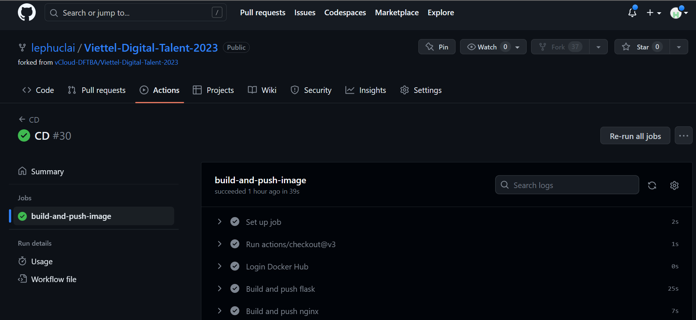
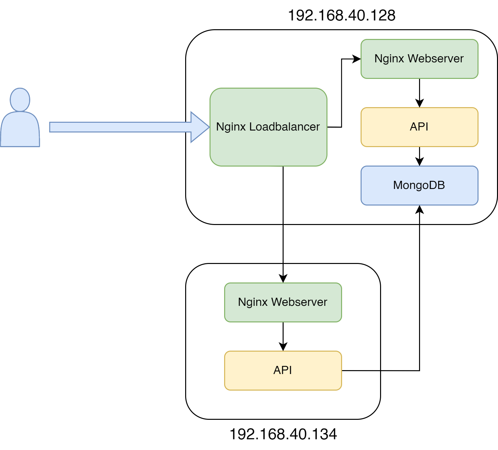
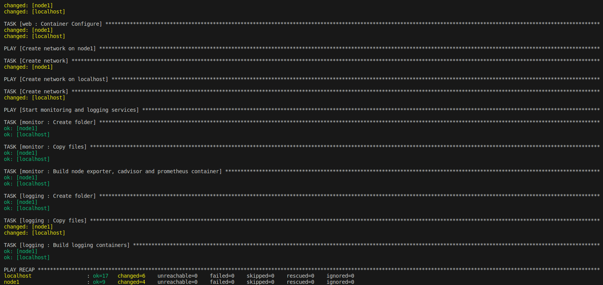
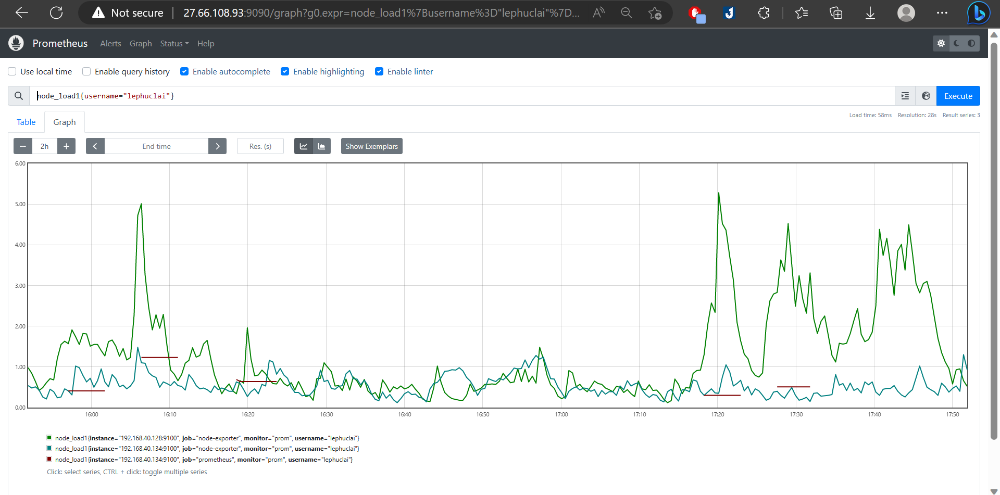
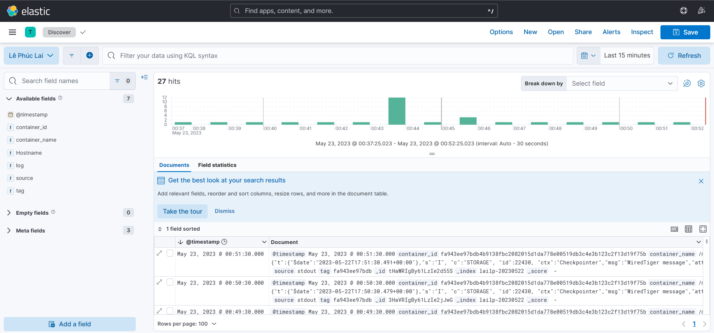

# BÀI TẬP LỚN GIỮA KỲ

# 1. Phát triển một 3-tier web application đơn giản
Mã nguồn:
* [web](Docker/nginx/conf.d/app.conf)
* [api](Docker/app/app.py)
* [unitest](Docker/app/test.py)



# 2. Containerization
* [File dockercompose](Docker/docker-compose.yml)
* [Dockerfile cua api](Docker/app/Dockerfile)
* [Dockerfile cua web](Docker/nginx/Dockerfile)
* [File log của câu lệnh docker compose build](logs/dockercompose_build_logs.txt)
* [Docker history của python image](logs/history_python.txt)
* [Docker history của nginx image](logs/history_nginx.txt)
* [Docker history của mongo image](logs/history_mongo.txt)

Chạy câu lệnh docker compose up:


# 3. Continuous Integration
* Setup CI:
```
name: CI

on:
  push:
    branches:
      - midterm
  pull_request:
    branches:
      - main

jobs:
  build:
    runs-on: ubuntu-latest

    steps:
      - uses: actions/checkout@v3

      - name: Set up Python 3.10.6
        uses: actions/setup-python@v4
        with:
          python-version: 3.10.6

      - name: Install dependencies
        run: |
          python -m pip install --upgrade pip
          pip install ruff pytest
          cd 10.Midterm/LePhucLai/Docker/app
          pip install -r requirements.txt;

      - name: Turn on Container for Database
        run: |
          cd 10.Midterm/LePhucLai/Docker
          docker compose up -d
          docker exec mongodb mongoimport --db VDT23 --collection attendees --jsonArray --file data/db/attendees.json
          
      - name: Test with pytest
        run: |
          cd 10.Midterm/LePhucLai/Docker/app
          export MONGO_URI="mongodb://localhost:27017/VDT23"
          pytest test.py
```
* [Output log của luồng CI](logs/CI.txt)



# 4. Continuous Delivery
## 4.1 CD
* Setup CD:
```
name: CD

on:
  create:
    tags:
      - '*'

jobs:
  build-and-push-image:
    runs-on: ubuntu-latest

    steps:
      - uses: actions/checkout@v3

      - name: Login Docker Hub
        uses: docker/login-action@v2
        with:
          username: ${{ secrets.DOCKER_USERNAME }}
          password: ${{ secrets.DOCKER_TOKEN }}

      # - name: Set up Docker Buildx
      #   uses: docker/setup-buildx-action@v2

      - name: Build and push flask
        uses: docker/build-push-action@v4
        with:
          context: 10.Midterm/LePhucLai/Docker/app
          file: 10.Midterm/LePhucLai/Docker/app/Dockerfile
          push: true
          tags: ${{ secrets.DOCKER_USERNAME }}/flask:latest

      - name: Build and push nginx
        uses: docker/build-push-action@v4
        with:
          context: 10.Midterm/LePhucLai/Docker/nginx
          file: 10.Midterm/LePhucLai/Docker/nginx/Dockerfile
          push: true
          tags: ${{ secrets.DOCKER_USERNAME }}/nginx:latest
```
* [Output log của luồng CD](logs/CD.txt)


## 4.2 Cách triển khai load balance:


## 4.3 Ansible
Thư mục Ansible:
```
.
├── inventories
│   └── inventory.yaml
├── roles
│   ├── api
│   │   └── tasks
│   │       └── main.yaml
│   ├── common
│   │   └── tasks
│   │       └── main.yaml
│   ├── db
│   │   ├── files
│   │   │   └── attendees.json
│   │   └── tasks
│   │       └── main.yaml
│   ├── lb
│   │   ├── files
│   │   │   ├── app.conf
│   │   │   └── Dockerfile
│   │   └── tasks
│   │       └── main.yaml
│   ├── logging
│   │   ├── files
│   │   │   ├── docker-compose.yml
│   │   │   └── fluentd
│   │   │       ├── conf
│   │   │       │   └── fluent.conf
│   │   │       └── Dockerfile
│   │   └── tasks
│   │       └── main.yaml
│   ├── monitor
│   │   ├── files
│   │   │   ├── docker-compose.yml
│   │   │   └── prometheus.yml
│   │   └── tasks
│   │       └── main.yaml
│   └── web
│       └── tasks
│           └── main.yaml
└── setup.yaml
```
* Output log triển khai hệ thống:
[Output log triển khai hệ thống] (logs/ansible_log.txt)

* Do ở localhost docker đã được cài đặt trước đó bằng gói containerd.io, gói này xung đột với gói containered được thiết lập để cài ở trong playbook. Do đó task này báo lỗi. Ở trên node khác thì việc cài đặt Docker diễn ra bình thường

# 5. Monitoring
[Role monitor chứa playbook và cấu hình giám sát hệ thống](Ansible/roles/monitor)



# 6. Logging
[Role logging triển khai các dịch vụ collect log](Ansible/roles/logging)
* Để có thể lấy được log từ các Container, ta sẽ phải thêm `log_driver: fluentd` vào trong các task build container trong ansible playbook

