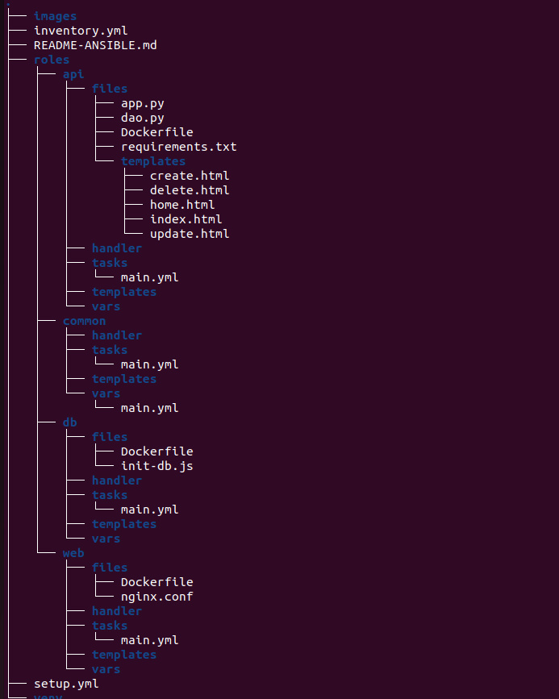
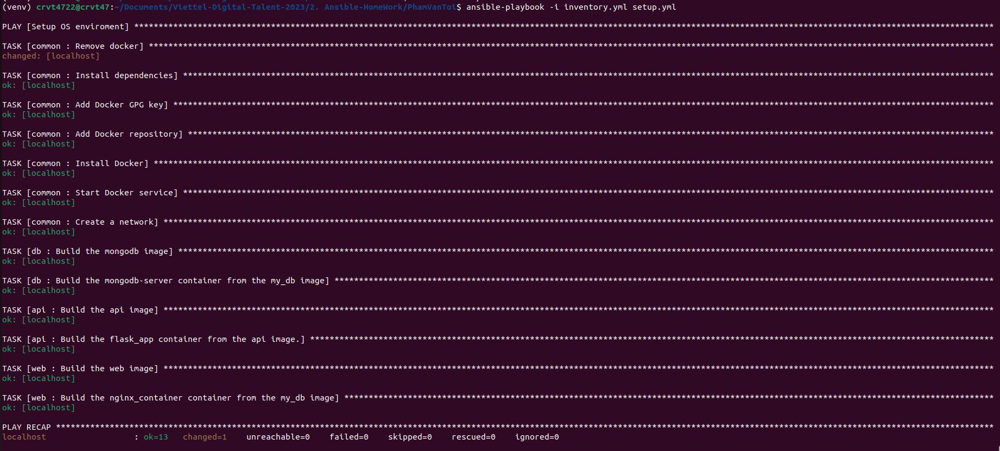
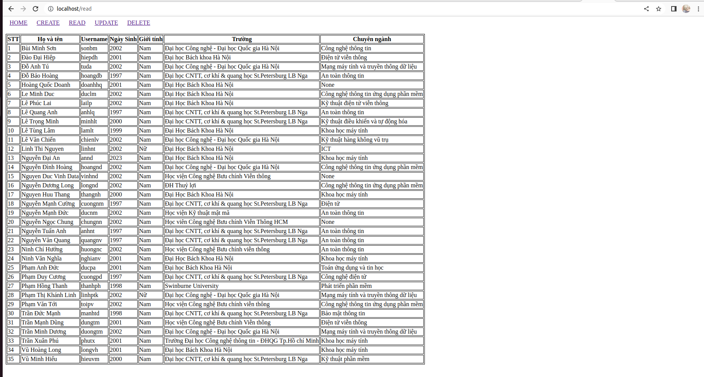

### Set up the enviroment

- Install ansible inside virtualenv
  ```
  ansible-galaxy collection install community.docker
  ```

### Directory structure




### Result

- Tasks result when running ansible-playbook  


- Web page  
