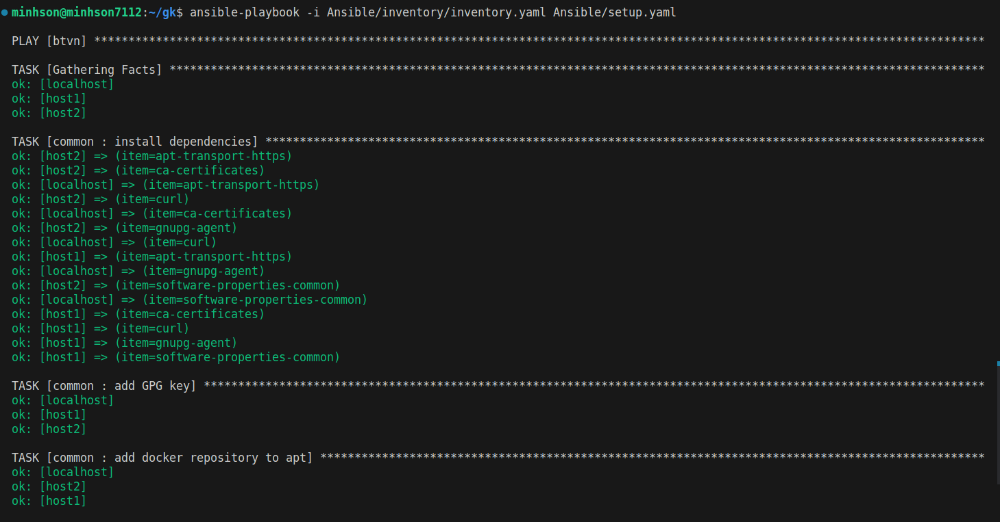
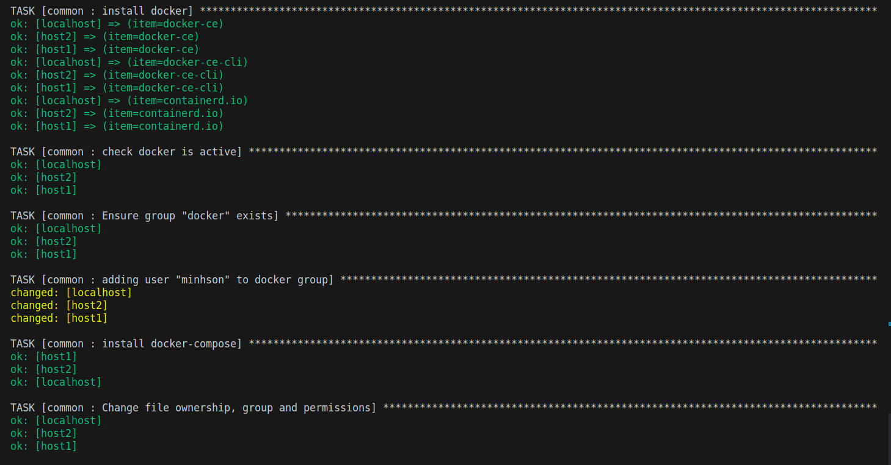
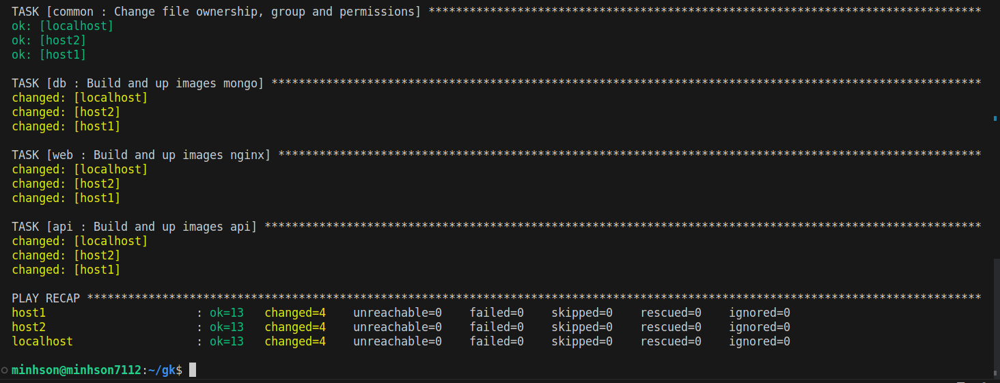
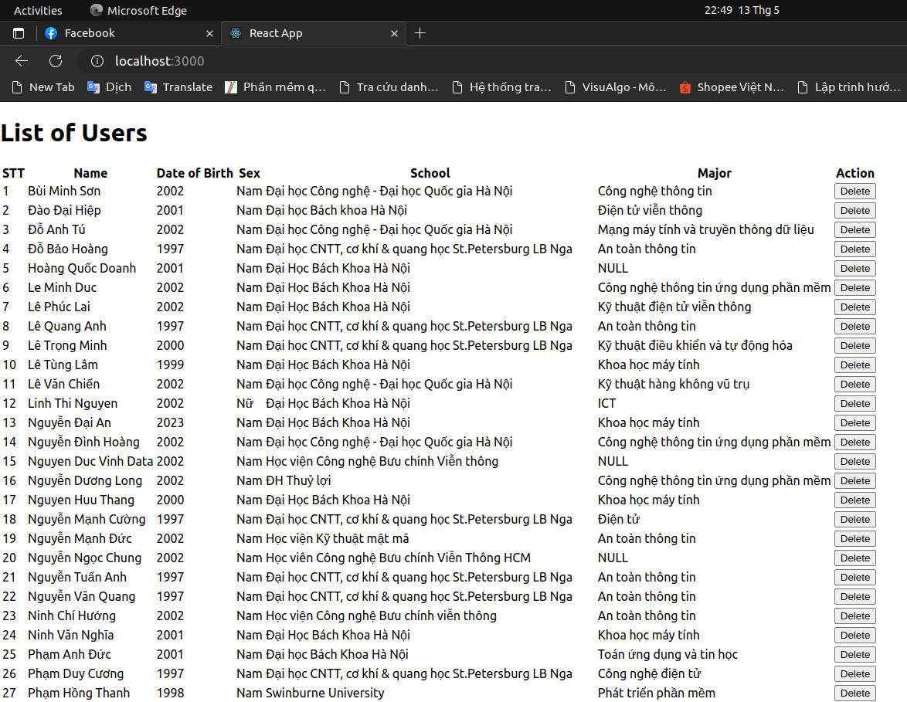
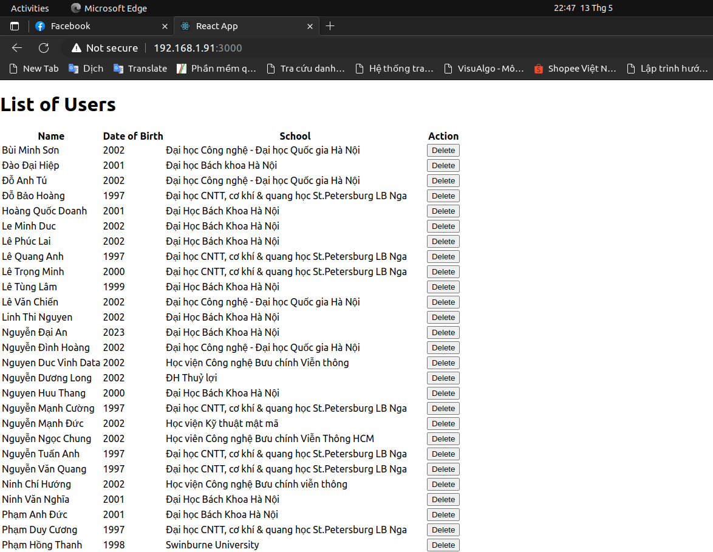

# Practice 2: Ansible - Bùi Minh Sơn

## Mục lục
[I. Chuẩn bị](#i-chuẩn-bị)

- [1. Hosts](#1-hosts)
- [2. Chuẩn bị mã nguồn Webapp](#2-Chuẩn-bị-mã-nguồn-Webapp)

[II. Sử dụng Ansible](#ii-Sử-dụng-Ansible)

- [1. Cấu trúc Ansible ](#1-Cấu-trúc-Ansible )
  - [1.1. Inventory](#11-inventory)
  - [1.2. Common role](#12-common-role)
  - [1.3. Api db web role](#13-Api-db-web-role)
 
- [2. Triển khai](#2-triển-khai)
  - [2.1. Chạy Ansible Playbooks](#21-chạy-ansible-playbooks)
  - [2.2. Kết quả](#22-kết-quả)

## I. Chuẩn bị 
### 1. Hosts
Để tận dụng khả năng của Ansible là triển khai được trên nhiều host, ngoài máy chính của mình, em sử dụng thêm 2 máy ảo có địa chỉ IP như sau:

- host1: 192.168.1.91
- host2: 192.168.1.193

=> Deploy Web lên trên cả 3 host

### 2. Chuẩn bị mã nguồn Webapp
- Em vẫn sẽ sử dụng code của bài tập tuần trước nhưng có 1 chút sự thay đổi về mặt cấu trúc thư mục của Web, chia nó thành các phần riêng biệt để tiện lợi hơn cho việc phát triển về sau
- Ngoài ra em không dùng docker build để dựng image mà sẽ tận dụng docker compose từ tuần trước để dựng image và chạy container, do đó ta sẽ có 3 file docker compose mỗi file sử dụng cho 1 image đó là `docker-compose-api.yaml`, `docker-compose-db.yaml`, `docker-compose-web.yaml`

## II. Sử dụng Ansible

### 1. Cấu trúc Ansible 

```bash
Ansible/
├── inventory
│   └── inventory.yaml
├── roles
│   ├── api
│   │   └── tasks
│   │       └── main.yaml
│   ├── common
│   │   └── tasks
│   │       └── main.yaml
│   ├── db
│   │   └── tasks
│   │       └── main.yaml
│   └── web
│       └── tasks
│           └── main.yaml
└── setup.yaml
```
#### 1.1. Inventory 
-  [`inventory.yaml`](./Ansible/inventory/inventory.yaml) 

- File nay định nghĩa danh sách các máy chủ mà Ansible sẽ thực thi các tác vụ trên đó,bao gồm địa chỉ IP, tên máy chủ, người dùng và mật khẩu để đăng nhập vào máy chủ đó, và các thông tin khác liên quan đến kết nối với máy chủ đó.

#### 1.2. Common role 
- [`common/tasks/main.yaml`](./Ansible/roles/common/tasks/main.yaml)

- Thực hiện cài đặt docker, docker compose lên trên các host

- Cụ thể, nó sẽ gồm các bước :
  - Cài đặt các phụ thuộc cần thiết để cài đặt Docker như apt-transport-https, ca-certificates, curl, gnupg-agent, software-properties-common, vv
  - Thêm GPG key để xác minh tính toàn vẹn của các gói phần mềm được cài đặt.
  - Thêm kho lưu trữ Docker vào tệp danh sách các kho lưu trữ của Ubuntu.
  - Cài đặt Docker CE, Docker CLI, và containerd.io.
  - Khởi động dịch vụ Docker và đảm bảo rằng dịch vụ này được khởi động tự động sau khi máy chủ khởi động lại.
  - Tạo một group "docker" trên máy chủ nếu nhóm này chưa tồn tại.
  - Thêm người dùng vào group "docker".
  - Tải xuống và cài đặt Docker Compose.
  - Thay đổi chủ sở hữu và quyền truy cập của tệp docker-compose được cài đặt.

#### 1.3. Api db web role
- Về cơ bản là chạy các task để có thể build docker image và run container thông qua dockercompose
- [`api/tasks/main.yaml`](./Ansible/roles/api/tasks/main.yaml)
- [`db/tasks/main.yaml`](./Ansible/roles/db/tasks/main.yaml)
- [`web/tasks/main.yaml`](./Ansible/roles/web/tasks/main.yaml)

### 2. Triển khai

#### 2.1. Chạy Ansible Playbooks

- Ta có file playbook là setup.yaml để chạy task của các role trên cả 3 host [setup.yaml](./Ansible/setup.yaml)

- Sau khi chạy playbook ta có kết quả như các hình dưới:




#### 2.2. Kết quả
- Bây giờ Webapp của ta đã đươc deploy lên 3 host, ta có thể truy cập vào nó thông qua IP của host và cổng 3000. 
- Dưới đây là kết quả em truy cập vào Web từ máy local thông qua địa chỉ IP của máy ảo




