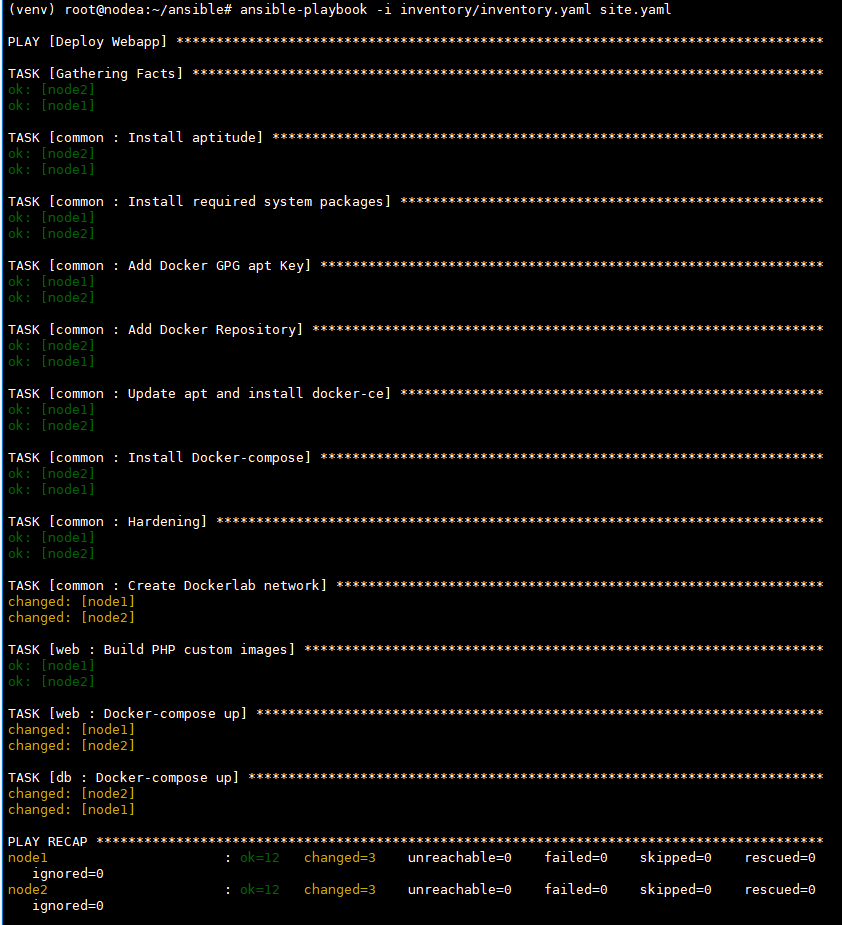
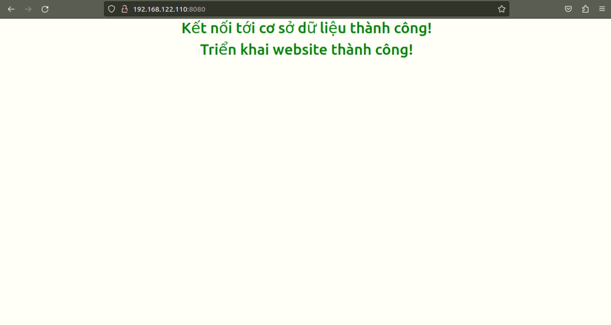

# Ansible Lab
## 1. Mục tiêu
Sử dụng Ansible để triển khai ứng dụng Web PHP với docker-compose như bài lab về Containerization trên 2 máy ảo.

Hai máy ảo có địa chỉ lần lượt là 192.168.122.110 và 192.168.122.111
## 2. Ansible Lab
### 2.1. Phương pháp sử dụng
Sử dụng Ansible Roles

Có 3 Roles:

* common:  
    * Cài đặt Docker và Docker Compose
    * Copy thư mục Hardening tới máy đích
    * Tạo Docker Network
* web:
    * build custom PHP image
    * run docker-compose
* db:
    * run docker-compose
### 2.2. Triển khai
```bash
sudo apt install sshpass -y
ansible-playbook -i inventory/inventory.yaml site.yaml
```
### 2.3. Kết quả
Ansible chạy thành công:


Website hoạt động và kết nối database thành công


### 3. Ứng dụng web:
* Mã nguồn: https://github.com/bonavadeur/simplewebapp (tag v1.0)
* Mã nguồn được đặt trong folder `web`
* Chi tiết hướng dẫn đọc [README](web/README.md)
* Cấu hinh thông tin đăng nhập trong file `web/config.php`
## 4. Contributor:
Đào Hiệp - @bonavadeur
