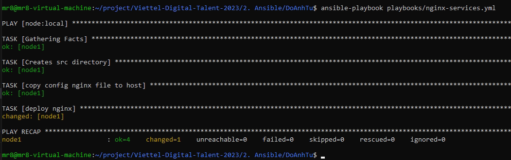

# **Deploy 3-tier web application by Ansible**

## **Config ansible inventory**

I have 2 file to config ansible inventory

```
# hosts-dev
[node]
node1 ansible_host=18.140.66.35
node1 ansible_ssh_pass=***
node1 ansible_user=cloud_user
node1 ansible_sudo_pass=***

[local]
node1 ansible_host=192.168.60.134
node1 ansible_ssh_pass=***
node1 ansible_user=vm1
node1 ansible_sudo_pass=***
```

```cfg
# ansible.cfg

[defaults]
inventory = ./hosts-dev
host_key_checking = False
retry_files_enabled = False
# private_key_file=~/local
```

`host-dev` is a file which contains all of information about remote server i need deploy. Local server is server i create in vmware to deploy app.With ip address: 192.168.60.134 and i remote it from server: 192.168.60.133.

<div align="center">
  
  192.168.60.134
</div>

<div align="center">
  
  192.168.60.133
</div>

The second config is in `ansible.cfg`. In this file has `inventory` for ansible and `host_key_checking = False` is a configuration parameter used in SSH (Secure Shell) that instructs the SSH client to not check the host key of the server it is connecting to.

## **Set up playbook**

This is my project structure

```tree
.
└── DoAnhTu
    ├── ansible.cfg
    ├── app
    │   ├── Dockerfile
    │   ├── requirements.txt
    │   └── VDT
    │       ├── __init__.py
    │       └── templates
    │           └── VDT.html
    ├── hosts-dev
    ├── img
    ├── mongo-entrypoint
    │   └── init-mongo.js
    ├── nginx
    │   └── conf.d
    │       └── default.conf
    ├── playbooks
    │   ├── flask-services.yml
    │   ├── install-docker.yml
    │   ├── mongo-services.yml
    │   └── nginx-services.yml
    └── README.md

```

### **install-docker.yml**

There are 4 roles to deploy app:

- install-docker.yml
- mongo-services.yml
- flask-services.yml
- nginx-services.yml

First of all, server need to download docker to run 3 containers app.

```yaml
# install-docker.yml
---
- hosts: local
  become: true
  tasks:
    - name: updating apt packages
      apt:
        name: "*"
        state: latest
        update_cache: true
    - name: instal require packages for docker
      apt:
        pkg:
          - apt-transport-https
          - ca-certificates
          - curl
          - software-properties-common
          - python3-pip
          - python3-setuptools
        state: latest
        update_cache: true
    - name: Add Docker GPG apt Key
      apt_key:
        url: https://download.docker.com/linux/ubuntu/gpg
        state: present
    - name: Add Docker Repository
      apt_repository:
        repo: deb https://download.docker.com/linux/ubuntu focal stable
        state: present
    - name: Update apt and install docker-ce
      apt:
        name: docker-ce
        state: latest
        update_cache: true
    - name: Install Docker Module for Python
      pip:
        name:
          - docker
          - docker-compose

    - name: add user to Docker group
      shell: "usermod -aG docker vm1"
    - name: Create a volume
      community.docker.docker_volume:
        name: db1
```

This file will cover instruction to download docker in [docs.docker.com](https://docs.docker.com/engine/install/ubuntu/). After donwloading docker, it will insatll docker module for python which help using docker in remote server by command line from ansile and add current user to Docker group to avoid using sudo in each commnand.

```yml
- name: Install Docker Module for Python
      pip:
        name:
          - docker
          - docker-compose
- name: add user to Docker group
      shell: "usermod -aG docker vm1"
```

### **mongo-services.yml**

Beacause app depending on database so i deploy mongodb first.

`mongo-services.yml` is:

```yaml
---
- hosts: local
  become: true
  tasks:
    - name: Creates src directory
      file:
        path: /home/data
        state: directory
        mode: "0775"
    - name: Copy file with owner and permissions
      ansible.builtin.copy:
        src: ../mongo-entrypoint/init-mongo.js
        dest: /home/data
        mode: "0777"

    - name: Create a network
      docker_network:
        name: network_db

    - name: deploy mongo db
      community.docker.docker_container:
        name: mongodb
        image: mongo:5.0
        env:
          MONGO_INITDB_ROOT_USERNAME: "admin"
          MONGO_INITDB_ROOT_PASSWORD: "Admin123"
          MONGO_INITDB_DATABASE: "VDTuser"
        ports:
          - "27017:27017"
        volumes:
          - db1:/data/db
          - /home/data/init-mongo.js:/docker-entrypoint-initdb.d/init-mongo.js:ro
        networks:
          - name: network_db
```

First i created folder on remote server to save from dev server. Then, i transfer file config mongo(`init-mongo.js`) to remote server.

To create container, i used docker module for ansible. It is similar docker compose and docker file.

```yml
- name: Create a network
      docker_network:
        name: network_db

    - name: deploy mongo db
      community.docker.docker_container:
        name: mongodb
        image: mongo:5.0
        env:
          MONGO_INITDB_ROOT_USERNAME: "admin"
          MONGO_INITDB_ROOT_PASSWORD: "Admin123"
          MONGO_INITDB_DATABASE: "VDTuser"
        ports:
          - "27017:27017"
        volumes:
          - db1:/data/db
          - /home/data/init-mongo.js:/docker-entrypoint-initdb.d/init-mongo.js:ro
        networks:
          - name: network_db
```

Mongodb container is created with network and initialized a database when starting a MongoDB docker container.

### **flask-services.yml**

This is flask-services.yml to deploy flask app

```yaml
# flask-services.yml
---
- hosts: node2
  become: true
  tasks:
    - name: Creates src directory
      file:
        path: /home/src
        state: directory
        mode: "0775"

    - name: copy src to folder remote
      ansible.builtin.copy:
        src: ../app
        dest: /home/src
    - name: Create a network
      docker_network:
        name: network_app

    - name: create docker image flask app
      shell: docker build -t flask_python .
      args:
        chdir: /home/src/app

    - name: create docker container flask app
      docker_container:
        name: flask
        image: flask_python
        state: started
        ports:
          - "5000:5000"
        networks:
          - name: network_db
          - name: network_app
```

First i need to transfer source code in dev server to remote server.

```yaml
- name: Creates src directory
      file:
        path: /home/src
        state: directory
        mode: "0775"

    - name: copy src to folder remote
      ansible.builtin.copy:
        src: ../app
        dest: /home/src
    - name: Create a network
      docker_network:
        name: network_app

```

In source code have a Dockerfile from week 1 so i dont write ansible to create container like mongodb and nginx. I build image container from Dockerfile by ansible shell command:

```yaml
- name: create docker image flask app
  shell: docker build -t flask_python .
  args:
    chdir: /home/src/app
```

When build an image has name is flaks_python, i run docker container by using docker module container from ansible:

```yaml
- name: create docker container flask app
      docker_container:
        name: flask
        image: flask_python
        state: started
        ports:
          - "5000:5000"
        networks:
          - name: network_db
          - name: network_app

```

### **nginx-services.yml**

```yml
---
- hosts: local
  become: true
  tasks:
    - name: Creates src directory
      file:
        path: /home/nginx
        state: directory
        mode: "0775"

    - name: copy config nginx file to host
      ansible.builtin.copy:
        src: ../nginx/
        dest: /home/nginx

    - name: deploy nginx
      community.docker.docker_container:
        name: nginx
        image: nginx:1.22.0-alpine
        ports:
          - "8000:80"
        volumes:
          - /home/nginx/conf.d/:/etc/nginx/conf.d/
        networks:
          - name: network_app
```

I have transfered file from dev server to remote server like mongo and flask.

```yaml
- hosts: local
  become: true
  tasks:
    - name: Creates src directory
      file:
        path: /home/nginx
        state: directory
        mode: "0775"

    - name: copy config nginx file to host
      ansible.builtin.copy:
        src: ../nginx/
        dest: /home/nginx
```

Deploy nginx so Ez, i use docker module container to build image and run.

## **result**

### **install docker**

<div align="center">
  
</div>

### **deploy mongo**

<div align="center">
  
</div>

### **deploy flask**

<div align="center">
  
</div>

### **deploy flask**

<div align="center">
  
</div>

### **docker container in remote server**

<div align="center">
  
</div>

### **web deploy in remote server**

Web will be deployed in 192.168.60.134:8000 like config nginx.

```yaml
- name: deploy nginx
      community.docker.docker_container:
        name: nginx
        image: nginx:1.22.0-alpine
        ports:
          - "8000:80"
```

<div align="center">
  
</div>
Home page

<div align="center">
  
</div>
VDT app

### **Note**

In this exercise, i have write 4 role:

1. install docker for remote server
1. deploy mongodb
1. deploy flask app
1. deploy nginx

Although have done this exercise but i think i need impove many things in ansible:

1. use ansible galaxy to write more readable role in project
1. use congregate playbook to run this project
