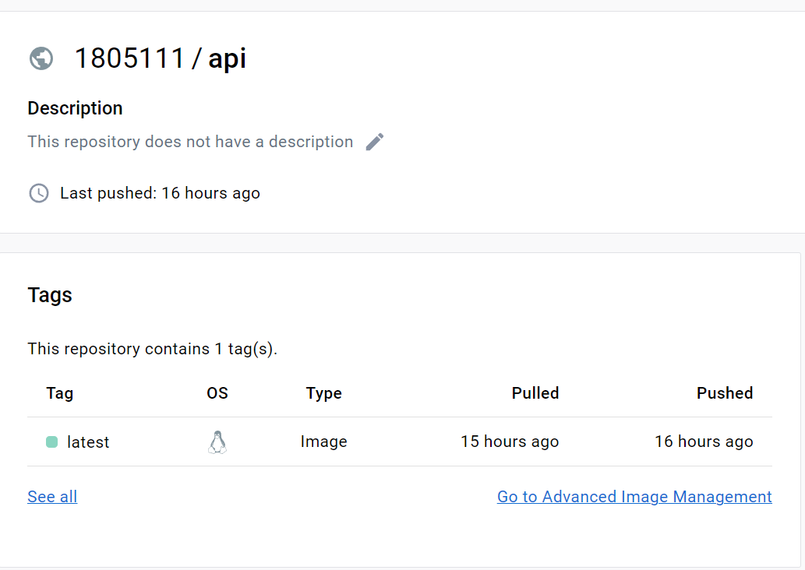
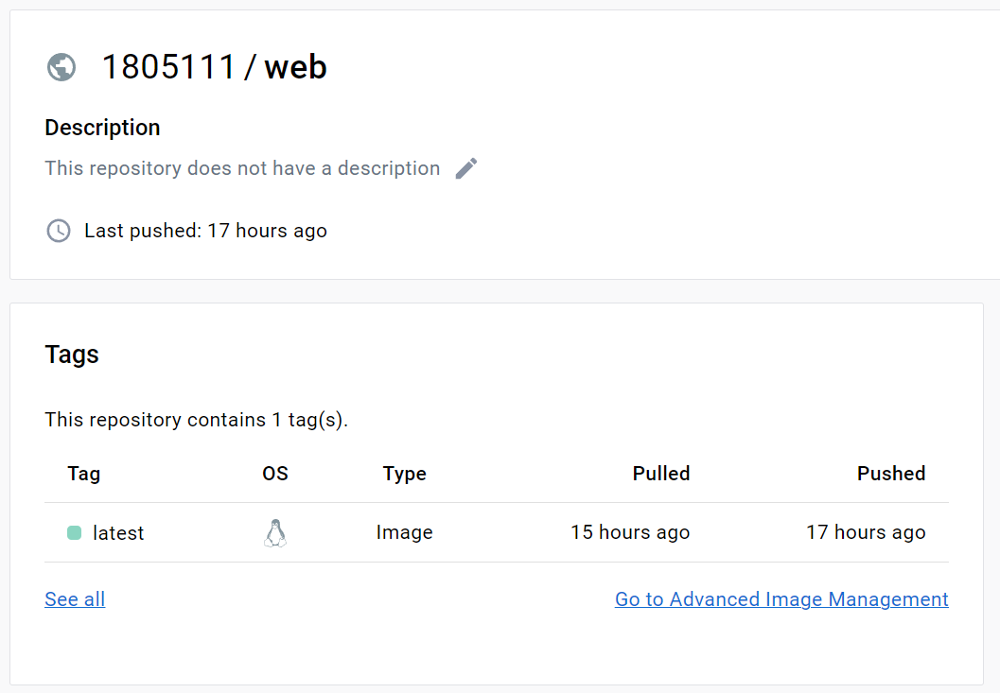
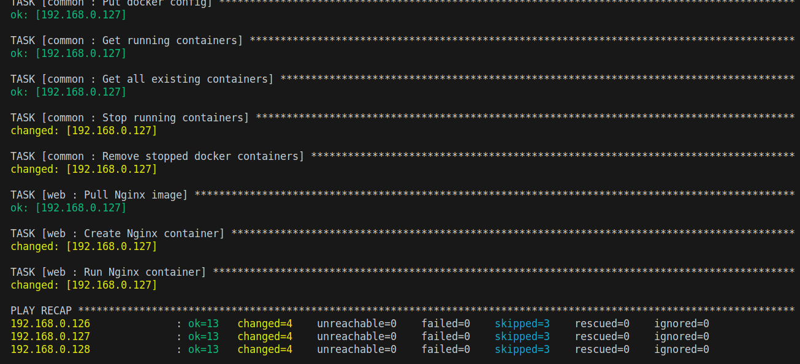
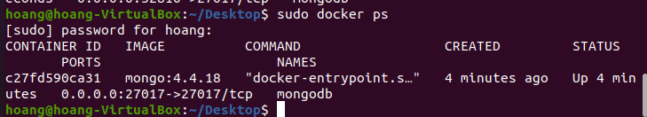
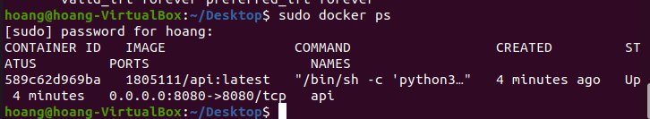
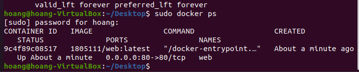
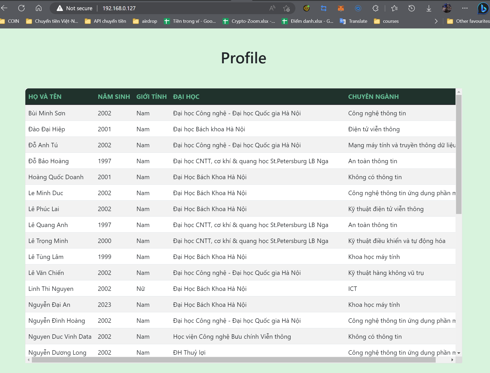

# Deploy Webapp using Ansible

Editor: **Do Bao Hoang**

---
## Table of contents
[I. Introduction](#intro)
- [1. Ansible](#ansible)
- [2. Ansible Galaxy](#galaxy)

[II. Homework](#requirements)

[III. Deployment](#deployment)
- [1. Setup VM](#vmSetup)
- [2. Common roles](#common)
- [3. Other roles](#other)
- [4. Deploy Webapp](#deployWeb)


---
## I. Introduction <a name='intro'></a>

### 1. Ansible <a name='ansible'></a>

**Ansible** là một trong những công cụ quản lý cấu hình hiện đại, nó tạo điều kiện thuận lợi cho công việc cài đặt, quản lý và bảo trì các server từ xa, với thiết kế tối giản giúp người dùng cài đặt và chạy nhanh chóng.

<div align="center">
  
</div>

<div align="center">
  <i>Pic. 1 - Ansible logo</i>
</div>

**Ansible** sử dụng kiến trúc `agentless` không cần đến agent để giao tiếp với các máy khác. Cơ bản nhất là giao tiếp thông qua các giao thức `WinRM` trên Windows, `SSH` trên Linux hoặc giao tiếp qua chính `API` của thiết bị đó cung cấp.

Để hiểu và áp dụng **Ansible** một cách hiệu quả, các bạn cần nắm rõ một số thuật ngữ được sử dụng như: ***Controller Machine***, ***Inventory***, ***Playbook***, ***Task***, ***Module***, ***Role***, ***Play***, ***Facts***, ***Handlers***, ***Variables***, ***Conditions***.

**Ansible** có 2 dự án cộng đồng chính: `Ansible community package` và `Ansible-core`

*Table 1 - Compare Ansible community project*
| Ansible community package | ansible-core |
|---------------------------|--------------|
| Uses new versioning (2.10, then 3.0.0) | Continues “classic Ansible” versioning (2.11, then 2.12) |
| Follows semantic versioning rules | Does not use semantic versioning |
| Maintains only one version at a time | Maintains latest version plus two older versions | 
| Includes language, runtime, and selected Collections | Includes language, runtime, and builtin plugins | 
| Developed and maintained in Collection repositories | Developed and maintained in ansible/ansible repository | 

`Playbooks` là thuật ngữ trong Ansible để chỉ các tập lệnh được viết bằng ngôn ngữ YAML để thực hiện các tác vụ tự động hóa trên các hệ thống. Các `playbooks` trong Ansible thường bao gồm các yêu cầu cài đặt, cấu hình, triển khai ứng dụng và thực hiện các tác vụ khác trên các máy chủ và hệ thống mạng. Các `playbooks` cũng có thể được sử dụng để thực hiện các tác vụ quản lý hệ thống thường xuyên, như sao lưu và khôi phục dữ liệu, giám sát hệ thống và bảo mật. Các `playbooks` rất linh hoạt và có thể được tùy chỉnh để phù hợp với nhu cầu cụ thể.

```YAML
# Simple Ansible Playbook1.yml
- name: Play 1
  hosts: localhost
  tasks:
    - name: Execute command "date"
      command: date
    - name: Install httpd service
      yum:
        name: httpd
        state: present
```

Mỗi `playbook` gồm một hoặc nhiều `play`. Như ví dụ về playbook đơn giản bên trên gồm có 1 `play` duy nhất tên là `Play 1`. 

Mỗi `Play` lại gồm một hoặc nhiều `task` . Ở ví dụ bên trên `Play 1` có 2 `task` là Execute command "date" và Install httpd service. Các `Task` và `Play` đều thực hiện theo thứ tự từ trên xuống dưới nên nếu thay đổi sẽ tạo ra ảnh hưởng lớn. 

Cũng trong ví dụ trên ta có thể thấy các `module`: command và yum. Các `module` giúp bạn viết và thực thi các tác vụ một cách đơn giản hơn. Nếu bạn muốn tạo ra `module` riêng của mình, Ansible vẫn hỗ trợ và cho phép bạn tự viết `module` của riêng mình để chạy trên Python. Bên cạnh các `module` đơn giản được nêu trên, Ansible cũng cung cấp hàng trăm `module` khác, bạn có thể tham khảo tài liệu của Ansible để biết thêm thông tin.

`Inventory` is where the server names or ip addresses will be stored. Looking back at the playbook file above, in the playbook file there will be an attribute called hosts, which is where the server name is declared. Now try to view the simple inventory file: 

```ini
#Sample Inventory File
Server1.company.com
127.0.0.1

[mail]
Server3.company.com 
Server4.company.com 

[db]
Server5.company.com 
Server6.company.com 
```

Trong `Inventory` có một số nhóm mặc định được định nghĩa sẵn để giúp người dùng quản lý và thực hiện các tác vụ trên các máy chủ. Các nhóm mặc định này bao gồm:

- `all`: Nhóm này chứa tất cả các máy chủ được định nghĩa trong inventory
- `ungrouped`: Nhóm này chứa các máy chủ không thuộc bất kỳ nhóm nào khác trong tệp inventory.
- `localhost`: Nhóm này chứa máy chủ được xác định là máy chủ địa phương (localhost) và đặc biệt không cần liệt kê trong file inventory (implicit defined).
- `ansible`: Nhóm này được sử dụng để định nghĩa các biến số toàn cục cho tất cả các máy chủ được quản lý bằng Ansible.

Ngoài ra người dùng cũng có thể tự định nghĩa các biến số cho từng máy chủ trong file `inventory` dưới dạng key-pair.

Trong Ansible, `role` là một bộ sưu tập các `task`, `handler`, `template`, và các tệp và biến khác được tổ chức một cách có cấu trúc để thực hiện một hoặc nhiều chức năng cụ thể trên một hoặc nhiều máy chủ. Các `role` giúp đơn giản hóa và tổ chức các playbook bằng cách phân tích các nhiệm vụ phức tạp thành các thành phần nhỏ hơn, có thể tái sử dụng. Chúng cũng thúc đẩy việc tái sử dụng mã và dễ dàng chia sẻ và hợp tác trong các dự án Ansible. 
Một role Ansible tiêu chuẩn bao gồm các thư mục và tệp có tên và mục đích được xác định trước. Các thư mục này bao gồm:

- `tasks`: Chứa các nhiệm vụ chính.
- `handlers`: Chứa các bộ xử lý được kích hoạt bởi các nhiệm vụ trong role.
- `templates`: Chứa các mẫu Jinja2 sử dụng để tạo các tệp config.
- `files`: Chứa các tệp tĩnh để sao chép đến máy chủ đích.
- `vars`: Chứa các biến sử dụng trong các task và template.
- `defaults`: Chứa các giá trị mặc định cho các biến được sử dụng trong role.
- `meta`: Chứa siêu dữ liệu về role, chẳng hạn như tác giả, mô tả, phụ thuộc, ...

`Idempotency` là một khái niệm quan trọng trong Ansible. Nó liên quan đến khả năng áp dụng một cấu hình một cách nhất quán, bất kể số lần chạy. Nói cách khác, chạy một `playbook` Ansible `nhiều lần` sẽ có hiệu quả giống như chạy `một lần`.

Ví dụ, `module file` là idempotent. Nếu một tệp đã tồn tại và có nội dung chính xác, Ansible sẽ `không sửa đổi` nó. Nếu tệp không tồn tại hoặc có nội dung khác nhau, Ansible sẽ `tạo` hoặc `cập nhật` tệp tương ứng.

Tính `idempotent` của Ansible đảm bảo rằng các cấu hình là `nhất quán` và dự đoán được, giảm thiểu rủi ro của các thay đổi hoặc lỗi không mong muốn. Nó cũng cho phép quản lý hệ thống dễ dàng và hiệu quả hơn, vì Ansible có thể chạy nhiều lần mà `không gây ra xung đột hoặc lỗi`.

Tuy nhiên, cần lưu ý rằng `không phải tất cả` các module trong Ansible đều idempotent. Một số module, chẳng hạn như `command` và `shell`, không idempotent và có thể dẫn đến các thay đổi không mong muốn nếu chạy nhiều lần.

### 2. Ansible Galaxy <a name='galaxy'></a>

`Ansible Galaxy` là một remote repository lưu trữ các role, collection, và các nội dung khác liên quan đến Ansible. Galaxy hoạt động như một centralized location giúp cho các nội dụng có thể chia sẻ, phân phối một cách dễ dàng. 

`Ansible Galaxy` là một phần mềm mã nguồn mở và được maintain bởi cộng đồng Ansible. Ngoài các role và collections, galaxy còn cung cấp các nội dung khác như playbook, module, plugin và inventory. Người dùng cũng có thể tự tạo nội dung và chia sẻ với cộng đồng.

## II. Homework <a name='requirements'></a>

Triển khai một 3-tier web application sử dụng ansible:

- Role `common` sử dụng để setup docker
- 3 roles `web`, `api`, `db` sử dụng để triển khai web app đến các máy chủ tương ứng. 

## III. Deployment <a name='deployment'></a>
### 1. Setup VM <a name='vmSetup'></a>

Ta tạo 1 máy chứa Ansible để làm Controller và 3 máy chủ tương ứng web server, api, database. Tất cả các máy đều chạy hệ điều hành Ubuntu. Ngoài ra với mục đích thử nghiệm, ta có thêm 3 máy chủ AWS EC2 chạy hệ điều hành AWS linux.

*Table 2 - Danh sách máy chủ*
| Tên máy chủ | Hệ điều hành | IP address |
|-------------|--------------| -----------|
| Controller | Ubuntu 24.04 | 192.168.0.125 |
| api | Ubuntu 22.04 | 192.168.0.126 |
| web server | Ubuntu 22.04 | 192.168.0.127 |
| database | Ubuntu 22.04 | 192.168.0.128 |
| api | AWS Linux | 3.70.111.222 |
| web server | AWS Linux | 3.74.333.222 |
| database | AWS Linux | 3.71.111.333 |

Đối với các máy chủ AWS EC2, để thực hiện kết nối SSH, ta cần tải file chưa ssh private key về. Các file của 3 máy chủ AWS tương ứng là aws1.pem, aws2.pem và aws3.pem được lưu vào trong thư mục cert/.

Đối với các máy chủ local, để thực hiện kết nối SSH, ta cần add thủ công public ssh key của controler vào ~/.ssh/authorized_keys trong mỗi máy chủ còn lại. 

```bash
ssh-keygen -t rsa
ssh-copy-id -i ~/.ssh/id_rsa.pub <user>@<ip>
```

Sau khi thực hiện 2 câu lệnh trên ta đã có thể kết nối SSH đến các máy chủ.

### 2. Common roles <a name='common'></a>

Nhiệm vụ chính của Common roles là cài đặt và khởi tạo môi trường Docker trên các máy chủ. Có 2 loại hệ điều hành là Ubuntu và AWS linux nên ta cần xác định và cài đặt phiên bản tương ứng.

Task đầu tiên là cài đặt Docker trên máy chủ Ubuntu:
```yaml
- name: Install Docker in Debian system
  when: ansible_os_family  == 'Debian'
  block:
  - name: Install packages
    ansible.builtin.apt:
      name:
      - apt-transport-https
      - ca-certificates
      - curl
      - gnupg2
      - software-properties-common
      state: present
      update_cache: yes
      cache_valid_time: 3600

  - name: Install repo key
    ansible.builtin.apt_key:
      url: https://download.docker.com/linux/{{ ansible_distribution | lower }}/gpg
      state: present

  - name: Add docker repo
    ansible.builtin.apt_repository:
      repo: deb [arch=amd64] https://download.docker.com/linux/{{ ansible_distribution | lower }} {{ ansible_distribution_release }} stable
      state: present

  - name: Install docker
    ansible.builtin.apt:
      name:
      - docker-ce
      - docker-ce-cli
      - containerd.io
      update_cache: yes
      state: present
      cache_valid_time: 3600
```

Điều kiện `ansible_os_family  == 'Debian'`tuy không đủ để chắc chắn hệ điều hành là Ubuntu nhưng là đủ để phân biệt giữa 2 loại máy chủ hiện có. 

Tiếp theo ta định nghĩa 1 `block`. `block` là một chức năng của Ansible giúp gộp nhiều task trong playbook thành 1 khối, giúp dễ quản lý, kiểm soát lỗi hơn.

Trong task 1 này ta có 4 sub-tasks là: `Install packages`,  `Install repo key`, `Add docker repo` và `Install docker`. Tất cả các sub-task đều sử dụng ansible module và đều có tính idempotent. 

Ngoài ra để tiết kiệm thời gian và dung lượng, 2 task cài đặt sử dụng module `apt` có thêm tính năng `cache` với khoảng thời gian lưu trữ là 1 tiếng.

Task tiếp theo là Cài đặt Docker trên máy chủ AWS:

```yaml
- name: Install Docker in AWS linux
  when: ansible_distribution == 'Amazon'
  block:
  - name: Add Docker repo
    ansible.builtin.copy:
      src: docker-ce.repo
      dest: /etc/yum.repos.d/docker-ce.repo
      mode: 0644

  - name: Enable Docker Edge repo
    community.general.files.ini_file:
      dest: /etc/yum.repos.d/docker-ce.repo
      section: 'docker-ce-edge'
      option: enabled
      value: 0

  - name: Install Docker
    ansible.builtin.yum:
      name: docker-ce
      state: present
      update_cache: yes
```

Giống như Task trước, task này cũng được chia làm nhiều sub-tasks. Khác với hệ điều hành Ubuntu, AWS Linux có nhân là RedHat và sử dụng yum làm package manager. Tại bước cuối cùng khi cài đặt Docker ta cũng cache lại để tối ưu thời gian cài đặt. 

Task 3 có nhiệm vụ copy file config cho docker sau đó restart lại service

```yaml
- name: Put docker config
  ansible.builtin.copy:
    src: daemon.json
    dest: /etc/docker/daemon.json
    mode: 0644
  notify: Restart docker daemon
```

Tại đây ta có sử dụng 1 handler là Restart docker daemon với ý nghĩa sau khi copy xong file config vào máy đích thì mới restart docker service. 

```yaml
- name: Restart docker daemon
  ansible.builtin.systemd:
    daemon_reload: yes
    name: docker
    state: restarted
```

Task cuối cùng có nhiệm vụ Clean lại môi trường Docker nếu máy đích đã cài đặt sẵn docker và đang có các container khác chạy. Mục đích là để tránh xung đột trong việc đặt tên container, giảm tải cho máy đích và tăng tính idempotent cho role. 

```yaml
- name: Prepare clean docker
  block:
  - name: Get running containers
    community.general.docker_host_info:
      containers: true
      containers_all: false
    register: docker_running

  - name: Get all existing containers
    community.general.docker_host_info:
      containers: true
      containers_all: true
    register: docker_all

  - name: Stop running containers
    when: (docker_running.containers | length) != 0
    shell: "docker kill $(docker ps -q)"

  - name: Remove stopped docker containers
    when: (docker_all.containers | length) != 0
    shell: docker rm $(docker ps -aq)
```

2 sub-tasks đầu tiên có nhiệm vụ assign giá trị cho 2 biến `docker_running` và `docker_all`. Option `containers: true` giúp cho biến sau khi đc assign có chứa danh sách containers. 
Option `containers_all: false` chỉ định rằng chỉ đưa ra danh sách các container đang hoạt động. 

Ở sub-task 3 và 4 có sử dụng `filter` `length` để lấy lấy ra kích thước của danh sách containers. Các câu lệnh shell được bổ sung thêm `condition` `when` đã đảm bảo tính `idempotent` của roles. 

### 3. Other roles <a name='other'></a>

Ở cả 3 roles này ta đều dùng 1 phương pháp: `pull image` từ `Image Registry` (dockerhub) về máy đích sau đó tiến hành cài đặt, khởi tạo biến môi trường cùng các options khác. Chứ không copy trực tiếp code vào máy đích và build. 

Việc `build image` trước và chỉ tải image về để chạy ở máy đích giúp `giảm thời gian build` xuống mức tối thiểu, ngoài ra còn `hạn chế lỗi`, xung đột xảy ra trong quá trình build ở máy đích. 

---

Role `db`

```yaml
- name: Install and run Database
  block:
  - name: Pull Mongodb image
    community.general.docker_image:
      name: "{{ mongodb_image }}"
      tag: "{{ mongodb_tag }}"
      source: pull
      state: present
      force_source: true
  
  - name: Create Mongodb container
    community.general.docker_container:
      name: "{{ mongodb_container_name }}"
      image: "{{ mongodb_image }}:{{ mongodb_tag }}"
      state: present
  
  - name: Run Mongodb container
    community.general.docker_container:
      name: "{{ mongodb_container_name }}"
      image: "{{ mongodb_image }}:{{ mongodb_tag }}"
      env:
        MONGO_INITDB_DATABASE: flaskdb
      exposed_ports:
        - 27017
      published_ports:
        - "27017:27017"
      volumes:
        - /mongodbdata:/data/db
      restart_policy: unless-stopped
      state: started
```

Role `db` chỉ có 1 env variable duy nhất là MONGO_INITDB_DATABASE để khởi tạo server với database có tên flaskdb. Container sau khi được build sẽ chạy và expose ra ngoài với port 27010:27017. Ngoài ra để đảm bảo tính bất biến của database mỗi khi container bị restart, ta mount ổ đĩa thực của máy đích với container để lưu trữ.

Các variables của ansible được lưu trong file defaults/main.yml
```yml
mongodb_container_name: 'mongodb'
mongodb_tag: 4.4.18
mongodb_image: mongo
```

---
Role `api`

```yaml
- name: Install and run API server
  block:
  - name: Pull API image
    community.general.docker_image:
      name: "{{ api_image }}"
      tag: "{{ api_tag }}"
      source: pull
      state: present
      force_source: true
  
  - name: Create API container
    community.general.docker_container:
      name: "{{ api_container_name }}"
      image: "{{ api_image }}:{{ api_tag }}"
      state: present
  
  - name: Run API container
    community.general.docker_container:
      name: "{{ api_container_name }}"
      image: "{{ api_image }}:{{ api_tag }}"
      env:
        MONGODB_DATABASE: flaskdb
        MONGODB_HOSTNAME: "192.168.0.128"
      exposed_ports:
        - 8080
      published_ports:
        - "8080:8080"
      restart_policy: unless-stopped
      state: started
```

Tương tự như role `db` nhưng có 2 env variables là `MONGODB_DATABASE`, `MONGODB_HOSTNAME` chỉ định địa chỉ của máy chủ database và expose ra port 8080:8080. 

Các variables của ansible được lưu trong file defaults/main.yml
```yml
api_container_name: 'api'
api_tag: latest
api_image: 1805111/api
```

Có thể thấy rằng image này không có sẵn mà do tự mình đã build từ source/api và đưa lên docker hub bằng tài khoản 1805111

<div align="center">
  
</div>

<div align="center">
  <i>Pic. 2 - Image api trên dockerhub </i>
</div>

Ta để tag lastest để đảm bảo mỗi khi có cập nhật về image ta có thể cài đặt lại mà không cần sửa đổi roles. 

---
Role `web`

```yaml
- name: Install and run Web Server
  block:
  - name: Pull Nginx image
    community.general.docker_image:
      name: "{{ nginx_image }}"
      tag: "{{ nginx_tag }}"
      source: pull
      state: present
      force_source: true
  
  - name: Create Nginx container
    community.general.docker_container:
      name: "{{ nginx_container_name }}"
      image: "{{ nginx_image }}:{{ nginx_tag }}"
      state: present
  
  - name: Run Nginx container
    community.general.docker_container:
      name: "{{ nginx_container_name }}"
      image: "{{ nginx_image }}:{{ nginx_tag }}"
      exposed_ports:
        - 80
      published_ports:
        - "80:80"
      restart_policy: unless-stopped
      state: started
```

Role `web` cũng tương tự như role `api` khi ta phải tự build image từ source/server và tải lên dockerhub trước sau đó chạy role và expose ra port 80:80.

<div align="center">
  
</div>

<div align="center">
  <i>Pic. 3 - Image web trên dockerhub </i>
</div>

### 4. Deploy Webapp <a name='deployWeb'></a>

<div align="center">
  
</div>

<div align="center">
  <i>Pic. 4 - Quá trình chạy playbook </i>
</div>

<div align="center">
  
</div>

<div align="center">
  <i>Pic. 5 - Đảm bảo máy chủ db chỉ có 1 container đang chạy </i>
</div>

<div align="center">
  
</div>

<div align="center">
  <i>Pic. 6 - Đảm bảo máy chủ api chỉ có 1 container đang chạy </i>
</div>

<div align="center">
  
</div>

<div align="center">
  <i>Pic. 7 - Đảm bảo máy chủ web chỉ có 1 container đang chạy </i>
</div>

<div align="center">
  
</div>

<div align="center">
  <i>Pic. 8 - Kết quả web trên browser </i>
</div>
