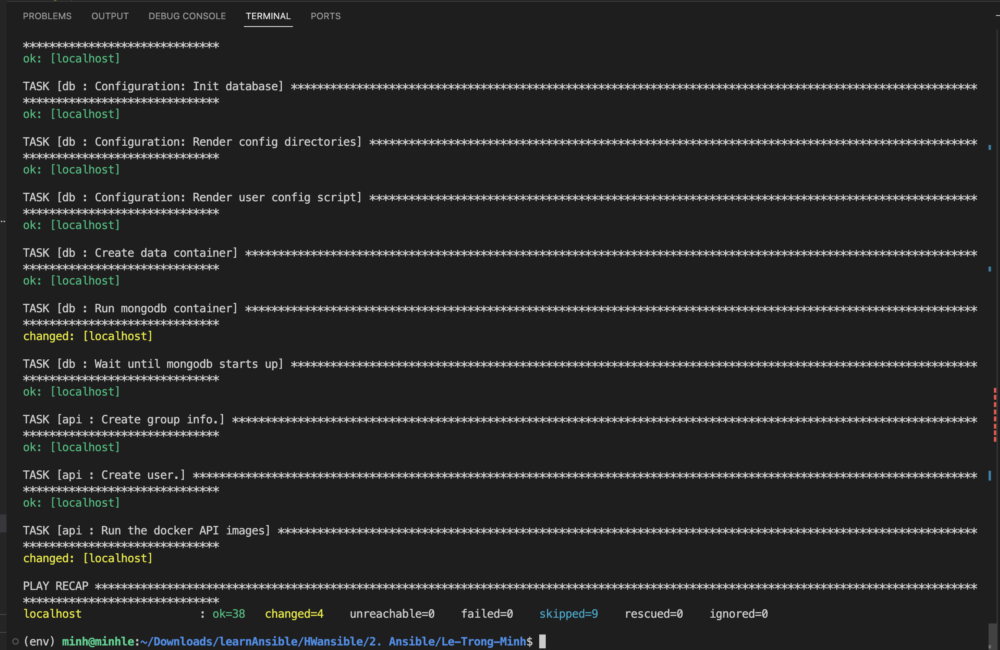
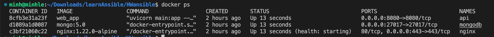
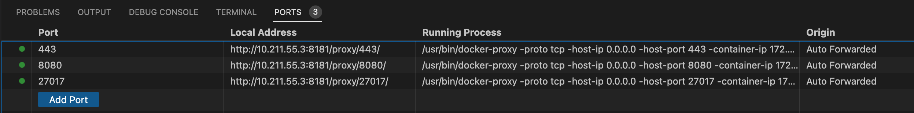
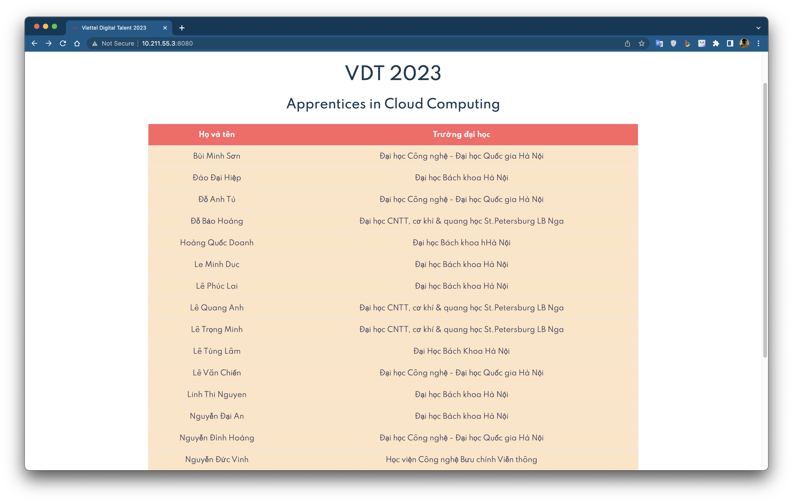

# Deploy your application in the docker-compose homework using ansible:

# Table of contents
## [I. What is Ansible ?](#1-overview)
-   ### [1. Ansible](#11--what-is-ansible)

## [II. Homework](#2-homework)

-   ### [1. Install ansible](#21-install-ansible)
-   ### [2. Config](#22-configure)
-   ### [2. Using ansible to deploy common role](#23-deployment)

## [III. References](#4-references)

# 1. Overview
### 1.1 . What is Ansible?

- Ansible is an open-source software provisioning, configuration management, and application-deployment tool enabling infrastructure as code. It runs on many Unix-like systems, and can configure both Unix-like systems as well as Microsoft Windows. It includes its own declarative language to describe system configuration. Ansible is agentless, temporarily connecting remotely via SSH or Windows Remote Management (allowing remote PowerShell execution) to do its tasks.

-  Ansible Playbooks use YAML, which is an easy to read language in plain English as compared to most scripting languages. With Ansible you have the ability to manage a plain text inventory file of hosts you want to keep track of or modify. These hosts can be grouped together or separately under different group headings. When building your Ansible Playbook you can differentiate which groups should run which modules.

# 2. Homework

- Setup docker for your target environments in role “common”

- Split your application into 3 roles: “web”, “api” and “db” 


## 2.1 Install Ansible:
```shell
        sudo apt-get install software-properties-common

        sudo apt-add-repository --yes --update ppa:ansible/ansible

        sudo apt-get install ansible
```
## 2.2 Configure 
## Initialize virtual environment:

Using a virtual environment with `virtualenv` in Python has several benefits, including:

1. Ensuring independence between packages and dependencies: One of the main benefits of using a virtual environment is that you can separate dependencies between different projects, avoiding conflicting versions of packages.

2. Facilitating dependency management of the project: Using a virtual environment helps you manage project dependencies easily. You can specify the exact dependencies and versions in the virtual environment of the project, avoiding reliance on system-wide packages and versions.

```shell
        mkdir -p env

        virtualenv env

        source env/bin/activate
```

Config file `inventories/inventory.yaml`
```yaml
# Defining a group of hosts under the `all` group.
# There is only one host in this group, `localhost`, which will be accessed using the local connection method (`ansible_connection: local`).
# The `ansible_python_interpreter` variable specifies the path to the Python interpreter to be used by Ansible on the target host.
# In this case, the path is `/home/minh/Downloads/learnAnsible/HWansible/env/bin/python3`, which indicates that Ansible will use the Python interpreter located in the `env` directory of the specified path.
# The `ansible_become_user` and `ansible_become_password` variables specify the user and password that Ansible will use to escalate privileges on the target host.
# In this case, the user is `root` and the password is `111`. This is necessary when running Ansible tasks that require root privileges on the target host.
 
        all:
        hosts:
        localhost:
        ansible_connection: local
        ansible_python_interpreter: /home/minh/Downloads/learnAnsible/HWansible/env/bin/python3
        ansible_become_user: root
        ansible_become_password: 111
```

Build `web_app` Docker Images

```sh   
        cd web/app/

        docker build -t web_app
```

        Show about image here

Long in to dockerhub and push image


In this project, components are declared according to each of its roles. Here, `common` will setup `docker`, `nginx` will setup `web server` using nginx, `db` will install `mongodb` and api will be `web backend`.


Explaination:
Example: About Common role:
- In defaults will contain variables that have been declared before, used in tasks
- Handlers will...
- The tasks are divided in the tasks folder, which are executed one after the other when called in the main.yaml file


After writing the roles of each component, all that remains is to write the playbook of all in the all-in-one playbook.

```yaml
        ---
        - hosts: all
        become: True
        gather_facts: False

        pre_tasks:
        - wait_for_connection: { timeout: 300 }
        - setup:
        - name: Install requests library using pip
        pip:
                name: requests==2.28.1
                state: present

        # - name: install community docker
        #   community.general.collection:
        #     name: community.docker

        vars:
        docker_sdk_for_python_install: True
        docker_compose_install: True
        docker_daemon_config:
        default-address-pools:
                - { base: 172.16.0.0/16, size: 26 }
        log-driver: "json-file"
        log-opts:
                max-size: "10m"
                max-file: "3"
        
        tasks:
        - name: Install Docker
        import_role:
                name: common
        - name: config nginx
        import_role:
                name: nginx
        - name: config db
        import_role:
                name: db
        - name: api
        import_role:
                name: api
```


## 2.3 Deployment

Execute the following playbook run command:

```shell
        ansible-playbook -i inventories/inventory.yaml aio.yaml
```


<div align="center">
  
</div>

<div align="center">
  <i>
         result (logs)
        </i>
</div>


<div align="center">
  
</div>

<div align="center">
  <i>
         images
        </i>
</div>


<div align="center">
  
</div>

<div align="center">
  <i>
         ports
        </i>
</div>


<div align="center">
  
</div>

<div align="center">
  <i>
         students
        </i>
</div>


# 3. Errors during practice:

During the development process, I encountered many conflicts as architectural conflicts, unsupported libraries.

One of them is the virtual environment conflict

```sh
TASK [nginx : Restart a container] ********************************************************************************************************************************************
fatal: [localhost]: FAILED! => {"changed": false, "msg": "Error connecting: Error while fetching server API version: HTTPConnection.request() got an unexpected keyword argument 'chunked'"}

PLAY RECAP ********************************************************************************************************************************************
localhost
```

That's because older versions of requests vendored in their own urllib3. Modern requests uses the distributed version.

Solved: Install `requests<2.2.29`


# 4. References:
- [Ansible](https://www.ansible.com/)
- [Ansible Galaxy](https://galaxy.ansible.com/)
- [Deploying Docker Compose Applications With Ansible and GitHub Actions](https://medium.com/swlh/deploying-docker-compose-applications-with-ansible-and-github-actions-7f1740392507)
- [How to Install Docker Compose using Ansible Playbook](https://cloudinfrastructureservices.co.uk/how-to-install-docker-compose-using-ansible-playbook/)
- [Automate your Docker deployments with Ansible - YouTube](https://www.youtube.com/watch?v=CQk9AOPh5pw)
- [Automated Deployment using Ansible and Docker Compose YAML](https://community.home-assistant.io/t/automated-deployment-using-ansible-and-docker-compose-yaml/366250)
